<font size="5">COMfortable Exfiltration</font>

  8<sup>th</sup> 5 2026

  Prepared By: canopus

  Challenge Author: canopus

  Difficulty: <font color=orange>Medium</font>

  Classification: Official


# Synopsis

COMfortable Exfiltration is a Medium Forensics challenge revolving around a C++ dropper which drops and initializes a C# malware. The dropper shadows the `ADOBD.Stream` CLSID object before using the Windows Explorer CLSID to drop the C# malware. Said malware, registers a couple of COM objects which are invoked from the dropper itself.

## Skills Required

    - Memory Analysis Basics

## Skills Learned

    - Windows COM Objects basics
    - C++/C# COM Interop
    - Chrome Password Recovery

# Solution

### [1/8] There is an installed Service disguised as a Microsoft Component; What is the full path of the executable

We begin by listing the Windows Services using `windows.svclist`. However, since we know that the service is imitating a Microsoft component, we can filter with `--filter "Name,Microsoft":

```bash
$> vol -f mem.elf --filter "Name,Microsoft" windows.svclist 

Volatility 3 Framework 2.28.1
Progress:  100.00               PDB scanning finished
Offset  Order   PID     Start   State   Type    Name    Display Binary  Binary (Registry)       Dll

0x2591416a060   273     N/A     SERVICE_DEMAND_START    SERVICE_STOPPED SERVICE_KERNEL_DRIVER   Microsoft_Bluetooth_AvrcpTransport      Microsoft_Bluetooth_AvrcpTransport      N/A     \SystemRoot\System32\drivers\Microsoft.Bluetooth.AvrcpTransport.sys     -
0x2591416f660   272     N/A     SERVICE_DEMAND_START    SERVICE_STOPPED SERVICE_WIN32_OWN_PROCESS       MicrosoftEdgeElevationService   MicrosoftEdgeElevationService   N/A     "C:\Program Files (x86)\Microsoft\Edge\Application\148.0.3967.54\elevation_service.exe" -
0x2591416b8e0   271     N/A     SERVICE_AUTO_START      SERVICE_STOPPED SERVICE_WIN32_OWN_PROCESS       Microsoft Updater       Microsoft Updater       N/A     "C:\Temp\Microsoft Cache\updater.exe"   -
```

- Answer: `C:\Temp\Microsoft Cache\updater.exe`

### [2/8] The injector shadows an object into the HKCU registry. Using its CLSID, what is the name of the Object

After searching and dumping the executable using `windows.filescan` and `windows.dumpfile`. We open it in a decompiler to examine it further:

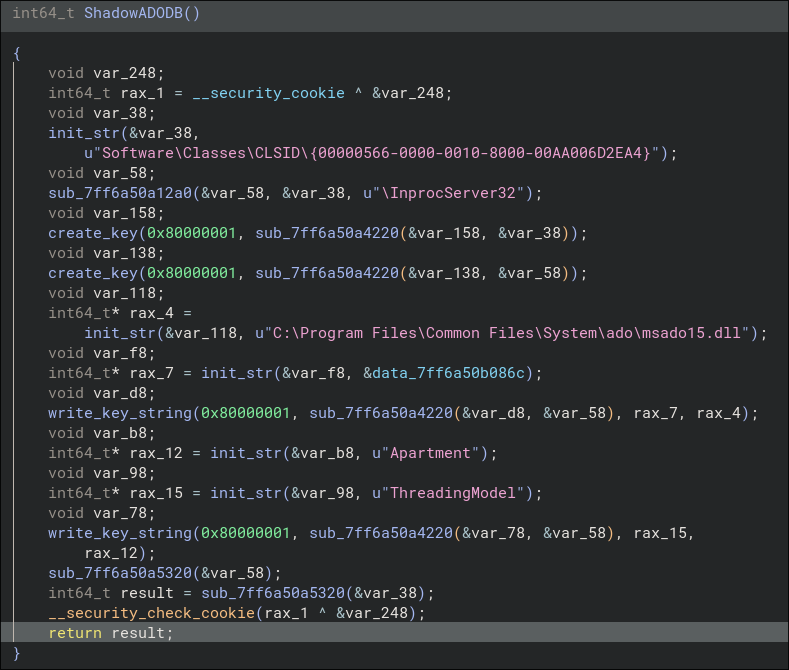

If we use [oleviewdotnet](https://github.com/tyranid/oleviewdotnet) to query a windows' system CLSID objects, we can filter using the found CLSID:

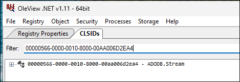

- Answer: `ADODB.Stream`

### [3/8] Following its self-duplication, the malware drops a secondary file onto the system. What is the filename of this secondary file?

The dropper uses the `ShellWindows` Object to create the path for the `commable` dll:

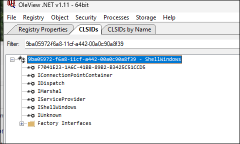

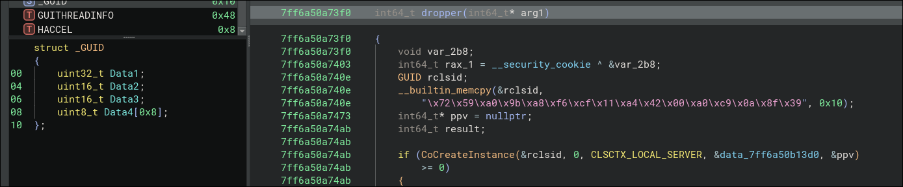

**Note:** We have to account for the endianess of each part of the `GUID` object


Essentially, by using the `Shell` object, the path is being created much like the user would, if they would've right-clicked and selected "New Folder":

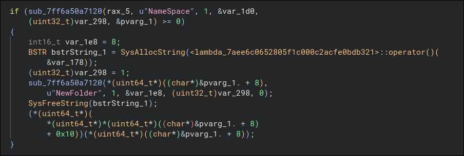

Finally, the dropper uses the newly shadowed `ADODB.Stream` object to write the DLL from the embedded resources into the newly created file:

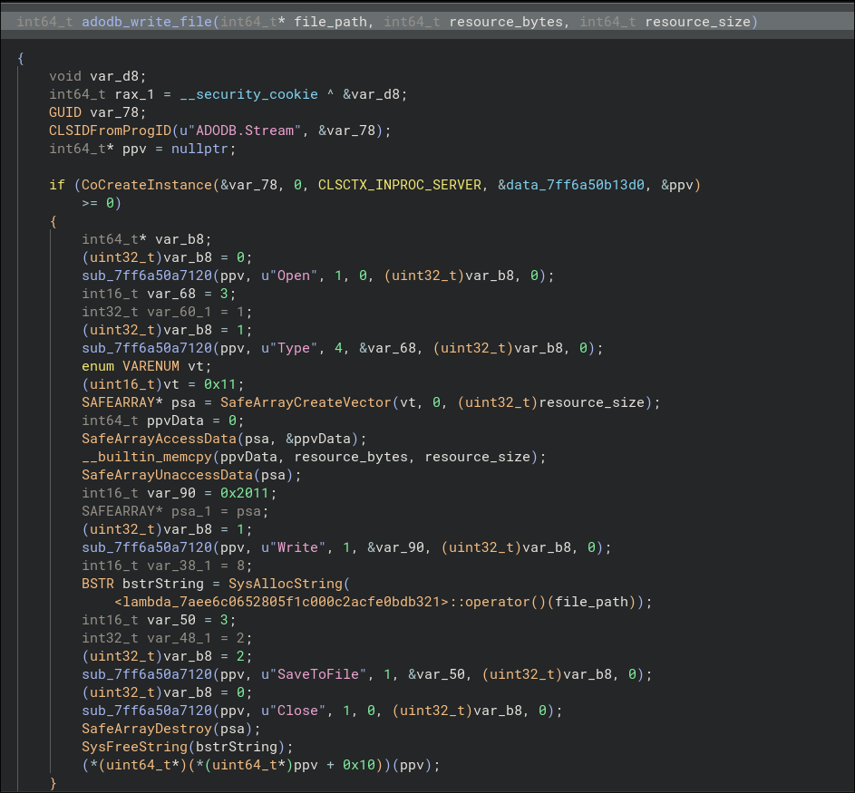

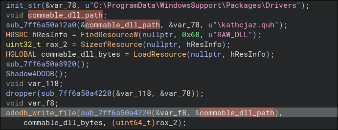

- Answer: `kathcjaz.quh`

### [4/8] What is the (C#) Class Name and the corresponding CLSID that's exposed to the COM API (Name:{GUID})

After extracting the embedded dll (Foremost, binwalk, direct carving) we can open it up in `DnSpy(Ex)` to analyze it further:

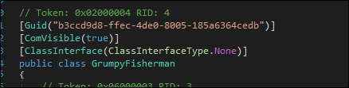

There we find the class `GrumpyFisherman` which is also annotated as `ComVisible(True)` with a `GUID` of `b3ccd9d8-ffec-4de0-8005-185a6364cedb`

- Answer: `GrumpyFisherman:{b3ccd9d8-ffec-4de0-8005-185a6364cedb}`

### [5/8] What is the CLSID responsible for calling the .NET function that installs the malicious Service? ({GUID})


Going back to our dropper, following the DLL drop, we find the function that registers 3 new CLSIDs that all of them call the same DLL:

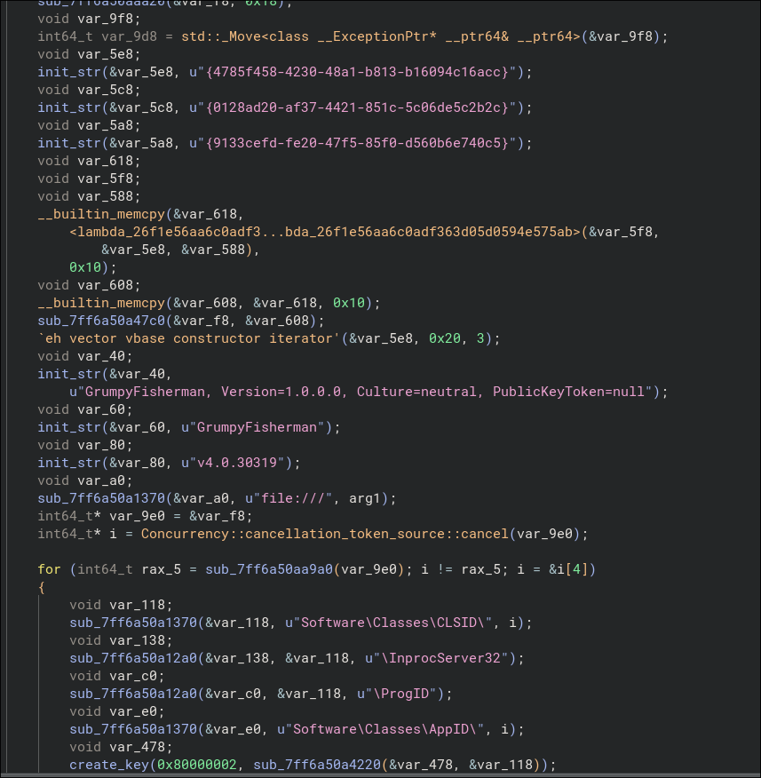

Each C# function is invoked by name, after instantiating the COM object for that CLSID (which is always the same):

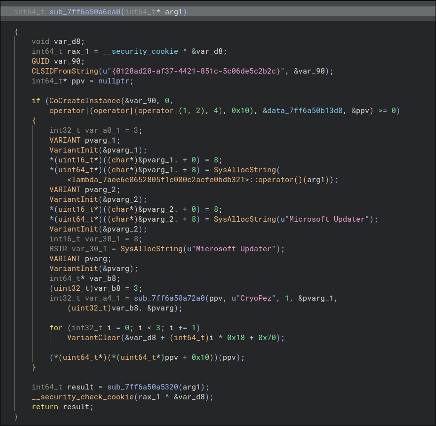

In this case, the dropper instantiates the COM object with CLSID `0128ad20-af37-4421-851c-5c06de5c2b2c` and calls the function `CryoPez` with 3 arguments (reverse order):

- arg1
- Microsoft Updater
- Microsoft Updater

The `commable` DLL is slightly obfuscated, we can use a tool like [de4dotEx](https://github.com/GDATAAdvancedAnalytics/de4dotEx) to try and deobfuscate it:

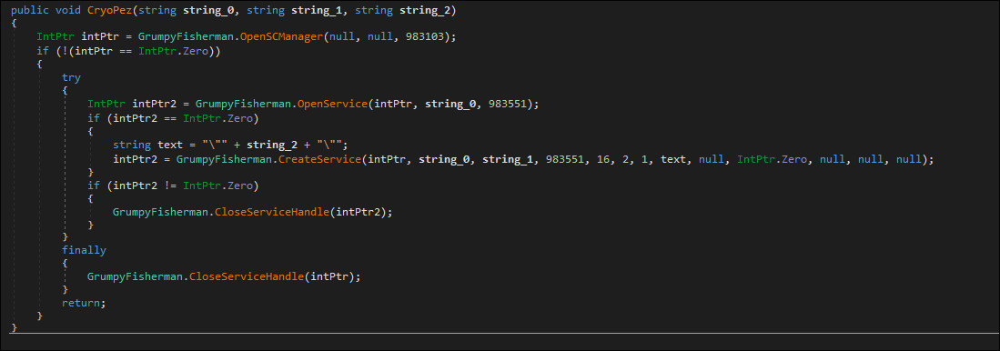

`CryoPez` is responsible for creating the Service!

- Answer: `{0128ad20-af37-4421-851c-5c06de5c2b2c}`

### [6/8] One of the .NET code's functionalities is disabling BitLocker Protection. What _WINDOWS_ CLSID is responsible for that? ({GUID})

Examining the rest of the functions we find `OrangeDucky` which instantiated an object of type `FveUI`:

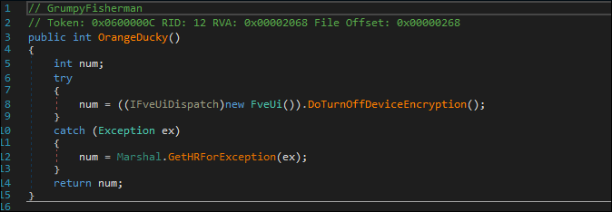

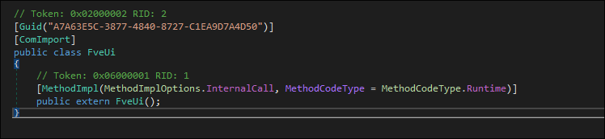

It imports the COM object `Secure Startup` and dispatches the `DoTurnOffDeviceEncryption` method:

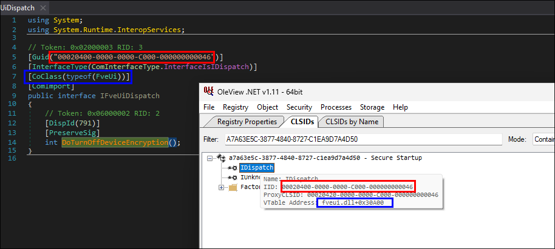

- Answer: `{A7A63E5C-3877-4840-8727-C1EA9D7A4D50}`

### [7/8] What is the (complete) exfiltration URL (without the key, http[s]://URL:PORT/PATH/)

The method `HyperAlan` is responsible for impersonating a user token, stealing their Thorium saved credentials, along with their DPAPI master key:

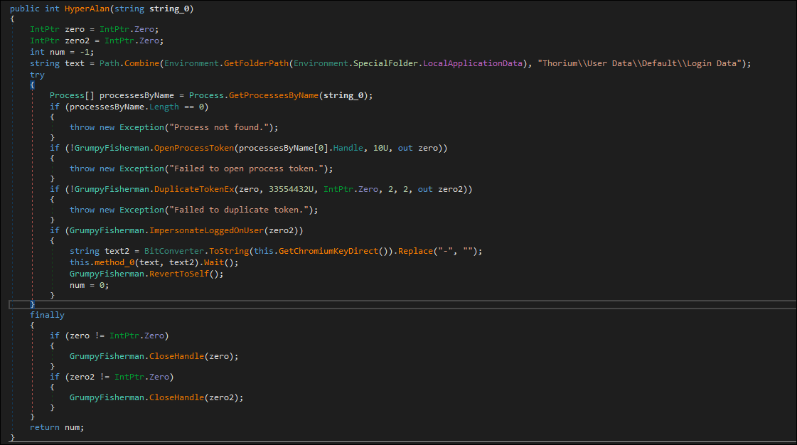

`method_0` is responsible for exfiltrating the data:

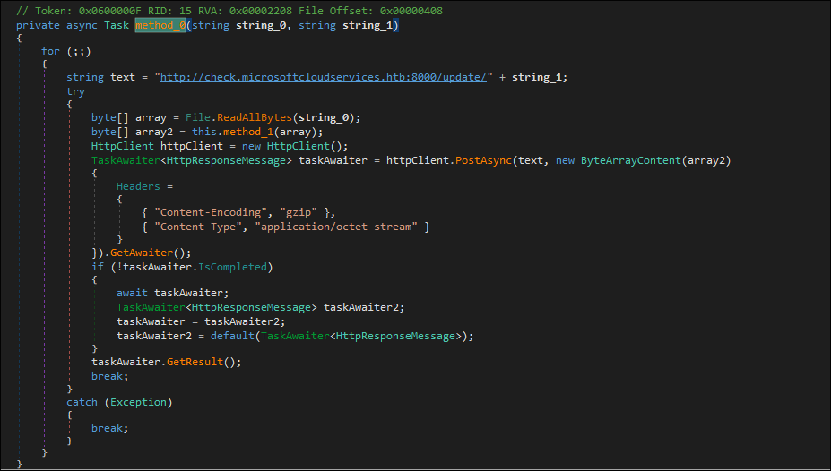

- Answer: `http://check.microsoftcloudservices.htb:8000/update/`

### [8/8] What is the exfiltrated username:password

We are provided with the `AppData` folder of the Victim User -> encrypted DPAPI key.

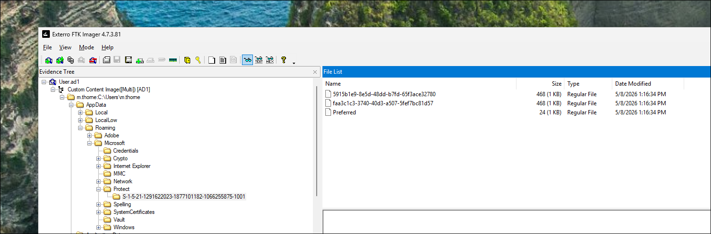

We can decrypt the DPAPI master key if we know the victim's password. We can try and find the password by attempting to crack their NTLM hash:

```bash
$> vol -f mem.elf windows.hashdump

Volatility 3 Framework 2.28.1
Administrator   500     aad3b435b51404eeaad3b435b51404ee        31d6cfe0d16ae931b73c59d7e0c089c0
Guest   501     aad3b435b51404eeaad3b435b51404ee        31d6cfe0d16ae931b73c59d7e0c089c0
DefaultAccount  503     aad3b435b51404eeaad3b435b51404ee        31d6cfe0d16ae931b73c59d7e0c089c0
WDAGUtilityAccount      504     aad3b435b51404eeaad3b435b51404ee        0868e02e612c68e42092ed7435511bba
m.thorne        1001    aad3b435b51404eeaad3b435b51404ee        3716e9804c41b32fe09dcb2aa4c98071
```

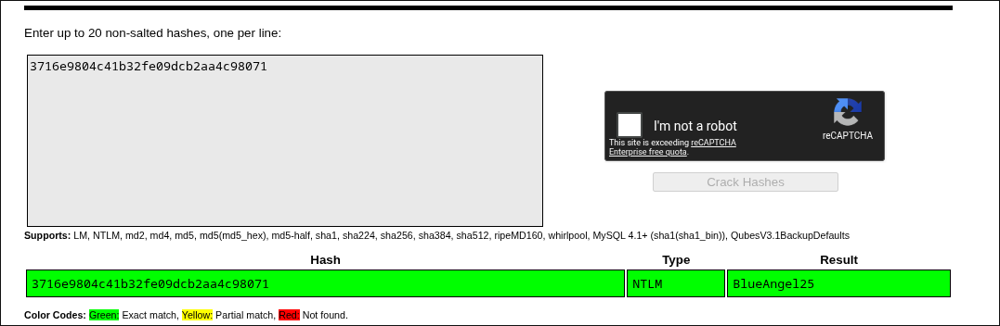

Once we know the password, we can decrypt the master key(s) using impacket's `dpapi.py` module:

```bash
$> dpapi.py masterkey -f S-1-5-21-1291622023-1877101182-1066255875-1001/5915b1e9-8e5d-48dd-b7fd-65f3ace32780 -sid S-1-5-21-1291622023-1877101182-1066255875-1001 -password BlueAngel25

Impacket v0.13.0.dev0 - Copyright Fortra, LLC and its affiliated companies

[MASTERKEYFILE]
Version     :        2 (2)
Guid        : 5915b1e9-8e5d-48dd-b7fd-65f3ace32780
Flags       :        5 (5)
Policy      :        0 (0)
MasterKeyLen: 000000b0 (176)
BackupKeyLen: 00000090 (144)
CredHistLen : 00000014 (20)
DomainKeyLen: 00000000 (0)

Decrypted key with User Key (SHA1)
Decrypted key: 0xcdbf3b9143ba3613e5b95f901e229c746cfac1a004eda44c09f9e9c24ef6a7b75cab525df5147376aa25f3839d3ba36729cfdb445e90c1c75b3e69970dac6ea3

$> dpapi.py masterkey -f S-1-5-21-1291622023-1877101182-1066255875-1001/faa3c1c3-3740-40d3-a507-5fef7bc81d57 -sid S-1-5-21-1291622023-1877101182-1066255875-1001 -password BlueAngel25 

Impacket v0.13.0.dev0 - Copyright Fortra, LLC and its affiliated companies

[MASTERKEYFILE]
Version     :        2 (2)
Guid        : faa3c1c3-3740-40d3-a507-5fef7bc81d57
Flags       :        5 (5)
Policy      :        0 (0)
MasterKeyLen: 000000b0 (176)
BackupKeyLen: 00000090 (144)
CredHistLen : 00000014 (20)
DomainKeyLen: 00000000 (0)

Decrypted key with User Key (SHA1)
Decrypted key: 0xdb99adde65d94b9ca252c276243b217e8a6cf6071c5890580035f395ab935218c21083343e9f1cb0b18c31e6c56cb7c5c0cdfeb80bc63b67010cffd764a5a791
```

Once we have our masterkey candidates we can attempt to decrypt the chromium masterkey, present in `Local State`:

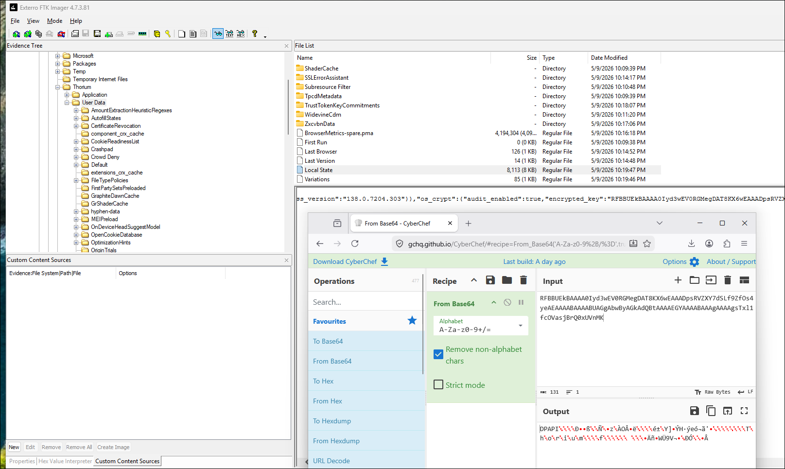

To decrypt it, we have to extract it from the `json` and strip the first 5 letters (`DPAPI`):


```bash
$> cat /Local\ State | jq -r .os_crypt.encrypted_key | base64 -d | tail -c +6 > blob
$> dpapi.py unprotect -f blob -key 0xcdbf3b9143ba3613e5b95f901e229c746cfac1a004eda44c09f9e9c24ef6a7b75cab525df5147376aa25f3839d3ba36729cfdb445e90c1c75b3e69970dac6ea3

Impacket v0.13.0.dev0 - Copyright Fortra, LLC and its affiliated companies

Successfully decrypted data
 0000   E4 26 08 6A 62 28 B0 51  55 EB 61 88 38 D2 C8 E6   .&.jb(.QU.a.8...
 0010   29 40 6B A5 DD 19 5B AE  66 19 83 49 5C 0D 61 14   )@k...[.f..I\.a.
```

With the `os_crypt` key we can decrypt the encrypted password from the `Login Data` SQLite database:

```python
from Crypto.Cipher import AES

ct = b"\x76\x31\x30[...]"
key = b"\xe4\x26\x08[...]"

iv = ct[3:15]
encrypted_pass = ct[15:-16]
tag = ct[-16:]

cipher = AES.new(key, AES.MODE_GCM, iv)
pt = cipher.decrypt_and_verify(encrypted_pass, tag).decode()
print(pt)
```

- Answer: `admin-03:yiz9yzf3HAnhw49hRCtxXEtsL`


This challenge is modelled after 'Turla's Kazuar v3 Loader'. More information about the native loader and the dll can be found in [this](https://r136a1.dev/2026/01/14/command-and-evade-turlas-kazuar-v3-loader/) amazing report

