<font size='10'>Open Wound</font>

16<sup>th</sup> April 2025

Prepared By: bquanman

Challenge Author(s): bquanman

Difficulty: <font color=red>Hard</font>

Classification: Official

# Synopsis

Investigation of IIS Web Server, identifying and analyzing a malicious IIS module installed on the server to decrypt exchanged data and understand the attacker’s behavior

# Description

TransitNode, a critical logistics provider, has suffered a severe security breach on their public-facing web server. Following suspicious activities tied to the Rust Faction proxy, the company enacted emergency measures and shut down primary services, replacing the main site with a basic maintenance notification. However, the disruption continued unabated, proving Gilded Weaver had already established a persistent backdoor deep within the infrastructure and was returning to exploit their trusted access. Network traffic was captured during this secondary assault, and a disk image of the compromised staging server was extracted. Task Force Nightfall needs you to investigate these artifacts, uncover how Directorate 9 maintained their hidden persistence, track their lateral movements during the return visit, and recover the critical routing data they targeted before the blackout triggers.

## Skills Required

* Components of IIS Web Server 
* Memory/Network Forensics

## Skills Learned

* IIS Module Forensics
* C++/CLI Malware Reverse
* Applying AES decryption methods to uncover attacker activities
* Retrieve GPG private key

# Enumeration

In this challenge, we are provided with:

* A pcap file containing network traffic at the time of the attack
* The filesystem of the compromised server

For web servers like this one, the web service exposed to the internet is an ideal entry point for threat actors. This server uses IIS web server, so our next step is to perform forensics on it.

### IIS Forensics

We will focus on the two main IIS directories:

`C:\inetpub` and `C:\Windows\System32\inetsrv`

`C:\inetpub\logs` is the directory containing access logs, but most logs have been deleted or contain no valuable information.

The default configuration file is located at: `C:\Windows\System32\inetsrv\config\applicationHost.config`

The details about the status of the sites recorded show that there are a total of 3 sites, with 2 sites having been turned off (serverAutoStart="false").

```xml
            <site name="MyAspNetSite" id="1" serverAutoStart="true">
                <application path="/">
                    <virtualDirectory path="/" physicalPath="C:\inetpub\wwwroot\MyAspNetSite" />
                </application>
                <bindings>
                    <binding protocol="http" bindingInformation="192.168.91.174:80:" />
                </bindings>
            </site>
            <site name="SmartStore" id="2" serverAutoStart="false">
                <application path="/">
                    <virtualDirectory path="/" physicalPath="C:\inetpub\wwwroot\SmartStore" />
                </application>
                <bindings>
                    <binding protocol="http" bindingInformation="192.168.91.174:8080:" />
                </bindings>
            </site>
            <site name="Web3" id="3" serverAutoStart="false">
                <application path="/">
                    <virtualDirectory path="/" physicalPath="C:\inetpub\wwwroot\Web3" />
                </application>
                <bindings>
                    <binding protocol="http" bindingInformation="192.168.91.174:3333:" />
                </bindings>
            </site>
```

The source code for these websites is located at the path C:\inetpub\wwwroot. The only active site uses port 80, which is the port where requests are sent in the provided pcap file.

Let’s think about some common methods that attackers might use to maintain access on the IIS server:

1. Modifying or adding a web shell

The attacker uploads a web shell (a malicious file, often ASP.NET for IIS) to the IIS web directory (e.g., wwwroot).

=> Therefore, we would need to scan the web shell within the directory containing the website source code. However, since the websites are turned off, it's unlikely that the attacker can directly access the web shell via a URL anymore. The only remaining active site looks like a simple notice page, which informs users and doesn't have a web shell.

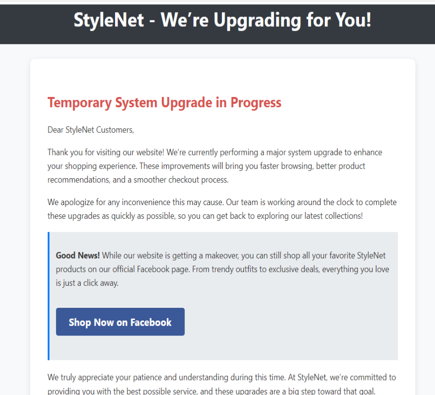

2. Modifying IIS Configuration Files

The attacker modifies IIS configuration files (such as web.config or applicationHost.config) to add malicious code or custom configurations.


3. Installing Malicious Module

The attacker uploaded a malicious DLL to the system and registered it as a module or extension in IIS.

=> For methods 2 and 3, we should check for changes in the web.config and applicationHost.config.

- web.config: The web.config file for the website MyAspNetSite appears to be completely clean.

- aplicationHost.config: Review all IIS modules.

```xml
        <globalModules>
            <add name="UriCacheModule" image="%windir%\System32\inetsrv\cachuri.dll" />
            <add name="FileCacheModule" image="%windir%\System32\inetsrv\cachfile.dll" />
            <add name="TokenCacheModule" image="%windir%\System32\inetsrv\cachtokn.dll" />
            <add name="HttpCacheModule" image="%windir%\System32\inetsrv\cachhttp.dll" />
            <add name="StaticCompressionModule" image="%windir%\System32\inetsrv\compstat.dll" />
            <add name="DefaultDocumentModule" image="%windir%\System32\inetsrv\defdoc.dll" />
            <add name="DirectoryListingModule" image="%windir%\System32\inetsrv\dirlist.dll" />
            <add name="ProtocolSupportModule" image="%windir%\System32\inetsrv\protsup.dll" />
            <add name="StaticFileModule" image="%windir%\System32\inetsrv\static.dll" />
            <add name="AnonymousAuthenticationModule" image="%windir%\System32\inetsrv\authanon.dll" />
            <add name="RequestFilteringModule" image="%windir%\System32\inetsrv\modrqflt.dll" />
            <add name="CustomErrorModule" image="%windir%\System32\inetsrv\custerr.dll" />
            <add name="HttpLoggingModule" image="%windir%\System32\inetsrv\loghttp.dll" />
            <add name="IsapiModule" image="%windir%\System32\inetsrv\isapi.dll" />
            <add name="IsapiFilterModule" image="%windir%\System32\inetsrv\filter.dll" />
            <add name="ManagedEngineV4.0_32bit" image="%windir%\Microsoft.NET\Framework\v4.0.30319\webengine4.dll" preCondition="integratedMode,runtimeVersionv4.0,bitness32" />
            <add name="ConfigurationValidationModule" image="%windir%\System32\inetsrv\validcfg.dll" />
            <add name="ManagedEngineV4.0_64bit" image="%windir%\Microsoft.NET\Framework64\v4.0.30319\webengine4.dll" preCondition="integratedMode,runtimeVersionv4.0,bitness64" />
            <add name="CgiModule" image="%windir%\System32\inetsrv\cgi.dll" />
            <add name="FastCgiModule" image="%windir%\System32\inetsrv\iisfcgi.dll" />
            <add name="RewriterModule" image="%windir%\System32\inetsrv\RewriterModule.dll" preCondition="bitness64" />
        </globalModules>
        ...........................
                <modules>
            <add name="HttpCacheModule" lockItem="true" />
            <add name="StaticCompressionModule" lockItem="true" />
            <add name="DefaultDocumentModule" lockItem="true" />
            <add name="DirectoryListingModule" lockItem="true" />
            <add name="IsapiFilterModule" lockItem="true" />
            <add name="ProtocolSupportModule" lockItem="true" />
            <add name="StaticFileModule" lockItem="true" />
            <add name="AnonymousAuthenticationModule" lockItem="true" />
            <add name="RequestFilteringModule" lockItem="true" />
            <add name="CustomErrorModule" lockItem="true" />
            <add name="IsapiModule" lockItem="true" />
            <add name="HttpLoggingModule" lockItem="true" />
            <add name="UrlRoutingModule-4.0" type="System.Web.Routing.UrlRoutingModule" preCondition="managedHandler,runtimeVersionv4.0" />
            <add name="ScriptModule-4.0" type="System.Web.Handlers.ScriptModule, System.Web.Extensions, Version=4.0.0.0, Culture=neutral, PublicKeyToken=31bf3856ad364e35" preCondition="managedHandler,runtimeVersionv4.0" />
            <add name="OutputCache" type="System.Web.Caching.OutputCacheModule" preCondition="managedHandler" />
            <add name="Session" type="System.Web.SessionState.SessionStateModule" preCondition="managedHandler" />
            <add name="WindowsAuthentication" type="System.Web.Security.WindowsAuthenticationModule" preCondition="managedHandler" />
            <add name="FormsAuthentication" type="System.Web.Security.FormsAuthenticationModule" preCondition="managedHandler" />
            <add name="DefaultAuthentication" type="System.Web.Security.DefaultAuthenticationModule" preCondition="managedHandler" />
            <add name="RoleManager" type="System.Web.Security.RoleManagerModule" preCondition="managedHandler" />
            <add name="UrlAuthorization" type="System.Web.Security.UrlAuthorizationModule" preCondition="managedHandler" />
            <add name="FileAuthorization" type="System.Web.Security.FileAuthorizationModule" preCondition="managedHandler" />
            <add name="AnonymousIdentification" type="System.Web.Security.AnonymousIdentificationModule" preCondition="managedHandler" />
            <add name="Profile" type="System.Web.Profile.ProfileModule" preCondition="managedHandler" />
            <add name="UrlMappingsModule" type="System.Web.UrlMappingsModule" preCondition="managedHandler" />
                <add name="ConfigurationValidationModule" lockItem="true" />
                <add name="CgiModule" lockItem="true" />
                <add name="FastCgiModule" lockItem="true" />
                <add name="RewriterModule" preCondition="bitness64" />
        </modules>
```

The RewriterModule is the most recently added module, and it is not a common module but rather a custom one, making it worth analyzing.

All the default IIS modules are located in %windir%\system32\inetsrv\, so we can look for RewriterModule.dll from this directory. We will then proceed to analyze it.

### IIS module reversing and traffic decrypting

Typically, native modules like this are developed using C/C++, but this DLL file has been identified as a .NET assembly. 

```
$ file RewriterModule.dll
RewriterModule.dll: PE32+ executable (DLL) (GUI) x86-64 Mono/.Net assembly, for MS Windows
```

In order for IIS to load these DLLs, they must export a RegisterModule function – a function responsible for handling core functionalities

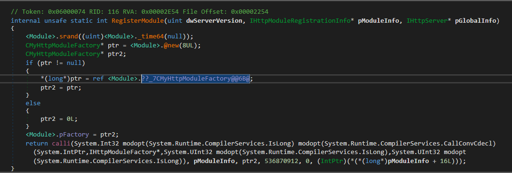

The function ends bv invoking the [`calli`](https://learn.microsoft.com/en-us/dotnet/api/system.reflection.emit.opcodes.calli?view=netframework-4.8.1&viewFallbackFrom=net-10.0) opcode. The function called is the `pModuleInfo + 16` with arguments:

- `pModuleInfo`*
- `ptr2` -> `CMyHttpModuleFactory`
- `536870912` -> `0x20000000`
- `0`

That `pModuleInfo + 16` is a `vftable` (virtual function table) offset, so the original C++ code looked something like `pModuleInfo->func()` where `pModuleInfo` is the instantiated object of the class [`IHttpModuleRegistrationInfo`](https://learn.microsoft.com/en-us/previous-versions/iis/smooth-streaming-client/ihttpmoduleregistrationinfo-interface).

Looking at the documentation, we can see the interface exposes some methods, however we don't know which method corresponds to offset 16 (methods are basically just a function pointer of length 8 bytes). For that we would need to look at the header file [httpserv.h](https://github.com/tritao/WindowsSDK/blob/master/SDKs/SourceDir/Windows%20Kits/10/Include/10.0.17763.0/um/httpserv.h#L3757).

From the above class definition, we can see the 3rd declared method for that interface is:

```c++
virtual 
    HRESULT
    SetRequestNotifications(
        _In_ IHttpModuleFactory * pModuleFactory,
        _In_ DWORD                dwRequestNotifications,
        _In_ DWORD                dwPostRequestNotifications
    ) = 0;
```

The `pModuleInfo` is not an actual argument, but more like the `this` object, so the C++ code looked something like:

`pModuleInfo->SetRequestNotification(ptr2, 0x20000000, 0)`. By checking out the documentation of [SetRequestNotifications](https://learn.microsoft.com/en-us/previous-versions/iis/smooth-streaming-client/ihttpmoduleregistrationinfo-setrequestnotifications-method) and [Request-Processing Constants
](https://learn.microsoft.com/en-us/previous-versions/iis/smooth-streaming-client/request-processing-constants) we find that constant `0x20000000` instructs the registered handler to fire whenever IIS responds to a request! Effectively creating a backdoor! 

It initializes a factory (CMyHttpModuleFactory) and implements inherited classes to override some of their event-handling methods, particularly `OnSendResponse`. Therefore, when a request is sent, the malicious execution intercepts and alters the original flow's handling.

However, the source code is quite difficult to read, unlike pure .NET.

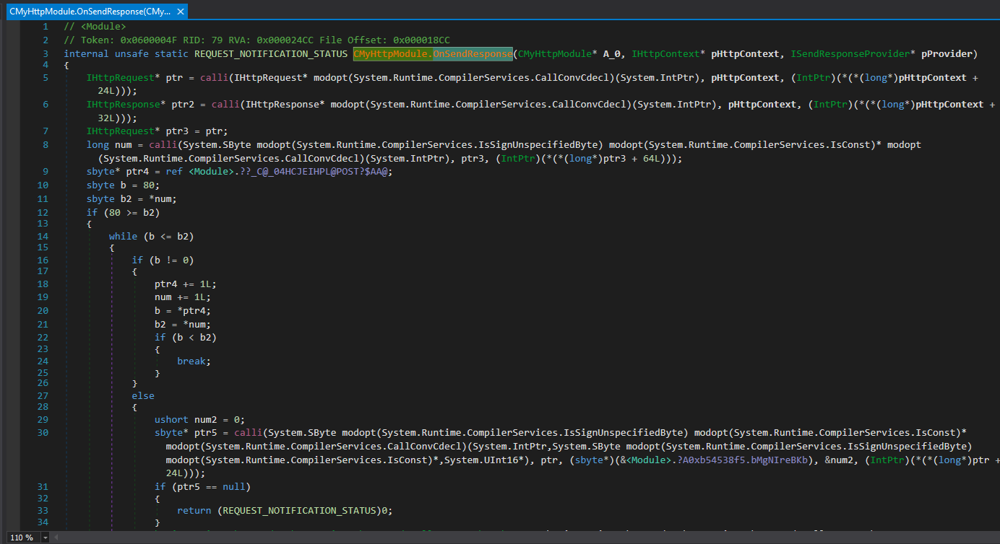

It turns out that the code is actually written in C++/CLI (a programming language developed by Microsoft to bridge native C++ code with the .NET managed environment). This makes it a bit more challenging for us.

The same previous logic applies here as well (and further down the analysis), by checking out the class definition of `IHttpContext` we can identify the methods that are called from the object instance `pHttpContext`. (we can also deduce the variables from their type `IHttpRequest/IHttpResponse`)

Basically, the function handles incoming requests if they have the following attributes:

- Request type: HTTP POST

- Request header field and value: `X-Auth-Token : value of ?A0xb54538f5.EHaDxBogf (encrypted)`

- Request header field and value: `Cache-Control : <any> (encrypted)`

When an HTTP POST request is sent, the backdoor will receive the `X-Auth-Token` field and assign it the value `?A0xb54538f5.EHaDxBogf`. If the value of `?A0xb54538f5.EHaDxBogf` when decrypted matches `IoCreateDevice` , it will then proceed to decrypt the Cache-Control field and pass it to the EventHandler function for processing.

The string variables are not that apparent at first, they point to a File Offset:

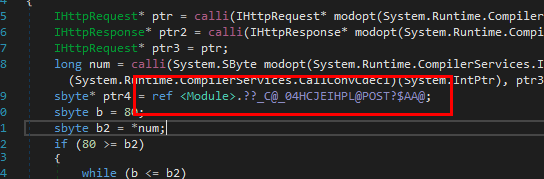

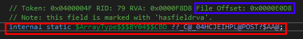

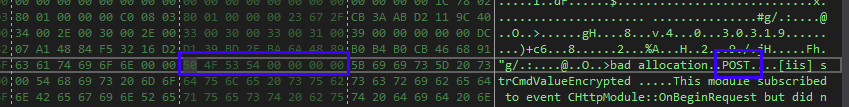

Similarly, we can find the `X-Auth-Token` string definition (and the rest):

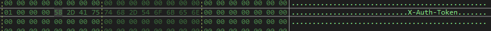


The encryption used is the default AES CBC with the key: `3f4156487474704d6f64756c652e12` + padding bytes, and the IV: `000102030405060708090a0b0c0d0e0f`.

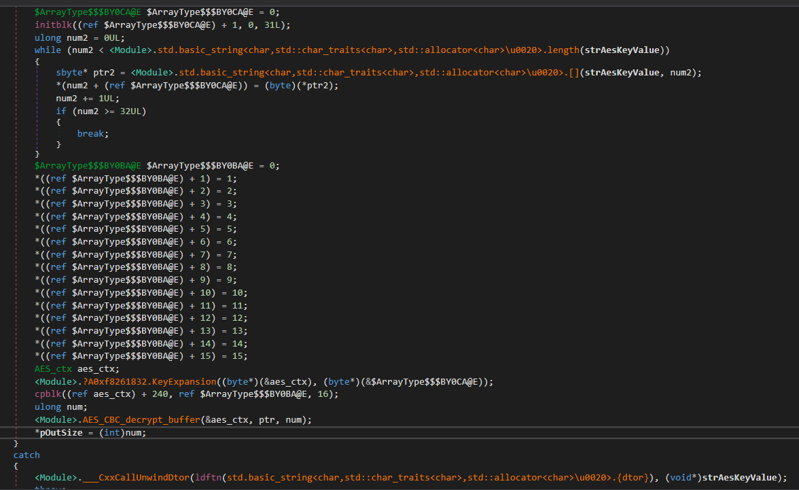

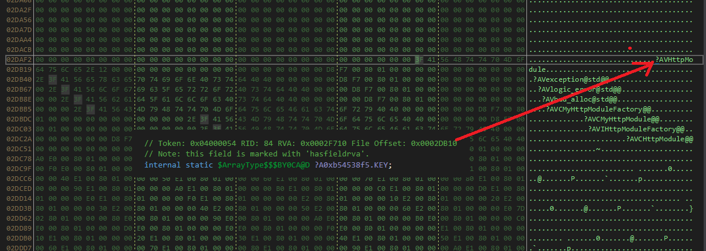

So, to decrypt the requests and responses, we only need to focus on decrypting the `Cache-Control` field.

The event handler code for processing the commands:

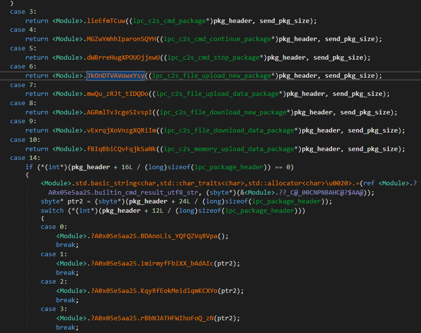

#### Dirty POC

Request.py: Decrypting the requests sent to the server

```py
import pyshark
from Crypto.Cipher import AES
import base64
import struct

def decrypt_cache_control(cache_control_b64, key, iv):
    try:
        enc_data = base64.b64decode(cache_control_b64)
        cipher = AES.new(key, AES.MODE_CBC, iv)
        dec_data = cipher.decrypt(enc_data)
        
        type_val = struct.unpack('<I', dec_data[:4])[0]
        if type_val == 14:
            header = dec_data[:20]
            type_val, _, _, builtin_cmd_id = struct.unpack('<IIII', header[:16])
            payload = dec_data[24:].decode('utf-8', errors='ignore').rstrip('\x00')
            return {
                'type': type_val,
                'builtin_cmd_id': builtin_cmd_id,
                'header_hex': header.hex(),
                'payload': payload
            }
        elif type_val == 6:
            header = dec_data[:16]
            type_val, _, _, _ = struct.unpack('<IIII', header)
            payload = dec_data[20:].decode('utf-8', errors='ignore').rstrip('\x00')
            return {
                'type': type_val,
                'builtin_cmd_id': 0,
                'header_hex': header.hex(),
                'payload': payload
            }
        elif type_val == 7:
            header = dec_data[:24]
            type_val, _, payload_len, offset, status, current_size = struct.unpack('<IIIIII', header[:24])
            path_len = struct.unpack('<I', dec_data[20:24])[0]
            payload = dec_data[24:24+path_len].decode('utf-8', errors='ignore').rstrip('\x00')
            file_data = dec_data[24+path_len:-10]
            return {
                'type': type_val,
                'builtin_cmd_id': 0,
                'header_hex': header.hex(),
                'payload_len': payload_len,
                'offset': offset,
                'status': status,
                'path': payload,
                'file_data': file_data
            }
        else:
            return {'error': f'Unknown type: {type_val}'}
    except Exception as e:
        return {'error': str(e)}

def process_pcap_cache_control(pcap_file):
    aes_key_raw = b"\x3f\x41\x56\x48\x74\x74\x70\x4d\x6f\x64\x75\x6c\x65\x2e\x12"
    key_32 = aes_key_raw + b"\x00" * (32 - len(aes_key_raw))
    iv = bytes(range(16))

    capture = pyshark.FileCapture(
        pcap_file,
        display_filter='ip.src == 192.168.91.1 && ip.dst == 192.168.91.174 && tcp.dstport == 80 && http.request'
    )

    print(f"Processing PCAP file: {pcap_file}")
    request_count = 0
    output_file = "iisupdate.zip"

    for idx, packet in enumerate(capture, 1):
        try:
            if hasattr(packet, 'http'):
                cache_control = packet.http.get_field_value('cache_control')
                if cache_control:
                    request_count += 1
                    print(f"\nRequest #{request_count}############################################################################################")
                    result = decrypt_cache_control(cache_control, key_32, iv)
                    if result.get('payload') or result.get('path'):
                        print(f"Type: {result['type']}")
                        print(f"Handler id: {result['builtin_cmd_id']}")
                        if result['type'] == 6:
                            print(f"Decrypted Payload: {result['payload']}")
                        elif result['type'] == 7:
                            print(f"Payload Len: {result['payload_len']}")
                            print(f"Offset: {result['offset']}")
                            print(f"Length: {result['status']}")
                            print(f"Path: {result['path']}")
                            with open(output_file, 'ab') as f:
                                f.write(result['file_data'])
                            print(f"Written {result['status']} bytes to {output_file}")
                        else:
                            print(f"Decrypted Payload: {result['payload']}")
                    elif result.get('error'):
                        print(f"Error decoding: {result['error']}")
                    else:
                        print("Error decoding: Unknown error")
        except AttributeError:
            continue

    capture.close()

pcap_file = "traffic.pcap"
process_pcap_cache_control(pcap_file)
```

Respond.py: Decrypting the data sent back to the attacker.

```python
import pyshark
from Crypto.Cipher import AES
import base64

def decrypt_cache_control(cache_control_b64, key, iv):
    try:
        if cache_control_b64.startswith("private,"):
            cache_control_b64 = cache_control_b64[len("private,"):].strip()
        
        enc_data = base64.b64decode(cache_control_b64)
        cipher = AES.new(key, AES.MODE_CBC, iv)
        dec_data = cipher.decrypt(enc_data)
        
        # Extract payload from byte 20 onwards
        payload = dec_data[20:].decode('utf-8', errors='ignore').rstrip('\x00')
        return {'payload': payload}
    except Exception as e:
        return {'error': str(e)}

def process_pcap_response(pcap_file):
    aes_key_raw = b"\x3f\x41\x56\x48\x74\x74\x70\x4d\x6f\x64\x75\x6c\x65\x2e\x12"
    key_32 = aes_key_raw + b"\x00" * (32 - len(aes_key_raw))
    iv = bytes(range(16))

    capture = pyshark.FileCapture(
        pcap_file,
        display_filter='ip.src == 192.168.91.174 && ip.dst == 192.168.91.1 && tcp.srcport == 80 && http.response'
    )

    print(f"Processing PCAP file for responses: {pcap_file}")
    response_count = 0

    for idx, packet in enumerate(capture, 1):
        try:
            if hasattr(packet, 'http'):
                cache_control = packet.http.get_field_value('cache_control')
                if cache_control:
                    response_count += 1
                    print(f"\nResponse #{response_count}############################################################################################")
                    result = decrypt_cache_control(cache_control, key_32, iv)
                    if result.get('payload'):
                        print(f"Decrypted Payload: {result['payload']}")
                    elif result.get('error'):
                        print(f"Error decoding: {result['error']}")
                    else:
                        print("Error decoding: Unknown error")
        except AttributeError:
            continue

    capture.close()

pcap_file = "traffic.pcap"
process_pcap_response(pcap_file)
```

### Analyzing the actions of the attacker

First, he executes commands to explore the system.

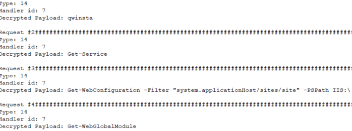

After discovering that the file StyleNet_Retail_Network_Design.docx is GPG encrypted, he attempts to decrypt it, but fails because the private GPG key was initialized by the Administrator, and his current privileges do not allow him to access the private key.

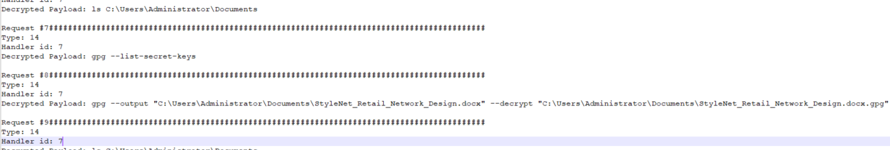

Extracts and steals the sam and system files to dump the Administrator credentials.

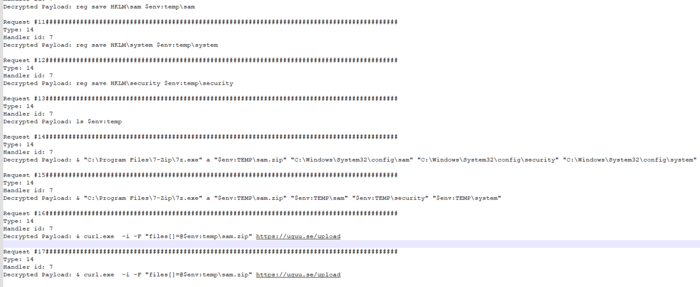

Creates the file C:\Windows\TEMP\iisupdate.zip on the compromised server and write data into it in chunks of 4096 bytes.

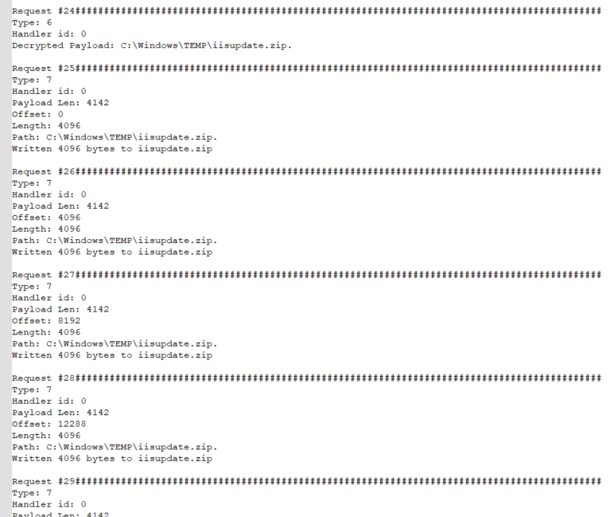

Runs the phant0m.exe file, which is designed to stop the writing of event logs.

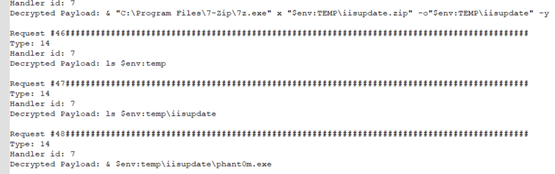

Creates a scheduled task to run the Admin.ps1 file with Administrator privileges and executes it. This file calls the C2 server on port 4444 to run PowerShell.

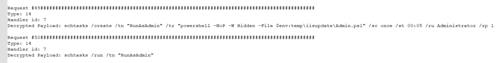

This is why some network traffic through port 4444 is unencrypted, and we can use this to analyze the subsequent actions. The image below shows the successful privilege escalation to Administrator.

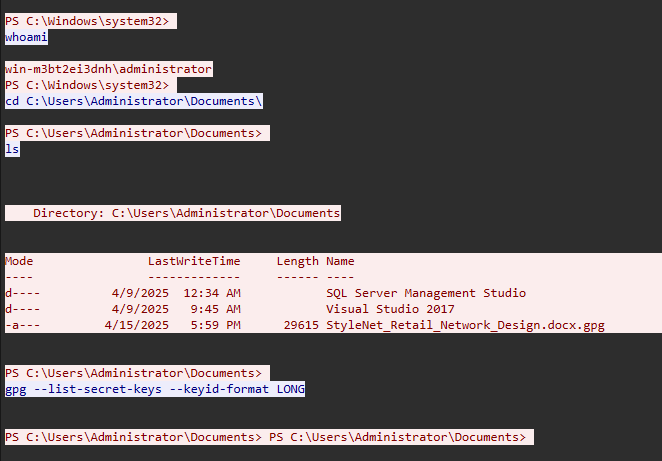

Decrypts the StyleNet_Retail_Network_Design.docx.gpg file and performs exfiltration over an alternative protocol. However, the links are no longer active, so we cannot retrieve the decrypted StyleNet_Retail_Network_Design.docx file.

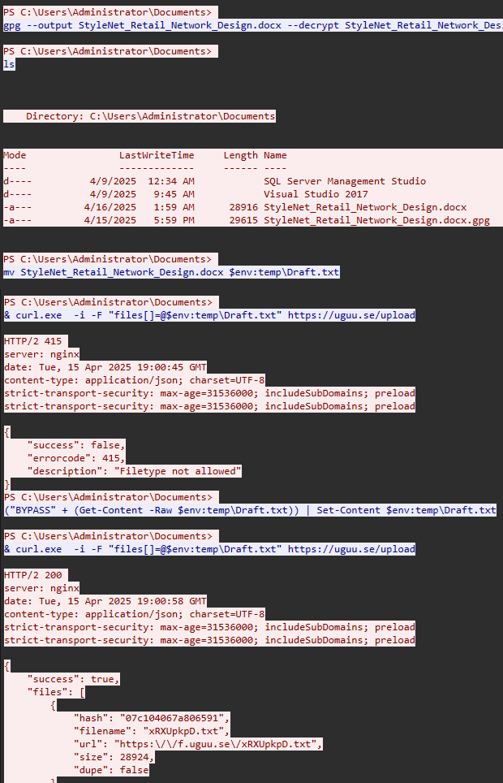

Finally, the attacker runs the Scdaemon.dll file and deletes all traces before leaving the scene.

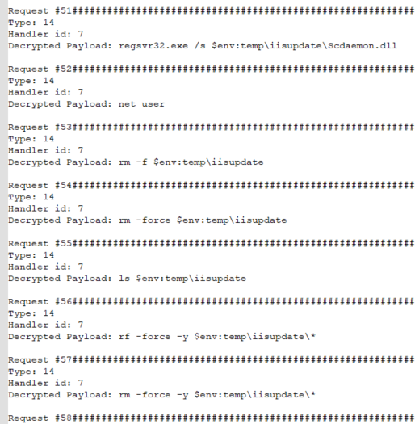

### Decrypting StyleNet_Retail_Network_Design.docx using GPG private key

To decrypt the file, we need the GPG private key of the Administrator. These keys are located at: **C:\Users\Administrator\AppData\Roaming\gnupg**

To recover the private key, you need to restore all the files from the gnupg directory and overwrite the existing files in the gnupg folder on your machine.

Once placed in the gnupg directory, you can extract the private key or directly decrypt the file StyleNet_Retail_Network_Design.docx.gpg.

The file StyleNet_Retail_Network_Design.docx contains part 1 of the flag.

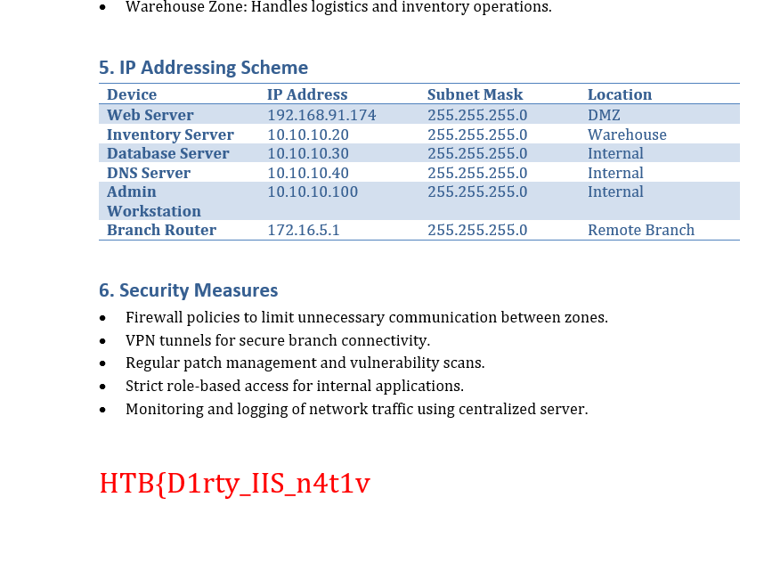

### Analyzing Scdaemon.dll

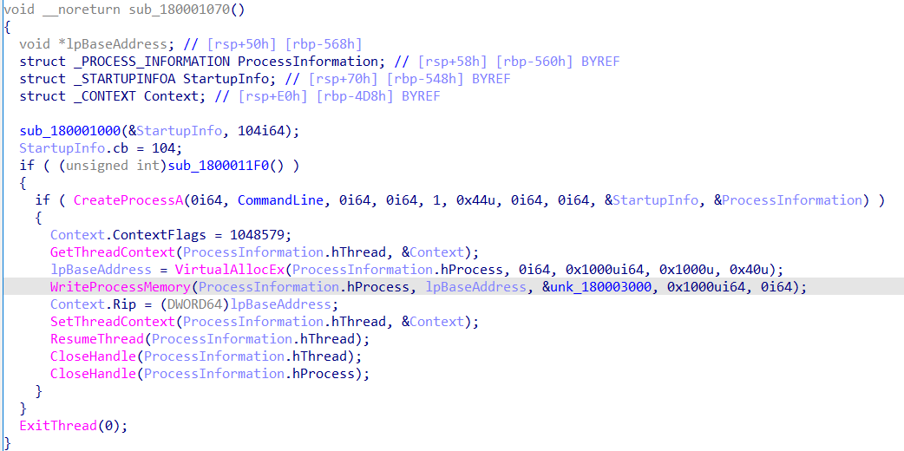

It simply creates a process, allocates memory space to write the shellcode, and then executes the shellcode.

You can retrieve the raw shellcode from the address `&unk_180003000`.

Use `speakeasy` to simulate the shellcode's behavior.

```sh
$ speakeasy -a x64 -r -t shellcode.bin
* exec: shellcode
0x110b: 'kernel32.WinExec("net user webadmin \'3_m0dul3_0n_7hE_l04D}\' /add /Y", 0x1)' -> 0x20
0x1118: 'kernel32.GetVersion()' -> 0x1db10106
```

We have obtained the second part of the flag.

