The Gilded Ghost

19th Apr 2026

Prepared By: VivisGhost

Challenge Author(s): VivisGhost

Difficulty: Very Easy

Classification: Official

# Synopsis

This challenge introduces learners to basic file recovery from a disk image using The Sleuth Kit. Participants will practice identifying a filesystem, locating deleted directory entries, extracting deleted files, and interpreting recovered script and payload artifacts to reconstruct attacker actions

## Description

Gabe received a late-night call: the city’s water filtration system had triggered alerts consistent with unauthorized access. When the team reviewed surveillance footage, they spotted a figure moving through the facility—keeping to the shadows, avoiding cameras, and heading straight for an operator workstation.
The attacker was in and out within minutes. No tools were left behind at the workstation, no obvious malware was found, and the trail went cold—until the final camera angle caught something odd. As the intruder exited, they tossed a small object into the dumpster behind the building.
An intern was voluntold to perform “high-impact evidence recovery” and climbed in to search. They surfaced with a single item: a USB drive.
You’ve been provided a disk image of the USB. Determine what was on it and what the attacker intended to do—ASAP.

  

## Skills Learnt

* Identifying disk layouts & partitions from a provided drive image 
* Using The Sleuth Kit to enumerate files and directories
* Recovering deleted files
* Recover encrypted payloads

## Solution

To begin the analysis, the password-protected ZIP file was unlocked using the password `hackthebox`.

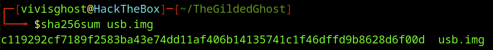

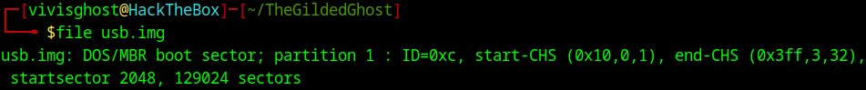

We can mount the file system to see what it contains. First we create a directory to mount `sudo mkdir /mnt/img`.

In the following screenshot we run `fdisk` to list the disk partitions to find the length of sectors and the start. Multiplying these 2 values will give us the offset. Next, we `mount` the image  using the offset . Finally, we check the counts on the mounted drive with `ls -la`.

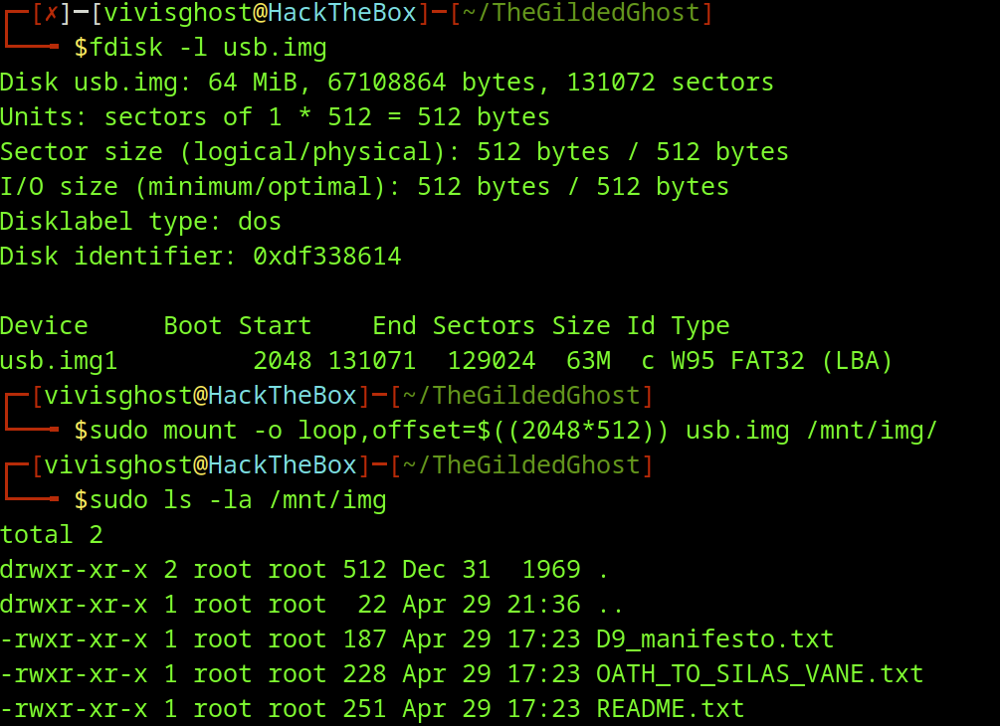

After mounting we can begin to read some of the files. `README.txt` tells us there are 2 files (`setup.sh`, `payload.enc`) that should be deleted after the script run. We currently don't see the mentioned files, so we can assume the Threat Actor ran the script and deleted the files.

We can try to recover them with `sleuthkit`. After ensuring we have `sleuthkit` downloaded, we can begin to answer the questions.  We can also check the official documentation of the tools `https://wiki.sleuthkit.org/TSK-Tool-Overview/`.

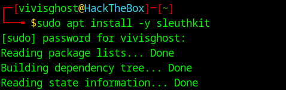

## Questions

----------
1. **What filesystem is used in the USB image?**

	

	We will begin by using `fsstat` to display the general details of the file system. In the first line of output we see the `File System Type` is `FAT32`.
	
	
	
	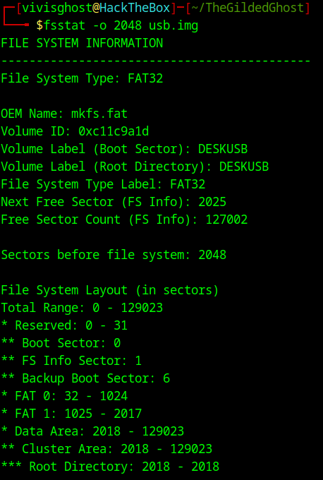
	
	**Answer:** `FAT32`

2. **What is the partition start offset (in sectors) for the filesystem?**

	

	We have found this answer twice already using `fdisk` and `fsstat`.  We can also use `mmls` to check the offset. In the following screenshot, we can see on line `002` the start of the `Win95 FAT32` is `2048`.
	
	
	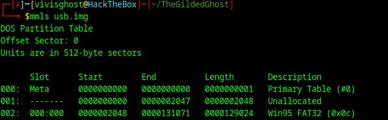
	
	
	
	
	**Answer:** `2048`

3. **What file explains how to use the payload?**

	
	We read this file in the initial analysis. We see it gives the operator instructions on how to run the malware. On the 3rd note we see they are instructed to `Delete` the files after use.
	
	
	
	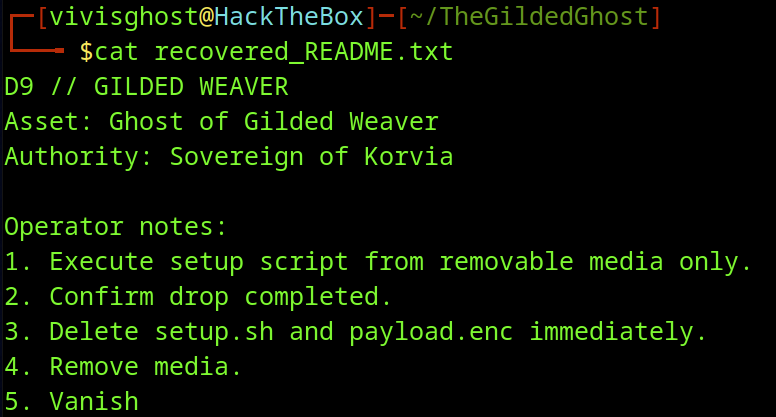
	
	
	
	
	**Answer:** `README.txt`

4. **What is the Sleuth Kit metadata address (inode number shown by fls) for the deleted setup.sh file?**

	

	Using `fls` we can list the files and directories of a disk image. `fls` will also show us the recently deleted files indicted by the `*`. Here we see the `setup.sh` and `payload.enc` files mentioned in the `README.txt` at `13` and `15` respectively.  
	
	
	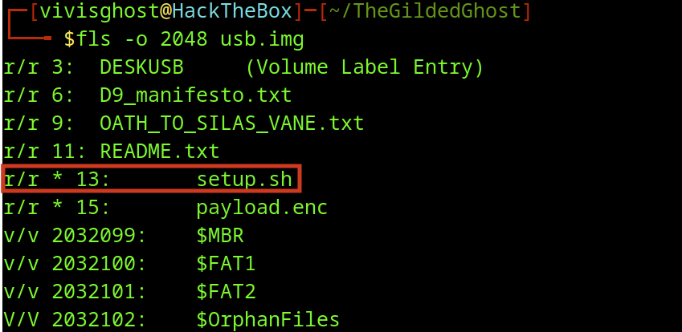
	
	
	
	**Answer:** `13`

5. **What encryption algorithm is used to protect the payload?**

	
	Next, we can use `icat` to recover the files based on their inode.  
	
	
	
	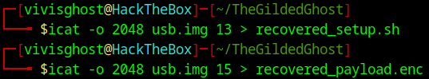
	
	
	After recovering the deleted files, we can check their contents.
	
	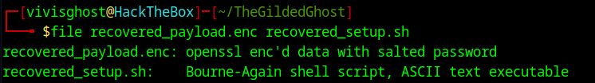
	
	
	
	After recovering the `setup.sh` script we can see it contains 2 main steps.
	
	1) Use `openssl` to decrypt the `payload.enc` file as `stage.sh`.
	2) Run `stage.sh` with `bash`.
	
	The `openssl` command has a couple switches.
	
	1. `enc -d` tells us decrypt.
	2. `-aes-256-cbc` is the type of encryption.
	3. `-pbkdf2`
	4. `-iter 100000 -salt`
	5. `-pass` is the key used.
	6. Finally, `-in` and `-out` are the files to be decrypted and the name of the output.
	
	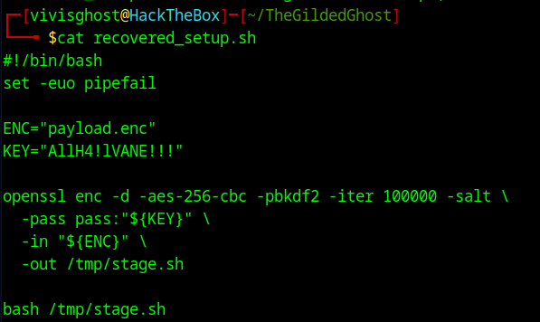
	
	**Answer:** `AES-256-CBC`

6. **What key/passphrase is used to decrypt the encrypted payload?**

	

	From the previous screenshot we can see the KEY that is being used. 
	
	
	
	
	**Answer:** `AllH4!lVANE!!!`

7. **What is the attacker’s SSH public key comment/identity string?**

	

	To decrypt the payload we can use the `setup.sh` script with a couple of modifications. 
	
	1. The red line shows we need to change the name of the file to the name of what we recovered.
	2. The orange line shows we change the output to our current directory.
	3. The yellow line shows we comment out the running of the script, so we can just read it.
	
	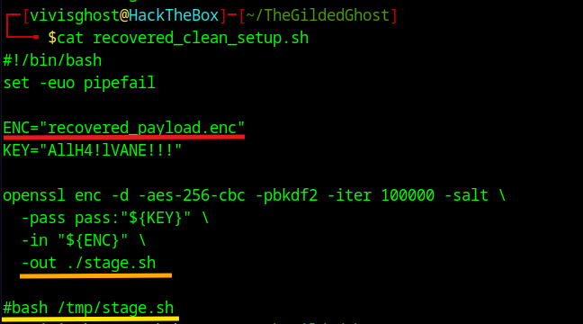
	
	
	
	After running the altered setup script we get the decrypted payload, `stage.sh`.
	
	
	
	Lets analyze the script to see what it does.
	
	1. The Red Box shows setting up the variable web address to exfiltrate data.
	2. The Orange Box shows a public ssh key connected to the `GHOST_PUB` variable.
	3. The following lines check if  `.ssh/authorized_keys` is present, then adds the public key to it.
	
	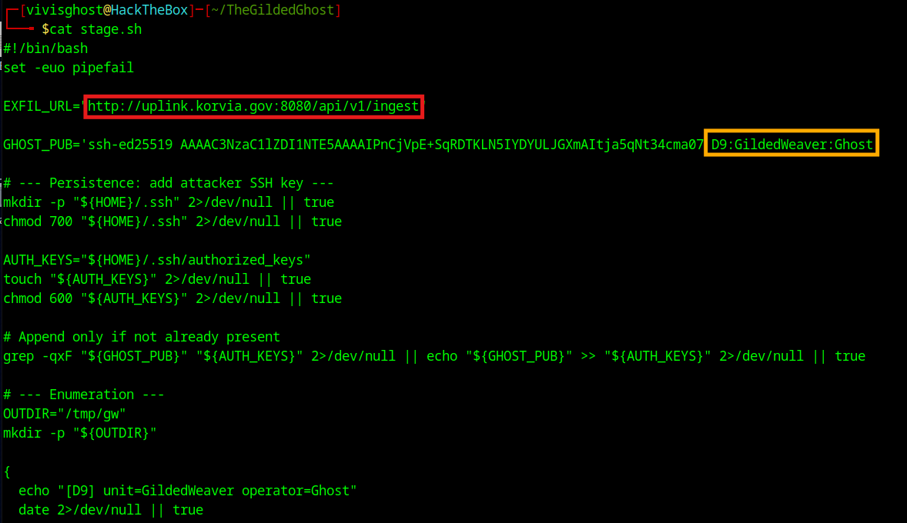
	
	
	
	
	
	Finally, to answer the present question we see the comment string in the Orange Box.
	
	
	
	
	**Answer:** `D9:GildedWeaver:Ghost`

8. **What the fullpath of the file that was exfiltrated?**

	

	The next lines setup an output directory and file. Next, they run some enumeration of the system.
	
	
	
	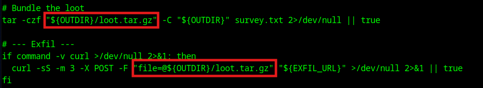
	
	
	
	
	**Answer:** `/tmp/gw/loot.tar.gz`

9. **What is the exfiltration destination (full URL path)?**

	
	We saw this answer in the Red Box from the second screenshot in question 7. Additionally, the screenshot in question 8 shows the curl command in action.
	
	**Answer:** `http://uplink.korvia.gov:8080/api/v1/ingest`

