<br>

<br>

<font size='5'>NoctEye</font>

12<sup>th</sup> April 2026

Prepared By: lawbyte

Challenge Author: lawbyte

Difficulty: <font color='green'>Easy</font>

<br>

<br>

<br>

# Synopsis

A field analyst's handset was compromised by a spyware implant — **NoctEye**. Before the SOC team could isolate the device, the implant encrypted a local log of stolen operational data and staged it for exfiltration. The team pulled the outgoing artifact — `intercept.bin` — before it left the device. The APK sample was also recovered from the filesystem.

The encryption is entirely self-contained: no network calls, no cloud keys, no device fingerprint. Every parameter needed to decrypt `intercept.bin` is baked into either the DEX bytecode or the native library bundled with the APK.

Reverse both. Recover the plaintext. Find the flag.

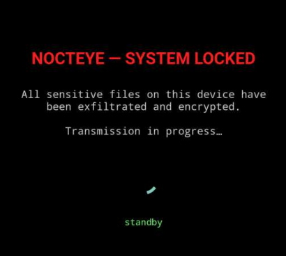

## Skills Required

- Android APK structure and unpacking
- DEX decompilation with jadx
- Reading Kotlin source code
- ARM64 native library analysis with Ghidra or IDA Pro
- Identifying standard cryptographic primitives (SHA-256, HMAC, PBKDF2) from assembly
- AES-GCM decryption in Python

## Skills Learned

- Reading across two tool chains (jadx for DEX, IDA/Ghidra for native) to reconstruct a full crypto pipeline
- Identifying SHA-256 by its H0–H7 init constants and K[64] round-constant table in disassembly
- Identifying HMAC-SHA256 by the `0x36` / `0x5C` XOR masks on two 64-byte key pads
- Identifying PBKDF2 by the block-loop + T-XOR-U accumulation pattern and iteration count
- Spotting a compiler-constant-folded XOR obfuscation (salt stored as baked-in 64-bit immediates)
- Tracing a non-obvious KDF input (filename concatenation) that lives entirely in native code

# Solution

## Step 1 — Look at `intercept.bin` first

Before opening the APK, inspect the encrypted artifact with a hex dump:

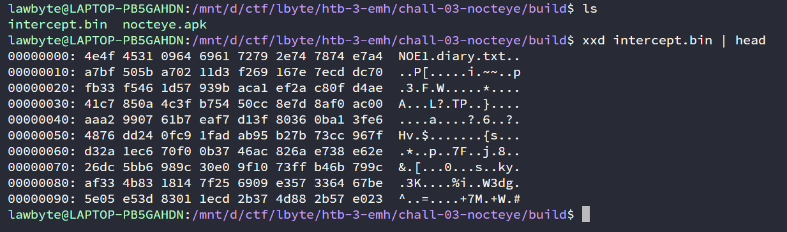

Breaking it down byte by byte:

| Offset | Bytes | Meaning |
| ------ | ----- | ------- |
| `+0` | `4E 4F 45 31` | Magic — `"NOE1"` |
| `+4` | `09` | Filename length — 9 bytes |
| `+5` | `64 69 61 72 79 2e 74 78 74` | Filename — `"diary.txt"` |
| `+14` | next 12 bytes | IV (12 bytes = AES-GCM nonce) |
| `+26` | remainder | Ciphertext + GCM tag |

The filename is `diary.txt`. Write that down — it will matter in a non-obvious way later.

## Step 2 — Unpack the APK and decompile the DEX

```bash
unzip nocteye.apk -d nocteye_unpacked
ls nocteye_unpacked/lib/
# → arm64-v8a/   x86_64/

jadx -d out nocteye.apk
ls out/sources/com/nightfall/nocteye/
# → CryptoOps.kt   MainActivity.kt   Native.kt
```

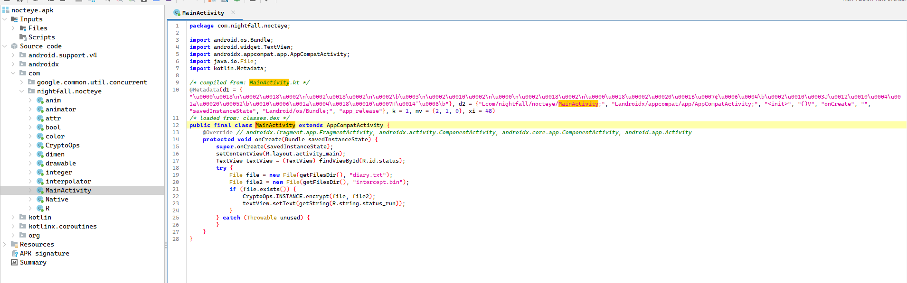

Three classes. Look at each in order.

## Step 3 — Read `MainActivity.kt`

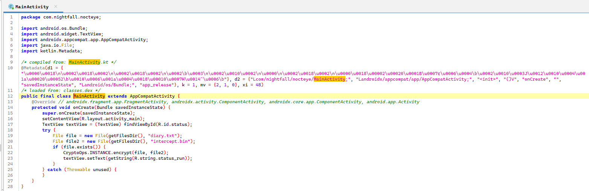

Minimal — tries to encrypt `diary.txt` → `intercept.bin` on startup and renders a ransom-note screen. Confirms the encrypted filename is `diary.txt`.

## Step 4 — Read `CryptoOps.kt` — the encryption side

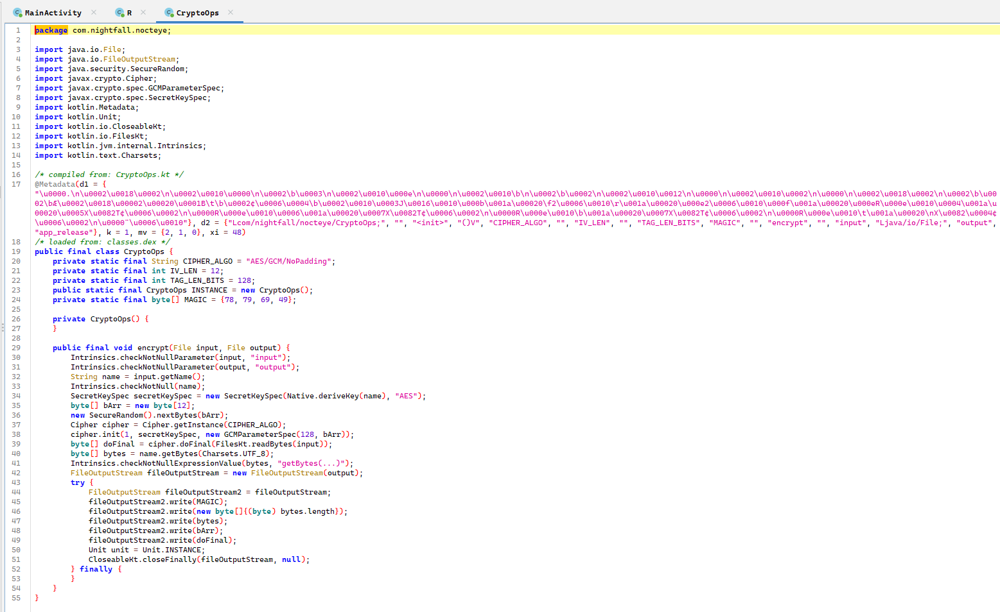

This gives you five of the six parameters you need:

- **Algorithm:** `AES/GCM/NoPadding`
- **IV:** 12 bytes (at header offset `5 + fname_len`)
- **Tag:** 128-bit, trailing after ciphertext (`Cipher.doFinal` and Python's `AESGCM.decrypt` both handle `ct || tag` as one blob)
- **Header layout:** `"NOE1" | len(fname) | fname | iv | ct+tag`
- **Key source:** `Native.deriveKey(filename)` — the 32-byte key is **not** in the DEX

The key derivation is entirely inside `libnocteye.so`.

## Step 5 — Read `Native.kt`

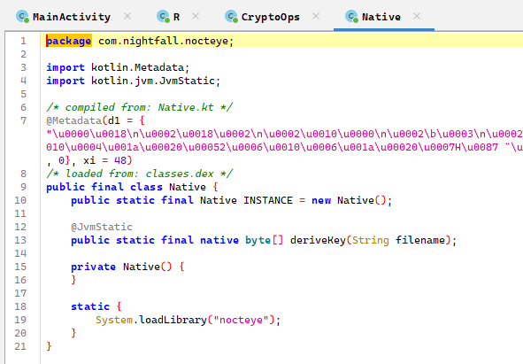

One JNI method: `deriveKey(String) → ByteArray`. The filename is the sole argument. Everything else — passphrase, salt, KDF algorithm, iteration count — lives in the native library.

## Step 6 — Survey `libnocteye.so`

```bash
file nocteye_unpacked/lib/arm64-v8a/libnocteye.so
# ELF 64-bit LSB shared object, ARM aarch64, stripped

readelf --dyn-syms nocteye_unpacked/lib/arm64-v8a/libnocteye.so
```

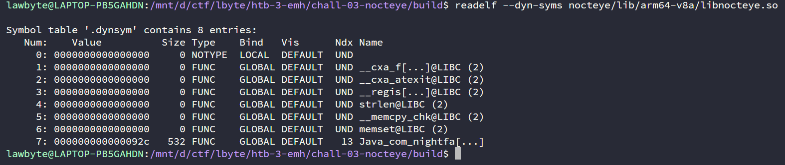

The dynamic symbol table has six libc imports (`__cxa_finalize`, `__cxa_atexit`, `__register_atfork`, `strlen`, `__memcpy_chk`, `memset`) and exactly one user-defined export:

```text
Java_com_nightfall_nocteye_Native_deriveKey
```

No `sha256_*`, no `hmac`, no `pbkdf2`, no passphrase string. Everything beyond the export name is stripped.

Open the library in **IDA Pro** or Ghidra (arm64, Android NDK headers). Auto-analysis on a ~7 KB binary completes instantly. IDA names the following functions:

| Address | IDA name | Role |
| ------- | -------- | ---- |
| `0x92C` | `Java_com_nightfall_nocteye_Native_deriveKey` | JNI entry — key derivation orchestrator |
| `0xB40` | `sub_B40` | HMAC-SHA256 |
| `0xC90` | `sub_C90` | SHA-256 init |
| `0xCB0` | `sub_CB0` | SHA-256 update |
| `0xD2C` | `sub_D2C` | SHA-256 block compression |
| `0xF54` | `sub_F54` | SHA-256 final / digest output |

Navigate to `Java_com_nightfall_nocteye_Native_deriveKey` and work down the call tree.

## Step 7 — Identify SHA-256 (`sub_C90` → `sub_D2C`)

### Init values (`sub_C90`)

`sub_C90` is the SHA-256 init function. IDA decompiles it as:

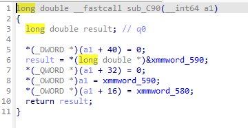

Jump to `xmmword_590` (address `0x590`) and `xmmword_580` (`0x580`) in the data view. The raw bytes read:

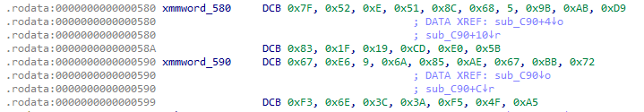

```text
xmmword_590 @ 0x590:  67 e6 09 6a  85 ae 67 bb  72 f3 6e 3c  3a f5 4f a5
xmmword_580 @ 0x580:  7f 52 0e 51  8c 68 05 9b  ab d9 83 1f  19 cd e0 5b
```

Reading each 4-byte group as little-endian `uint32`:

```text
H0 = 0x6A09E667   H1 = 0xBB67AE85   H2 = 0x3C6EF372   H3 = 0xA54FF53A
H4 = 0x510E527F   H5 = 0x9B05688C   H6 = 0x1F83D9AB   H7 = 0x5BE0CD19
```

These are the standard SHA-256 initial hash values. This is SHA-256.

### Compression function (`sub_D2C`)

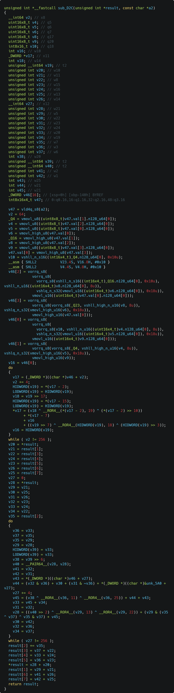

`sub_D2C` is the SHA-256 block compression function. Its K[64] round-constant table sits at `unk_5A0` (address `0x5A0`). The first 32 bytes:

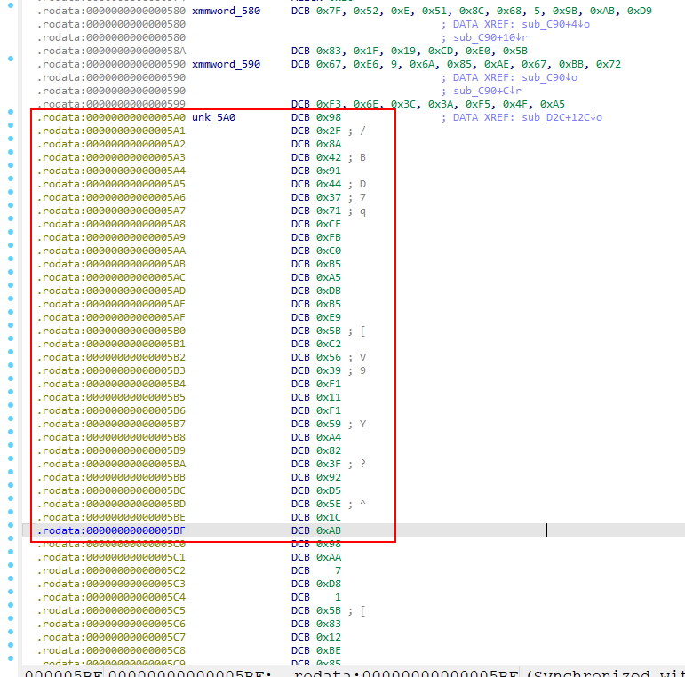

```text
0x5A0:  98 2f 8a 42  91 44 37 71  cf fb c0 b5  a5 db b5 e9
0x5B0:  5b c2 56 39  f1 11 f1 59  a4 82 3f 92  d5 5e 1c ab
```

Reading as little-endian `uint32`:

```text
K[0] = 0x428A2F98   K[1] = 0x71374491   K[2] = 0xB5C0FBCF   K[3] = 0xE9B5DBA5
K[4] = 0x3956C25B   K[5] = 0x59F111F1   K[6] = 0x923F82A4   K[7] = 0xAB1C5ED5
```

This is the canonical SHA-256 K[] table. `sub_D2C` is the SHA-256 compression function.

## Step 8 — Identify HMAC-SHA256 (`sub_B40`)

IDA decompiles `sub_B40` as:

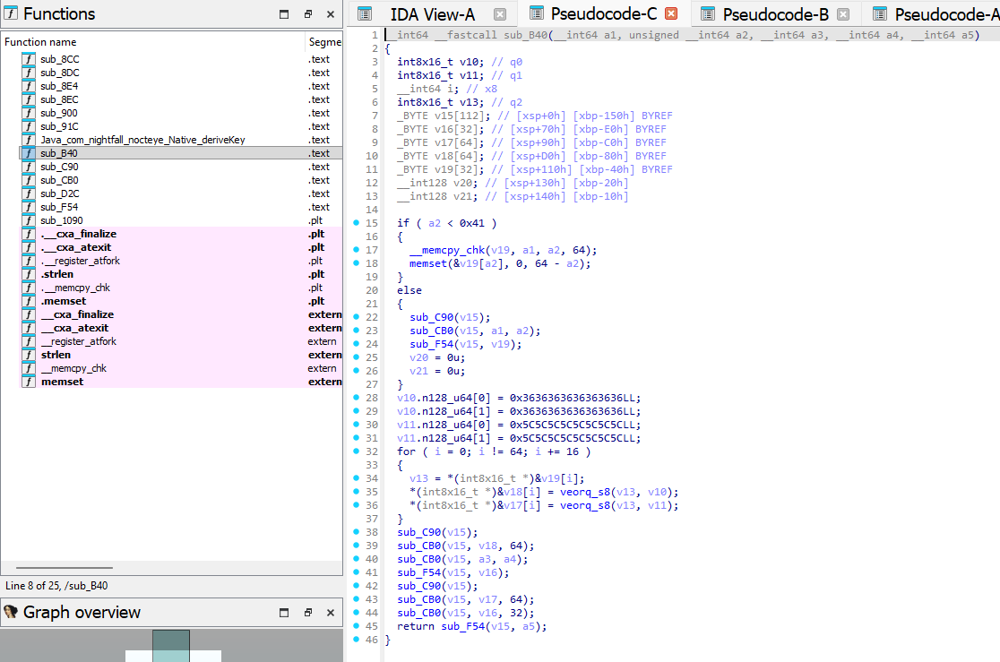

```c
__int64 __fastcall sub_B40(__int64 a1, unsigned __int64 a2,
                           __int64 a3, __int64 a4, __int64 a5)
{
  // ... key normalisation (hash if > 64 bytes, else zero-pad) ...

  // XOR key with ipad (0x36) and opad (0x5C) — HMAC constants
  v10.n128_u64[0] = 0x3636363636363636LL;
  v10.n128_u64[1] = 0x3636363636363636LL;
  v11.n128_u64[0] = 0x5C5C5C5C5C5C5C5CLL;
  v11.n128_u64[1] = 0x5C5C5C5C5C5C5C5CLL;
  for ( i = 0; i != 64; i += 16 )
  {
    v13 = *(int8x16_t *)&v19[i];
    *(int8x16_t *)&v18[i] = veorq_s8(v13, v10);  // k_ipad[i] = k[i] ^ 0x36
    *(int8x16_t *)&v17[i] = veorq_s8(v13, v11);  // k_opad[i] = k[i] ^ 0x5C
  }

  // inner hash: SHA256(k_ipad || msg)
  sub_C90(v15);
  sub_CB0(v15, v18, 64);
  sub_CB0(v15, a3, a4);
  sub_F54(v15, v16);

  // outer hash: SHA256(k_opad || inner)
  sub_C90(v15);
  sub_CB0(v15, v17, 64);
  sub_CB0(v15, v16, 32);
  return sub_F54(v15, a5);
}
```

The two vector constants `0x3636...` and `0x5C5C...` are HMAC's `k_ipad` and `k_opad`. The double-hash structure `SHA256(k_opad || SHA256(k_ipad || msg))` is the standard HMAC construction. `sub_B40` is `hmac_sha256`.

## Step 9 — Identify PBKDF2 inside `deriveKey`

Back in `Java_com_nightfall_nocteye_Native_deriveKey`, IDA shows the PBKDF2 loop:

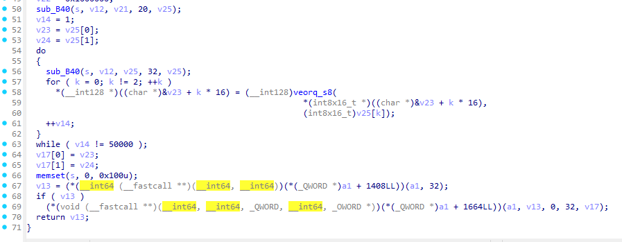

```c
// First HMAC: U1 = HMAC(kdf_input, salt || block_counter)
sub_B40(s, v12, v21, 20, v25);   // s = kdf_input, v21 = salt+counter (20 bytes)
v14 = 1;
v23 = v25[0];                     // T = U1
v24 = v25[1];

// Iterate: U_j = HMAC(kdf_input, U_{j-1}),  T ^= U_j
do
{
  sub_B40(s, v12, v25, 32, v25);
  for ( k = 0; k != 2; ++k )
    *(__int128 *)((char *)&v23 + k * 16) = (__int128)veorq_s8(
        *(int8x16_t *)((char *)&v23 + k * 16),
        (int8x16_t)v25[k]);         // T ^= U
  ++v14;
}
while ( v14 != 50000 );            // ← iteration count: 50,000
```

The outer loop `v14 = 1 .. 50000`, inner accumulator `T ^= U`, HMAC as the PRF — this is PBKDF2-HMAC-SHA256 with **50,000 iterations**.

The output `T` (`v23:v24`, 32 bytes) is the derived key.

## Step 10 — Read the full `deriveKey` body

IDA's full decompile of `Java_com_nightfall_nocteye_Native_deriveKey` (`0x92C`):

```c
__int64 __fastcall Java_com_nightfall_nocteye_Native_deriveKey(
        __int64 env, __int64 cls, __int64 jfilename)
{
  // ── Decode passphrase from rodata blob 'a459WKUbdhqbu' ──────────────
  for ( i = 0; i != 10; ++i )
    v20[i] = a459WKUbdhqbu[i] ^ 0x5A;            // PASS_BLOB_A: bytes 0..9,  XOR 0x5A

  for ( j = 0; j != 9; ++j )
    v20[10 + j] = a459WKUbdhqbu[10 + j] ^ 0x27;  // PASS_BLOB_B: bytes 10..18, XOR 0x27

  // ── Get filename string from JNI ─────────────────────────────────────
  v10 = GetStringUTFChars(env, jfilename, 0);
  if ( !v10 ) return 0;
  v12 = strlen(v10) + 19;    // kdf_input total length = 19 (passphrase) + fname_len

  // ── Build kdf_input = passphrase || filename ─────────────────────────
  *(_OWORD *)s      = *(_OWORD *)v20;        // copy passphrase (19 bytes) into s
  *(_DWORD *)&s[15] = *(_DWORD *)&v20[15];
  __memcpy_chk(v19, v10, strlen(v10), 237);  // append filename after passphrase ← TWIST

  ReleaseStringUTFChars(env, jfilename, v10);

  // ── Salt — baked as 64-bit immediates (compiler constant-folded XOR) ─
  v21[0] = 0x11597B8EC0D4F1A3LL;   // salt bytes  0..7  (LE: a3 f1 d4 c0 8e 7b 59 11)
  v21[1] = 0xB2E49D01836F4A2CLL;   // salt bytes  8..15 (LE: 2c 4a 6f 83 01 9d e4 b2)
  v22    = 0x1000000;               // PBKDF2 block counter i=1 in big-endian

  // ── PBKDF2-HMAC-SHA256, 50,000 iterations, 32-byte output ───────────
  sub_B40(s, v12, v21, 20, v25);   // U1 = HMAC(kdf_input, salt || 0x00000001)
  v14 = 1;
  v23 = v25[0];  v24 = v25[1];    // T = U1
  do {
    sub_B40(s, v12, v25, 32, v25); // Uj = HMAC(kdf_input, U_{j-1})
    v23 ^= v25[0];  v24 ^= v25[1]; // T ^= Uj  (SIMD veorq_s8)
    ++v14;
  } while ( v14 != 50000 );

  // ── Return 32-byte key as jbyteArray ────────────────────────────────
  memset(s, 0, 0x100);
  result = NewByteArray(env, 32);
  SetByteArrayRegion(env, result, 0, 32, key);
  memset(key, 0, 32);
  return result;
}
```

Two observations that drive the whole solve:

1. **Passphrase decoding at runtime:** `a459WKUbdhqbu` (at address `0x560`) is a rodata blob. The XOR loop decodes it in two passes — first 10 bytes with key `0x5A`, then 9 bytes with key `0x27` — to produce the 19-byte passphrase.

2. **Salt constant-folded:** The compiler evaluated the salt's XOR decoding at compile time. The two 64-bit immediates `0x11597B8EC0D4F1A3` and `0xB2E49D01836F4A2C` **are** the decoded salt bytes packed as little-endian 64-bit integers. There is no XOR loop for the salt in the binary.

3. **KDF input twist:** The line `__memcpy_chk(v19, v10, strlen(v10), 237)` copies the filename immediately after the 19-byte passphrase in the `s` buffer. PBKDF2 takes `passphrase || filename` as its password, not just the passphrase. This is invisible in the Kotlin side.

## Step 11 — Dump the passphrase blob and decode the salt

### Passphrase

In the decompile, IDA labels the blob `a459WKUbdhqbu`. Double-click it to jump to `0x560` in the data view. IDA splits it into two DCB lines because byte `0x0A` (LF) is non-printable:

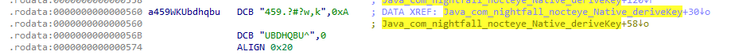

Map these back to the two blobs the decompile uses:

- **PASS_BLOB_A** (10 bytes, XOR `0x5A`): `"459.?#?w,k"` → bytes `34 35 39 2E 3F 23 3F 77 2C 6B`
- **PASS_BLOB_B** (9 bytes, XOR `0x27`): the `0xA` suffix of the first line **plus** `"UBDHQBU^"` from the second → bytes `0A 55 42 44 48 51 42 55 5E` (ignore the trailing null `,0`)

Verify with a quick Python script:

```python
# bytes straight from IDA's DCB view
PASS_BLOB_A = b"459.?#?w,k"          # "459.?#?w,k"   (the string part only)
PASS_BLOB_B = b"\x0a" + b"UBDHQBU^"  # 0xA suffix + "UBDHQBU^"  (9 bytes, no null)

pass_a = bytes(b ^ 0x5A for b in PASS_BLOB_A)
pass_b = bytes(b ^ 0x27 for b in PASS_BLOB_B)
print(pass_a)           # b'nocteye-v1'
print(pass_b)           # b'-recovery'
print(pass_a + pass_b)  # b'nocteye-v1-recovery'
```

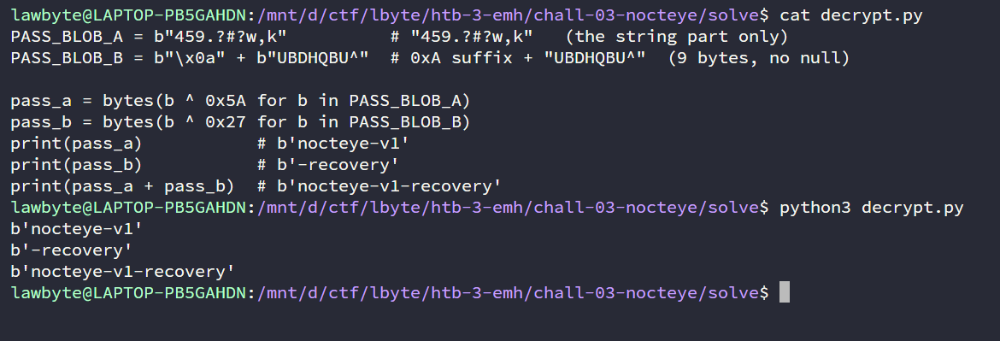

### Salt

The salt does not come from a rodata blob — the compiler constant-folded both XOR-decode results into two 64-bit immediates stored directly on the stack inside `deriveKey`. From the IDA decompile:

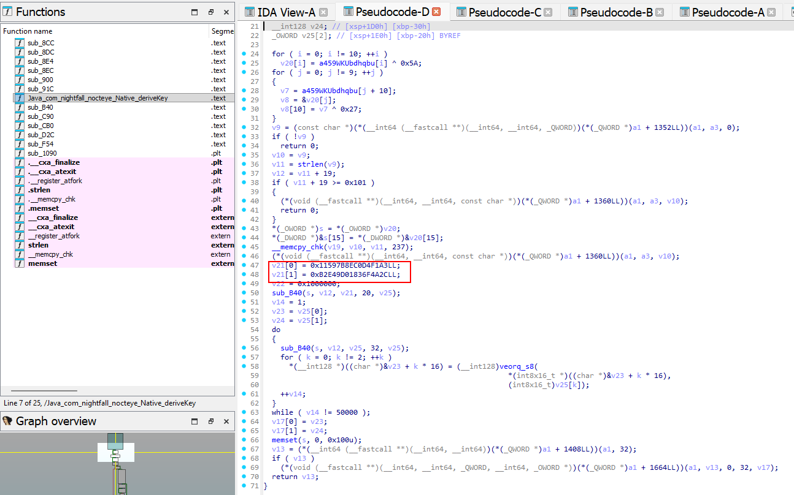

These are little-endian packed `uint64`. Unpack them to get the 16 salt bytes:

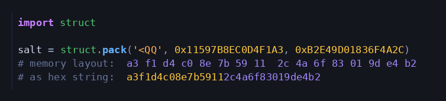

## Step 12 — Implement the solver

All parameters are now known. Parse the file header, build the KDF input with the filename twist, and decrypt:

```python
from cryptography.hazmat.primitives import hashes
from cryptography.hazmat.primitives.ciphers.aead import AESGCM
from cryptography.hazmat.primitives.kdf.pbkdf2 import PBKDF2HMAC
import struct

PASSPHRASE = b"nocteye-v1-recovery"
SALT       = struct.pack('<QQ', 0x11597B8EC0D4F1A3, 0xB2E49D01836F4A2C)
ITERATIONS = 50_000

blob      = open("intercept.bin", "rb").read()
assert blob[:4] == b"NOE1"
fname_len = blob[4]
filename  = blob[5:5 + fname_len]      # b"diary.txt"
off       = 5 + fname_len
iv        = blob[off:off + 12]
ct        = blob[off + 12:]

kdf_input = PASSPHRASE + filename      # passphrase || filename — the twist
key       = PBKDF2HMAC(hashes.SHA256(), 32, SALT, ITERATIONS).derive(kdf_input)

print(AESGCM(key).decrypt(iv, ct, None).decode())
```

```bash
python3 solve.py build/intercept.bin
```

## Step 13 — Read the flag

The decrypted plaintext is the stolen intercept log:

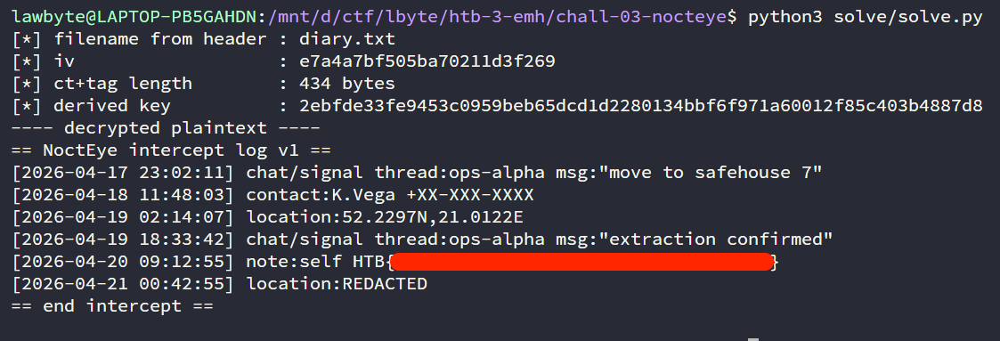

The flag is on the `note:self` line.

<details><summary>Flag</summary>

`HTB{..........................}`

</details>

---