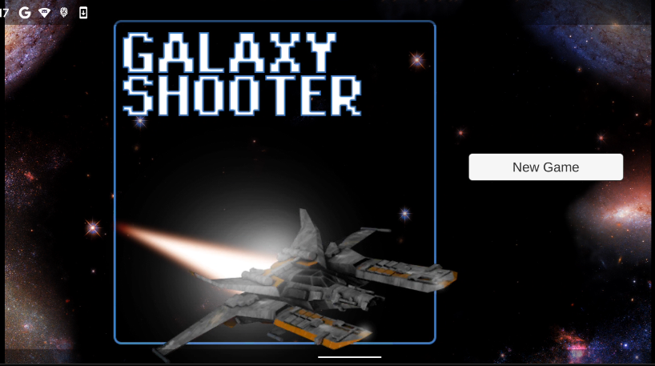
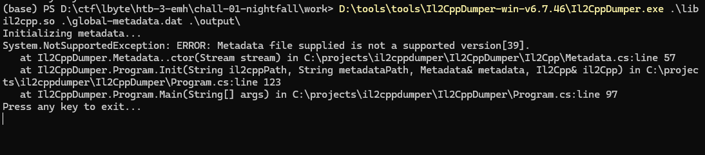
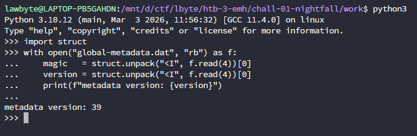
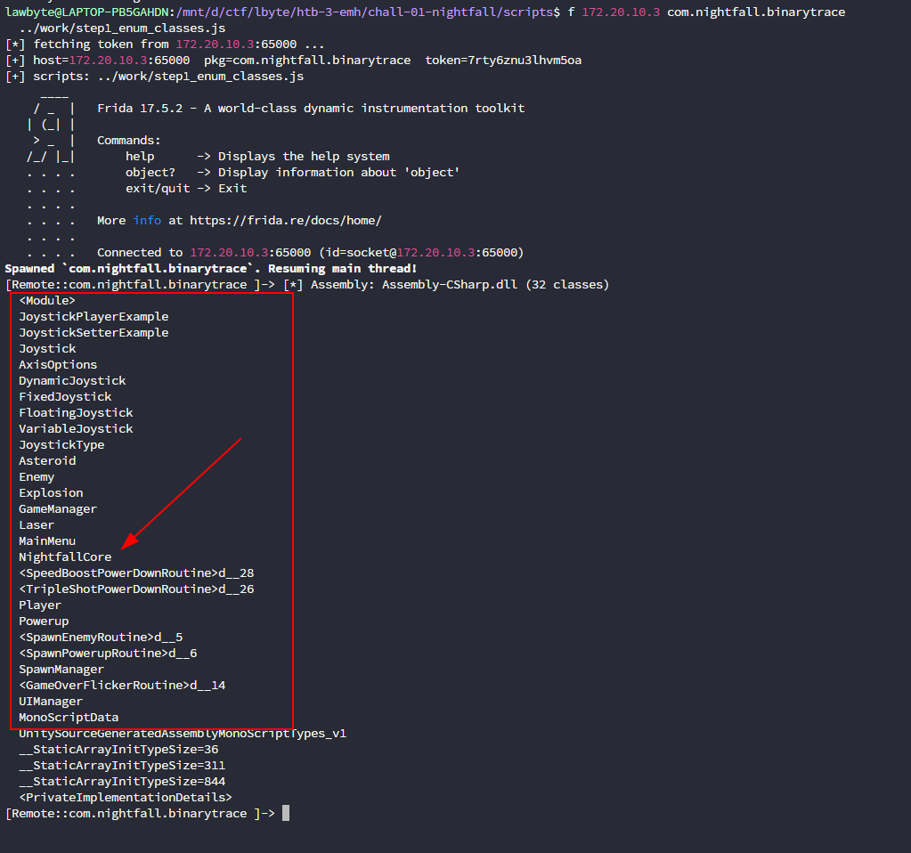
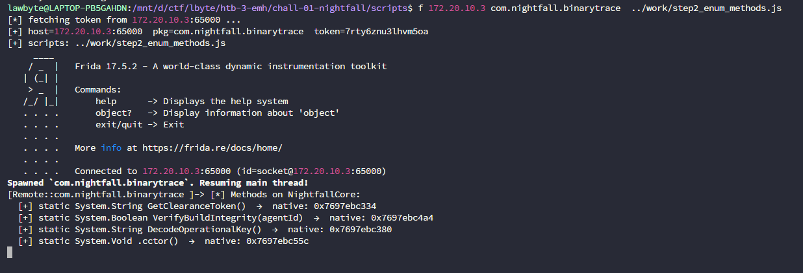
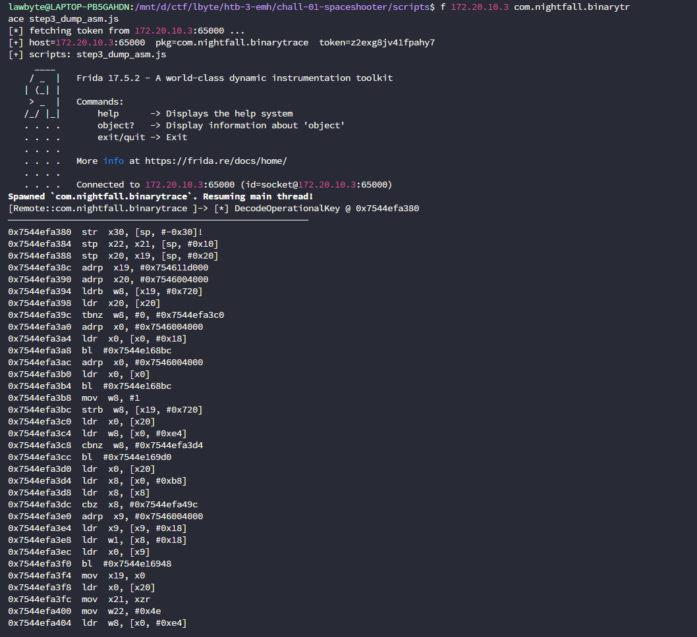
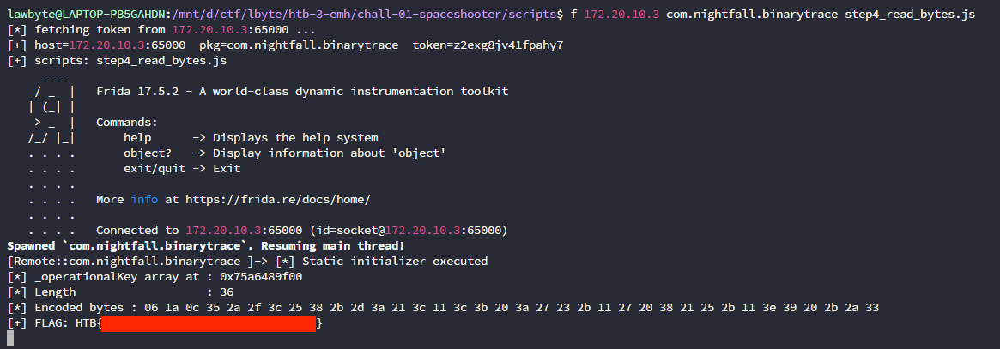

<br>

<br>

<font size='5'>Space Shooter</font>

12<sup>th</sup> April 2026

Prepared By: lawbyte

Challenge Author: lawbyte

Difficulty: <font color='green'>Medium</font>

<br>

<br>

<br>

# Synopsis

A nation-state APT group known as **DarkVector** has been conducting cyberattacks against our country's critical infrastructure. During a counter-operation, our red team captured a suspicious Android application deployed by the group as part of their staging infrastructure. The application is disguised as a simple mobile game — **Space Shooter** — but intelligence suggests it contains an embedded operational key used for C2 authentication.



## Skills Required

- Basic Android reverse engineering (APK structure, ADB)
- Understanding of Unity IL2CPP runtime internals
- Frida scripting (NativeFunction, memory reads, disassembly)
- ARM64 assembly reading
- XOR decoding

## Skills Learned

- Identifying Unity IL2CPP game structure inside an APK
- Why IL2CPP metadata version mismatches break static tools
- Using Frida to enumerate IL2CPP classes and methods at runtime
- Reading ARM64 assembly to identify XOR decode loops
- Extracting static field data from IL2CPP memory and decoding manually

# Solution

## Step 1 — Install the APK and observe

Install and run the APK. The main menu has a **New Game** button. After starting, the game shows a score counter and lives display. The game is a space shooter — enemies give points, powerups drop. Nothing about the gameplay surface is obviously suspicious.

The challenge description states the APK was captured from DarkVector APT staging infrastructure and contains an embedded operational key. The goal is to find it inside the binary.

## Step 2 — Unpack the APK and identify the build type

```bash
unzip nightfall-binarytrace.apk -d nightfall_unpacked
```

Look at the contents:

```text
lib/arm64-v8a/libil2cpp.so
assets/bin/Data/Managed/Metadata/global-metadata.dat
AndroidManifest.xml    →  package: com.nightfall.binarytrace
```

There is **no** `Assembly-CSharp.dll`. In a Unity Mono build all game code compiles into that DLL and is trivially decompilable with dnSpy. Its absence confirms this is an **IL2CPP** build — the C# code has been compiled to native ARM64 inside `libil2cpp.so`. Class and method names are stored separately in `global-metadata.dat`.

## Step 3 — Try static analysis tools → fail

```bash
Il2CppDumper.exe libil2cpp.so global-metadata.dat ./output
```



Check the metadata version manually:

```python
import struct
with open("global-metadata.dat", "rb") as f:
    magic   = struct.unpack("<I", f.read(4))[0]  # 0xFAB11BAF
    version = struct.unpack("<I", f.read(4))[0]  # 39
    print(f"metadata version: {version}")
```



Version **39** is produced by Unity 6. All released builds of Il2CppDumper (≤ v6.7.46) and Cpp2IL (≤ 2022.1.0-pre-release.21) only support up to version 29. Static dumping is not possible with available tools.

**Pivot: switch to dynamic analysis with Frida.**

## Step 4 — Set up Frida

Frida works at runtime — it reads class names and method names directly from the live process memory using IL2CPP runtime API functions exported by `libil2cpp.so`. It does not rely on `global-metadata.dat` at all, so the version incompatibility is irrelevant.

```bash
pip install frida-tools
adb push frida-server /data/local/tmp/
adb shell "chmod +x /data/local/tmp/frida-server && /data/local/tmp/frida-server &"
frida-ps -Uai | grep -i night
```

## Step 5 — Enumerate all IL2CPP classes

With no dump.cs available there is no class list. Write a Frida script that walks every assembly and prints all class names from `Assembly-CSharp`:

```javascript
// step1_enum_classes.js
var LIB = "libil2cpp.so";

function waitForLib(cb) {
    var t = setInterval(function () {
        var mod = Process.findModuleByName(LIB);
        if (mod) { clearInterval(t); cb(mod); }
    }, 500);
}

waitForLib(function (mod) {
    var domain_get            = new NativeFunction(mod.findExportByName("il2cpp_domain_get"),            "pointer", []);
    var thread_attach         = new NativeFunction(mod.findExportByName("il2cpp_thread_attach"),         "pointer", ["pointer"]);
    var domain_get_assemblies = new NativeFunction(mod.findExportByName("il2cpp_domain_get_assemblies"), "pointer", ["pointer", "pointer"]);
    var assembly_get_image    = new NativeFunction(mod.findExportByName("il2cpp_assembly_get_image"),    "pointer", ["pointer"]);
    var image_get_name        = new NativeFunction(mod.findExportByName("il2cpp_image_get_name"),        "pointer", ["pointer"]);
    var image_get_class_count = new NativeFunction(mod.findExportByName("il2cpp_image_get_class_count"), "int",     ["pointer"]);
    var image_get_class       = new NativeFunction(mod.findExportByName("il2cpp_image_get_class"),       "pointer", ["pointer", "int"]);
    var class_get_name        = new NativeFunction(mod.findExportByName("il2cpp_class_get_name"),        "pointer", ["pointer"]);

    var domain = domain_get();
    thread_attach(domain);
    var countPtr = Memory.alloc(4);
    var assemblies = domain_get_assemblies(domain, countPtr);
    var count = countPtr.readInt();

    for (var i = 0; i < count; i++) {
        var asm = assemblies.add(i * Process.pointerSize).readPointer();
        var img = assembly_get_image(asm);
        if (image_get_name(img).readUtf8String() !== "Assembly-CSharp.dll") continue;
        var n = image_get_class_count(img);
        for (var j = 0; j < n; j++)
            console.log("  " + class_get_name(image_get_class(img, j)).readUtf8String());
    }
});
```

```bash
frida -U -f com.nightfall.binarytrace -l step1_enum_classes.js
```

Output:



Two entries stand out:

- **`NightfallCore`** — every other class maps to a visible game object (Asteroid, Enemy, Player, Laser, etc.). This one has no in-game counterpart. It sounds like an infrastructure or verification module — suspicious.
- **`__StaticArrayInitTypeSize=36`** — IL2CPP generates this helper class for static byte array initializers. A 36-byte static array is embedded in this binary. That is exactly the kind of structure used to store an XOR-encoded key.

`NightfallCore` is the primary suspect. Investigate it next.

## Step 6 — Enumerate methods on NightfallCore

```javascript
// step2_enum_methods.js
var LIB = "libil2cpp.so";

function waitForLib(cb) {
    var t = setInterval(function () {
        var mod = Process.findModuleByName(LIB);
        if (mod) { clearInterval(t); cb(mod); }
    }, 500);
}

waitForLib(function (mod) {
    var domain_get           = new NativeFunction(mod.findExportByName("il2cpp_domain_get"),           "pointer", []);
    var thread_attach        = new NativeFunction(mod.findExportByName("il2cpp_thread_attach"),        "pointer", ["pointer"]);
    var domain_assembly_open = new NativeFunction(mod.findExportByName("il2cpp_domain_assembly_open"), "pointer", ["pointer", "pointer"]);
    var assembly_get_image   = new NativeFunction(mod.findExportByName("il2cpp_assembly_get_image"),   "pointer", ["pointer"]);
    var class_from_name      = new NativeFunction(mod.findExportByName("il2cpp_class_from_name"),      "pointer", ["pointer", "pointer", "pointer"]);
    var class_get_methods    = new NativeFunction(mod.findExportByName("il2cpp_class_get_methods"),    "pointer", ["pointer", "pointer"]);
    var method_get_name      = new NativeFunction(mod.findExportByName("il2cpp_method_get_name"),      "pointer", ["pointer"]);
    var method_get_flags     = new NativeFunction(mod.findExportByName("il2cpp_method_get_flags"),     "uint32",  ["pointer", "pointer"]);
    var method_get_return_type = new NativeFunction(mod.findExportByName("il2cpp_method_get_return_type"), "pointer", ["pointer"]);
    var type_get_name          = new NativeFunction(mod.findExportByName("il2cpp_type_get_name"),          "pointer", ["pointer"]);

    var domain   = domain_get();
    thread_attach(domain);
    var assembly = domain_assembly_open(domain, Memory.allocUtf8String("Assembly-CSharp"));
    var image    = assembly_get_image(assembly);
    var klass    = class_from_name(image, Memory.allocUtf8String(""), Memory.allocUtf8String("NightfallCore"));

    var iterPtr = Memory.alloc(Process.pointerSize);
    iterPtr.writePointer(ptr(0));
    var method;
    while (!(method = class_get_methods(klass, iterPtr)).isNull()) {
        var name    = method_get_name(method).readUtf8String();
        var retType = type_get_name(method_get_return_type(method)).readUtf8String();
        var flagsOut = Memory.alloc(4);
        var flags    = method_get_flags(method, flagsOut);
        var isStatic = (flags & 0x0010) ? "static " : "";
        var native   = method.readPointer();
        console.log("  [+] " + isStatic + retType + " " + name + "()  →  " + native);
    }
});
```

```bash
frida -U -f com.nightfall.binarytrace -l step2_enum_methods.js
```

Output:



Three methods, all static, none taking arguments at runtime:

- **`GetClearanceToken()`** — returns a String. The name directly matches the game's lore of "operator clearance". Entry point.
- **`DecodeOperationalKey()`** — returns a String. The word "decode" confirms something is encoded and this method decodes it. This is where the real work happens.
- **`VerifyBuildIntegrity()`** — returns Boolean. A comparison check — likely verifies that the decoded key matches something.
- **`.cctor()`** — the static constructor. This initializes static fields including the encoded key array.

The decode chain is clear: `GetClearanceToken` → calls → `DecodeOperationalKey` → returns the plaintext key.

## Step 7 — Disassemble DecodeOperationalKey

`GetClearanceToken` tail-calls `DecodeOperationalKey` (confirmed by the `b #addr` at the end of `GetClearanceToken` — a plain branch, not `bl`, meaning no return). The actual decode logic is entirely inside `DecodeOperationalKey`. The address will differ each run due to ASLR — use the address printed by the script.

```javascript
// step3_dump_asm.js — disassemble DecodeOperationalKey
var LIB = "libil2cpp.so";

function waitForLib(cb) {
    var t = setInterval(function () {
        var mod = Process.findModuleByName(LIB);
        if (mod) { clearInterval(t); cb(mod); }
    }, 500);
}

waitForLib(function (mod) {
    var domain_get           = new NativeFunction(mod.findExportByName("il2cpp_domain_get"),                 "pointer", []);
    var thread_attach        = new NativeFunction(mod.findExportByName("il2cpp_thread_attach"),              "pointer", ["pointer"]);
    var domain_assembly_open = new NativeFunction(mod.findExportByName("il2cpp_domain_assembly_open"),       "pointer", ["pointer", "pointer"]);
    var assembly_get_image   = new NativeFunction(mod.findExportByName("il2cpp_assembly_get_image"),         "pointer", ["pointer"]);
    var class_from_name      = new NativeFunction(mod.findExportByName("il2cpp_class_from_name"),            "pointer", ["pointer", "pointer", "pointer"]);
    var class_get_method     = new NativeFunction(mod.findExportByName("il2cpp_class_get_method_from_name"), "pointer", ["pointer", "pointer", "int"]);

    var domain   = domain_get();
    thread_attach(domain);
    var assembly = domain_assembly_open(domain, Memory.allocUtf8String("Assembly-CSharp"));
    var image    = assembly_get_image(assembly);
    var klass    = class_from_name(image, Memory.allocUtf8String(""), Memory.allocUtf8String("NightfallCore"));
    var method   = class_get_method(klass, Memory.allocUtf8String("DecodeOperationalKey"), 0);
    var nativePtr = method.readPointer();

    console.log("[*] DecodeOperationalKey @ " + nativePtr);
    var cursor = nativePtr;
    for (var i = 0; i < 80; i++) {
        try {
            var insn = Instruction.parse(cursor);
            console.log(cursor + "  " + insn.mnemonic + "  " + insn.opStr);
            cursor = ptr(insn.next);
        } catch(e) { break; }
    }
});
```

```bash
frida -U -f com.nightfall.binarytrace -l step3_dump_asm.js
```

Output (annotated):



```text
[*] DecodeOperationalKey @ <base>   ← address varies each run (ASLR)

; ── static initializer check ─────────────────────────────────────────────────
<base+0x000>  str   x30, [sp, #-0x30]!
<base+0x014>  ldrb  w8, [x19, #0x720]      ; load init flag for _operationalKey
<base+0x01c>  tbnz  w8, #0, <+0x040>       ; if already init → skip
<base+0x024>  ldr   x0, [x0, #0x18]        ; load _operationalKey type descriptor
<base+0x028>  bl    <il2cpp_static_init>    ; il2cpp static field initializer
<base+0x03c>  strb  w8, [x19, #0x720]      ; mark as initialized

; ── allocate result char[] of same length as _operationalKey ─────────────────
<base+0x054>  ldr   x8, [x0, #0xb8]        ; _operationalKey.data pointer
<base+0x068>  ldr   w1, [x8, #0x18]        ; w1 = array.Length  (= 36)
<base+0x070>  bl    <il2cpp_array_new>      ; allocate char[] of that length
<base+0x074>  mov   x19, x0                ; x19 = result char[]

; ── loop setup ───────────────────────────────────────────────────────────────
<base+0x07c>  mov   x21, xzr               ; x21 = i = 0
<base+0x080>  mov   w22, #0x4e             ; w22 = 0x4E  ← XOR KEY

; ── XOR decode loop ──────────────────────────────────────────────────────────
<base+0x084>  ; (null + bounds checks omitted for brevity)
<base+0x0a0>  ldrsw x9, [x8, #0x18]        ; x9 = array length
<base+0x0a4>  cmp   x21, x9                ; i >= length ?
<base+0x0a8>  b.ge  <loop_exit>            ; → exit loop

<base+0x0e4>  add   x8, x8, x21            ; src ptr = &_operationalKey[i]
<base+0x0e8>  add   x9, x19, x21, lsl #1   ; dst ptr = &result[i]  (×2 = UTF-16)
<base+0x0ec>  add   x21, x21, #1           ; i++

<base+0x0f0>  ldrb  w8, [x8, #0x20]        ; w8 = _operationalKey[i]  (encoded byte)
<base+0x0f4>  eor   w8, w8, w22            ; w8 ^= 0x4E              ← XOR DECODE
<base+0x0f8>  strh  w8, [x9, #0x20]        ; result[i] = (char)w8    (UTF-16 store)
<base+0x0fc>  b     <base+0x084>           ; loop back

; ── build managed String from result char[] and return ───────────────────────
<loop_exit>   mov   x1, x19
              b     <String_ctor>           ; tail call → String..ctor(char[])
```

The three lines that contain the entire decode operation:

```asm
ldrb  w8, [x8, #0x20]   ; load encoded byte from _operationalKey[]
eor   w8, w8, w22        ; XOR with w22 = 0x4E
strh  w8, [x9, #0x20]   ; store decoded char into result[] as UTF-16
```

Now we know:

- There is a 36-byte encoded array (`_operationalKey`)
- Each byte is XOR'd with `0x4E` (hardcoded in `mov w22, #0x4e`)
- The result is a UTF-16 managed string — the operational key

## Step 8 — Read encoded bytes from memory and decode

Use `il2cpp_runtime_class_init` to force the static constructor (which populates `_operationalKey`), then read the raw bytes directly from the array in memory and XOR-decode them manually:

```javascript
// step4_read_bytes.js
var LIB = "libil2cpp.so";
var XOR_KEY = 0x4E;  // from: mov w22, #0x4e in the disassembly

// IL2CPP array layout:  klass*(8) | monitor*(8) | bounds*(8) | length(4) | data[]
var ARRAY_LENGTH_OFFSET = 0x18;
var ARRAY_DATA_OFFSET   = 0x20;

function waitForLib(cb) {
    var t = setInterval(function () {
        var mod = Process.findModuleByName(LIB);
        if (mod) { clearInterval(t); cb(mod); }
    }, 500);
}

waitForLib(function (mod) {
    var domain_get                = new NativeFunction(mod.findExportByName("il2cpp_domain_get"),                "pointer", []);
    var thread_attach             = new NativeFunction(mod.findExportByName("il2cpp_thread_attach"),             "pointer", ["pointer"]);
    var domain_assembly_open      = new NativeFunction(mod.findExportByName("il2cpp_domain_assembly_open"),      "pointer", ["pointer", "pointer"]);
    var assembly_get_image        = new NativeFunction(mod.findExportByName("il2cpp_assembly_get_image"),        "pointer", ["pointer"]);
    var class_from_name           = new NativeFunction(mod.findExportByName("il2cpp_class_from_name"),           "pointer", ["pointer", "pointer", "pointer"]);
    var class_get_field_from_name = new NativeFunction(mod.findExportByName("il2cpp_class_get_field_from_name"), "pointer", ["pointer", "pointer"]);
    var field_static_get_value    = new NativeFunction(mod.findExportByName("il2cpp_field_static_get_value"),    "void",    ["pointer", "pointer"]);
    var runtime_class_init        = new NativeFunction(mod.findExportByName("il2cpp_runtime_class_init"),        "void",    ["pointer"]);

    var domain   = domain_get();
    thread_attach(domain);
    var assembly = domain_assembly_open(domain, Memory.allocUtf8String("Assembly-CSharp"));
    var image    = assembly_get_image(assembly);
    var klass    = class_from_name(image, Memory.allocUtf8String(""), Memory.allocUtf8String("NightfallCore"));

    // Force static constructor → populates _operationalKey in memory
    runtime_class_init(klass);

    var field = class_get_field_from_name(klass, Memory.allocUtf8String("_operationalKey"));
    var arrayPtrBuf = Memory.alloc(Process.pointerSize);
    field_static_get_value(field, arrayPtrBuf);
    var arrayPtr = arrayPtrBuf.readPointer();

    var length  = arrayPtr.add(ARRAY_LENGTH_OFFSET).readU32();
    var encoded = [];
    for (var i = 0; i < length; i++)
        encoded.push(arrayPtr.add(ARRAY_DATA_OFFSET + i).readU8());

    console.log("[*] Encoded bytes : " + encoded.map(function(b) {
        return ("00" + b.toString(16)).slice(-2);
    }).join(" "));

    var flag = encoded.map(function(b) {
        return String.fromCharCode(b ^ XOR_KEY);
    }).join("");

    console.log("[+] FLAG: " + flag);
});
```

```bash
frida -U -f com.nightfall.binarytrace -l step4_read_bytes.js
```

Output:



The flag is the DarkVector APT operational key, embedded in the application as a 36-byte XOR-encoded array with key `0x4E`, decoded entirely at runtime by `DecodeOperationalKey()`.
